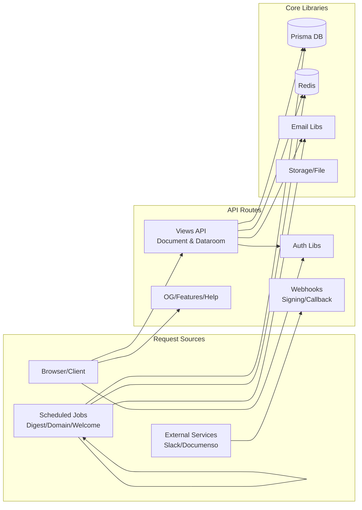
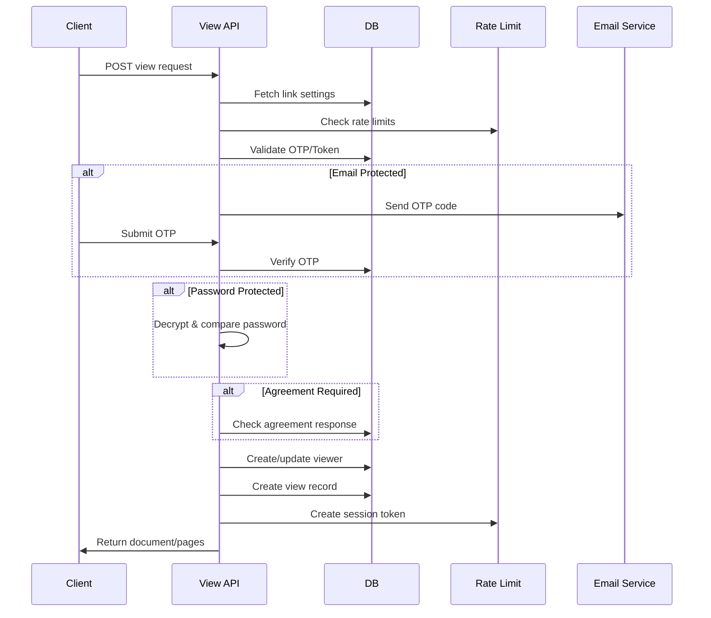
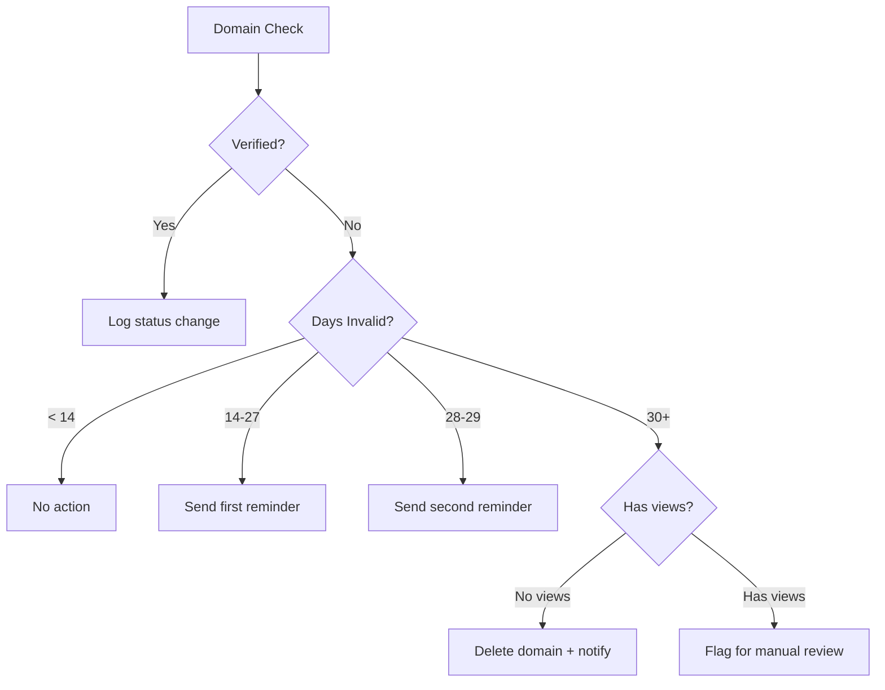

# app — api

# API Module Documentation

The `app/api` module is the central HTTP interface for Papermark's backend. It handles document view tracking, authentication flows, cron jobs, integrations, webhooks, and support utilities. This module acts as the entry point for all client-server communication and external service callbacks.

## Architecture Overview

The module is organized by functional area, with each route file responsible for a specific domain. Most routes interact with Prisma for database operations, Redis for rate limiting and sessions, and various email/integration libraries.



## Route Categories

### View Recording (`/api/views`, `/api/views-dataroom`)

These are the most critical routes, handling document and dataroom access. They implement layered security with multiple verification mechanisms.

**Document Views (`/api/views/route.ts`)**
- Records a view when a visitor accesses a document link
- Supports both paginated PDFs and single-file documents
- Handles multiple file types: PDF, images, videos, spreadsheets, ZIPs, and links

**Dataroom Views (`/api/views-dataroom/route.ts`)**
- Records views for datarooms (document collections)
- Handles two view types: `DATAROOM_VIEW` (room-level) and `DOCUMENT_VIEW` (individual document)
- Manages dataroom sessions with fingerprinting

**Access Control Flow**

Both view routes implement a consistent access control pipeline:



**Session Management**

View routes create session tokens stored in HTTP-only cookies:

```typescript
// Session cookie naming convention
`pm_ls_${linkId}`    // Link session (document views)
`pm_drs_${linkId}`   // Dataroom session (dataroom views)
`pm_drs_flag_${...}` // Session flag for dataroom paths
```

Sessions expire after 23 hours and include fingerprinting based on request headers (User-Agent, Accept-Language, etc.) to help detect session sharing.

**On-Demand Page Fetching (`/api/views/pages/route.ts`)**

Returns signed URLs for specific document pages. Clients initially receive 10 pages centered around the requested start page; additional pages are fetched on-demand through this endpoint. Supports both standard view sessions and preview sessions.

### Authentication (`/api/auth/verify-code`)

Handles email-based login verification using time-limited codes.

**Rate Limiting**
- 5 attempts per email per minute
- 10 attempts per IP per minute

**Verification Flow**
1. Client submits email + 10-character code
2. Atomically fetch and delete the code (prevents race conditions)
3. Return callback URL on success
4. Return 401 on invalid/expired code

```typescript
// Code identifier format in Redis/database
`otp:${linkId}:${email}`      // OTP verification
`link-verification:${linkId}:${teamId}:${email}` // Long-term token
```

### Cron Jobs

All cron routes verify incoming requests using Upstash QStash signatures when running on Vercel (`VERCEL=1`). This prevents unauthorized job execution.

**Domain Management (`/api/cron/domains`)**
- Verifies domain ownership daily via DNS checks
- Sends escalating reminder emails for invalid domains:
  - Day 1: First reminder
  - Day 14: Second reminder
  - Day 28: Final warning
  - Day 30: Automatic deletion (if no links have views)



**Dataroom Digests (`/api/cron/dataroom-digest`)**
- Daily: Processes daily digest emails for datarooms
- Weekly: Processes weekly digest emails
- Runs for up to 5 minutes per invocation

**Welcome Email (`/api/cron/welcome-user`)**
- Triggered via QStash when a new user registers
- Sends welcome email via Resend
- Subscribes user to mailing list

**Year in Review (`/api/cron/year-in-review`)**
- Runs hourly to process year-in-review email queue
- Generates personalized OG images with user statistics

### Integrations

**Slack OAuth (`/api/integrations/slack/oauth/*`)**
- `authorize`: Generates Slack installation URL for team
- `callback`: Handles OAuth callback, exchanges code for tokens, stores encrypted credentials

```typescript
// State parameter flow
1. Generate random state string
2. Store in Redis: `slack:install:state:${state}` → teamId
3. Redirect to Slack with state
4. On callback, validate state from Redis
5. Exchange code for tokens
6. Store encrypted tokens via installIntegration()
```

### Webhooks

**Signing Webhooks (`/api/webhooks/signing`)**
- Receives events from Documenso signing service
- Handles `DOCUMENT_SIGNED` and `DOCUMENT_COMPLETED` events
- Updates agreement response status
- Mirrors signed documents to storage

**Callback Webhooks (`/api/webhooks/callback`)**
- Receives delivery status callbacks from QStash
- Records webhook events for audit/debugging

### Utilities

**Open Graph Images (`/api/og/*`)**
- `route.tsx`: Generic Papermark OG image with title
- `yir/route.tsx`: Year-in-review personalized OG image with statistics

**Feature Flags (`/api/feature-flags`)**
- Edge runtime for fast global access
- Returns team-specific feature flags

**Help Center (`/api/help`)**
- Proxies to marketing site help articles
- Supports query parameter filtering

**CSP Reports (`/api/csp-report`)**
- Receives Content Security Policy violation reports
- Logs for security monitoring

## Key Patterns

### Rate Limiting

All public-facing routes implement rate limiting via Redis:

| Route | Limit | Window | Key Pattern |
|-------|-------|--------|-------------|
| Verify Code | 5 | 1 minute | `verify_code:{email}` |
| Verify Code (IP) | 10 | 1 minute | `verify_code:ip:{ip}` |
| Send OTP | 1 | 30 seconds | `send-otp:{linkId}:{email}` |
| Send OTP (IP) | 10 | 1 minute | `send-otp:{ip}` |
| Verify OTP | 10 | 1 minute | `verify-otp:{ip}` |
| Page Fetch | 60 | 1 minute | `view-pages:{viewId}` |

### Input Validation

Routes use Zod schemas for request validation:

```typescript
// Common patterns
z.string().email()           // Email fields
z.string().cuid()            // Database IDs
z.number().int().positive()  // Page numbers
z.array(z.number())          // Batch operations
```

### Error Handling

Consistent error response structure:

```typescript
// Success
NextResponse.json({ /* data */ }, { status: 200 })

// Validation errors
NextResponse.json({ error: "Message" }, { status: 400 })

// Rate limited
NextResponse.json({ error: "Too many attempts", retryAfter: 60 }, { status: 429 })

// Server errors
NextResponse.json({ error: "Internal error" }, { status: 500 })
```

### Session Fingerprinting

Dataroom sessions include fingerprinting to detect unauthorized sharing:

```typescript
// Headers collected for fingerprinting
- x-forwarded-for / x-real-ip
- user-agent
- accept-language
- accept-encoding
```

Fingerprint is hashed and stored with session. Comparison on subsequent requests can flag suspicious activity.

## Security Considerations

### Atomic Operations

Login code verification uses atomic fetch-and-delete to prevent TOCTOU (time-of-check-time-of-use) race conditions:

```typescript
// Instead of separate read then delete (race-prone)
const code = await getCode(email, code)
await deleteCode(email, code)

// Use atomic operation
const loginCodeData = await fetchAndDeleteLoginCodeData(email, code)
```

### Password Handling

Passwords support two formats:
1. **Hashed**: Using `checkPassword()` for bcrypt comparison
2. **Encrypted**: For backwards compatibility, using `decryptEncryptedPassword()`

### Block Lists

Global block lists override all other access controls. Denied access attempts are reported for security monitoring.

### Cookie Security

Session cookies use strict security settings:

```typescript
{
  httpOnly: true,      // No JS access
  secure: true,        // HTTPS only in production
  sameSite: "strict",  // CSRF protection (dataroom)
  sameSite: "lax",     // CSRF protection (document links)
  path: "/",
  expires: new Date(expiration)
}
```

## Dependencies

### External Services
- **Upstash Redis**: Rate limiting, session storage
- **QStash**: Cron job scheduling and verification
- **Resend**: Email delivery
- **Vercel Functions**: Edge runtime, `waitUntil` for background tasks

### Internal Libraries
- **Prisma**: Database ORM
- **lib/auth**: Session management, fingerprinting, preview sessions
- **lib/emails**: Email templates and sending
- **lib/signing**: Agreement and signature handling
- **lib/tracking**: View recording to analytics
- **lib/files**: File storage and URL signing