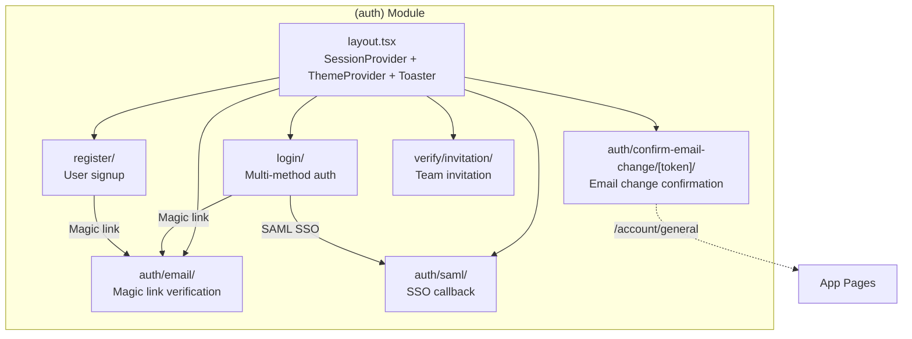

# app — (auth)

# Auth Module (`app/(auth)`)

The `(auth)` route group in Papermark handles all authentication-related pages and flows. This module provides user login, registration, email verification, SAML/SSO, invitation acceptance, and email change confirmation.

## Architecture Overview

The module uses Next.js 14's App Router with a root layout that wraps all auth pages in providers. Client/server component separation is used throughout for optimal performance.



## Root Layout

**`app/(auth)/layout.tsx`** provides the provider wrapper for all auth routes:

```tsx
export default function Layout({ children }: { children: React.ReactNode }) {
  return (
    <SessionProvider>
      <ThemeProvider attribute="class" defaultTheme="light" enableSystem>
        <main>
          <Toaster closeButton richColors theme="system" />
          <div>{children}</div>
        </main>
      </ThemeProvider>
    </SessionProvider>
  );
}
```

**Providers:**

- `SessionProvider` — NextAuth session context for `useSession()` and `getServerSession()`
- `ThemeProvider` — Light/dark theme switching
- `Toaster` — Sonner toast notifications for auth events (success/error feedback)

## Authentication Methods

The module supports five authentication methods:

| Method | Provider | Flow |
|--------|----------|------|
| Email Magic Link | NextAuth `email` provider | POST to `/api/auth/callback/email` with signed token |
| Google OAuth | NextAuth `google` provider | OAuth 2.0 redirect flow |
| LinkedIn OAuth | NextAuth `linkedin` provider | OAuth 2.0 redirect flow |
| Passkey | Hanko Passkeys | WebAuthn/FIDO2 assertion |
| SAML SSO | Jackson + NextAuth `saml-idp` | IdP-initiated or SP-initiated SSO |

## Login Flow (`app/(auth)/login/`)

The login page supports all authentication methods with a split-screen layout featuring branding and testimonials.

### Key Features

**1. Magic Link Email Authentication**
```tsx
signIn("email", {
  email: emailValidation.data,
  redirect: false,
  callbackUrl: next,
}).then((res) => {
  if (res?.ok && !res?.error) {
    // Store email for verification page
    sessionStorage.setItem("pendingVerificationEmail", email);
    router.push("/auth/email");
  }
});
```

The email is stored in `sessionStorage` so the verification page can pre-fill it without requiring re-entry.

**2. OAuth Providers**
```tsx
signIn("google", { callbackUrl: next });  // or "linkedin"
```

**3. Passkey Authentication**
```tsx
signInWithPasskey({
  tenantId: process.env.NEXT_PUBLIC_HANKO_TENANT_ID as string,
});
```

**4. SSO Enforcement**
When the `?error=require-saml-sso` query parameter is present, the page displays an alert blocking regular login methods and highlights the SSO button:

```tsx
const isSSORequired = authError === "require-saml-sso";
```

**5. Last Used Method Persistence**
The `useLastUsed` hook remembers the user's last authentication method and displays a subtle indicator on that button.

## Email Verification Flow (`app/(auth)/auth/email/`)

Handles verification of magic link login codes after the user clicks the link in their email.

### Flow

1. User clicks magic link in email → redirected to `/auth/email?token=xxx`
2. The `email` param is extracted (via catch-all route `[[...params]]`) or email is retrieved from `sessionStorage`
3. User enters the 10-character verification code
4. POST to `/api/auth/verify-code` validates the code
5. On success, redirect to `callbackUrl` (originally the `next` param from login)

### State Handling

```tsx
const [isExpired, setIsExpired] = useState(false);
// ...
if (response.status === 410 || data.error?.includes("expired")) {
  setIsExpired(true);
  // Show "Code Expired" UI with link to request new code
}
```

Expired or invalid codes display a dedicated UI with a button to return to login.

## Email Change Confirmation (`app/(auth)/auth/confirm-email-change/[token]/`)

When a user requests an email change, they receive a link containing a signed token. This page completes the change.

### Server-Side Verification (`page.tsx`)

The `VerifyEmailChange` component performs async verification:

```tsx
const VerifyEmailChange = async ({ params: { token } }: PageProps) => {
  // 1. Find token in database
  const tokenFound = await prisma.verificationToken.findUnique({
    where: { token: hashToken(token) },
  });
  
  // 2. Check token exists and not expired
  if (!tokenFound || tokenFound.expires < new Date()) return <NotFound />;
  
  // 3. Verify user is logged in as token owner
  const session = await getSession();
  if (!session) redirect(`/login?next=/auth/confirm-email-change/${token}`);
  if (tokenUserId !== currentUserId) return <NotFound />;
  
  // 4. Retrieve pending change data from Redis
  const data = await redis.get(`email-change-request:user:${tokenUserId}`);
  
  // 5. Execute the email change
  await prisma.user.update({ where: { id: tokenUserId }, data: { email: data.newEmail } });
  
  // 6. Async cleanup and notifications via waitUntil
  waitUntil(Promise.all([
    deleteRequest(tokenFound),  // Remove token + Redis data
    subscribe(data.newEmail),   // Add new email to mailing list
    sendEmail({ /* notify old email */ }),  // Confirmation to old email
  ]));
  
  return <ConfirmEmailChangePageClient />;
};
```

### Client-Side Session Refresh (`page-client.tsx`)

After the email change succeeds, the client component refreshes the session:

```tsx
useEffect(() => {
  if (status !== "authenticated") return;
  
  async function updateSession() {
    hasUpdatedSession.current = true;
    await update();  // Refresh NextAuth session with new email
    toast.success("Email update successful!");
    router.replace("/account/general");
  }
  
  updateSession();
}, [status, update]);
```

Uses a ref (`hasUpdatedSession`) to prevent double-updates during React strict mode.

## SAML/SSO Callback (`app/(auth)/auth/saml/`)

Handles IdP-initiated SSO flows where Jackson (the SAML service) redirects users after processing the SAML response.

### Distinction from SP-Initiated SSO

```tsx
/**
 * SAML Callback Page
 *
 * This page handles IdP-initiated SSO flow:
 * 1. User clicks the app tile in their IdP dashboard
 * 2. Jackson processes the SAML response and redirects here with a `code`
 * 3. We exchange the code via the `saml-idp` CredentialsProvider
 *
 * SP-initiated SSO (user clicks "Continue with SSO" on login page) is handled
 * entirely by NextAuth's OAuth flow via the `saml` provider — it never hits this page.
 */
```

The callback expects a `code` query parameter from Jackson:

```tsx
useEffect(() => {
  const code = searchParams?.get("code");
  if (code) {
    signIn("saml-idp", { code, redirect: false })
      .then((result) => {
        if (result?.ok) {
          router.push("/dashboard");
        } else {
          setStatus("error");
        }
      });
  }
}, [searchParams, router]);
```

## Invitation Acceptance (`app/(auth)/verify/invitation/`)

Allows users to accept team invitations via a signed JWT token.

### Token Verification

```tsx
const payload = verifyJWT(jwtToken);
// Returns: { verification_url, teamId, token, email, expiresAt }
```

The `verification_url` contains the actual NextAuth callback URL. The JWT is validated server-side before rendering the invitation UI.

### States

| State | UI |
|-------|-----|
| Valid invitation | Accept button + expiration warning |
| Expired | "Invitation Expired" message |
| Revoked | "Invitation No Longer Available" message |

### URL Cleanup

`CleanUrlOnExpire` removes the token from the URL after detection:

```tsx
useEffect(() => {
  if (shouldClean && typeof window !== "undefined") {
    const url = new URL(window.location.href);
    url.search = "";
    window.history.replaceState({}, "", url.toString());
  }
}, [shouldClean]);
```

This prevents token leakage via browser history.

## Invitation Flow (`app/(auth)/verify/page.tsx`)

A legacy redirect page that forwards to the new email verification flow:

```tsx
export default async function VerifyPage() {
  redirect("/auth/email");
}
```

## Key Dependencies

| Dependency | Purpose |
|------------|---------|
| `next-auth/react` | Session management, OAuth flows |
| `@teamhanko/passkeys-next-auth-provider` | Passkey/WebAuthn authentication |
| `sonner` | Toast notifications |
| `@/lib/prisma` | Database access for tokens/users |
| `@/lib/redis` | Cache for pending email changes |
| `@/lib/resend` | Email sending (confirmation, notifications) |
| `@/ee/features/security/sso` | SSO login component |
| `date-fns` | Date formatting for invitation expiry |

## Security Considerations

1. **Token Hashing** — Verification tokens are hashed before database lookup
2. **Session Validation** — Email change requires matching authenticated user
3. **Redis TTL** — Email change requests expire automatically
4. **URL Token Cleanup** — Invitation tokens removed from browser history
5. **waitUntil** — Email notifications sent after response to avoid blocking