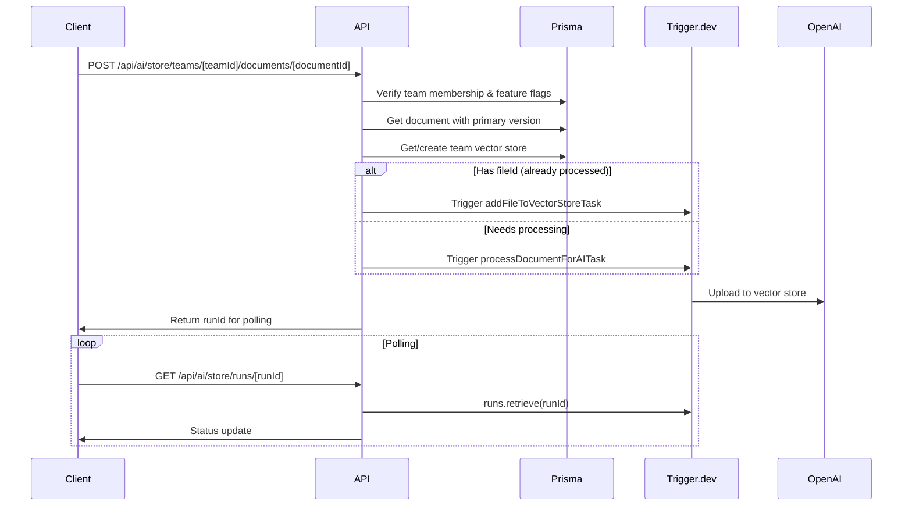
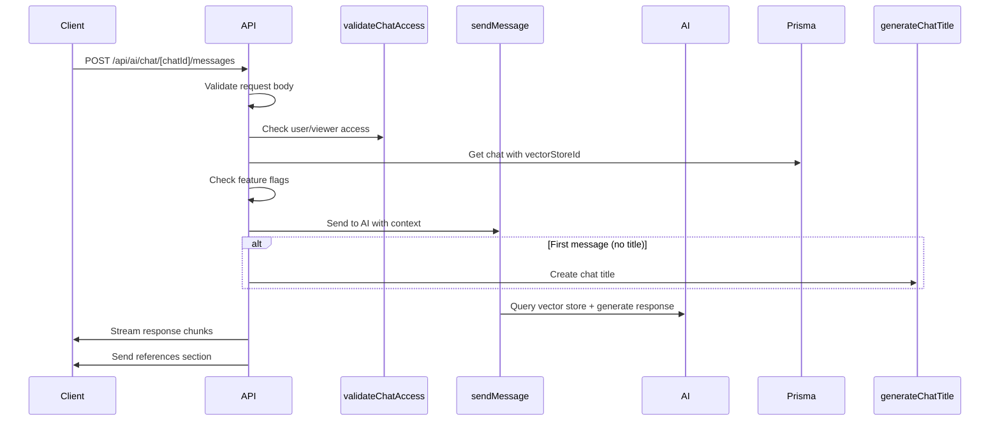
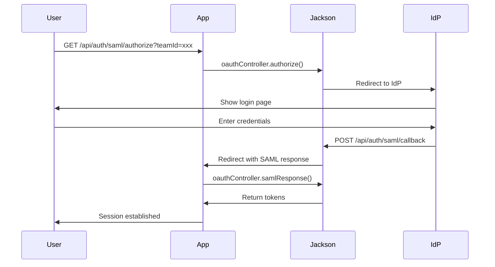
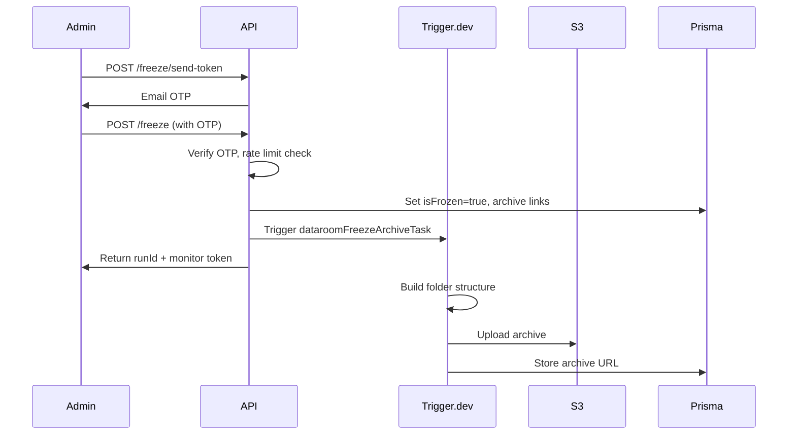

# app — (ee)

# Enterprise Edition (EE) API Module

The `app/(ee)` route group contains enterprise-grade API routes for the Papermark platform. These endpoints power advanced features including AI-powered document Q&A, SAML/SSO authentication, SCIM user provisioning, dataroom freeze/archive functionality, visitor FAQ access, and visitor document uploads.

---

## Feature Areas Overview

This module is organized into distinct domains, each serving a specific enterprise use case:

| Domain | Route Pattern | Purpose |
|--------|---------------|---------|
| **AI Chat** | `/api/ai/chat/*` | Document Q&A with streaming responses |
| **AI Vector Store** | `/api/ai/store/*` | Document indexing and retrieval |
| **SAML Auth** | `/api/auth/saml/*` | SSO authentication flows |
| **SCIM Sync** | `/api/scim/v2.0/*` | Automated user provisioning |
| **Dataroom Freeze** | `/api/teams/*/datarooms/*/freeze/*` | Immutable archive generation |
| **FAQs** | `/api/faqs` | Visitor FAQ access |
| **Link Uploads** | `/api/links/*/upload` | Visitor document submissions |

---

## AI Chat & Vector Store

### Overview

The AI feature enables users to ask questions about documents and datarooms using natural language. It leverages vector embeddings for semantic search and streams responses in real-time.

### Endpoints

| Method | Path | Purpose |
|--------|------|---------|
| `POST` | `/api/ai/chat` | Create a new chat session |
| `GET` | `/api/ai/chat` | List chats (filtered by user/viewer) |
| `GET` | `/api/ai/chat/[chatId]` | Get chat details with messages |
| `DELETE` | `/api/ai/chat/[chatId]` | Delete a chat |
| `POST` | `/api/ai/chat/[chatId]/messages` | Send message, receive streaming response |
| `GET` | `/api/ai/store/teams/[teamId]` | Get team vector store info |
| `POST` | `/api/ai/store/teams/[teamId]/documents/[documentId]` | Index a document |
| `DELETE` | `/api/ai/store/teams/[teamId]/documents/[documentId]` | Remove document from index |
| `POST` | `/api/ai/store/teams/[teamId]/datarooms/[dataroomId]` | Index all dataroom documents |
| `GET` | `/api/ai/store/runs/[runId]` | Poll Trigger.dev run status |

### Authentication Model

The AI chat system supports dual authentication:

1. **Internal users**: Authenticated via NextAuth session (`getServerSession`)
2. **External viewers**: Authenticated via dataroom session tokens (`viewerId`, `linkId`, `viewId`)

Both flows validate:
- Team membership via `prisma.userTeam`
- Feature flag enabled (`getFeatureFlags({ teamId })`)
- Team-level `agentsEnabled` flag
- Document/dataroom-level `agentsEnabled` flag

### Document Indexing Flow



### Chat Message Flow



### Supported Content Types

Document indexing supports: PDF, Excel, JPEG, PNG, WebP (defined in `SUPPORTED_AI_CONTENT_TYPES`).

---

## SAML/SSO Authentication

### Overview

SAML-based Single Sign-On allows enterprise teams to authenticate users through their identity provider (IdP). This module integrates with [Jackson](https://github.com/boxyhq/jackson) for SAML 2.0 handling.

### Endpoints

| Method | Path | Purpose |
|--------|------|---------|
| `GET/POST` | `/api/auth/saml/authorize` | Initiate SAML auth flow |
| `POST` | `/api/auth/saml/callback` | Handle IdP response |
| `POST` | `/api/auth/saml/token` | Exchange SAML assertion for tokens |
| `GET` | `/api/auth/saml/userinfo` | Get user info from token |
| `POST` | `/api/auth/saml/verify` | Check if team has SSO configured |

### Team SAML Endpoints

| Method | Path | Purpose |
|--------|------|---------|
| `GET` | `/api/teams/[teamId]/saml` | List SAML connections |
| `POST` | `/api/teams/[teamId]/saml` | Create SAML connection |
| `PATCH` | `/api/teams/[teamId]/saml` | Update SSO enforcement |
| `DELETE` | `/api/teams/[teamId]/saml` | Delete SAML connection |

### SAML Configuration Flow

1. Admin provides metadata (raw XML, URL, or encoded)
2. System validates and creates connection via Jackson
3. Domain is extracted from metadata or provided explicitly
4. SSO can be enforced to require SAML login for team members

### Domain Validation

The system rejects public email domains (gmail.com, outlook.com, etc.) for SSO configuration. It validates:
- Domain format with regex
- Generic domain detection
- IdP metadata hints (excluding known generic IdP hosts)

### Authentication Flow



---

## SCIM Directory Sync

### Overview

SCIM 2.0 integration automates user provisioning from enterprise identity providers (Azure AD, Okta, etc.) to Papermark. User lifecycle events sync automatically to team memberships.

### Endpoint

| Method | Path | Purpose |
|--------|------|---------|
| `GET/POST/PUT/PATCH/DELETE` | `/api/scim/v2.0/[directory]` | SCIM resource operations |

### Supported Events

| Event | Action |
|-------|--------|
| `user.created` | Create user, add to team |
| `user.updated` | Update user attributes; handle activation/deactivation |
| `user.deleted` | Remove from team |
| `user.updated` (active=false) | Deactivate user (same as delete) |
| `group.*` | Logged but no action (future roadmap) |

### Plan Requirements

SCIM requires:
- Team plan: `datarooms-premium`, `datarooms-unlimited`, or legacy variants
- Team SSO enabled

### User Lifecycle Handling

The system handles Azure AD's `active` field normalization (can be boolean or string):
- `active: true` → Ensure user is on team
- `active: false` → Remove from team, orphan links to owner
- No `active` change → Update name/attributes only

### Directory Management

| Method | Path | Purpose |
|--------|------|---------|
| `GET` | `/api/teams/[teamId]/directory-sync` | List SCIM directories |
| `POST` | `/api/teams/[teamId]/directory-sync` | Create directory connection |
| `DELETE` | `/api/teams/[teamId]/directory-sync` | Delete directory connection |

---

## Dataroom Freeze

### Overview

Freeze creates an immutable snapshot archive of a dataroom at a point in time. This is critical for legal/compliance workflows requiring audit trails.

### Endpoints

| Method | Path | Purpose |
|--------|------|---------|
| `POST` | `/api/teams/[teamId]/datarooms/[id]/freeze/send-token` | Send OTP to admin |
| `POST` | `/api/teams/[teamId]/datarooms/[id]/freeze` | Execute freeze (requires OTP) |
| `GET` | `/api/teams/[teamId]/datarooms/[id]/freeze/monitor-token` | Get token for monitoring progress |
| `POST` | `/api/teams/[teamId]/datarooms/[id]/freeze/retry-archive` | Retry failed archive generation |
| `GET` | `/api/teams/[teamId]/datarooms/[id]/freeze/download` | Get signed download URL |

### Freeze Workflow



### Security Measures

1. **OTP verification**: 6-digit code, 10-minute expiry, 5/min rate limit
2. **Role requirement**: Only ADMIN and MANAGER can freeze
3. **Plan gate**: Requires Data Rooms Plus or higher
4. **Link archival**: All existing links are automatically archived

### Rollback on Failure

If archive generation fails after the freeze is committed:
1. Dataroom state is reverted (`isFrozen=false`)
2. Archived links are restored
3. Error is returned to client

---

## Visitor FAQ Access

### Endpoint

| Method | Path | Purpose |
|--------|------|---------|
| `GET` | `/api/faqs` | List published FAQs for visitors |

### Query Parameters

- `linkId`: Required. The dataroom link ID.
- `dataroomId`: Required. The dataroom ID.
- `documentId`: Optional. Filter to specific document's FAQs.

### Visibility Model

FAQs support three visibility modes:
1. **PUBLIC_DATAROOM**: Visible across the entire dataroom
2. **PUBLIC_LINK**: Visible only for a specific link
3. **PUBLIC_DOCUMENT**: Visible only for a specific document

The API returns FAQs matching any of these conditions.

### Authentication

Visitors must have a valid dataroom session (verified via `verifyDataroomSession`).

---

## Visitor Document Uploads

### Endpoints

| Method | Path | Purpose |
|--------|------|---------|
| `GET` | `/api/links/[id]/upload` | List visitor's previous uploads |
| `POST` | `/api/links/[id]/upload` | Upload a new document |

### Upload Flow

1. Verify dataroom session and link permissions
2. Validate `enableUpload` is true on link
3. Create document via `processDocument`
4. Add to dataroom (respecting folder restrictions)
5. Track upload in `DocumentUpload` table
6. Trigger notifications (with debounce/cancellation logic)

### Folder Restrictions

- **No restriction**: Admin selected 0 folders → visitor uploads anywhere valid
- **Restricted**: Admin selected folders → uploads go to first allowed folder if visitor's choice isn't allowed

### Notification Debouncing

Uses cancel-and-retrigger pattern:
1. Cancel existing pending notifications
2. Accumulate document IDs from cancelled runs
3. Trigger new notification with batched uploads

---

## Shared Patterns

### Authentication Helpers

All routes use consistent authentication patterns:

```typescript
// Internal users
const session = await getServerSession(authOptions);
const userId = (session.user as CustomUser).id;

// Verify team membership
const userTeam = await prisma.userTeam.findUnique({
  where: { userId_teamId: { userId, teamId } },
});

// External viewers
const dataroomSession = await verifyDataroomSession(req, linkId, dataroomId);
```

### Feature Flags

Most enterprise features check:
1. Team-level feature flags via `getFeatureFlags({ teamId })`
2. Entity-level enable flags (document.agentsEnabled, dataroom.agentsEnabled)
3. Team plan restrictions

### Error Responses

Routes consistently return:
- `401 Unauthorized`: Missing or invalid authentication
- `403 Forbidden`: Valid auth but insufficient permissions/plan
- `404 Not Found`: Resource doesn't exist
- `500 Internal Server Error`: Unexpected errors

### External Dependencies

| Service | Purpose |
|---------|---------|
| **Jackson** | SAML 2.0 SSO, SCIM 2.0 |
| **Trigger.dev** | Background task processing |
| **AWS S3** | Document storage, archive files |
| **Redis** | Rate limiting |
| **Resend** | Email delivery (freeze OTP) |
| **Prisma** | Database access |
| **OpenAI** | Vector embeddings, chat completions |

### Jackson Initialization

The SAML routes import `jackson` from `@/lib/jackson`, which initializes the Jackson instance with database connection. Routes include workarounds for crypto module bundling:

```typescript
// Fix tree-shaking of jose crypto primitives
import * as jose from "jose";
import * as openidClient from "openid-client";
void [jose, openidClient];
```

### Rate Limiting

Freeze endpoints implement rate limiting via Redis:
- OTP sending: 3 requests per minute per user
- OTP verification: 5 attempts per minute per user

---

## Database Models

Key Prisma models used across this module:

| Model | Usage |
|-------|-------|
| `Chat` | AI chat sessions |
| `Viewer` | External dataroom viewers |
| `Link` | Shareable dataroom/document links |
| `Team` | Teams with vectorStoreId, agentsEnabled |
| `Document` | Documents with agentsEnabled |
| `Dataroom` | Datarooms with vectorStoreId, isFrozen |
| `UserTeam` | Team membership with roles |
| `VerificationToken` | OTP codes for freeze |
| `DocumentUpload` | Track visitor uploads |

---

## Security Considerations

1. **SSO domain validation**: Prevents misconfiguration with public email domains
2. **OTP protection**: Freezes require time-limited, rate-limited verification
3. **Plan gates**: Enterprise features restricted by subscription tier
4. **Link archival**: Freezing automatically protects by archiving all links
5. **Data pseudonymization**: SCIM logs use hashed email addresses