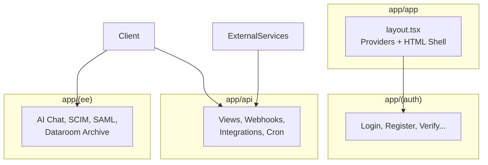

# app

# App Module (`app`)

The `app` module is the root of Papermark's Next.js application, containing all pages, layouts, and API routes. It uses Next.js 14's App Router with route groups for logical separation.

## Sub-Modules

| Module | Purpose |
|--------|---------|
| [`app/app`](app/app.md) | Root layout with HTML shell, metadata, and global styles |
| [`app/(auth)`](app/(auth).md) | Authentication pages: login, register, email verification, SAML/SSO |
| [`app/(ee)`](app/(ee).md) | Enterprise API routes: AI chat, SCIM provisioning, dataroom freeze |
| [`app/api`](app/api.md) | Core API endpoints: views, webhooks, integrations, cron jobs |

## How They Connect

## Key Cross-Module Workflows

### Authentication Flow
1. User visits [`app/(auth)`](app/(auth).md) pages (login, register)
2. SAML/SSO requests route through [`app/(ee)`](app/(ee).md) → `/api/auth/saml/*`
3. Session state flows through root layout's providers in [`app/app`](app/app.md)

### Enterprise User Provisioning
1. SCIM requests hit [`app/(ee)`](app/(ee).md) → `/api/v2.0/directory`
2. User data persists via internal service calls
3. Enterprise admins manage via authenticated API routes

### Document View Tracking
1. View events POST to [`app/api`](app/api.md) → `/api/views-dataroom`
2. Dataroom session verified through auth utilities
3. Fingerprint collection identifies returning visitors

### Domain-Based Workflows
1. Access requests POST to `/api/[entryLinkId]/access`
2. Workflow engine evaluates conditions (including domain checks)
3. Domain verification handled via `/api/domains/*` routes

## Architecture Notes

- **Route Groups**: Parentheses `(auth)` and `(ee)` organize routes without affecting URL paths
- **Provider Pattern**: Auth, theme, and toast providers live in the root layout
- **Server/Client Separation**: API routes use server components; UI pages mix both
- **Rate Limiting**: API routes integrate Redis for throttling