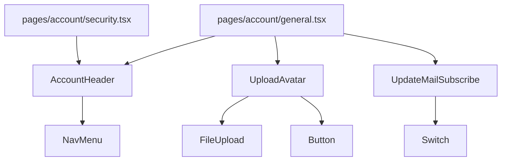
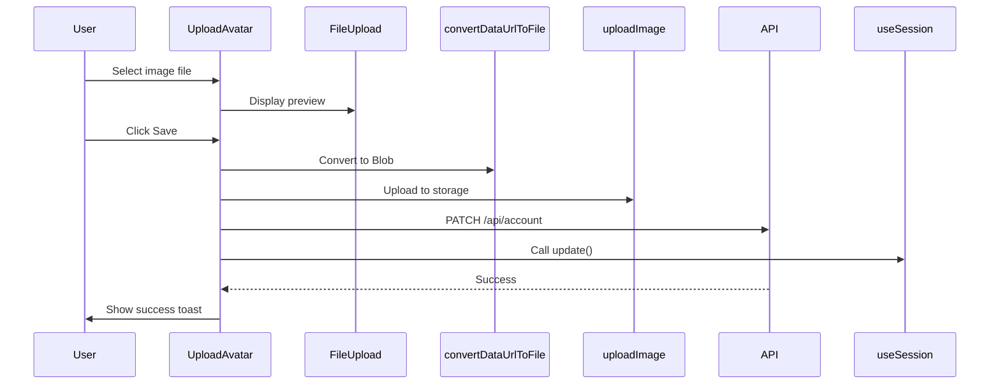

# components — account

# Account Components Module

The `components/account` module provides user account management UI components for the application's account settings pages. It handles profile display, avatar uploads, and email subscription preferences.

## Components Overview



## AccountHeader

Renders the page header for account sections with a title, description, and navigation tabs.

**Props:** None (self-contained)

**Features:**
- Displays "User Account" heading with "Manage your profile" subtitle
- Renders `NavMenu` with links to `/account/general` and `/account/security`
- Responsive spacing that adapts across breakpoints (mb-4 on mobile, mb-12 on large screens)

**Usage:** Imported by both the General and Security account pages to provide consistent page structure.

```tsx
import { AccountHeader } from "@/components/account/account-header";

// In a page component:
<AccountHeader />
```

## UpdateMailSubscribe

A toggle switch component that allows users to opt in or out of product update emails. Uses optimistic updates to provide immediate UI feedback while the request processes.

**Exports:** `UpdateMailSubscribe` (named) and `default` (same component)

**Features:**
- Optimistic UI updates via `useOptimisticUpdate` hook
- Toast notifications for loading, success, and error states
- API calls: `POST /api/user/subscribe` to subscribe, `DELETE /api/user/subscribe` to unsubscribe

**Data shape:**

```ts
{
  subscribed: boolean;  // true = subscribed, false = unsubscribed
}
```

**Integration:** Calls `useOptimisticUpdate` hook which handles the request lifecycle and toast notifications automatically.

## UploadAvatar

A form component for uploading and updating user profile pictures.

**Props:**

| Prop | Type | Required | Description |
|------|------|----------|-------------|
| `title` | `string` | Yes | Card title displayed in header |
| `description` | `string` | Yes | Card description text |
| `helpText` | `string \| ReactNode` | No | Helper text shown in footer |
| `buttonText` | `string` | No | Button label (defaults to "Save Changes") |

**Features:**
- Integrates with NextAuth session via `useSession`
- Supports image preview before upload
- Image processing: resizes to 160×160 pixels, max 2MB file size
- Automatically updates session after successful upload
- Uses `convertDataUrlToFile` and `uploadImage` utilities from `@/lib/utils`
- PATCH request to `/api/account` with the uploaded image URL

**Upload flow:**



**Client-side:** Component is marked with `"use client"` directive because it uses hooks (`useState`, `useEffect`, `useSession`) and browser APIs.

## Integration with Account Pages

### General Page (`pages/account/general.tsx`)

The general account page typically renders:

```tsx
import { AccountHeader } from "@/components/account/account-header";
import UploadAvatar from "@/components/account/upload-avatar";
import UpdateMailSubscribe from "@/components/account/update-subscription";

export default function GeneralPage() {
  return (
    <>
      <AccountHeader />
      <UploadAvatar
        title="Profile Picture"
        description="Update your avatar"
        helpText="JPG, PNG or GIF. Max 2MB."
        buttonText="Save Avatar"
      />
      <UpdateMailSubscribe />
    </>
  );
}
```

### Security Page (`pages/account/security.tsx`)

The security page renders the header with navigation:

```tsx
import { AccountHeader } from "@/components/account/account-header";

export default function SecurityPage() {
  return <AccountHeader />;
}
```

## Dependencies

| Component | External Dependencies | Internal Dependencies |
|-----------|----------------------|----------------------|
| `AccountHeader` | — | `NavMenu` |
| `UpdateMailSubscribe` | `useOptimisticUpdate` | `Switch` |
| `UploadAvatar` | `useSession`, `uploadImage`, `convertDataUrlToFile`, `toast` | `Button`, `Card*`, `FileUpload` |

## API Endpoints Used

| Endpoint | Method | Purpose |
|----------|--------|---------|
| `/api/user/subscribe` | POST | Subscribe to emails |
| `/api/user/subscribe` | DELETE | Unsubscribe from emails |
| `/api/account` | PATCH | Update profile image |