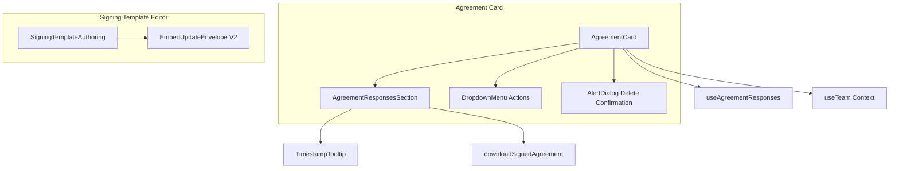

# components — agreements

# Agreements Module

The `components/agreements/` module provides UI components for displaying and managing agreements, including a card component for listing agreements and an embedded editor for authoring signing templates via Documenso.

## Overview



## Components

### AgreementCard

The primary component for displaying a single agreement within a list or grid. It handles presentation, user interactions, and orchestrates data fetching for signing-related responses.

```typescript
interface AgreementCardProps {
  agreement: AgreementWithLinksCount;
  onDelete: (id: string) => void;
  onEdit: (agreement: AgreementWithLinksCount) => void;
}
```

**Visual Structure:**
- Icon badge (FileSignatureIcon for signing agreements, FileTextIcon for standard)
- Agreement name and last updated timestamp
- Link count indicator
- Expand/collapse toggle for signing agreements (shows signed NDAs)
- Actions dropdown menu

**Key Behaviors:**

| Behavior | Condition | Result |
|----------|-----------|--------|
| Disable Edit | `signingProvider === "DOCUMENSO"` AND has responses | Tooltip explains why; click prevented |
| Show Signed Section | `isSigningAgreement === true` AND `isExpanded === true` | Fetches and displays responses |
| Download Available | `isSigningAgreement === false` | Direct download via API |
| Delete Confirmation | Always available | Shows AlertDialog with warning about references |

**Action Handlers:**

- **handleDelete**: Calls `PUT /api/teams/${teamId}/agreements/${agreement.id}` to soft-delete, then invokes `onDelete` callback
- **handleDownload**: Fetches agreement content, extracts filename from `Content-Disposition` header, triggers browser download
- **handleDownloadResponse**: Builds signed agreement URL via `buildTeamSignedAgreementDownloadUrl()` and initiates download with sanitized filename

**State Management:**
- `showDeleteDialog`: Controls AlertDialog visibility
- `isExpanded`: Toggles the signed responses section
- `agreement` props are stable via `memo()` wrapper

### AgreementResponsesSection

Subcomponent that renders the list of signed NDA responses when expanded. Handles loading, error, and empty states.

```typescript
interface AgreementResponsesSectionProps {
  loading: boolean;
  error: boolean;
  responses: AgreementResponseSummary[];
  onDownload: (response: AgreementResponseSummary) => void | Promise<void>;
}
```

**Display Logic:**
- **Loading**: Shows two skeleton rows
- **Error**: Shows destructive error message
- **Empty**: Informational message explaining the flow
- **Populated**: Table with signer info, source link, timestamps, and download action

**Response Metadata Extraction:**
The component normalizes data from potentially inconsistent response shapes:

```
Signer Label: view.viewerName → view.viewerEmail → signerName → signerEmail → "Signed before opening link"
Source: link.name → "Link #${last5Chars}" → "Unknown link"
Context: dataroom.name → document.name → (none)
Signed At: signedAt → completedAt → createdAt → "—"
```

Orphan responses (signed but not associated with a view) display a distinct message.

### SigningTemplateAuthoring

Wraps Documenso's `EmbedUpdateEnvelopeV2` component with project-specific configuration for the signing template editor.

```typescript
interface SigningTemplateAuthoringProps {
  host: string;
  presignToken: string;
  externalId?: string | null;
  envelopeId: string;
  onEnvelopeSaved: (envelopeId: string) => void;
}
```

**Configuration:**
- **CSS Variables**: Customized to match the application's design system using HSL values
- **CSS Overrides**: Removes border-radius and shadows for seamless integration
- **Feature Flags**: Limits functionality to field configuration only, disabling uploads and title editing

**Event Guard:**
A 3-second guard (`INITIAL_EMBED_EVENT_GUARD_MS`) prevents handling the `onEnvelopeUpdated` event that fires during editor initialization. Only subsequent events (actual saves) trigger the `onEnvelopeSaved` callback.

```typescript
useEffect(() => {
  const timer = window.setTimeout(() => {
    canHandleEnvelopeUpdatedRef.current = true;
  }, INITIAL_EMBED_EVENT_GUARD_MS);
  return () => window.clearTimeout(timer);
}, []);
```

## Data Dependencies

| Hook/Function | Source | Purpose |
|---------------|--------|---------|
| `useTeam()` | `@/context/team-context` | Access `currentTeam.id` for API calls |
| `useAgreementResponses(agreementId)` | `@/lib/swr/use-agreement-responses` | Fetch signed response data |
| `downloadSignedAgreement()` | `@/lib/signing/download` | Handle signed PDF download |
| `buildTeamSignedAgreementDownloadUrl()` | `@/lib/signing/download` | Construct download URLs |

## API Interactions

| Action | Endpoint | Method |
|--------|----------|--------|
| Delete Agreement | `/api/teams/${teamId}/agreements/${agreementId}` | PUT |
| Download Agreement | `/api/teams/${teamId}/agreements/${agreementId}/download` | POST |
| Signed Agreement | `/api/teams/${teamId}/agreements/${agreementId}/responses/${responseId}/download` | GET (via URL builder) |

## Usage Example

```tsx
import AgreementCard from "@/components/agreements/agreement-card";

function AgreementList({ agreements, onDelete, onEdit }) {
  return (
    <div className="space-y-4">
      {agreements.map((agreement) => (
        <AgreementCard
          key={agreement.id}
          agreement={agreement}
          onDelete={onDelete}
          onEdit={onEdit}
        />
      ))}
    </div>
  );
}
```