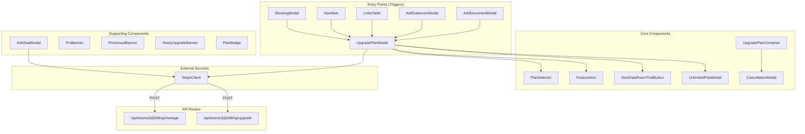
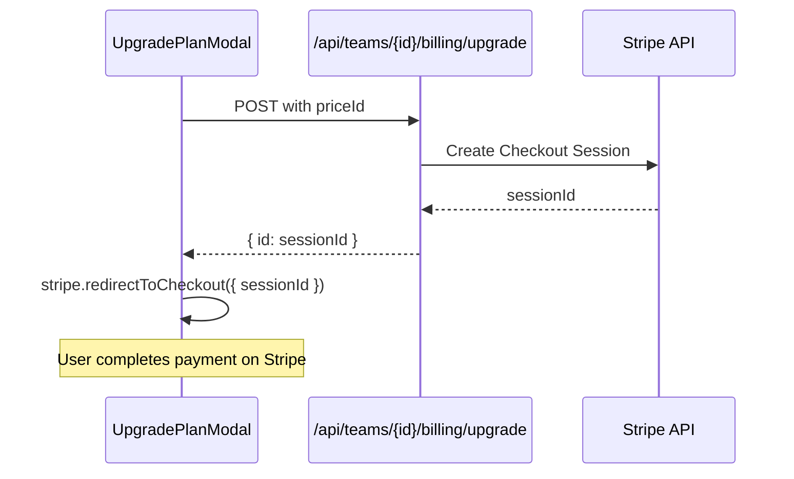
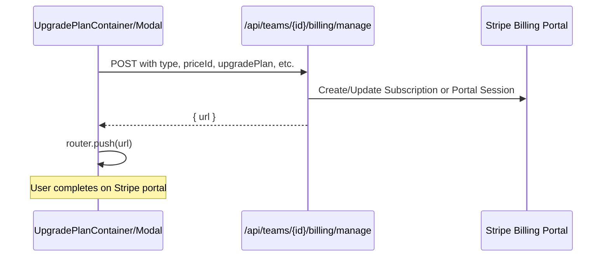

# components — billing

# Billing Components Module

The `components/billing` module provides a suite of React components for managing subscription billing, plan upgrades, and seat management in Papermark. These components interface with Stripe through backend API routes to handle the full lifecycle of team subscriptions.

## Module Architecture

The billing module is organized around two primary concerns: **plan upgrades** (new customers or changing plans) and **subscription management** (existing customers modifying their active subscription).



## Key Components

### UpgradePlanModal

The primary upgrade interface, used throughout the application wherever users encounter feature gates. It displays plan comparison cards and handles checkout flows for both new and existing customers.

**Key features:**

- Displays two adjacent plan cards based on the `clickedPlan` prop
- Supports monthly/yearly toggle with savings display
- Uses `getPlanFeatures()` from `@/ee/stripe/constants` for plan feature lists
- Handles two distinct checkout paths:
  - **Existing customers** → `POST /api/teams/{teamId}/billing/manage` with `upgradePlan: true`
  - **New customers** → `POST /api/teams/{teamId}/billing/upgrade` for Stripe Checkout session
- Provides optional `hideItems` prop to exclude specific features from display (useful when upselling around a particular feature gap)
- Includes inline links to the `UnlimitedPlanModal` for Data Rooms plans
- Integrates with `StartDataRoomTrialButton` to offer trial access

```tsx
// Usage from various trigger points in the codebase
<UpgradePlanModal
  clickedPlan={PlanEnum.Business}
  trigger="add_document_dropdown"
>
  <Button>Upgrade</Button>
</UpgradePlanModal>
```

The `trigger` prop is passed to analytics for tracking which upgrade CTAs convert best.

### UpgradePlanContainer

A card-based component for the billing settings page that displays the current plan and provides contextual action buttons based on subscription state:

| State | Actions |
|-------|---------|
| Free plan | "Upgrade" button |
| Cancelled | "Reactivate subscription" |
| Paused | "Unpause subscription" + "Cancel" in menu |
| Active | "Cancel subscription" + "Change plan" + billing menu |

The component fetches billing cycle dates (`startsAt`, `endsAt`) and displays them alongside any applied discounts. It also renders pause/cancellation dates when relevant.

### AddSeatModal

A dialog for adding team seats to an existing subscription. Key behavior:

- Calculates `totalSeatsAfterUpdate` by adding quantity to current `limits.users`
- Validates against `minQuantity` from the plan's price ID
- POSTs to `/api/teams/{teamId}/billing/manage` with `addSeat: true` and the target `quantity`
- Redirects to Stripe's hosted billing portal for the update

```tsx
// Calculation flow
const priceId = getPriceIdFromPlan({ planSlug, isOld, period });
const minQuantity = getQuantityFromPriceId(priceId);
const totalSeatsAfterUpdate = limits.users + quantity;
```

### UnlimitedPlanModal

A standalone modal for the "Data Rooms Unlimited" plan—designed as a premium option with no user/storage/data room limits. Features:

- Monthly/yearly toggle with 35% savings badge
- Shows plan features from `getPlanFeatures(PlanEnum.DataRoomsUnlimited, { period })`
- Checkout flow differs for existing customers vs new (similar pattern to UpgradePlanModal)

### Banner Components

Three banner components display contextual upgrade prompts:

- **ProBanner**: Promotes Business plan upgrade with a single CTA
- **ProAnnualBanner**: Promotes switching from monthly to yearly Pro (only shows for Pro customers)
- **YearlyUpgradeBanner**: A floating, animated banner (right side of viewport) showing the next plan tier with yearly pricing and savings

All banners respect cookie-based dismissal, storing `hideXxxBanner` cookies that persist for 7 days.

## Data Flow

### Checkout Flow (New Customers)



### Subscription Management (Existing Customers)



The `type` parameter in the manage API supports: `manage`, `invoices`, `subscription_update`, `payment_method_update`, and `cancellation`.

## External Dependencies

| Dependency | Usage |
|------------|-------|
| `@/lib/swr/use-billing` | `usePlan()` hook provides plan state, billing dates, trial info, and customer status |
| `@/context/team-context` | `useTeam()` provides `currentTeamId` for API calls |
| `@/ee/stripe/functions/get-price-id-from-plan` | Converts plan enum + period to Stripe price ID |
| `@/ee/stripe/constants` | `PlanEnum`, `getPlanFeatures()`, feature definitions |
| `@/ee/stripe/utils` | `PLANS` array with pricing configuration |
| `@/ee/stripe/client` | `getStripe()` initializes Stripe.js for checkout |
| `useAnalytics` | Tracks upgrade button clicks with `trigger` context |

## Key API Routes

| Route | Methods | Purpose |
|-------|---------|---------|
| `/api/teams/[teamId]/billing/upgrade` | POST | Create Stripe Checkout session for new subscriptions |
| `/api/teams/[teamId]/billing/manage` | POST | Handle plan changes, seat additions, portal redirects |
| `/api/teams/[teamId]/billing/unpause` | POST | Reactivate a paused subscription |
| `/api/teams/[teamId]/billing/reactivate` | POST | Reactivate a cancelled subscription |

## Integration Points

`UpgradePlanModal` is invoked from 20+ locations throughout the codebase, typically triggered when users attempt gated features:

- **Documents**: `AddDocumentModal`, `DocumentsCard`, `DocumentHeader`
- **Data Rooms**: `AddDataroomModal`, `DataroomTagSection`, `GenerateIndexDialog`
- **Links**: `LinksTable`, `AddLinkButton`, `LinkOptions`, `DomainSection`
- **Settings**: `WebhookSettings`, `AddDomainModal`, `AddFolderModal`
- **Navigation**: `NavMain`, `NavItem`, `TeamSwitcher`, `MobileBottomNav`
- **Overlays**: `BlockingModal`, `MobileMoreMenu`, `TrialBannerComponent`

Each integration passes a `trigger` prop (e.g., `"add_document_dropdown"`, `"sidebar_datarooms"`) used in analytics to measure which paths lead to conversions.