# components — components

# Components Module

The `components/` directory contains reusable React UI components that power the application interface. These components handle user authentication flows, document management, navigation, search, theme switching, and file uploads.

## Architecture Overview

The components are organized by feature domain rather than type:

```mermaid
graph TD
    Navigation[Navigation Components]
    Upload[Upload System]
    Search[Search & Discovery]
    Theme[Theme System]
    Auth[Auth & Profile]
    Documents[Document UI]
    
    Navigation --> NavMenu
    Navigation --> TabMenu
    Navigation --> SidebarFolders
    
    Upload --> DocumentUpload
    Upload --> UploadZone
    Upload --> UploadNotificationDrawer
    
    Search --> SearchBox
    Search --> SearchCommand
    Search --> ProfileSearchTrigger
    
    Theme --> ThemeProvider
    Theme --> ThemeToggle
    
    Auth --> ProfileMenu
    Auth --> EmailForm
    
    Documents --> BlurImage
    Documents --> Skeleton
```



## Navigation Components

### NavMenu (`navigation-menu.tsx`)

A sticky navigation bar with tab-style links. Handles complex active-state logic for routes with nested paths.

**Key behavior:**

- Highlights the current route by matching `segment` against `router.pathname`
- Special cases for permissions routes (also active when pathname includes "groups")
- Renders a crown icon for `limited` items that trigger the upgrade modal
- Disabled items are hidden but still rendered in the nav array for consistent positioning

```tsx
// Usage in SettingsHeader
<NavMenu
  navigation={[
    { label: "General", href: "/settings/general", segment: "/settings/general" },
    { label: "Billing", href: "/settings/billing", segment: "/settings/billing", limited: true },
  ]}
/>
```

### TabMenu (`tab-menu.tsx`)

A tabbed navigation component for secondary page sections. Similar to `NavMenu` but styled differently with optional count badges.

**Props:**
- `navigation` — Array of tab definitions with `value`, `href`, `currentValue` for active matching
- `count` — Optional number displayed in a badge next to the label

### SidebarFolders (`sidebar-folders.tsx`)

Renders a nested folder tree for document navigation. Uses the `FileTree` component from `@/components/ui/nextra-filetree`.

**Two variants:**

1. **`SidebarFolderTree`** — Read-only tree for browsing folders
2. **`SidebarFolderTreeSelection`** — Selection tree for move/copy operations with a virtual "Home" node

**Folder structure building:**

```tsx
// buildNestedFolderStructure transforms flat folder list into nested tree
const rootFolders = buildNestedFolderStructure(folders);
// Each folder gets a childFolders array injected
```

## Upload System

The upload system is the most complex part of this module, involving three coordinated components.

### UploadZone (`upload-zone.tsx`)

The core upload handler that wraps a drop zone and manages the entire upload lifecycle. It handles:

- **Drag-and-drop** file/folder uploads
- **File picker** inputs (both files and directories via `webkitdirectory`)
- **Concurrent uploads** with `UPLOAD_CONCURRENCY = 5`
- **Multipart uploads** for large files via S3 pre-signed URLs
- **Resumable uploads** via TUS protocol for smaller files
- **Folder traversal** using `FileSystemEntry` APIs
- **Plan-aware validation** (file types, sizes, page counts per plan tier)

**Key interfaces:**

```tsx
interface UploadItemState {
  itemId: string;
  name: string;
  type: "folder" | "file";
  totalEntries: number;      // folders + files for folders; 1 for loose files
  completedEntries: number;
  failedEntries: number;
  cancelled?: boolean;
  folderHref?: string;      // link to completed folder
  bytesUploaded?: number;
  bytesTotal?: number;
}

interface UploadBatchState {
  batchId: string;
  items: UploadItemState[];
  startedAt: number;
  totalEntries: number;
  completedEntries: number;
  failedEntries: number;
  cancelled?: boolean;
}
```

**Upload flow:**

1. Files dropped or selected → `getFilesFromEvent` normalizes paths
2. Folder uploads: `walkTopLevel` recursively reads `FileSystemEntry` tree
3. Bulk folder creation via `createFoldersForUpload` (single API request)
4. Files validated against plan limits (type, size, page count)
5. Upload via TUS or S3 multipart based on file size (`MULTIPART_SIZE_THRESHOLD`)
6. Document records created via `createDocument` API
7. Optional: add to dataroom with folder replication
8. SWR cache invalidated via `mutateQueue` (batched to prevent connection pool saturation)

**Context integration:**

```tsx
// Registers picker triggers so external components can open file/folder dialogs
const { registerUploadTriggers } = useUploadProgress();
useEffect(() => {
  return registerUploadTriggers({
    openFilesPicker: () => filesInputRef.current?.click(),
    openFolderPicker: () => folderInputRef.current?.click(),
  });
}, [registerUploadTriggers]);
```

### UploadNotificationDrawer (`upload-notification.tsx`)

A fixed-position drawer showing real-time upload progress. Displays:

- Individual item rows with progress gauges
- Collapsible sections for skipped files (plan limits) and failed files
- Estimated time remaining based on byte-level progress
- Downloadable list of skipped file names
- Cancel buttons per-item and per-batch

**Key states:**
- `isPreparing` — Batch created but no items yet
- `isCancelled` — User cancelled the batch
- `isComplete` — All entries processed (completed + failed ≥ total)

### DocumentUpload (`document-upload.tsx`)

A simpler single-file upload component for document modals. Uses `react-dropzone` for drag-and-drop with:

- Plan-aware file type filtering (`FREE_PLAN_ACCEPTED_FILE_TYPES` vs `FULL_PLAN_ACCEPTED_FILE_TYPES`)
- Explicit `maxSizeBytes` prop override for templates (e.g., NDA signing)
- Page count validation for PDFs
- Preview of selected file with background image from blob URL

## Search Components

### SearchBox (`search-box.tsx`)

A debounced search input with keyboard shortcuts:

- **Cmd/Ctrl+K** — Global focus shortcut (works even while typing elsewhere)
- **/** — Focus when not in an input/textarea and no modal is open
- **Debounced callback** — Fires `onChangeDebounced` after `debounceTimeoutMs`
- **URL persistence** — `SearchBoxPersisted` variant syncs with query params

```tsx
// SearchBoxPersisted automatically:
// 1. Reads initial value from URL (?search=value)
// 2. Updates URL on debounced input
// 3. Syncs back if URL changes externally
<SearchBoxPersisted
  urlParam="search"
  placeholder="Search documents..."
  onChangeDebounced={(value) => fetchResults(value)}
/>
```

### SearchCommand (`search-command.tsx`)

A command-palette-style dialog for help article search. Renders a combobox with:

- Remote article fetching via `/api/help`
- Links to articles on the marketing site
- Customizable placeholder, no-results text, and heading

## Profile & Authentication

### ProfileMenu (`profile-menu.tsx`)

User dropdown with session-aware rendering:

- Shows skeleton while loading session
- Displays avatar (from session) or placeholder icon
- Dropdown contents: theme toggle, help search trigger, contact link, sign out
- Integrates `SearchCommand` for help article search

**Help article fetching:**

```tsx
const fetchArticles = async (query?: string) => {
  const params = new URLSearchParams({ locale: "en", ...(query && { q: query }) });
  const res = await fetch(`/api/help?${params}`);
  // Articles displayed in SearchCommand dialog
};
```

### EmailForm (`email-form.tsx`)

Minimal email capture form for document viewing. Props:

- `onSubmitHandler` — Form submission callback
- `setEmail` — State setter for email value

## Theme System

### ThemeProvider (`theme-provider.tsx`)

Wrapper around `next-themes` `ThemeProvider`. Sets up CSS variables for dark/light mode.

### ThemeToggle (`theme-toggle.tsx`)

Dropdown submenu for theme selection with three options:

- Light (sun icon)
- Dark (moon icon)
- System (monitor icon)

Uses `useTheme` hook from `next-themes` and `DropdownMenuRadioGroup` for the selection state.

## Utility Components

### BlurImage (`blur-image.tsx`)

Next.js `Image` wrapper with blur-up loading effect:

```tsx
<BlurImage
  src={user.avatarUrl}
  alt="User avatar"
  className="rounded-full"
/>
// Adds blur-[2px] while loading, blur-0 when loaded
// Falls back to avatar.vercel.sh on error or tiny images
```

### Skeleton (`skeleton.tsx`)

Animated loading placeholder using Tailwind's `animate-pulse`. Merges custom className with `bg-muted`.

### GTMComponent (`gtm-component.tsx`)

Google Tag Manager integration. Returns `null` if `NEXT_PUBLIC_GTM_ID` is not set.

## Integration Patterns

### Context Dependencies

| Component | Contexts |
|-----------|----------|
| `UploadZone` | `useTeam`, `useSession`, `usePlan`, `useLimits`, `useUploadProgress` |
| `DocumentUpload` | `usePlan`, `useLimits` |
| `ProfileMenu` | `useSession` |
| `ThemeToggle` | `useTheme` (next-themes) |
| `NavMenu` | `useRouter` |

### SWR Integration

`UploadZone` uses `mutate` from SWR to invalidate cache keys after uploads complete. The `mutateQueue` batches invalidations to prevent connection pool saturation:

```tsx
// Batches up to 500ms of mutate calls into single flushes
const mutateQueue = createMutateQueue(MUTATE_FLUSH_INTERVAL_MS);
mutateQueue.enqueue(`/api/teams/${teamId}/documents`);
mutateQueue.flush();
```

### Plan-Aware Features

Several components gate features based on plan tier:

- `UploadZone` checks `isFree`, `isTrial` for file type acceptance
- `DocumentUpload` limits accepted types on free plan
- `NavItem` shows upgrade modal for `limited: true` items
- Upload rejections include upgrade CTAs when on free tier