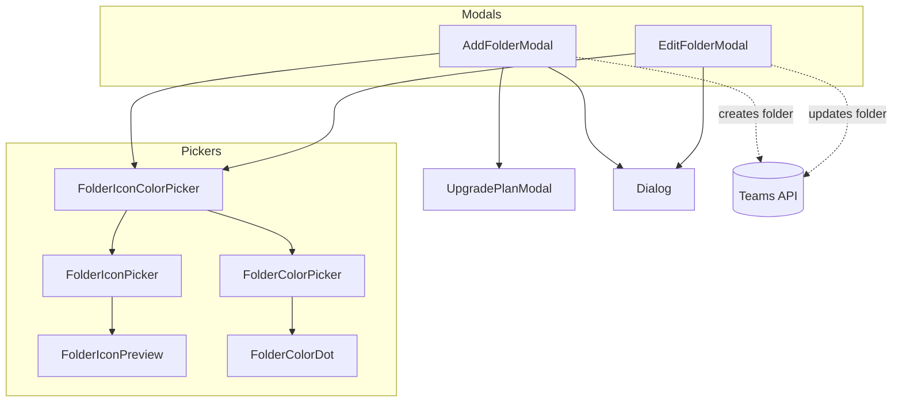

# components — folders

# Folders Module (`components/folders`)

The folders module provides UI components for creating and editing folders across two contexts: **document folders** (general file organization) and **dataroom folders** (structured document rooms). It includes the creation/edit modals plus reusable pickers for folder icons and colors.

---

## Architecture Overview



---

## Core Concepts

### Dual Context Support

All folder components support two contexts via the `isDataroom` and `dataroomId` props:

| Context | API Endpoint | Use Case |
|---------|--------------|----------|
| Documents | `/api/teams/{teamId}/folders` | General file organization |
| Dataroom | `/api/teams/{teamId}/datarooms/{id}/folders` | Structured document rooms |

### Controlled vs. Uncontrolled State

`AddFolderModal` supports both patterns:

```tsx
// Uncontrolled: uses internal state
<AddFolderModal>
  <Button>Add Folder</Button>
</AddFolderModal>

// Controlled: parent drives open state
<AddFolderModal
  open={isOpen}
  onOpenChange={setIsOpen}
  onAddition={(name) => handleNewFolder(name)}
/>
```

This pattern allows both trigger-based opening and programmatic control without leaking internal state.

### Plan Gating

Folder creation is gated on the Pro plan. Free tier users (outside trial) see an `UpgradePlanModal` instead of the creation dialog. The gating applies regardless of how the modal is opened, preventing bypass via controlled props.

---

## Components

### `AddFolderModal`

Creates new folders with custom name, icon, and color.

**Props:**

```typescript
{
  open?: boolean;                           // Controlled open state
  onOpenChange?: (open: boolean) => void;  // Controlled setOpen
  onAddition?: (folderName: string) => void;
  isDataroom?: boolean;
  dataroomId?: string;
  children?: React.ReactNode;              // DialogTrigger content
}
```

**Behavior:**

1. Validates folder name (3–256 characters) using Zod
2. On submit, calls the appropriate API endpoint based on context
3. Invalidates SWR cache for folder lists
4. Resets form state (name, icon, color) after successful creation
5. Tracks analytics event `"Folder Added"`
6. Shows a success toast with an "Open folder" action

**Plan Restriction:** Renders `UpgradePlanModal` for free-tier teams (non-trial).

**Usage Example:**

```tsx
<AddFolderModal isDataroom dataroomId="abc123">
  <Button variant="outline">New Folder</Button>
</AddFolderModal>
```

---

### `EditFolderModal`

Updates existing folder name, icon, and color.

**Props:**

```typescript
{
  open: boolean;
  setOpen: React.Dispatch<React.SetStateAction<boolean>>;
  name: string;
  folderId: string;
  icon?: string | null;
  color?: string | null;
  onAddition?: (folderName: string) => void;
  isDataroom?: boolean;
  dataroomId?: string;
  children?: React.ReactNode;
}
```

**Behavior:**

1. Syncs local state with props when modal opens (`useEffect`)
2. Tracks which fields changed for analytics
3. Calls `PUT /folders/manage` API
4. Invalidates SWR cache on success
5. Tracks `"folder_updated"` analytics with `changed` array

Unlike `AddFolderModal`, this component is always controlled (no internal open state).

---

### `FolderIconPicker`

Grid-based icon selector wrapped in `ScrollArea`.

**Props:**

```typescript
{
  value: FolderIconId | null | undefined;
  onChange: (iconId: FolderIconId) => void;
  colorClass?: string;  // Tailwind class for selected icon color
}
```

**Visual:** 6-column grid of icon buttons, selected icon shows ring and applies `colorClass`.

---

### `FolderIconColorPicker`

Combined popover for selecting both icon and color. Used inside the modals.

**Props:**

```typescript
{
  iconValue: FolderIconId;
  colorValue: FolderColorId;
  onIconChange: (iconId: FolderIconId) => void;
  onColorChange: (colorId: FolderColorId) => void;
}
```

**Structure:**
- Trigger button shows preview of current icon with current color
- Popover contains:
  - Color picker row (circular swatches)
  - Icon picker grid (7 columns, scrollable)

---

### `FolderIconPreview`

Renders a folder icon at a specified size with color.

```typescript
{
  iconId: FolderIconId | null | undefined;
  colorClass?: string;   // Default: "text-gray-600"
  className?: string;
  size?: "sm" | "md" | "lg";  // Default: "md"
}
```

---

### `FolderColorPicker`

Color selection as labeled pill buttons.

**Props:**

```typescript
{
  value: FolderColorId | null | undefined;
  onChange: (colorId: FolderColorId) => void;
}
```

Each color option shows a dot and label. Selected option displays a ring.

---

### `FolderColorDot`

Simple colored circle for inline color indicators.

```typescript
{
  colorId: FolderColorId | null | undefined;
  className?: string;
}
```

---

## Integration with Other Modules

### External Dependencies

| Module | Usage |
|--------|-------|
| `team-context` | `useTeam()` — gets `currentTeam.id` for API calls |
| `lib/swr/use-billing` | `usePlan()` — checks `isFree` / `isTrial` for plan gating |
| `lib/analytics` | `useAnalytics()` — tracks folder create/update events |
| `lib/utils` | `safeSlugify()` — sanitizes folder names in paths |
| `billing/upgrade-plan-modal` | `UpgradePlanModal` — surfaces for free-tier users |

### API Calls

Both modals call team-scoped endpoints:

```
POST   /api/teams/{teamId}/folders
POST   /api/teams/{teamId}/datarooms/{id}/folders
PUT    /api/teams/{teamId}/folders/manage
PUT    /api/teams/{teamId}/datarooms/{id}/folders/manage
```

### Cache Invalidation

After folder mutations, both components call `mutate()` on multiple cache keys:

```tsx
mutate(`/api/teams/${teamId}/${endpoint}?root=true`);
mutate(`/api/teams/${teamId}/${endpoint}`);
mutate(`/api/teams/${teamId}/${endpoint}${parentFolderPath}`);
```

This ensures the folder tree and breadcrumb views refresh.

---

## Consumers

| Component | Usage |
|-----------|-------|
| `AddDocumentDropdown` | Opens `AddFolderModal` via `DialogTrigger` child |
| `FolderCard` | Opens `EditFolderModal` when user clicks edit action |

---

## Constants Reference

Folder icons and colors are defined in `lib/constants/folder-constants.ts`:

- `FOLDER_ICONS` — array of available icon options with `id`, `label`, and `icon` component
- `FOLDER_COLORS` — array of color options with `id`, `label`, and Tailwind utility classes (`bg`, `border`, `text`)
- `DEFAULT_FOLDER_ICON` — fallback icon (`"folder"`)
- `DEFAULT_FOLDER_COLOR` — fallback color (`"gray"`)
- `getFolderIcon(iconId)` — returns icon component by ID
- `getFolderColorClasses(colorId)` — returns Tailwind classes for a color

---

## Key Implementation Notes

1. **Auto-focus management**: `AddFolderModal` intercepts Radix Dialog's `onOpenAutoFocus` to focus the name input instead of the icon picker button.

2. **Defense in depth for plan gating**: The form submission handler re-checks `isCreationAllowed` even though the modal isn't rendered for blocked users. This prevents edge cases with stale submissions.

3. **State reset pattern**: Form state (name, icon, color) resets in the `finally` block, ensuring cleanup even if the API throws.

4. **Analytics tracking**: `EditFolderModal` diffs initial vs. current values to track only changed fields, reducing noise in analytics.