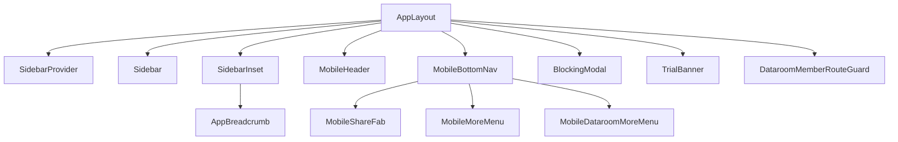
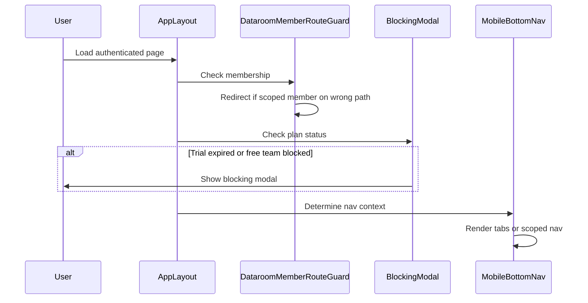

# components — layouts

# Layout Components (`components/layouts/`)

The layouts module provides the main application shell for Papermark, handling responsive navigation, user context, and access enforcement across the platform.

## Overview

The module implements a hybrid desktop/mobile layout strategy:

- **Desktop**: Persistent sidebar navigation + header with breadcrumb
- **Mobile**: Fixed bottom tab bar + collapsible "More" sheets



## Core Layout (`app.tsx`)

`AppLayout` is the root layout component wrapped around all authenticated pages. It orchestrates:

1. **Sidebar state management** via `SidebarProvider` and the `SIDEBAR_COOKIE_NAME` cookie
2. **Dataroom member route guarding** for scoped access
3. **Responsive chrome**: header on desktop, fixed header/bottom nav on mobile

### Sidebar State Persistence

```typescript
function getInitialSidebarState(isDataroom: boolean): boolean
```

The sidebar open/collapsed state persists across sessions via a cookie. Special handling applies to dataroom routes—they always start expanded.

### Dataroom Member Route Guard

`DataroomMemberRouteGuard` is a UX-only redirect mechanism for members with restricted (dataroom-scoped) access. It:

1. Detects if the current user is a dataroom-scoped member via `useSelfMembership`
2. Redirects off non-dataroom paths back to `/datarooms`
3. On dataroom detail pages (`/datarooms/[id]`), verifies the user is assigned to that specific dataroom

> **Note**: The API layer is the real security boundary. This guard prevents users from landing on pages where they'd see empty states or errors.

## Blocking Modal (`blocking-modal.tsx`)

`BlockingModal` enforces access restrictions for teams on free/solo plans or with expired trials.

### Trigger Conditions

The modal appears when:
- User is on the free plan, not in trial, not an admin, and the team has multiple users
- User's status is `BLOCKED_TRIAL_EXPIRED`

### Behavior

When active, the modal:
1. Disables right-click, F12, and developer tools shortcuts (Ctrl+Shift+I/J/C)
2. Offers three actions:
   - **Upgrade** → Opens plan upgrade modal
   - **Switch Team** → If user belongs to another team
   - **Create New Team** → If no other teams exist
   - **Log out** → Always available

## Breadcrumb Navigation (`breadcrumb.tsx`)

`AppBreadcrumb` is a router-aware component that renders different breadcrumb structures based on the current path.

### Supported Route Patterns

| Route Pattern | Component |
|---------------|-----------|
| `/dashboard` | `AnalyticsBreadcrumb` |
| `/settings/*` | `SettingsBreadcrumb` |
| `/account/*` | `AccountBreadcrumb` |
| `/documents` | Static "Documents" crumb |
| `/documents/tree/[...name]` | `DocumentsBreadcrumb` (folder hierarchy) |
| `/documents/[id]` | `SingleDocumentBreadcrumb` (folder path + doc name) |
| `/datarooms` | Static "Datarooms" crumb |
| `/datarooms/[id]` | `SingleDataroomBreadcrumb` |
| `/datarooms/[id]/documents` | `DataroomBreadcrumb` (from datarooms module) |
| `/datarooms/[id]/document/[documentId]` | `SingleDataroomDocumentBreadcrumb` |
| `/visitors` | `VisitorsBreadcrumb` |
| `/visitors/[id]` | `SingleVisitorBreadcrumb` |

### Truncation Handling

`TruncatedBreadcrumbLink` detects when breadcrumb text overflows its container and wraps it in a tooltip to preserve layout.

## Mobile Navigation

### Bottom Tab Bar (`mobile-bottom-nav.tsx`)

The bottom navigation adapts its tabs based on context:

**Standard tabs** (non-dataroom members):
- Dashboard, Documents, Share FAB, Datarooms, More

**Dataroom detail context**:
- Documents, Permissions, Share FAB, Analytics, More

**Dataroom-scoped members**:
- Data Rooms, More (minimal nav matching their restricted access)

### Mobile Header (`mobile-header.tsx`)

Displays:
- Dataroom name + back button when in a dataroom
- Papermark logo when elsewhere
- User avatar dropdown with account settings, theme toggle, support contact, logout

### More Menus

Both `MobileMoreMenu` and `MobileDataroomMoreMenu` are full-screen sheet overlays containing:

- Team switcher (for users in multiple teams)
- Settings sub-navigation with collapsible sections
- Usage progress bars for links/documents
- Upgrade CTAs for free/trial users

The dataroom variant additionally includes:
- Share button → opens `DataroomLinkSheet`
- Q&A (conversations) link (feature-gated)
- Request List (feature-gated)
- Visitors, Branding sections

### Share FAB (`mobile-share-fab.tsx`)

The floating "+" button on mobile opens a flow for creating share links:

1. **Choose type sheet**: Document or Dataroom
2. **Document picker**: Searchable list of team documents → creates `LinkSheet`
3. **Dataroom picker**: List of datarooms → creates `DataroomLinkSheet`

In dataroom context, it skips the picker and directly opens `DataroomLinkSheet`.

### Team Switcher (`mobile-team-switcher.tsx`)

Collapsible team selector used in the More menu. Shows only when user belongs to multiple teams. Displays team avatars with initials and handles switching via `useTeam().setCurrentTeam`.

## Trial Banner (`trial-banner.tsx`)

`TrialBanner` shows a dismissible alert when the user is on a Data Rooms trial. It:

1. Checks for a `hideTrialBanner` cookie (dismissible for 24 hours)
2. Computes days remaining using either:
   - Explicit `trialEndsAt` from the billing hook
   - Legacy calculation: 7 days from first dataroom or team creation
3. Displays expired state (red border) or countdown state
4. Provides inline upgrade CTA

The banner is desktop-only (hidden on mobile via `md:block`).

## Key Dependencies

```typescript
// State management
useTeam()           // Team context for current team and switching
usePlan()           // Billing plan state (isFree, isTrial, etc.)

// Membership
useSelfMembership() // Current user's role and dataroom assignments

// Feature flags
useFeatureFlags()    // Controls optional features like requestList
useLimits()          // Usage limits for links/documents

// UI primitives
SidebarProvider      // Radix sidebar state container
AlertDialog          // Blocking modal and confirmation dialogs
Sheet                // Bottom sheets for mobile menus
```

## Data Flow

