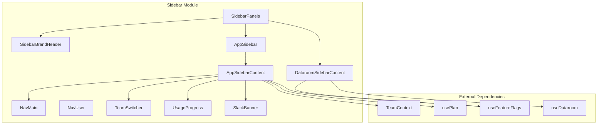

# components — sidebar

# Components — Sidebar Module

The sidebar module provides the primary navigation interface for the Papermark application. It operates in two distinct modes: a general application sidebar for team-level navigation, and a specialized dataroom sidebar for context-specific navigation within individual datarooms.

## Architecture Overview

The sidebar system uses a routing-aware orchestration layer that switches between two sidebar content variants based on the current pathname. The `SidebarPanels` component detects the route and renders either `AppSidebarContent` (for general routes) or `DataroomSidebarContent` (for dataroom routes).



## Core Components

### SidebarPanels

**File:** `components/sidebar/sidebar-panels.tsx`

The orchestrator component that manages which sidebar content to display. It uses `useRouter` to detect if the current route starts with `/datarooms/[id]` and switches between the two sidebar variants accordingly.

**Key behavior:**
- Detects dataroom routes via `router.pathname.startsWith("/datarooms/[id]")`
- Applies a slide animation (100% offset) when switching between sidebar types
- Renders `SidebarBrandHeader` (always visible) and `NavUser` footer (always visible)
- The animation direction is calculated based on the previous state to determine enter vs. leave direction

```typescript
const animDirection = useState<"enter" | "leave" | null>(() => {
    if (lastKnownIsDataroom === null) return null;
    if (isDataroom && !lastKnownIsDataroom) return "enter";
    if (!isDataroom && lastKnownIsDataroom) return "leave";
    return null;
});
```

### AppSidebarContent

**File:** `components/sidebar/app-sidebar.tsx`

The main application sidebar content, rendered for all non-dataroom routes. This component assembles the complete navigation structure including team context, datarooms listing, plan-based gating, and promotional banners.

**Navigation structure (navMain):**
- Dashboard (`/dashboard`)
- All Documents (`/documents`)
- All Datarooms (`/datarooms`) — conditionally enabled based on plan
- Visitors (`/visitors`) — requires Pro plan
- Workflows (`/workflows`) — gated by feature flag
- Branding (`/branding`)
- General Settings — collapsible submenu with 7-8 items

**Plan-based access control:**
- Datarooms require Business, Datarooms, DataroomsPlus plan, or active trial
- Visitors requires Pro plan
- Workflows require DataRoomsPlus plan and `features.workflows` flag
- Security settings (in General Settings) only visible to admins

**Dataroom member scoping:**
When `isDataroomMember` is true, the sidebar shows only the Datarooms section with only the user's assigned rooms. All other navigation items are hidden—the user has no access to Dashboard, Documents, Visitors, Workflows, Branding, or Settings.

**Banner system:**
- ProBanner shown to free-tier users (cookie-dismissable for 30 days)
- SlackBanner shown when no Slack integration exists (cookie-dismissable for 30 days)

**Usage limits:**
Displays `UsageProgress` components showing current links/documents usage against plan limits. Only renders when limits exist for the current plan.

### DataroomSidebarContent

**File:** `components/sidebar/dataroom-sidebar.tsx`

Specialized sidebar for dataroom pages. Provides context-aware navigation for managing a specific dataroom.

**Navigation sections:**
- Documents — main dataroom content view
- Permissions — collapsible with Links and Groups sub-items
- Analytics — collapsible with Overview and Audit Log sub-items
- Q&A — conversations/questions interface
- Request List — optional, gated by `requestListFeatureEnabled` and `dataroom.requestListEnabled`
- Branding
- Settings — collapsible with General, Introduction, Notifications, Downloads, File Permissions, and Danger Zone (hidden for dataroom members)

**Dataroom header features:**
- Back link to `/datarooms`
- ScrollingText component for long dataroom names (animates on hover when overflow)
- Frozen indicator (snowflake icon) for archived datarooms

**Frozen dataroom handling:**
When `dataroom.isFrozen` is true, the share button is replaced with a link to the danger zone settings.

### NavMain

**File:** `components/sidebar/nav-main.tsx`

Reusable navigation menu component that renders collapsible sidebar items.

**NavItem interface:**
```typescript
interface NavItem {
    title: string;
    url: string;
    icon: LucideIcon;
    current?: boolean;
    isActive?: boolean;
    disabled?: boolean;
    plan?: PlanEnum;
    trigger?: string;
    highlightItem?: string[];
    items?: { title: string; url: string; current?: boolean }[];
}
```

**Disabled items:**
When an item is disabled, it renders an `UpgradePlanModal` trigger instead of a direct link. The modal displays when clicked, showing the required plan for access.

### TeamSwitcher

**File:** `components/sidebar/team-switcher.tsx`

Team selection dropdown that allows users to switch between teams they belong to.

**Features:**
- Displays current team with avatar
- Lists all teams the user belongs to
- "Add new team" option (requires DataroomsPremium plan or triggers upgrade modal)
- Invite team members button with three states:
  - If `canAddUsers` is true: opens `AddTeamMembers` modal
  - If user limit reached: opens `AddSeatModal` for plan upgrade
  - If `showUpgradePlanModal`: shows upgrade prompt

**Dataroom member restriction:**
Team switching and member invitation are hidden for dataroom-scoped members (`isDataroomMember`).

### NavUser

**File:** `components/sidebar/nav-user.tsx`

User menu and help center interface in the sidebar footer.

**Features:**
- User avatar with name/email from NextAuth session
- Dropdown menu with:
  - Theme toggle
  - User settings link (`/account/general`)
  - Help Center (opens search dialog)
  - Contact Support (copies support email to clipboard)
  - Log out

**Help center search:**
- Command-palette style dialog
- Fetches articles from `/api/help` endpoint
- Debounced search on input change
- Opens articles in new tab to marketing site

### SlackBanner

**File:** `components/sidebar/banners/slack-banner.tsx`

Promotional banner encouraging Slack integration.

**Behavior:**
- Only renders when `slackIntegration` is falsy
- Dismissable with 30-day cookie persistence
- Clicking "Set up Slack" navigates to `/settings/slack` and tracks analytics event

### ScrollingText

**File:** `components/sidebar/dataroom-sidebar.tsx`

Utility component for displaying long text that scrolls horizontally when hovered if overflow exists.

**Implementation:**
- Uses `ResizeObserver` to detect overflow
- Animates `translateX` on hover when text exceeds container width
- Animation duration scales with overflow amount (minimum 600ms)

## Key Data Flows

### Team Context Integration

The sidebar integrates with the global team context from `context/team-context.tsx`. The `currentTeam` and `teams` are passed to `TeamSwitcher`, which handles switching via `setCurrentTeam`. The team ID is persisted to `localStorage` under the key `currentTeamId`.

### Plan and Feature Gating

```typescript
// Plan checks via usePlan hook
const { isBusiness, isDatarooms, isDataroomsPlus, isFree, isTrial } = usePlan();

// Feature flags via useFeatureFlags hook
const { features } = useFeatureFlags();

// Admin check via useIsAdmin hook
const { isAdmin } = useIsAdmin();

// Limits via useLimits hook
const { limits, canAddUsers } = useLimits();
```

These hooks determine visibility of gated navigation items and conditional UI elements.

### Dataroom Member Scoping

The `useSelfMembership` hook identifies if the current user is a dataroom-scoped member versus a full team member. When scoped:

1. `AppSidebarContent` hides all navigation except Datarooms
2. `TeamSwitcher` hides invite controls
3. `DataroomSidebarContent` hides the Danger Zone from settings

## Integration Points

### Parent Layout

`SidebarPanels` is consumed by `AppLayout` (`components/layouts/app.tsx`), which wraps all authenticated routes.

### Supporting Hooks

| Hook | Usage |
|------|-------|
| `useTeam` | Current team and team list |
| `usePlan` | Plan tier and feature flags |
| `useLimits` | Usage limits and user capacity |
| `useDataroom` | Current dataroom data |
| `useDataroomsSimple` | Simple dataroom list |
| `useFeatureFlags` | Feature flag states |
| `useIsAdmin` | Admin status |
| `useSelfMembership` | Dataroom member scoping |
| `useSlackIntegration` | Slack connection status |

### External Services

- **Analytics:** `useAnalytics` tracks banner interactions and navigation events
- **NextAuth:** Session data provides user info for `NavUser`
- **Cookies:** Banner dismissal state persisted client-side
- **Help API:** `/api/help` provides searchable articles