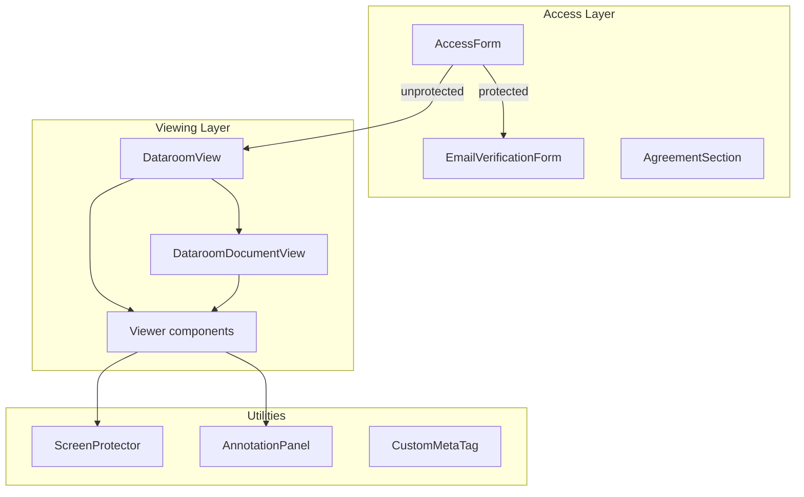

# components — view

# components/view Module

The `components/view` module provides the public-facing viewing experience for documents and datarooms. It handles access control gates (email/password/agreement forms), document rendering, annotation display, and dataroom browsing interfaces. This is the layer visitors interact with when accessing a Papermark link.

## Architecture Overview

The module consists of several functional areas: access gating, document/dataroom viewing, annotation display, and supporting UI utilities. The entry points (`DataroomView`, `DataroomDocumentView`, and page-level viewers) orchestrate the flow from access verification through to the final rendered content.



## Access Form System

The access form system (`access-form/`) implements the gate that visitors encounter before viewing protected content. It supports email collection, passcode verification, agreement acceptance (including Documenso e-signature integration), and custom field capture.

### Theme Provider

**`access-form-theme.tsx`** provides a React context for theming the access form. It wraps `createAdaptiveSurfacePalette` with the brand's accent color to produce a complete color palette for controls, backgrounds, and text.

```tsx
export function AccessFormThemeProvider({ value, children }) {
  return (
    <AccessFormThemeContext.Provider value={value}>
      {children}
    </AccessFormThemeContext.Provider>
  );
}

export function createAccessFormTheme(accentColor: string | null | undefined) {
  return createAdaptiveSurfacePalette(accentColor || "#000000");
}
```

The theme is memoized at the call site to avoid recalculation on every render.

### Form Sections

Each section is a self-contained input component:

| Component | Purpose |
|-----------|---------|
| `EmailSection` | Email input with debounced validation, localStorage persistence, and "shared with sender" messaging |
| `NameSection` | Full name input with localStorage persistence |
| `PasswordSection` | Passcode input with show/hide toggle |
| `CustomFieldsSection` | Dynamic rendering of custom fields (text, textarea, phone, checkbox, URL, number) |
| `AgreementSection` | Agreement display and Documenso signing integration |

### Agreement Signing Flow

**`agreement-section.tsx`** is the most complex form section. When `signingProvider === "DOCUMENSO"` or `agreementContentType === "SIGNING"`, it embeds the Documenso signing widget:

```tsx
const signingEmbedCssVars = useMemo(() => ({
  background: getEmbedSurfaceColor(theme.backgroundColor),
  primary: theme.ctaBgColor,
  primaryForeground: theme.ctaTextColor,
  // ... other CSS variable mappings
}), [/* theme tokens */]);
```

The signing flow:

1. **Session creation** — `ensureSigningSession()` posts to `/api/agreements/signing/session` with the agreement ID, link ID, and visitor identity
2. **Pre-warming** — on hover/focus of the "Open signing" button, the session is created early so the iframe loads faster
3. **Embedding** — `EmbedDirectTemplate` from `@documenso/embed-react` renders inside a `Sheet` (side panel) with custom CSS to hide Documenso's sidebar
4. **Completion** — `handleDocumentCompleted()` posts to `/api/agreements/signing/complete` when the visitor finishes signing

The component also handles **hydration** from stored state: if the visitor previously signed, their agreement status is loaded from localStorage and the status API, auto-confirming them.

### Email Verification

**`email-verification-form.tsx`** handles OTP verification when email verification is enabled. It displays a 6-digit OTP input with a 60-second resend cooldown timer.

## Document and Dataroom Views

### DataroomView

**`dataroom-view.tsx`** is the entry point for dataroom links. It manages the access flow and, once submitted, renders `DataroomViewer`.

```tsx
// State machine for the access/viewing lifecycle
const [submitted, setSubmitted] = useState(false);
const [verificationRequested, setVerificationRequested] = useState(false);
// ... then:
<DataroomViewer
  linkId={link.id}
  dataroom={dataroom}
  viewerEmail={viewData.viewerEmail ?? data.email ?? ...}
/>
```

### DataroomDocumentView

**`dataroom-document-view.tsx`** handles viewing a single document within a dataroom context. It differs from `DataroomView` in that it renders `ViewData` instead of `DataroomViewer`, passing document-specific data (pages, file, sheet data, etc.).

Both views share similar access patterns: form → email verification → viewing. They also both handle **inline OTP re-authentication** via `DownloadOtpVerification` when the server requires it for viewer uploads.

### ViewData

`ViewData` (imported from `view-data`) is the main document renderer that selects the appropriate viewer based on file type: PDF pages, Excel sheets, images, video, or Notion pages.

## Dataroom Components

### DataroomViewer

The viewer renders the dataroom shell with navbar, sidebar, and content area. Key sub-components:

- **`DataroomFolderPicker`** — dropdown for navigating folder hierarchy
- **`CompactDataroomListHeader`** / **`DocumentCard`** — compact list layout with grid template classes built from literal Tailwind strings
- **`DataroomBannerMedia`** — renders banner based on URL classification (image, video, YouTube embed)
- **`DataroomNoBannerTitle`** — title display when no banner is present
- **`DataroomTrailingActions`** — CTA buttons, Q&A toggle, download button; extracted to allow rendering from the body toolbar (in Notion preset mode)

### Downloads

**`viewer-download-progress-modal.tsx`** implements bulk download with progress tracking. It polls `/api/documents/[id]/download-status` and handles OTP verification for team member downloads.

## Screen Protection

**`ScreenProtection.tsx`** prevents screenshots by intercepting keyboard shortcuts across platforms:

| Platform | Shortcuts |
|----------|-----------|
| Windows/Linux | `PrintScreen`, `Alt+PrintScreen`, `Ctrl+PrintScreen`, `Shift+PrintScreen`, `Ctrl+Alt+PrintScreen`, `Meta+Shift+S` (Snipping), `Meta+G` (Game Bar) |
| macOS | `Cmd+Shift+3/4/5`, `Cmd+Shift+4+Space` (window) |
| Dev tools | `F12`, `Ctrl+Shift+I`, `Cmd+Option+I`, `Ctrl+Shift+C`, `Cmd+Option+C` |

PrintScreen requires `keyup: true` because browsers only emit it on keyup, not keydown. When triggered, an overlay blocks the screen with an "Screenshot is not allowed" message. The component also includes a print-specific block via `print:block`.

## Annotation System

**`annotation-panel.tsx`** renders annotations for the current page. It:

1. Fetches annotations via `useViewerAnnotations(linkId, documentId, viewId)`
2. Filters to the current page using `annotation.pages.includes(currentPage)`
3. Renders collapsible items with Tiptap JSON content (paragraphs, lists, blockquotes, images)
4. Displays attached images in a responsive grid

**`annotation-toggle.tsx`** provides the show/hide button, disabled when no annotations exist for the current page.

## Meta Tags

**`custom-metatag.tsx`** sets Open Graph and Twitter Card meta tags for link previews: canonical URL, favicon, title, description, and image. Branding (title, description, image) is only included when `enableBranding` is true.

## Theme System Integration

The viewer uses a separate theme provider from the access form:

```tsx
// In viewer setup:
const palette = createViewerSurfaceTheme(brand?.accentColor);

<ViewerSurfaceThemeProvider value={palette}>
  {/* viewer content */}
</ViewerSurfaceThemeProvider>
```

Components like `CompactDataroomListHeader`, `DataroomFolderPicker`, and `DocumentCard` consume this via `useViewerSurfaceTheme()` to apply consistent surface colors (panel backgrounds, control backgrounds, text colors) derived from the brand accent color.

## Key Patterns

### localStorage Persistence
Email and name inputs persist to `localStorage` (`papermark.email`, `papermark.name`) for return visitors, avoiding re-entry after the first visit.

### Session Pre-warming
The Documenso signing session is created on hover/focus before the user clicks "Open signing", reducing perceived latency when the sheet opens.

### Agreement Status Hydration
After signing, the agreement status is persisted to localStorage and verified against the status API on subsequent page loads, automatically confirming returning visitors who already signed.

### Tailwind JIT Compatibility
Grid template classes in `compactDataroomListGridClass` use literal strings rather than computed template literals. This ensures Tailwind's JIT compiler generates the corresponding CSS at build time.