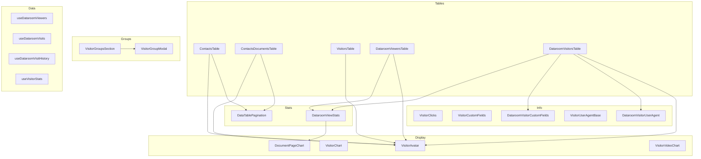

# components — visitors

# Visitors Module

The `components/visitors/` module provides a comprehensive set of React components for displaying, managing, and tracking visitors across documents and datarooms. It handles everything from visitor lists and avatars to detailed statistics and visitor group management.

## Architecture Overview



## Core Table Components

### ContactsTable

Displays a sortable, paginated list of visitor contacts. Supports sorting by email, last viewed time, and total visits.

**Key features:**
- Sortable columns with click-to-toggle ascending/descending order
- Pagination controls with configurable page size
- Visitor avatar with email-based gravatar or initials fallback
- Relative time display with tooltip showing exact timestamps

```tsx
// Usage
<ContactsTable
  viewers={viewersData}
  pagination={paginationConfig}
  sorting={currentSort}
  onPageChange={handlePageChange}
  onPageSizeChange={handlePageSizeChange}
  onSortChange={handleSortChange}
/>
```

### ContactsDocumentsTable

Shows documents viewed by a specific contact, including view duration, visit count, and last viewed time.

**Key features:**
- Document type icons via `fileIcon()`
- Duration loading states (shows skeleton while fetching)
- Custom sorting function for date comparison
- Row click navigation to document detail pages

```tsx
<ContactsDocumentsTable
  views={documentViews}
  durations={durationMap}
  loadingDurations={loading}
  pagination={paginationConfig}
/>
```

### DataroomViewersTable

Displays all visitors to a dataroom with expandable rows showing visit details.

**Key features:**
- Collapsible row expansion using Radix UI Collapsible
- Badges for verified, internal, and invited visitors
- Nested view statistics via `DataroomViewStats`
- Dynamic column visibility based on expansion state

### DataroomVisitorsTable

Enhanced visitors table for datarooms with support for:
- Custom field responses
- User agent information
- Signed agreement downloads
- Paused subscription handling (blurred visitor entries)

```tsx
// Example: Export visits feature
<Button onClick={() => setExportModalOpen(true)}>
  <Download className="!size-4" />
  Export visits
</Button>
```

## Visitor Identity Components

### VisitorAvatar

Generates visual identity for visitors based on their email address.

**Avatar generation strategy:**
1. Attempts gravatar URL using MD5 hash of email
2. Falls back to colored initials (first 2 characters)
3. Color is derived from email hash for consistency

```tsx
<VisitorAvatar 
  viewerEmail="user@example.com"
  isArchived={false}
/>
```

The component uses a deterministic color scheme derived from the email hash, ensuring the same visitor always gets the same background color across sessions.

## Statistics & Charts

### DataroomViewStats

Renders detailed view statistics for dataroom visits, combining multiple event types into a chronological timeline.

**Event types displayed:**
- **Upload** - Document uploads (purple icon)
- **View** - Document page views (orange icon)
- **Download** - Individual document downloads (cyan icon)
- **Bulk-download** - Folder or bulk downloads (expandable list)

The component fetches document-level statistics using `useDataroomViewDocumentStats` and displays:
- Time spent per document
- Completion rate as a gauge
- Page-by-page breakdown on expansion

### DocumentPageChart

Bar chart showing time spent on each page of a document.

**Behavior:**
- Shows loading skeleton during initial fetch
- Displays "downloaded without viewing" message for download-only visits
- Initializes data fetch after a 150ms delay to avoid unnecessary requests during rapid navigation

```tsx
<DocumentPageChart
  dataroomId={dataroomId}
  dataroomViewId={viewId}
  documentViewId={documentViewId}
  documentId={documentId}
  totalPages={totalPages}
/>
```

## Visitor Groups

### VisitorGroupModal

Dialog component for creating and editing visitor groups.

**Validation:**
- Group name must be at least 2 characters
- Email/domain list validation using `validateList()`
- Real-time feedback on invalid entries

**Features:**
- Create new groups or edit existing ones
- Displays linked documents and datarooms for existing groups
- Updates group list via SWR mutation after save

### VisitorGroupsSection

Card-based display of visitor groups with expandable member lists.

**Card structure:**
- Click to expand member details
- Dropdown menu for edit/delete actions
- Badges showing member and link counts
- Preview of first 5 members when collapsed

Members are categorized as:
- **Email members** - Specific email addresses
- **Domain members** - Domain wildcards (prefixed with `@`)

## Supporting Components

### DataTablePagination

Reusable pagination control for TanStack Table instances.

**Controls:**
- Page size selector (10, 20, 30, 40, 50)
- First/previous/next/last page navigation
- Current page indicator
- Row count display

### VisitorClicks

Displays external link click events recorded during document viewing.

Data is fetched via:
```tsx
useSWR(`/api/teams/${teamId}/documents/${documentId}/views/${viewId}/click-events`)
```

### VisitorCustomFields / DataroomVisitorCustomFields

Renders custom field responses collected during the visitor intake process.

```tsx
// Custom field structure
type CustomFieldResponse = {
  identifier: string;
  label: string;
  response: string;
};
```

## Data Dependencies

The module relies on several SWR hooks for data fetching:

| Hook | Purpose |
|------|---------|
| `useDataroomViewers` | List of dataroom visitors |
| `useDataroomVisits` | Individual visit records |
| `useDataroomVisitHistory` | Full visit timeline with documents |
| `useDataroomViewDocumentStats` | Per-document view statistics |
| `useDataroomVisitorUserAgent` | Browser/device information |
| `useDataroomDocumentPageStats` | Page-level duration data |
| `useVisitorGroups` | Visitor group management |

## Key Design Patterns

### Manual Pagination

All table components implement manual pagination with server-side data fetching:

```tsx
const table = useReactTable({
  data,
  columns,
  getCoreRowModel: getCoreRowModel(),
  manualPagination: true,
});
```

### Sort State Management

Sorting is handled through callback-driven state updates:

```tsx
const handleSort = useCallback((columnId: string) => {
  if (!onSortChange) return;
  
  let newSortOrder = "desc";
  if (currentSortBy === columnId) {
    if (currentSortOrder === "desc") {
      newSortOrder = "asc";
    }
    // Toggle behavior for subsequent clicks
  }
  onSortChange(columnId, newSortOrder);
}, [onSortChange, sorting?.sortBy, sorting?.sortOrder]);
```

### Collapsible Row Expansion

Expandable rows use Radix UI Collapsible with controlled state:

```tsx
const [expandedViewIds, setExpandedViewIds] = useState<Set<string>>(new Set());

const handleOpenChange = (viewId: string, open: boolean) => {
  setExpandedViewIds((prev) => {
    const next = new Set(prev);
    if (open) next.add(viewId);
    else next.delete(viewId);
    return next;
  });
};
```

### Loading Skeletons

Skeleton placeholders match the layout of actual content to prevent layout shift:

```tsx
if (!views) {
  return (
    <Table>
      <TableBody>
        {[...Array(5)].map((_, index) => (
          <TableRow key={index}>
            <TableCell>
              <div className="flex items-center space-x-3">
                <Skeleton className="h-7 w-7" />
                <Skeleton className="h-4 w-[200px]" />
              </div>
            </TableCell>
            {/* ... */}
          </TableRow>
        ))}
      </TableBody>
    </Table>
  );
}
```

## External Integrations

- **Next.js Router** - Navigation on row clicks
- **TanStack Table** - Table state management
- **SWR** - Data fetching and caching
- **Radix UI** - Accessible collapsible and popover components
- **Lucide React** - Iconography
- **TanStack React Table** - Sortable, filterable tables
- **Charting library** - Bar charts via `BarChartComponent`