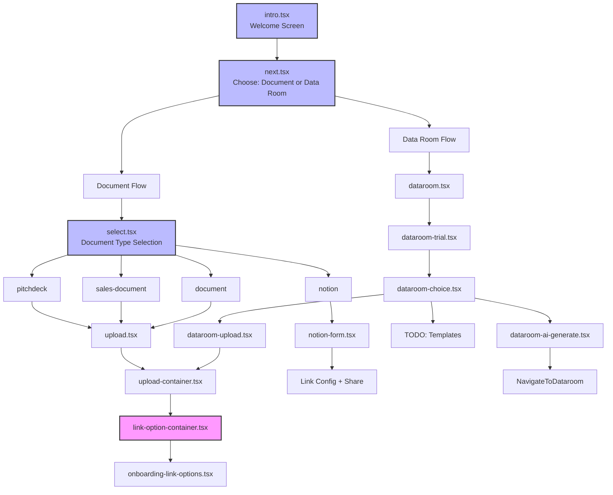
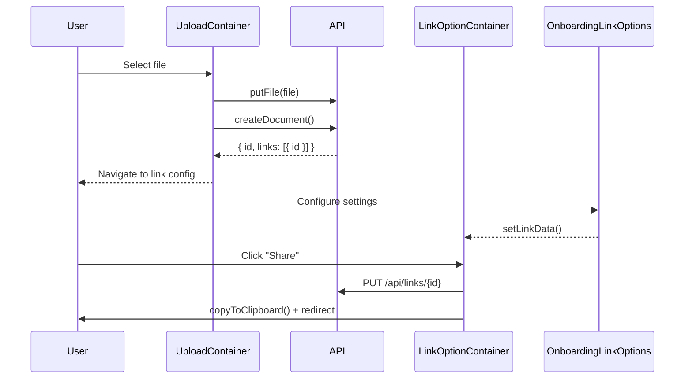

# components — welcome

# Welcome Module (`components/welcome`)

The welcome module provides the onboarding and document/dataroom creation flows for Papermark. It guides new users through initial setup, from choosing what to share through file upload to final link configuration with security settings.

## Overview

The module implements a multi-step wizard pattern that handles four primary flows:

1. **Document Sharing** — Upload a document and configure a shareable link with analytics
2. **Data Room Creation** — Start a trial and set up a multi-document data room
3. **Notion Import** — Import and share publicly-accessible Notion pages
4. **AI-Generated Data Rooms** — Describe a use case and have AI generate the folder structure



## Core Orchestrators

These components act as stateful containers that manage the wizard flow:

### `Upload` (`upload.tsx`)

Manages the document upload-to-share flow. Tracks local state for:

- `currentFile` — the selected `File` object
- `currentBlob` — whether a file has been uploaded (triggers phase change)
- `currentLinkId` / `currentDocId` — IDs returned from the API after upload
- `linkData` — the `DEFAULT_LINK_TYPE` object for link configuration

```tsx
// Phase 1: File selection and upload
if (!currentBlob) {
  return <UploadContainer {...props} />;
}

// Phase 2: Link configuration
if (currentBlob) {
  return <LinkOptionContainer {...props} />;
}
```

### `DataroomUpload` (`dataroom-upload.tsx`)

Identical structure to `Upload`, but passes `dataroomId` to `UploadContainer`. When uploading to an existing dataroom, the flow creates a link for the dataroom rather than the document.

### `NotionForm` (`notion-form.tsx`)

Handles Notion page import with two phases:

1. **URL submission** — validates the Notion URL using `parsePageId` from `notion-utils`
2. **Link configuration** — uses `LinkOptions` (not the onboarding variants) with an `Accordion` toggle

```tsx
// Validates Notion URL before submission
const validateNotionPageURL = parsePageId(notionLink);
if (validateNotionPageURL === null || !isValidURL.test(notionLink)) {
  toast.error("Please enter a valid Notion link to proceed.");
}
```

### `DataroomChoice` (`dataroom-choice.tsx`)

Presents three options for dataroom setup, each navigating with different query parameters:

| Option | Navigation Target | Icon |
|--------|-------------------|------|
| Create from Scratch | `/welcome?type=dataroom-upload&dataroomId={id}` | `FolderIcon` |
| Use a Template | `/welcome?type=dataroom-templates&dataroomId={id}` | `FileTextIcon` |
| Generate with AI | `/welcome?type=dataroom-ai-generate&dataroomId={id}` | `Sparkles` |

## Container Components

### `UploadContainer` (`containers/upload-container.tsx`)

Handles file upload with validation and document creation.

**Supported file types** — validated via `getSupportedContentType()`:
- PDF, PowerPoint, Excel, Word

**Upload flow:**

```tsx
const handleBrowserUpload = async (event) => {
  // 1. Validate file selection
  if (!currentFile) {
    toast.error("Please select a file to upload.");
    return;
  }

  // 2. Check file type support
  const supportedFileType = getSupportedContentType(currentFile.type);
  if (!supportedFileType) {
    toast.error("Unsupported file format...");
    return;
  }

  // 3. Upload to storage
  const { type, data, numPages, fileSize } = await putFile({ file, teamId });

  // 4. Create document record
  const response = await createDocument({
    documentData: { name, key, storageType, contentType, supportedFileType, fileSize },
    teamId,
    numPages,
    createLink: !dataroomId,  // Skip link creation when adding to dataroom
  });

  // 5. If dataroom, add document and create dataroom link
  if (dataroomId) {
    await fetch(`/api/teams/${teamId}/datarooms/${dataroomId}/documents`, {
      method: "POST",
      body: JSON.stringify({ documentId: document.id }),
    });
    // Create dataroom link...
  }

  // 6. Navigate to link config
  setCurrentLinkId(linkId);
  setCurrentDocId(document.id);
};
```

### `LinkOptionContainer` (`containers/link-option-container.tsx`)

Manages link configuration and sharing. Has two internal phases:

1. **Settings phase** (`showLinkSettings = true`) — renders `OnboardingLinkOptions` or `OnboardingDataroomLinkOptions`
2. **Share phase** (`showLinkSettings = false`) — displays the shareable link URL and "Copy & Share" button

**Link submission:**

```tsx
const handleSubmit = async (event) => {
  // Upload metaImage if it's a data URL
  let blobUrl = linkData.metaImage;
  if (linkData.metaImage?.startsWith("data:")) {
    const blob = convertDataUrlToFile({ dataUrl: linkData.metaImage });
    blobUrl = await uploadImage(blob);
  }

  // Update link with all settings
  await fetch(`/api/links/${currentLinkId}`, {
    method: "PUT",
    body: JSON.stringify({
      ...linkData,
      metaImage: blobUrl,
      targetId: currentDataroomId || currentDocId,
      linkType: currentDataroomId ? LinkType.DATAROOM_LINK : LinkType.DOCUMENT_LINK,
      teamId,
    }),
  });

  // Copy to clipboard and redirect
  copyToClipboard(`${process.env.NEXT_PUBLIC_MARKETING_URL}/view/${currentLinkId}`);
  router.push(currentDataroomId ? `/datarooms/${currentDataroomId}/documents` : `/documents/${currentDocId}`);
};
```

## Link Options Components

### `OnboardingLinkOptions` (`containers/onboarding-link-options.tsx`)

Renders link configuration settings for **documents**. Features:

- **Plan-gated features** — uses `usePlan()` and `useLimits()` hooks to determine which options are available
- **Upgrade modal integration** — calls `handleUpgradeStateChange()` when users toggle restricted features
- **Collapsible advanced settings** — toggled via `showAdvancedSettings` state for document links

```tsx
// Example: Watermark availability depends on plan and limits
<WatermarkSection
  {...{ data, setData }}
  isAllowed={isTrial || isDatarooms || isDataroomsPlus || allowWatermarkOnBusiness}
  handleUpgradeStateChange={handleUpgradeStateChange}
  presets={currentPreset}
/>
```

### `OnboardingDataroomLinkOptions` (`containers/onboarding-dataroom-link-options.tsx`)

Simpler variant for **dataroom links**. Always shows all settings (no plan-gating) except:

- `ExpirationSection` and `OGSection` are hidden under "Other custom settings" toggle
- Uses a different subset of sections appropriate for datarooms

## AI Data Room Generation

### `DataroomAIGenerate` (`dataroom-ai-generate.tsx`)

Two-phase component for AI-generated dataroom structures:

**Phase 1: Description input**

```tsx
const handleGenerateFolders = async () => {
  const response = await fetch(
    `/api/teams/${teamId}/datarooms/generate-ai-structure`,
    { method: "POST", body: JSON.stringify({ description: aiDescription }) }
  );
  const { name, folders } = await response.json();
  setGeneratedFolders(folders);
  setDataroomName(name);
  setShowPreview(true);
};
```

**Phase 2: Folder preview with selection**

The component maintains state for:
- `selectedFolderPaths` — `Set<string>` of selected folder paths
- `editingFolderPath` / `editingFolderName` — inline editing state

```tsx
// Recursive folder rendering with checkbox selection
const renderFolderPreview = (folders, indent = 0, parentPath = "") => {
  return folders.map((folder) => {
    const currentPath = generateFolderPath(folder, parentPath);
    return (
      <div key={currentPath} className="pl-4">
        <Checkbox
          checked={selectedFolderPaths.has(currentPath)}
          onCheckedChange={() => toggleFolderSelection(currentPath, folder)}
        />
        {/* Inline name editing */}
        {editingFolderPath === currentPath ? (
          <Input value={editingFolderName} onBlur={saveFolderName} />
        ) : (
          <span onClick={() => handleFolderNameEdit(currentPath, folder.name)}>
            {folder.name}
          </span>
        )}
        {folder.subfolders && renderFolderPreview(folder.subfolders, indent + 1, currentPath)}
      </div>
    );
  });
};
```

**Dataroom creation:**

```tsx
const handleCreateDataroom = async () => {
  const filteredFolders = filterSelectedFolders(generatedFolders);
  await fetch(`/api/teams/${teamId}/datarooms/generate-ai`, {
    method: "POST",
    body: JSON.stringify({ name: dataroomName, folders: filteredFolders, dataroomId }),
  });
  router.push(`/datarooms/${dataroom.id}/documents`);
};
```

## Survey Flow

### `Select` (`select.tsx`)

Document type selection with conditional survey questions:

1. **Document type selection** — pitchdeck, sales-document, notion, or document
2. **Use case question** (for notion/document) — shown inline after type selection
3. **Deal size question** — shown based on document type and use case

```tsx
// Auto-set deal type for specific document types
if (docType === "pitchdeck") {
  setDealType("startup-fundraising");
} else if (docType === "sales-document") {
  setDealType("sales");
}

// Save survey and proceed to upload
const saveSurveyAndProceed = async (type, size, otherText) => {
  await fetch(`/api/teams/${teamId}/survey`, {
    method: "POST",
    body: JSON.stringify({ dealType: type, dealTypeOther: otherText, dealSize: size }),
  });
  router.push({ pathname: "/welcome", query: { type: selectedDoc } });
};
```

## Data Flow Summary



## Key Dependencies

| Dependency | Purpose |
|------------|---------|
| `useTeam()` | Access `currentTeam.id` for API calls |
| `usePlan()` / `useLimits()` | Determine feature availability |
| `useAnalytics()` | Track user events (Document Added, Link Added, etc.) |
| `putFile()` | Upload file to storage |
| `createDocument()` | Create document record in database |
| `uploadImage()` | Upload meta image (OG images) |
| `copyToClipboard()` | Copy share link to clipboard |
| `UpgradePlanModal` | Modal for plan upgrade prompts |