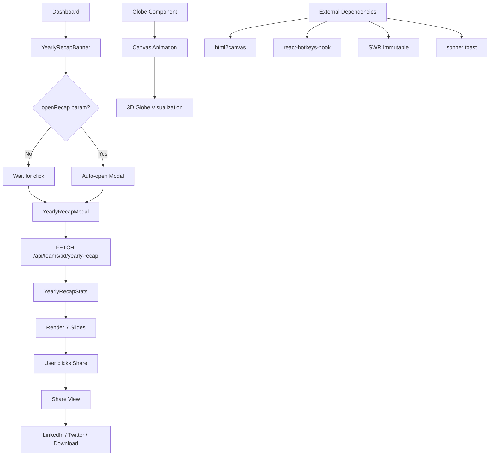

# components — yearly-recap

# Yearly Recap Module (`components/yearly-recap`)

A "Spotify Wrapped" style feature that presents users with a personalized year-in-review of their Papermark document sharing activity. The module consists of a promotional banner and a multi-slide modal with animated statistics.

## Module Structure

```
yearly-recap/
├── index.ts                 # Public exports
├── globe.tsx                # 3D animated globe visualization
├── yearly-recap-banner.tsx  # Dashboard banner component
└── yearly-recap-modal.tsx   # Main modal with stat slides
```

## Public API

```typescript
export { YearlyRecapBanner } from "./yearly-recap-banner";
export { YearlyRecapModal } from "./yearly-recap-modal";
```

Both components are client-side (`"use client"` directive required).

## YearlyRecapBanner

A persistent banner displayed in the dashboard that invites users to view their yearly recap.

### Props

None required. The component reads team context internally.

### Behavior

1. **Conditional Rendering**: Only renders when `teamInfo?.currentTeam?.id` exists
2. **URL Parameter Support**: Listens for `?openRecap=true` in the URL. When present, automatically opens the modal and removes the parameter via `router.replace()`
3. **Analytics**: Fires `YIR: Banner Opened` event on click with `teamId` and `source: "banner"`

### Visual Design

- Gradient background: orange → white → green
- Decorative SVG elements (document stack, scatter dots)
- Orange Sparkles icon with rounded background
- "Papermark Wrapped {year}" heading with ArrowRight button

## YearlyRecapModal

The main interactive modal containing 7 slides of statistics.

### Props

```typescript
interface YearlyRecapModalProps {
  isOpen: boolean;      // Dialog visibility state
  onClose: () => void;  // Callback to close the modal
  teamId: string;       // Team identifier for data fetching
}
```

### Data Source

Stats are fetched via SWR Immutable from:
```
GET /api/teams/${teamId}/yearly-recap
```

### Stats Interface

```typescript
interface YearlyRecapStats {
  year: number;
  totalViews: number;
  totalDocuments: number;
  totalLinks: number;
  totalDatarooms: number;
  mostViewedDocument: { documentId: string; documentName: string; viewCount: number } | null;
  mostActiveMonth: { month: string; viewCount: number } | null;
  mostActiveViewer: { email: string; name: string | null; viewCount: number } | null;
  totalDuration: number;      // In milliseconds
  uniqueCountries: string[];
  distanceTraveled: number;
}
```

### Slide Structure

| Slide | Index | Content |
|-------|-------|---------|
| IntroSlide | 0 | Welcome message, "Let's go" button |
| GlobalFootprintSlide | 1 | Distance traveled, countries reached |
| MinutesSlide | 2 | Total viewing time, most viewed document |
| ViewsStatsSlide | 3 | Grid: views, documents, datarooms |
| MostActiveSlide | 4 | Most active viewer info |
| SummarySlide | 5 | Year celebration, busiest month |
| ShareOfferSlide | 6 | $50 credit offer for sharing |

### Keyboard Navigation

| Key | Action |
|-----|--------|
| `→` | Next slide |
| `←` | Previous slide |
| `Enter` / `Space` | Next slide (when not on last slide) |
| `Escape` | Close share view or close modal |

### Share Functionality

The modal has a separate "share view" with three options:

1. **LinkedIn**: Opens share dialog with pre-filled stats text
2. **Twitter/X**: Opens tweet composer with pre-filled stats
3. **Download**: Captures shareable card as PNG using `html2canvas`

The shareable card displays:
- 2x2 grid of stats (minutes, km, documents, views)
- Papermark branding
- Optimized for social sharing

### Analytics Events

| Event | Trigger |
|-------|---------|
| `YIR: Banner Opened` | Banner click |
| `YIR: Share Clicked` | "Share" button in navigation |
| `YIR: Share Platform Clicked` | LinkedIn, Twitter, or download button |

## Globe Component

An animated 3D globe rendered on HTML Canvas showing document reach.

### Technical Details

- **Rendering**: 2D canvas with perspective projection
- **Point Generation**: 2500 points distributed using spherical coordinates
- **Animation**: Continuous Y-axis rotation at 0.003 rad/frame
- **Fixed Tilt**: 0.3 rad around X-axis for viewing angle
- **Depth Sorting**: Points sorted by Z-coordinate, back-to-front rendering
- **Point Colors**:
  - Land: greens and browns (6 colors)
  - Ocean: blues (4 colors)
- **Land Detection**: Approximated via `sin(theta * 3) * sin(phi * 2)` pattern

### Projection Pipeline

```typescript
// 1. Rotate around X axis
y = y * cosX - z * sinX
z = y * sinX + z * cosX

// 2. Rotate around Y axis
x = x * cosY + z * sinY
z = -x * sinY + z * cosY

// 3. Perspective projection
scale = 300 / (z + 150)
x2d = x * scale + width / 2
y2d = y * scale + height / 2
```

## Architecture Flow



## Integration Points

### Team Context
```typescript
const teamInfo = useTeam(); // from @/context/team-context
```

### Analytics
```typescript
const analytics = useAnalytics(); // from @/lib/analytics
```

### UI Components Used
- `Button` from `@/components/ui/button`
- `Dialog` / `DialogContent` from `@/components/ui/dialog`
- `cn` utility from `@/lib/utils`
- `fetcher` from `@/lib/utils`

### Routing
Uses `next/router` for URL parameter handling (`openRecap`).

## State Management

The modal maintains local state:
- `currentSlide: number` — Active slide index
- `showShareView: boolean` — Whether share view is displayed
- `isCapturing: boolean` — Image capture in progress

SWR handles server state for stats with `useSWRImmutable` (cached indefinitely).

## Key Implementation Patterns

### Slide Animation
Uses Tailwind `animate-in` classes with directional classes:
- `slide-in-from-top-8` / `slide-in-from-bottom-8` / `slide-in-from-left-8` / `slide-in-from-right-8`
- `zoom-in-75` / `zoom-in-50`
- Animation delays via `style={{ animationDelay: "..." }}`

### Dynamic Import
```typescript
const html2canvas = (await import("html2canvas")).default;
```
Avoids bundle bloat by dynamically importing the heavy canvas library only when share is triggered.

### Cleanup
The Globe component properly cancels animation frames on unmount:
```typescript
return () => cancelAnimationFrame(animationId);
```