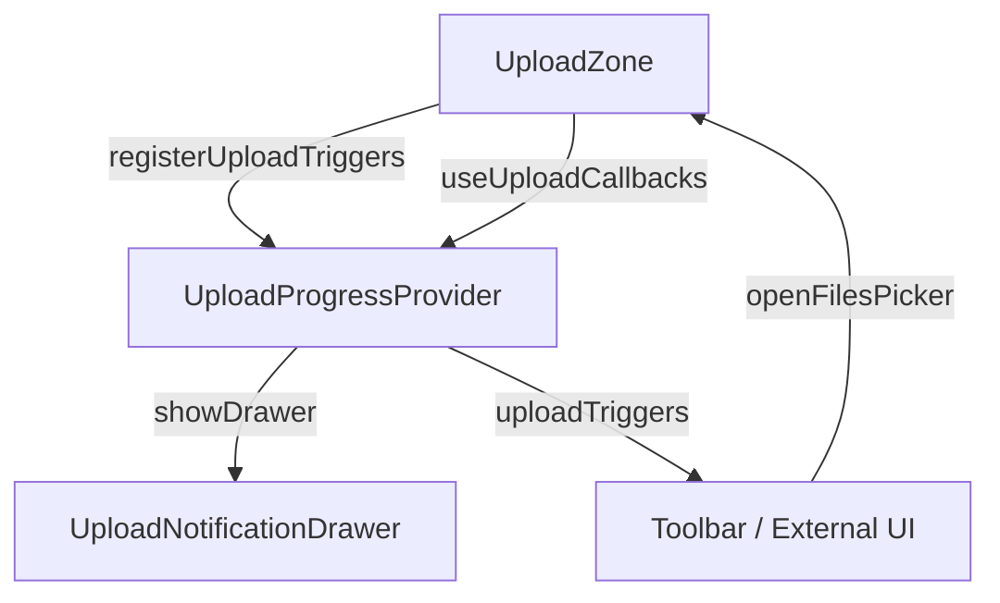

# context

# Context Module Documentation

The `context/` directory provides React Context providers that manage application-wide state for three distinct domains:

1. **Team selection** — current team and team list
2. **Upload progress** — batch upload tracking, progress UI, and cancellation
3. **Pending uploads** — documents awaiting or undergoing processing

These contexts are consumed by components throughout the codebase, from billing modals to dataroom item lists.

---

## Team Context (`team-context.tsx`)

### Purpose

Manages the currently selected team across the application. Since the app is multi-tenant (users belong to multiple teams), the team context ensures that the correct team scope is applied to data fetching, settings, and billing operations.

### State Shape

```typescript
type TeamContextType = {
  teams: Team[];           // All teams the current user belongs to
  currentTeam: Team | null; // The actively selected team
  currentTeamId: string | null;
  isLoading: boolean;
  setCurrentTeam: (team: Team) => void;
};
```

### Initialization Logic

The provider initializes the `currentTeam` through a cascading fallback:

1. **Check localStorage** — Look for a `currentTeamId` saved from a previous session
2. **Match against loaded teams** — If found, set that team as current
3. **Default to first team** — If no saved preference, select the first team in the list
4. **Persist to localStorage** — Save the selection so it survives page reloads

This means team selection is sticky across sessions without requiring the user to re-select on every visit.

### Data Flow

```
useTeams (SWR)          localStorage
      ↓                      ↓
   [teams, loading]    currentTeamId
          ↓                  ↓
    TeamProvider ──────────────────→ currentTeam
          ↓
   Context value ──→ useTeam() consumers
```

### Usage Example

```tsx
const { currentTeam, setCurrentTeam, teams } = useTeam();

// Switch to a different team
<select onChange={(e) => {
  const team = teams.find(t => t.id === e.target.value);
  setCurrentTeam(team);
}}>
  {teams.map(team => (
    <option key={team.id} value={team.id}>{team.name}</option>
  ))}
</select>
```

The `useTeam` hook is consumed by 30+ components across billing modals, dataroom settings, group management, and analytics tables. Any component that needs to display team-scoped data or check plan limits uses this context.

---

## Upload Progress Context (`upload-progress-context.tsx`)

### Purpose

Coordinates upload state between the `UploadZone` component and the `UploadNotificationDrawer` UI. It provides:

- A unified view of all active upload batches and their items
- Rejected file tracking (files that failed validation before upload)
- Cancellation support (full batch or individual items)
- Imperative triggers so external UI (like toolbar buttons) can open file/folder pickers

### Architecture

This context is unusual in that it bridges two separate concerns:

1. **State management** — tracking batches, items, bytes, and rejection lists
2. **UI coordination** — controlling the drawer and exposing triggers



### Upload Zone Triggers

The context exposes `uploadTriggers` so components outside the `UploadZone` can trigger file picker dialogs:

```typescript
interface UploadZoneTriggers {
  openFilesPicker: () => void;
  openFolderPicker: () => void;
}
```

This enables scenarios like an "Upload" button in the page toolbar opening the picker without reaching into the DOM.

The `registerUploadTriggers` function returns an unregister callback and includes an identity guard — a late unmount won't clear a newer registration.

### Cancellation Model

The context supports two cancellation granularities:

| Level | Function | Behavior |
|-------|----------|----------|
| Batch | `cancelUpload()` | Cancels all in-flight uploads, marks all pending items as complete |
| Item | `cancelItem(itemId)` | Cancels a single file/folder, updates batch totals |

Both functions recalculate `bytesUploaded` and `bytesTotal` using `getActiveUploadByteTotals`, which iterates items and skips cancelled ones.

### Batch and Item State

```typescript
// Simplified shapes
type UploadBatchState = {
  batchId: string;
  items: UploadItemState[];
  totalEntries: number;      // total files across all items
  completedEntries: number;
  failedEntries: number;
  bytesUploaded: number;
  bytesTotal: number;
  cancelled: boolean;
};

type UploadItemState = {
  itemId: string;
  name: string;
  type: 'file' | 'folder';
  totalEntries: number;
  completedEntries: number;
  failedEntries: number;
  bytesUploaded?: number;
  bytesTotal?: number;
  cancelled: boolean;
};
```

The batch aggregates counts from its items. When an item is cancelled, the batch's `completedEntries` increases by the remaining count (items that won't be uploaded are treated as complete).

### useUploadCallbacks

This hook provides stable callbacks for wiring `UploadZone` to the context:

```typescript
const {
  onTraversalStart,      // Folder drag detected, show drawer with preliminary items
  onUploadBatchStart,     // Actual upload beginning, merge into existing batch
  onUploadBatchUpdate,    // Progress update from Trigger.dev
  onUploadRejected,       // Files rejected before upload (size, type, etc.)
  onUploadAborted,        // Upload aborted before starting
} = useUploadCallbacks();
```

These callbacks are designed to be called from the `UploadZone` as the upload lifecycle progresses.

### Drawer Lifecycle

The drawer opens automatically when:

- Folder traversal begins (`onTraversalStart`)
- A batch upload starts (`onUploadBatchStart`)
- Files are rejected (`onUploadRejected`)

Closing the drawer resets all state: the batch, rejected files, cancelled item IDs, and cancel functions. This ensures a clean slate for the next upload session.

---

## Pending Uploads Context (`pending-uploads-context.tsx`)

### Purpose

Tracks documents that are either actively uploading/processing or have been persisted from a previous session. This context powers the dataroom items list, showing users the real-time status of their uploads.

### Dual Source Architecture

The context maintains two separate arrays:

```typescript
// In-flight uploads from the current session
const [pendingUploads, setPendingUploads] = useState<PendingUploadDocument[]>([]);

// Persisted uploads loaded from the server
const [persistedUploads, setPersistedUploads] = useState<PendingUploadDocument[]>([]);
```

**Why separate them?**

- **In-flight uploads** have real-time status (progress percentage, current processing stage)
- **Persisted uploads** come from the server and represent completed/processing uploads from a previous page load

### Server Persistence

On mount, if `linkId` and `dataroomId` are provided, the provider fetches persisted uploads:

```
GET /api/links/{linkId}/upload?dataroomId={dataroomId}
```

Response uploads are transformed into `PendingUploadDocument` objects with `persisted: true`.

The `fetchedRef` prevents duplicate fetches if the component re-renders before the effect completes.

### Deduplication Logic

When providing the merged list, in-flight uploads take priority:

```typescript
const allUploads = useMemo(() => {
  // Get documentIds from in-flight uploads
  const inFlightDocIds = new Set(
    pendingUploads
      .filter(u => u.documentId)
      .map(u => u.documentId)
  );

  // Filter out persisted uploads that have an in-flight version
  const filteredPersisted = persistedUploads.filter(
    u => !inFlightDocIds.has(u.documentId)
  );

  return [...pendingUploads, ...filteredPersisted];
}, [pendingUploads, persistedUploads]);
```

This ensures that if a user starts uploading a document that was already persisted (e.g., from a previous session), the real-time status takes over rather than showing stale server data.

### Document Lifecycle

```typescript
type PendingUploadDocument = {
  id: string;
  name: string;
  folderId: string | null;
  uploadedAt: Date;
  status: "uploading" | "processing" | "complete" | "error";
  progress: number;
  documentId?: string;           // Assigned after server processing
  dataroomDocumentId?: string;   // Assigned when added to dataroom
  documentVersionId?: string;    // For Trigger.dev realtime updates
  fileType?: string;
  errorMessage?: string;
  persisted?: boolean;           // Whether loaded from server
};
```

### Status Transitions

Typical lifecycle for an uploaded document:

1. **`uploading`** — File is being uploaded to the server
2. **`processing`** — Upload complete, Trigger.dev is processing/extracting content
3. **`complete`** — Processing finished, document fully available

If any step fails, status becomes `error` with an `errorMessage`.

### Provider API

```typescript
type PendingUploadsContextType = {
  pendingUploads: PendingUploadDocument[];  // Merged (allUploads)
  addPendingUpload: (upload: PendingUploadDocument) => void;
  updatePendingUpload: (id: string, update: Partial<PendingUploadDocument>) => void;
  removePendingUpload: (id: string) => void;
  clearCompletedUploads: () => void;
  getPendingUploadsForFolder: (folderId: string | null) => PendingUploadDocument[];
  getAllUploads: () => PendingUploadDocument[];
  hasUploads: boolean;
  isLoading: boolean;  // True while fetching persisted uploads
};
```

### Usage

```tsx
const { getPendingUploadsForFolder, updatePendingUpload, hasUploads } = usePendingUploads();

// Get uploads for current folder (null = root)
const folderUploads = getPendingUploadsForFolder(currentFolderId);

// Show upload status in a list
{folderUploads.map(upload => (
  <UploadStatusBadge key={upload.id} upload={upload} />
))}
```

---

## Relationship Between Upload Contexts

The two upload-related contexts serve different but complementary roles:

| Aspect | `PendingUploadsContext` | `UploadProgressContext` |
|--------|------------------------|-------------------------|
| **Primary concern** | Document status (persistence) | Upload operation (progress) |
| **Timeframe** | Pre-upload through processing | During active upload |
| **Status granularity** | `uploading`, `processing`, `complete`, `error` | `totalEntries`, `completedEntries`, bytes |
| **Consumer** | DataroomItemsList | UploadZone, UploadNotificationDrawer |
| **Trigger** | API callbacks from Trigger.dev | File picker / drag-drop |

They are used together in `DataroomItemsList`, which calls both `useUploadCallbacks` (for wiring the upload zone) and `useUploadProgress` (for controlling drawer visibility).