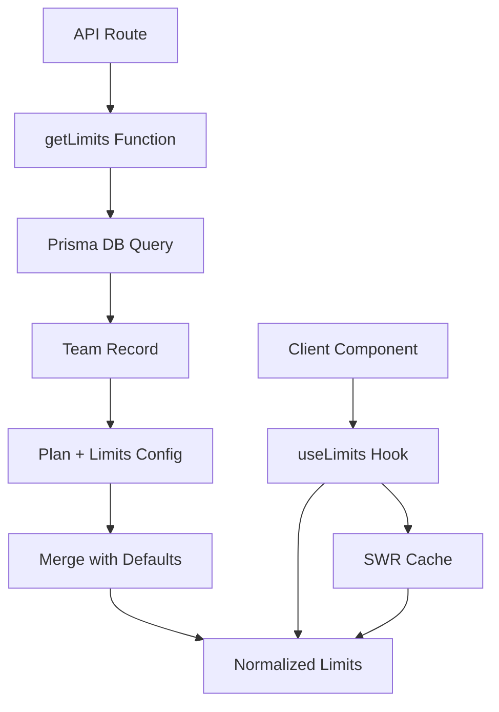

# ee — limits

# ee/limits Module

The `ee/limits` module manages subscription-based resource limits for teams. It defines plan tiers, handles per-team limit configuration, and provides both server-side and client-side APIs for checking and enforcing quotas.

## Overview

This module centralizes limit management for:

- **User seats** — How many team members can join
- **Documents** — Total documents allowed
- **Links** — Total links that can be created
- **Domains** — Custom domain assignments
- **Datarooms** — Virtual data room instances
- **File uploads** — Per-file size limits and page counts
- **Feature flags** — Boolean gates for premium features



## Plan Architecture

### Plan Tiers

The module defines seven plan tiers with increasing capabilities:

| Plan | Users | Links | Documents | Domains | Datarooms | Notes |
|------|-------|-------|-----------|---------|-----------|-------|
| Free | 1 | 50 | 50 | 0 | 0 | Entry tier |
| Pro | 1 | ∞ | 300 | 0 | 0 | Limited growth |
| Business | 3 | ∞ | ∞ | 5 | 100 | Mainstream tier |
| Datarooms | 3 | ∞ | ∞ | 10 | 100 | Data room focus |
| Datarooms Plus | 5 | ∞ | ∞ | 1000 | 1000 | +5 custom fields |
| Datarooms Premium | 10 | ∞ | ∞ | 1000 | 1000 | Team expansion |
| Datarooms Unlimited | ∞ | ∞ | ∞ | ∞ | ∞ | No restrictions |

### Null Means Unlimited

In `TFileSizeLimits` and `TPlanLimits`, `null` represents unlimited:

```typescript
video?: number | null;  // null = unlimited upload size
documents?: number | null;  // null = unlimited count
```

The `normalizeFileSizeLimit()` function converts `null` to `Infinity` for numeric comparison operations.

## Key Components

### constants.ts — Plan Definitions

Defines the baseline limits for each plan tier as exported constants:

```typescript
export const FREE_PLAN_LIMITS = {
  users: 1,
  links: 50,
  documents: 50,
  domains: 0,
  datarooms: 0,
  customDomainOnPro: false,
  customDomainInDataroom: false,
  advancedLinkControlsOnPro: false,
  linkCustomFields: 0,
};
```

Feature gates like `customDomainOnPro` are boolean flags that enable/disable functionality regardless of count-based limits.

### server.ts — Limit Resolution

The core function `getLimits()` resolves final limits by merging:

1. **Plan defaults** — Baseline limits from the team's subscription plan
2. **Team overrides** — Per-team customizations stored in `team.limits` JSON column
3. **Trial adjustments** — Special handling for trial periods

```typescript
export async function getLimits({ teamId, userId }: {
  teamId: string;
  userId: string;
}) {
  // 1. Fetch team with plan and limits config
  // 2. Parse limits JSON with Zod schema
  // 3. Get base plan (handles "pro+drtrial" → "pro")
  // 4. Merge defaults with parsed config
  // 5. Apply Infinity to null limits for paid plans
  // 6. Return with current usage counts
}
```

**Plan String Parsing**

The system handles compound plan strings:

```typescript
"free+drtrial"  → base: "free", isTrial: true
"business"      → base: "business", isTrial: false
"datarooms-plus" → base: "datarooms-plus", isTrial: false
```

**Usage Tracking**

The function returns current usage alongside limits:

```typescript
{
  users: 5,
  documents: 300,
  links: Infinity,
  // ...
  usage: {
    documents: 47,  // current count
    links: 123,
    users: 3,
  }
}
```

### handler.ts — API Endpoint

Provides the REST endpoint for fetching team limits:

```
GET /api/teams/:teamId/limits
```

Response includes limits merged with feature flags:

```typescript
{
  ...limits,
  conversationsInDataroom: true,  // from feature flags
  dataroomUpload: true,            // from feature flags
}
```

### swr-handler.ts — Client Hook

Provides `useLimits()` for React components:

```typescript
const { limits, canAddDocuments, canAddLinks, canAddUsers } = useLimits();
```

Derived booleans make UI conditional rendering straightforward:

```typescript
if (!canAddDocuments) {
  return <UpgradePrompt />;
}
```

## Usage Patterns

### Server-Side Enforcement

API routes validate limits before operations:

```typescript
// In document creation handler
const limits = await getLimits({ teamId, userId });

if (limits.usage.documents >= limits.documents) {
  return res.status(403).json({ error: "Document limit reached" });
}
```

Key consumers:
- `file/s3/multipart.ts` — File upload initialization
- `file/tus/[[...file]].ts` — TUS upload handling
- `api/links/bulk-import.ts` — Bulk link creation
- `api/datarooms/generate.ts` — Dataroom creation
- `teams/[teamId]/invite.ts` — User invitations

### Client-Side UI

Components use `useLimits()` to conditionally render upgrade prompts:

```typescript
function AddDocumentButton() {
  const { canAddDocuments, showUpgradePlanModal } = useLimits();
  
  if (showUpgradePlanModal) {
    return <UpgradePlanModal />;
  }
  
  return <Button disabled={!canAddDocuments}>Add Document</Button>;
}
```

Key consumers:
- `TeamSwitcher` — Sidebar navigation
- `DuplicateDataroom` — Settings modal

## Limit Merging Logic

The merging process follows this priority order:

1. **Plan defaults** (lowest priority)
2. **Team overrides** from `team.limits` JSON
3. **File size limits** merged separately (plan defaults + team overrides)
4. **Trial adjustments** (highest priority for trial plans)

```typescript
const mergedLimits = {
  ...defaultLimits,        // from plan
  ...parsedData,           // team overrides
  fileSizeLimits: {        // special merge for nested object
    ...normalizeFileSizeLimits(defaultLimits.fileSizeLimits),
    ...parsedData.fileSizeLimits,
  }
};
```

## File Size Limits

Per-plan file size constraints:

| Plan | Max Files | Max Pages |
|------|-----------|-----------|
| Free/Pro | — | — |
| Business | 500 | — |
| Datarooms | 1000 | — |
| Datarooms Plus | 5000 | 1000 |
| Datarooms Premium | 5000 | 1000 |
| Datarooms Unlimited | ∞ | ∞ |

These limits apply per-upload operation and are checked during file processing.

## Paused Plan Behavior

When a subscription is paused (`PAUSED_PLAN_LIMITS`), the system restricts new creation while preserving access:

```typescript
export const PAUSED_PLAN_LIMITS = {
  canCreateLinks: false,
  canReceiveViews: false,
  canCreateDocuments: false,
  canCreateDatarooms: false,
  // Keep existing access
  canViewAnalytics: true,
  canAccessExistingContent: true,
};
```