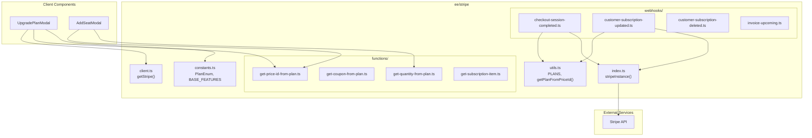

# ee — stripe

# ee/stripe Module

The `ee/stripe` module handles Stripe integration for Papermark.io, managing subscription lifecycles, plan pricing, and the connection between Stripe accounts and internal team records.

## Overview

This module supports a dual-account Stripe architecture—managing both "old" legacy accounts and "new" accounts through separate Stripe clients. It provides:

- Stripe client initialization for frontend and backend
- Plan and pricing definitions with Stripe price IDs
- Utility functions for mapping between plans, price IDs, and display names
- Webhook handlers for subscription lifecycle events
- Feature definitions for each pricing tier

## Architecture



## Dual Account Architecture

The module maintains two separate Stripe accounts: one for "old" accounts (legacy customers) and one for "new" accounts. This is handled through the `account` or `isOldAccount` boolean parameter.

**Stripe Instance Selection:**

| Account Type | Secret Key | Publishable Key |
|-------------|------------|-----------------|
| New (default) | `STRIPE_SECRET_KEY_LIVE` / `STRIPE_SECRET_KEY` | `NEXT_PUBLIC_STRIPE_PUBLISHABLE_KEY_LIVE` / `NEXT_PUBLIC_STRIPE_PUBLISHABLE_KEY` |
| Old | `STRIPE_SECRET_KEY_LIVE_OLD` / `STRIPE_SECRET_KEY_OLD` | `NEXT_PUBLIC_STRIPE_PUBLISHABLE_KEY_LIVE_OLD` / `NEXT_PUBLIC_STRIPE_PUBLISHABLE_KEY_OLD` |

```typescript
// Backend usage
import { stripeInstance } from "@/ee/stripe";
const stripe = stripeInstance(isOldAccount);

// Frontend usage
import { getStripe } from "@/ee/stripe/client";
const stripe = await getStripe(isOldAccount);
```

## Plan Structure

Plans are defined in `utils.ts` with the `PLANS` array. Each plan includes:

- **name**: Display name (e.g., "Business")
- **slug**: URL-safe identifier (e.g., "business")
- **minQuantity**: Minimum team members included
- **price**: Monthly and yearly pricing with environment-specific Stripe price IDs

### Available Plans

| Plan | Slug | Monthly | Yearly | Min Users |
|------|------|---------|--------|-----------|
| Pro | `pro` | €29 | €24 | 1 |
| Business | `business` | €79 | €59 | 3 |
| Data Rooms | `datarooms` | €149 | €99 | 3 |
| Data Rooms Plus | `datarooms-plus` | €349 | €249 | 5 |
| Data Rooms Premium | `datarooms-premium` | €699 | €549 | 10 |
| Data Rooms Unlimited | `datarooms-unlimited` | €1499 | €999 | 1 |

Each plan stores price IDs for four combinations:
- `test` environment + `old` account
- `test` environment + `new` account
- `production` environment + `old` account
- `production` environment + `new` account

## Key Functions

### Price ID Lookup

`getPriceIdFromPlan()` retrieves the Stripe price ID for a given plan and billing period:

```typescript
import { getPriceIdFromPlan } from "@/ee/stripe/functions/get-price-id-from-plan";

const priceId = getPriceIdFromPlan({
  planSlug: "business",
  period: "yearly",
});
```

### Plan Lookup from Price ID

`getPlanFromPriceId()` reverses the lookup, finding the internal plan from a Stripe price ID:

```typescript
import { getPlanFromPriceId } from "@/ee/stripe/utils";

const plan = getPlanFromPriceId(priceId, isOldAccount);
```

This function also handles historical price IDs for legacy subscriptions that no longer exist in the main configuration.

### Old Account Detection

`isOldAccount()` checks if a plan string indicates a legacy account:

```typescript
import { isOldAccount } from "@/ee/stripe/utils";

if (isOldAccount(plan)) {
  // Use old Stripe account
}
```

### Feature Retrieval

`getPlanFeatures()` returns the feature list for a plan with optional filtering:

```typescript
import { getPlanFeatures, PlanEnum } from "@/ee/stripe/constants";

const features = getPlanFeatures(PlanEnum.Business, {
  period: "yearly",
  maxFeatures: 5,
  excludeFeatures: ["webhooks"],
});
```

## Webhook Handlers

### Checkout Session Completed

`checkoutSessionCompleted()` processes successful purchases:

1. Retrieves subscription from Stripe
2. Maps price ID to plan using `getPlanFromPriceId()`
3. Clones appropriate plan limits from `@/ee/limits/constants`
4. Updates team record with subscription details and limits
5. Triggers welcome emails via `waitUntil()`:
   - `sendUpgradePlanEmail()` - generic upgrade notification
   - `sendUpgradePersonalEmail()` - personalized welcome
   - `sendUpgradeOneMonthCheckinEmailTask()` - delayed check-in (40 days)

```typescript
await checkoutSessionCompleted(event, isOldAccount);
```

### Customer Subscription Updated

`customerSubsciptionUpdated()` handles plan changes and quantity adjustments:

1. Detects plan changes (upgrades/downgrades) and updates limits accordingly
2. Adjusts team member limits when quantity changes
3. Updates subscription period dates
4. Clears domain redirects if the new plan doesn't support them

```typescript
await customerSubsciptionUpdated(event, res, isOldAccount);
```

### Customer Subscription Deleted

`customerSubscriptionDeleted()` handles subscription cancellation:

1. Resets team to "free" plan
2. Clears subscription ID and period dates
3. Applies `FREE_PLAN_LIMITS`
4. Removes domain redirects

```typescript
await customerSubscriptionDeleted(event, res);
```

### Invoice Upcoming

`invoiceUpcoming()` sends renewal reminders for yearly subscriptions:

1. Checks if invoice is for yearly renewal
2. Extracts customer email and renewal date
3. Triggers `sendSubscriptionRenewalReminderEmail()`

```typescript
await invoiceUpcoming(event, res, isOldAccount);
```

## Subscription Cancellation

`cancelSubscription()` schedules a subscription for cancellation at period end:

```typescript
import { cancelSubscription } from "@/ee/stripe";

await cancelSubscription(customerId, isOldAccount);
```

## Subscription Item Retrieval

`getSubscriptionItem()` fetches subscription details including discount information:

```typescript
import getSubscriptionItem from "@/ee/stripe/functions/get-subscription-item";

const item = await getSubscriptionItem(subscriptionId, isOldAccount);
// Returns: { id, currentPeriodStart, currentPeriodEnd, discount }
```

The `discount` object contains coupon details:
- `couponId`: Stripe coupon ID
- `percentOff` / `amountOff`: Discount value
- `duration`: Coupon duration (forever, once, repeating)
- `valid`: Whether coupon is still valid

## Feature Definitions

Each plan has a feature list in `BASE_FEATURES` with these properties:

| Property | Type | Description |
|----------|------|-------------|
| `id` | `string` | Unique feature identifier |
| `text` | `string` | Display text |
| `highlight` | `boolean?` | Mark as highlighted |
| `tooltip` | `string?` | Additional info text |
| `isCustomDomain` | `boolean?` | Feature relates to custom domains |
| `isUsers` | `boolean?` | Feature relates to team members |
| `usersIncluded` | `number?` | Number of users included |
| `isNotIncluded` | `boolean?` | Explicitly marked as not included |

## Integration Points

### Billing Components

- **UpgradePlanModal** - Uses `getStripe()`, `getPriceIdFromPlan()`, `getPlanFeatures()`
- **AddSeatModal** - Uses `getPriceIdFromPlan()`, `getQuantityFromPriceId()`
- **UnlimitedPlanModal** - Uses `getStripe()`, `getPriceIdFromPlan()`, `getPlanFeatures()`

### Cancellation Flow

The `cancellation/api/` routes use:
- `stripeInstance()` - For direct Stripe API calls
- `isOldAccount()` - To determine which Stripe account to use
- `getCouponFromPlan()` - To apply retention discounts

### Domain Management

When teams upgrade/downgrade, `customerSubsciptionUpdated()` calls `clearTeamDomainRedirects()` if the new plan doesn't support custom domains (via `planSupportsRedirects()` from `@/lib/api/domains/redis`).

### Email Triggers

Webhooks trigger emails through Vercel's `waitUntil()`:

```typescript
waitUntil(sendUpgradePlanEmail({ user, planType: plan.slug }));
```

## Environment Configuration

| Variable | Description |
|----------|-------------|
| `NEXT_PUBLIC_STRIPE_PUBLISHABLE_KEY` | Stripe publishable key (test) |
| `NEXT_PUBLIC_STRIPE_PUBLISHABLE_KEY_LIVE` | Stripe publishable key (production) |
| `NEXT_PUBLIC_STRIPE_PUBLISHABLE_KEY_OLD` | Legacy account publishable key (test) |
| `NEXT_PUBLIC_STRIPE_PUBLISHABLE_KEY_LIVE_OLD` | Legacy account publishable key (production) |
| `STRIPE_SECRET_KEY` | Stripe secret key (test) |
| `STRIPE_SECRET_KEY_LIVE` | Stripe secret key (production) |
| `STRIPE_SECRET_KEY_OLD` | Legacy account secret key (test) |
| `STRIPE_SECRET_KEY_LIVE_OLD` | Legacy account secret key (production) |
| `NEXT_PUBLIC_VERCEL_ENV` | Environment ("production" or "test") |