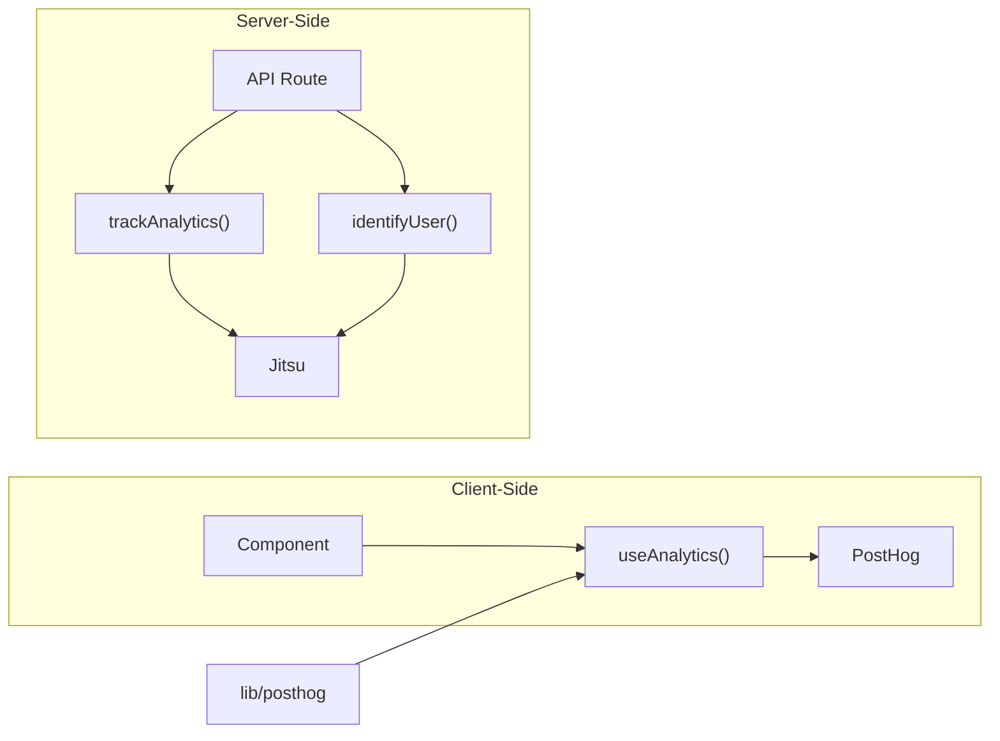

# lib — analytics

# Analytics Module (`lib/analytics`)

Provides unified analytics tracking across the application with support for both client-side and server-side event capture. The module abstracts over two analytics backends: **PostHog** for client-side tracking and **Jitsu** for server-side tracking.

## Overview

This module serves as the central interface for analytics throughout the codebase. It exports a React hook for client-side tracking and standalone functions for server-side event capture. The dual-provider architecture allows:

- **Client-side**: User behavior tracking via PostHog (requires PostHog configuration)
- **Server-side**: Server-initiated events via Jitsu (requires environment variables)

## Architecture



## Key Components

### `useAnalytics()`

A React hook providing client-side analytics capabilities. Returns `capture` and `identify` functions.

```typescript
const { capture, identify } = useAnalytics();
```

**Behavior:**
- Checks PostHog configuration via `getPostHogConfig()` before any operation
- All tracking calls are no-ops if PostHog is not enabled
- Returns functions directly bound to the PostHog instance

**Returns:**
| Property | Type | Description |
|----------|------|-------------|
| `capture` | `(event: string, properties?: Record<string, unknown>) => void` | Capture a custom event |
| `identify` | `(distinctId?: string, properties?: Record<string, unknown>) => void` | Associate a user with their actions |

### `trackAnalytics(args)`

Server-side event tracking function. Sends events to Jitsu when both `JITSU_HOST` and `JITSU_WRITE_KEY` environment variables are set.

```typescript
trackAnalytics({ event: "user_signup", properties: { plan: "pro" } });
```

**Parameters:**
- `args` — `AnalyticsEvents` type containing the event name and optional properties

**Fallback:** If Jitsu is not configured, returns a no-op analytics instance.

### `identifyUser(userId)`

Server-side function to associate a user ID with subsequent tracking calls.

```typescript
identifyUser("user_123");
```

**Parameters:**
- `userId: string` — The unique identifier for the user

## Environment Configuration

| Variable | Provider | Required For |
|----------|----------|--------------|
| `JITSU_HOST` | Jitsu | Server-side tracking |
| `JITSU_WRITE_KEY` | Jitsu | Server-side tracking |

PostHog configuration is handled separately in `lib/posthog`.

## Usage Examples

### Client-Side Tracking

```typescript
import { useAnalytics } from "@/lib/analytics";

function SignupButton() {
  const { capture } = useAnalytics();

  const handleClick = () => {
    capture("button_clicked", { button_id: "signup", location: "hero" });
  };

  return <button onClick={handleClick}>Sign Up</button>;
}
```

### Identifying Users

```typescript
// Client-side (React component)
const { identify } = useAnalytics();
identify(user.id, { email: user.email, plan: "pro" });

// Server-side (API route)
import { identifyUser } from "@/lib/analytics";
identifyUser(userId);
```

### Server-Side Event Tracking

```typescript
import { trackAnalytics } from "@/lib/analytics";

export async function POST(req: Request) {
  // Process signup...
  
  await trackAnalytics({
    event: "user_signup",
    properties: {
      userId: newUser.id,
      referral: req.headers.get("referer"),
    },
  });
  
  return Response.json({ success: true });
}
```

## Integration with Other Modules

- **`lib/posthog`**: Provides PostHog configuration via `getPostHogConfig()` — used to check if client-side tracking is enabled
- **`lib/types`**: Exports `AnalyticsEvents` type used by `trackAnalytics()` for type-safe event definitions