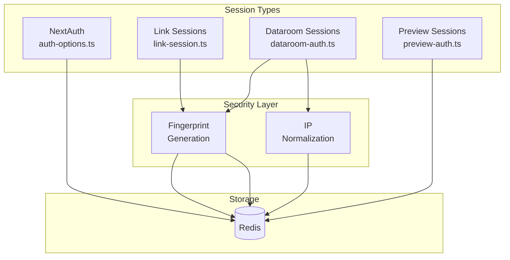

# lib — auth

# lib/auth Module

The `lib/auth` module provides authentication and session management for Paperless. It handles three distinct session types: user authentication via NextAuth, public link sharing sessions, and dataroom access sessions.

## Architecture Overview

The module is organized around the concept of Redis-backed sessions. Rather than storing sessions in database tables, short-lived session tokens are stored in Redis with automatic expiration. This approach provides:

- Fast session lookup and validation
- Automatic cleanup via Redis TTL
- Stateless request handling across serverless instances
- Support for both Next.js App Router and Pages Router APIs



## Core Concepts

### Browser Fingerprinting

All link and dataroom sessions use browser fingerprinting to prevent session hijacking via cookie theft. The fingerprint combines:

- `User-Agent` header
- `Accept-Language` header
- `Sec-CH-UA` client hints (browser brand)
- `Sec-CH-UA-Platform` (operating system)
- `Sec-CH-UA-Mobile` (mobile device indicator)

These values are combined with SHA-256 hashing to produce a stable identifier. Unlike IP-based validation, fingerprints remain constant when users switch networks or use VPNs, while still preventing session cookie reuse across different browsers or devices.

The fingerprinting system supports backward compatibility: sessions created before fingerprinting was implemented fall back to comparing User-Agent strings only.

### IP Address Normalization

IPv6 loopback addresses are normalized to a consistent format:

```typescript
// ::1, ::ffff:127.0.0.1, and 127.0.0.1 all become "127.0.0.1"
```

This prevents false negatives when users access the application from different network representations of localhost.

## Module Components

### auth-options.ts — NextAuth Configuration

The NextAuth configuration file sets up authentication for logged-in users. It defines:

**Providers:**

| Provider | Purpose | Account Linking |
|----------|---------|-----------------|
| Google OAuth | Sign in with Google | Enabled (allows linking Google account to existing email) |
| LinkedIn OAuth | Sign in with LinkedIn | Enabled |
| Email Magic Link | Passwordless email login | N/A |
| Passkey (Hanko) | WebAuthn passkey authentication | N/A |
| SAML (BoxyHQ) | Enterprise SSO | Enabled |
| SAML IdP | Identity Provider login flow | Enabled |

**Session Strategy:** JWT-based sessions with the following callback flow:

1. `jwt` callback attaches the `user` object to the token and tracks the provider
2. `session` callback merges token data with session user, ensuring `id` is available client-side

**User Creation Events:**

When a new user is created, three side effects occur:

1. User is identified in analytics (`identifyUser`)
2. "User Signed Up" event is tracked
3. A delayed welcome email job is queued via QStash (15-minute delay)

### dataroom-auth.ts — Dataroom Access Sessions

Dataroom sessions control access to secure document rooms. When a user gains access to a dataroom (e.g., after OTP verification or valid credentials), a session is created and stored in Redis.

**Session Cookie Format:** `pm_drs_{linkId}`

**Session Schema:**

```typescript
{
  linkId: string,           // The access link ID
  dataroomId: string,       // The dataroom being accessed
  viewId: string,           // Analytics view tracking ID
  viewerId?: string,        // Optional persistent viewer ID
  expiresAt: number,        // Unix timestamp (23 hours)
  ipAddress: string,        // Normalized IP at creation
  fingerprint?: string,     // Browser fingerprint (new sessions)
  verified: boolean,        // OTP verification status
}
```

**Verification Flow:**

1. Extract session token from cookie
2. Retrieve session data from Redis
3. Check expiration
4. Validate fingerprint (or IP for legacy sessions)
5. Verify `linkId` and `dataroomId` match

The `updateDataroomSessionVerified()` function marks a session as verified after successful OTP validation, allowing access to sensitive operations like downloads.

### link-session.ts — Link Sharing Sessions

Link sessions manage access for shared document and dataroom links. They track not just authentication but also access patterns.

**Session Cookie Format:** `pm_ls_{linkId}`

**Session Schema:**

```typescript
{
  linkId: string,
  documentId?: string,
  dataroomId?: string,
  viewId: string,
  viewerId?: string,
  email: string,
  expiresAt: number,
  ipAddress: string,
  userAgent: string,
  fingerprint?: string,
  verified: boolean,
  linkType: "DOCUMENT_LINK" | "DATAROOM_LINK" | "WORKFLOW_LINK",
  accessCount: number,      // Increments on each request
  maxAccesses: number,      // Default 1000
  lastAccessedAt: number,
  createdAt: number,
}
```

**Access Tracking:**

- `accessCount` increments on every verified request, allowing link owners to see usage
- `maxAccesses` defaults to 1000, providing soft limits on link usage
- Viewer sessions are tracked in a Redis set (`viewer_sessions:{viewerId}`) for bulk revocation

**Rate Limiting:** Each session is limited to 100 requests per minute via Redis increment with TTL.

**Session Revocation:** The `revokeLinkSession()` function deletes a session by link ID, useful when link owners want to immediately invalidate access.

### preview-auth.ts — Preview Sessions

Preview sessions are short-lived tokens for authenticated previews (e.g., showing a document to its owner before publishing).

**Session Duration:** 20 minutes

**Session Schema:**

```typescript
{
  userId: string,
  linkId: string,
  expiresAt: number,
}
```

Preview sessions are intentionally minimal—they only verify that the requesting user owns the link and that the session hasn't expired. They don't track fingerprints or IP addresses since the user is already authenticated.

## Security Model

### Defense in Depth

The session system implements multiple layers of protection:

| Layer | Protection Against |
|-------|-------------------|
| Redis TTL | Session expiration (auto-cleanup) |
| Fingerprint validation | Cookie theft / session hijacking |
| IP normalization | Network change false positives |
| Access count limits | Resource exhaustion |
| Rate limiting | Automated abuse |
| LinkId/dataroomId verification | Parameter tampering |

### Cookie Security

Session cookies are configured with:

- `httpOnly: true` — Prevents JavaScript access
- `sameSite: "lax"` — CSRF protection while allowing navigation
- `secure: true` on Vercel deployments — HTTPS-only

### Error Handling

All session verification functions return `null` on failure rather than throwing exceptions. This prevents information leakage through error messages and simplifies calling code.

## Integration Points

### API Routes Using Session Auth

| Route | Session Type | Purpose |
|-------|--------------|---------|
| `POST api/views` | Link + Preview | Track document view |
| `POST api/views-dataroom` | Dataroom + Preview | Track dataroom view |
| `GET api/faqs` | Dataroom | FAQ access |
| `POST ai/chat` | Dataroom | AI chat within dataroom |
| `POST [entryLinkId]/access` | Link + Dataroom | Link access grant |
| `handleAccess` in `domains/[...domainSlug]` | Link + Dataroom | Domain-based access |

### Analytics Integration

The `createUser` event handler fires on new user registration, enabling:

- User identification in the analytics system
- "User Signed Up" event tracking
- Delayed welcome email via QStash cron

### Database Schema

Sessions use Prisma for user-account linking via `PrismaAdapter`. The `Account` model stores OAuth tokens, while `User` stores identity information. The JWT strategy means session data is signed rather than stored in the database.