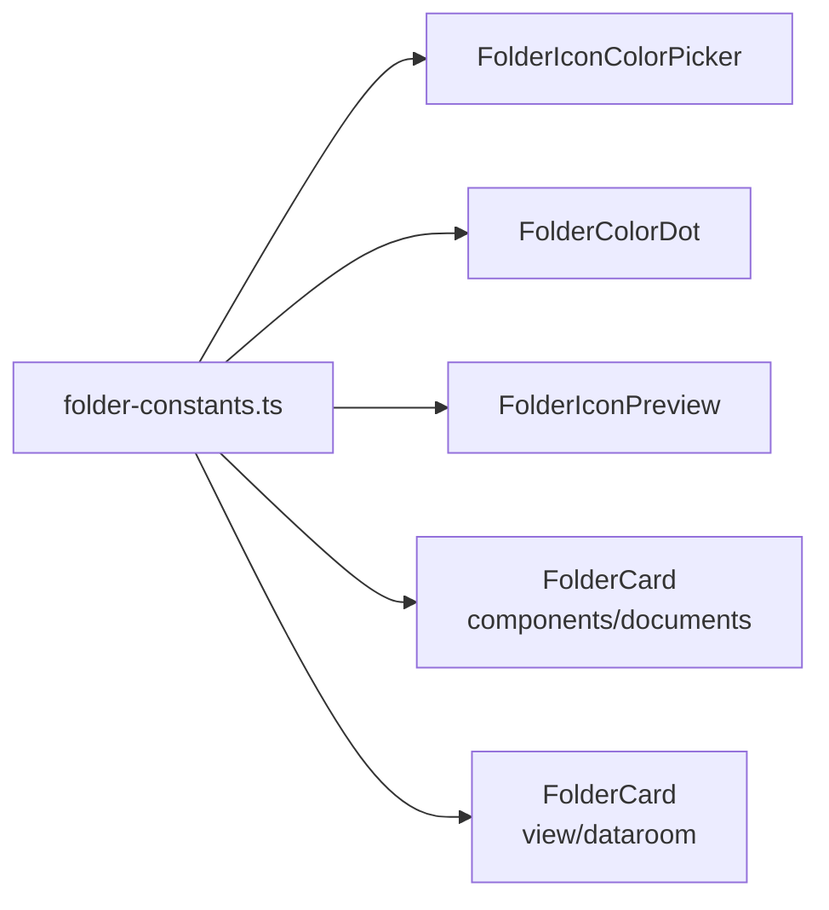

# lib — constants

# Folder Constants Module

## Overview

The `folder-constants.ts` module centralizes all icon and color definitions used for folder customization throughout the application. It provides a single source of truth for folder styling, ensuring consistency across folder-related components and enabling server-side validation of user-provided values.

This module exports constants, types, and helper functions that components use to render and validate folder icons and colors.

## Exports Summary

| Export | Type | Purpose |
|--------|------|---------|
| `FOLDER_ICONS` | `readonly` array | Icon definitions for folder customization |
| `FOLDER_COLORS` | `readonly` array | Color palette definitions for folders |
| `FolderIconId` | Type | Union type of valid icon IDs |
| `FolderColorId` | Type | Union type of valid color IDs |
| `ALLOWED_FOLDER_ICONS` | string array | Allowed values for server-side validation |
| `ALLOWED_FOLDER_COLORS` | string array | Allowed values for server-side validation |
| `DEFAULT_FOLDER_ICON` | string | Default icon ID (`"folder"`) |
| `DEFAULT_FOLDER_COLOR` | string | Default color ID (`"gray"`) |
| `getFolderIcon()` | function | Lookup icon component by ID |
| `getFolderColorClasses()` | function | Lookup color classes by ID |

## Icon Definitions

### FOLDER_ICONS

A readonly array of 34 icon definitions sourced from `lucide-react`. Each entry contains:

- **`id`**: Unique identifier (e.g., `"folder"`, `"briefcase"`, `"star"`)
- **`icon`**: The actual Lucide icon component for rendering
- **`label`**: Human-readable name for UI display (e.g., `"Folder"`, `"Briefcase"`)

```typescript
{ id: "folder", icon: FolderIcon, label: "Folder" },
{ id: "briefcase", icon: BriefcaseIcon, label: "Briefcase" },
// ... 32 more icons
```

The array uses `as const` for immutable tuple typing, enabling the `FolderIconId` type inference.

### FolderIconId Type

```typescript
export type FolderIconId = (typeof FOLDER_ICONS)[number]["id"];
```

This generates a union type of all valid icon IDs: `"folder" | "folder-open" | "briefcase" | ...`

### Available Icons

The icon library covers several use cases:

| Category | Icons |
|----------|-------|
| **Storage** | Folder, Folder Open, Archive, Box, File, Cloud |
| **Work** | Briefcase, Settings, Wrench, Layers, Zap |
| **Social** | Users, Heart, Star, Flag, Award, Bell |
| **Creative** | Palette, Pen Tool, Lightbulb, Sparkles |
| **Media** | Image, Video, Music, Book, Bookmark |
| **Status** | Lock, Shield, Globe, Home, Mail, Tag, Sun, Hash, Flame |

## Color Palette

### FOLDER_COLORS

A readonly array of 7 color definitions. Each entry provides Tailwind CSS classes for consistent styling:

- **`id`**: Unique identifier (`"gray"`, `"red"`, `"orange"`, etc.)
- **`label`**: Display name (`"Gray"`, `"Red"`, `"Orange"`, etc.)
- **`text`**: Text color class (e.g., `"text-gray-600"`)
- **`bg`**: Background color class (e.g., `"bg-gray-100"`)
- **`border`**: Border color class (e.g., `"border-gray-300"`)
- **`iconClass`**: Icon-specific color with dark mode support (e.g., `"text-gray-600 dark:text-gray-400"`)

```typescript
{
  id: "blue",
  label: "Blue",
  text: "text-blue-600",
  bg: "bg-blue-100",
  border: "border-blue-300",
  iconClass: "text-blue-500 dark:text-blue-400",
}
```

### FolderColorId Type

```typescript
export type FolderColorId = (typeof FOLDER_COLORS)[number]["id"];
```

Union type: `"gray" | "red" | "orange" | "yellow" | "green" | "blue" | "black"`

## Validation Constants

Two arrays are exported specifically for server-side validation:

```typescript
export const ALLOWED_FOLDER_ICONS = FOLDER_ICONS.map((icon) => icon.id);
export const ALLOWED_FOLDER_COLORS = FOLDER_COLORS.map((color) => color.id);
```

These flat string arrays can be used directly in validation schemas:

```typescript
import { ALLOWED_FOLDER_ICONS, ALLOWED_FOLDER_COLORS } from "@/lib/constants/folder-constants";

const folderSchema = z.object({
  icon: z.enum(ALLOWED_FOLDER_ICONS),
  color: z.enum(ALLOWED_FOLDER_COLORS),
});
```

## Default Values

```typescript
export const DEFAULT_FOLDER_ICON: FolderIconId = "folder";
export const DEFAULT_FOLDER_COLOR: FolderColorId = "gray";
```

Use these when creating new folders without user-specified customization.

## Helper Functions

### getFolderIcon()

Retrieves the Lucide icon component for a given ID. Falls back to `FolderIcon` if the ID is not found.

```typescript
export function getFolderIcon(iconId: string | null | undefined) {
  const foundIcon = FOLDER_ICONS.find((icon) => icon.id === iconId);
  return foundIcon?.icon ?? FolderIcon;
}
```

**Usage:**

```tsx
import { getFolderIcon } from "@/lib/constants/folder-constants";

function FolderIconRenderer({ iconId }: { iconId: string }) {
  const Icon = getFolderIcon(iconId);
  return <Icon className="h-5 w-5" />;
}
```

### getFolderColorClasses()

Retrieves the color class definitions for a given ID. Falls back to the first entry (gray) if the ID is not found.

```typescript
export function getFolderColorClasses(colorId: string | null | undefined) {
  const foundColor = FOLDER_COLORS.find((color) => color.id === colorId);
  return foundColor ?? FOLDER_COLORS[0];
}
```

**Usage:**

```tsx
import { getFolderColorClasses } from "@/lib/constants/folder-constants";

function FolderBadge({ colorId }: { colorId: string }) {
  const colors = getFolderColorClasses(colorId);
  
  return (
    <span className={`${colors.bg} ${colors.text} px-2 py-1 rounded`}>
      Custom Folder
    </span>
  );
}
```

## Component Integration

The module is consumed by several folder-related components:



| Component | Usage |
|-----------|-------|
| `FolderIconColorPicker` | `getFolderColorClasses()` for color selection UI |
| `FolderIconPreview` | `getFolderIcon()` for icon preview rendering |
| `FolderColorDot` | `getFolderColorClasses()` for color indicator dots |
| `FolderCard` (documents) | `getFolderIcon()`, `getFolderColorClasses()` for folder display |
| `FolderCard` (dataroom) | `getFolderIcon()`, `getFolderColorClasses()` for folder display |

## Adding New Icons or Colors

To extend the icon or color options:

1. **New icon**: Import the Lucide icon component and add it to `FOLDER_ICONS` with an `id` and `label`
2. **New color**: Add a new entry to `FOLDER_COLORS` with all required class properties

The types, validation arrays, and helper functions will automatically include the new options due to the `as const` inference pattern.