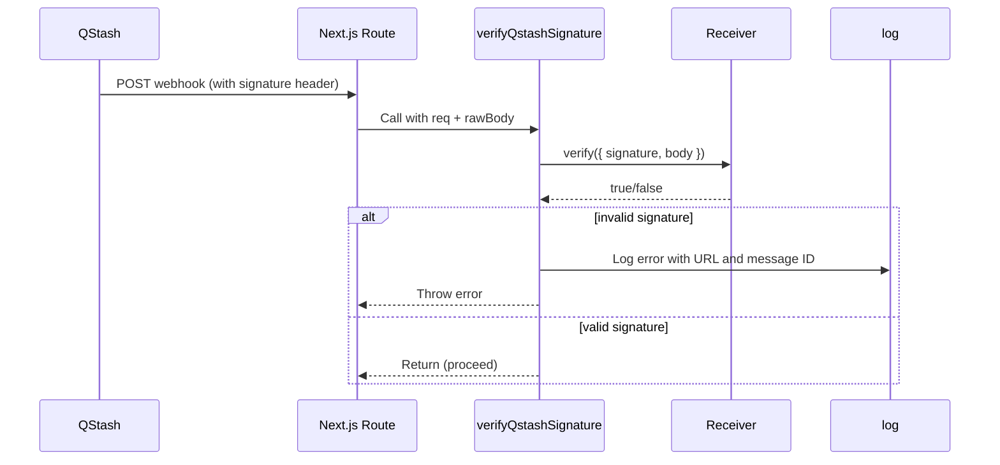

# lib — cron

# lib/cron

Provides infrastructure for scheduled task execution and webhook signature verification using Upstash QStash.

## Overview

This module handles communication with Upstash QStash, a serverless task queue and scheduler. It provides:

- **Rate limiting** via Bottleneck to respect third-party API limits (e.g., Resend's 10 req/s)
- **Signature verification** to validate that incoming webhooks originate from QStash
- **QStash client** for scheduling and managing background tasks

## Key Components

### Rate Limiter

```typescript
export const limiter = new Bottleneck({
  maxConcurrent: 1,
  minTime: 100,
});
```

A shared Bottleneck instance limiting concurrent requests to 1 and enforcing 100ms between requests. This prevents hitting Resend's rate limit of 10 requests per second when sending scheduled emails.

### Signature Verification

The `verifyQstashSignature` function validates incoming webhook requests from QStash:

```typescript
verifyQstashSignature({ req, rawBody })
```

**Parameters:**
- `req` — The incoming `Request` object
- `rawBody` — The raw request body string (not parsed JSON)

**Behavior:**
1. Skips verification when `VERCEL !== "1"` (local development)
2. Extracts the `Upstash-Signature` header
3. Uses Upstash's `Receiver` to verify the signature against the raw body
4. Logs and throws on invalid signatures

### QStash Client

```typescript
export const qstash = new Client({
  token: process.env.QSTASH_TOKEN || "",
});
```

A pre-configured client for scheduling tasks, sending messages, and managing scheduled jobs.

### Upstash Receiver

```typescript
export const receiver = new Receiver({
  currentSigningKey: process.env.QSTASH_CURRENT_SIGNING_KEY || "",
  nextSigningKey: process.env.QSTASH_NEXT_SIGNING_KEY || "",
});
```

The `Receiver` verifies that incoming webhook payloads are genuinely from QStash and haven't been tampered with.

## Architecture Flow



## Environment Variables

| Variable | Description |
|----------|-------------|
| `QSTASH_TOKEN` | API token for QStash client |
| `QSTASH_CURRENT_SIGNING_KEY` | Current signing key for signature verification |
| `QSTASH_NEXT_SIGNING_KEY` | Next signing key for signature rotation |
| `VERCEL` | Set to `"1"` in Vercel environment; enables signature verification |

## Usage

### Verifying a Webhook Request

In your route handler, pass both the request and the raw body:

```typescript
import { verifyQstashSignature } from "@/lib/cron/verify-qstash";

export async function POST(req: Request) {
  const rawBody = await req.text();
  
  await verifyQstashSignature({ req, rawBody });
  
  // Proceed with webhook logic
  const body = JSON.parse(rawBody);
  // ...
}
```

### Using the Rate Limiter

```typescript
import { limiter } from "@/lib/cron";

await limiter.schedule(() => {
  return sendEmail({ to: user.email, template: "welcome" });
});
```

### Scheduling a Cron Job

```typescript
import { qstash } from "@/lib/cron";

await qstash.publishJSON({
  url: "https://yourapp.com/api/cron/process-queue",
  body: { task: "process-queue" },
  cron: "*/5 * * * *", // Every 5 minutes
});
```

## Integration Points

This module is consumed by:

| Route | Purpose |
|-------|---------|
| `cron/welcome-user/route.ts` | Processes scheduled welcome email tasks |
| `webhooks/callback/route.ts` | Handles QStash delivery callbacks |

## Security Note

Signature verification is critical for webhook security. Always call `verifyQstashSignature` before processing any webhook payload to ensure the request originated from QStash and wasn't tampered with in transit.