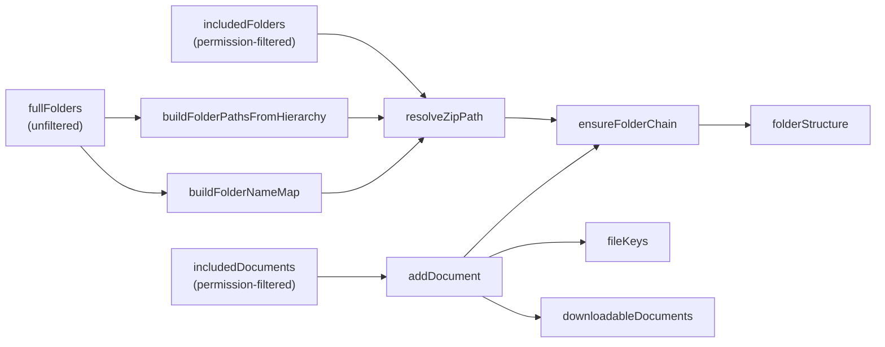
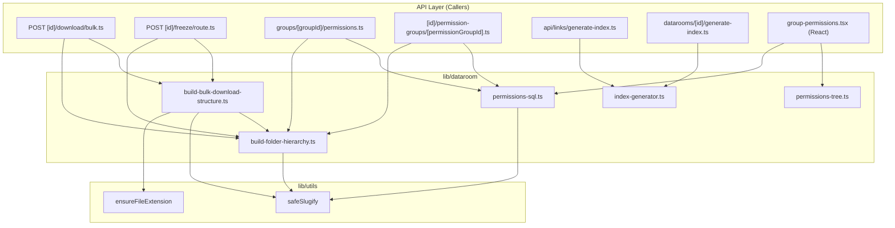

# lib — dataroom

# Dataroom Module (`lib/dataroom`)

The dataroom module provides shared utilities for the dataroom feature — a secure document portal with hierarchical folders, granular permissions, bulk download support, and index generation.

The module is organized around three concerns:

1. **Folder hierarchy** — path computation from parentId chains, descendant collection, name mapping
2. **Bulk download** — building the folder structure and file manifest that the download lambda consumes
3. **Permissions** — SQL builders for efficient bulk permission writes, plus tree-based helpers for computing permission cascades from UI interactions
4. **Index generation** — producing Excel, CSV, or JSON manifests of dataroom contents

---

## Folder Hierarchy (`build-folder-hierarchy.ts`)

### Why parentId instead of the materialized `path` field?

The dataroom schema has a `DataroomFolder` table with both `parentId` (reference to parent folder) and a materialized `path` field (e.g., `"/legal/contracts"`). The materialized field can become stale after renames or moves. This module ignores the stored path and **recomputes all paths from the parentId chain** on every operation.

### `buildFolderPathsFromHierarchy`

```typescript
function buildFolderPathsFromHierarchy(
  folders: FolderInput[],
): Map<string, string>
```

Recursively walks the parentId chain for every folder and returns a map of `folderId → slugified path`. Handles circular parentId references defensively by falling back to a safe slugified path.

```typescript
// Input
[
  { id: "f1", name: "Legal", parentId: null },
  { id: "f2", name: "Contracts", parentId: "f1" },
  { id: "f3", name: "NDA", parentId: "f2" },
]

// Output
{
  "f1" → "/legal",
  "f2" → "/legal/contracts",
  "f3" → "/legal/contracts/nda",
}
```

### `collectDescendantIds`

```typescript
function collectDescendantIds(
  rootId: string,
  folders: { id: string; parentId: string | null }[],
): Set<string>
```

Uses BFS traversal to return all descendant folder IDs under a root. This replaces `path: { startsWith }` queries that rely on the stale materialized field.

### `buildFolderNameMap`

```typescript
function buildFolderNameMap(
  folders: FolderInput[],
  pathMap: Map<string, string>,
): Map<string, { name: string; id: string }>
```

Inverts the path map so the download builder can look up the original display name for a path. This matters for non-ASCII folder names where the slug differs from what the user sees in the UI.

---

## Bulk Download Structure (`build-bulk-download-structure.ts`)

### Purpose

Builds the `folderStructure` + `fileKeys` payload that two lambdas consume:

- **Bulk-download lambda** — zips files for the viewer
- **Freeze-archive lambda** — archives a dataroom snapshot

Both lambdas share the same shape, so a single builder serves both.

### Data Flow



### `BulkDownloadFile`

```typescript
type BulkDownloadFile = {
  name: string;           // Display name with extension fix applied
  key: string;            // Storage key for the lambda to fetch
  type?: string;          // e.g. "pdf", "image"
  numPages?: number;
  needsWatermark?: boolean;
  size?: number;
};
```

### `BulkDownloadFolderStructure`

```typescript
type BulkDownloadFolderStructure = {
  [path: string]: {
    name: string;
    path: string;
    files: BulkDownloadFile[];
  };
};
```

Paths are slash-separated and slugified. Empty folders are represented by entries with `files: []` so the lambda recreates them in the zip.

### Watermarking Logic

| Condition | File picked |
|-----------|-------------|
| `enableWatermark=false` | `version.originalFile ?? version.file` |
| `enableWatermark=true` and type is PDF | `version.file` (the rendered watermark-ready copy) |
| `enableWatermark=true` and type is not PDF | `version.originalFile ?? version.file` |

PDFs always get their `.pdf` extension forced because `mupdf` saves renders as PDFs regardless of the upload type.

### Filtering

Documents are excluded when:

- Their latest version has `type === "notion"` (the lambda can't handle Notion docs)
- Their latest version has `storageType === VERCEL_BLOB` (same reason)
- They live in a folder that's not in `includedFolders` (permission boundary)
- The folder's computed path can't be resolved (the folder isn't in `fullFolders`)

### Folder-Scoped Downloads

When a viewer downloads a single folder rather than the whole dataroom, pass `rootFolder`:

```typescript
buildBulkDownloadStructure({
  fullFolders,
  includedFolders,
  includedDocuments,
  enableWatermark: true,
  rootFolder: { id: "f123", name: "Legal" },
});
```

The structure is then rooted at `"/legal"` instead of `"/"`, and `stripRootPath` rebases descendant paths under the root.

---

## Index Generation (`index-generator.ts`)

### `generateDataroomIndex`

```typescript
async function generateDataroomIndex(
  link: LinkWithDataroom,
  options?: {
    format?: "excel" | "csv" | "json";
    baseUrl?: string;
    showHierarchicalIndex?: boolean;
  },
): Promise<{ data: Buffer; filename: string; mimeType: string }>
```

Recursively traverses the folder tree and produces a flattened list of entries:

- **Root folder** — the dataroom itself
- **Folders** — included at the level where they appear in the tree
- **Files** — included with their parent folder path, size, page count, version, and online link

The index includes metadata about the dataroom (total files, total folders, total size in MB) and is consumed by both:

- `api/links/generate-index.ts` — per-link index download
- `datarooms/[id]/generate-index.ts` — dataroom-level index download

### Format Details

| Format | Notes |
|--------|-------|
| **Excel** | Two worksheets: "Dataroom Index" (full data) and "Summary" (totals). Online URLs are hyperlinks. Header rows are styled. |
| **CSV** | Flat row-per-entry. All columns included. |
| **JSON** | Serialized `DataroomIndex` type with entries array and totals. |

File sizes are converted from bytes to megabytes and rounded to two decimal places.

---

## Permissions SQL Builders (`permissions-sql.ts`)

### The Problem with Per-Row Upserts

The previous permission-save implementation used `prisma.*.upsert(...)` inside a `prisma.$transaction` loop. On datarooms with thousands of documents, this produced thousands of individual round-trips and reliably timed out Prisma's interactive transaction window.

### Solution

Four pure SQL builder functions that produce a single SQL statement covering all rows. They are invoked inside `prisma.$transaction` as raw SQL:

```typescript
// Before: O(n) round trips
for (const row of permissions) {
  await prisma.viewerGroupAccessControls.upsert({...});
}

// After: O(1) round trips
const sql = buildBulkUpsertPermissionsSql(table, groupId, rows);
await prisma.$executeRaw(sql);
```

### Two Consumers with Different Semantics

| Consumer | Table | Semantics |
|----------|-------|-----------|
| Viewer groups (admin permissions UI) | `ViewerGroupAccessControls` | Append-only delta — only rows in the payload are upserted; nothing deleted |
| Link permission groups (per-link overrides) | `PermissionGroupAccessControls` | Set-everything — any DB row not in the payload (or the computed ancestor set) is deleted |

### `buildBulkUpsertPermissionsSql`

Upserts all user-supplied permission rows with a single `INSERT ... ON CONFLICT DO UPDATE`. Rows are sorted by `itemId` before building the VALUES clause to produce a stable row-lock order for concurrent saves.

### `buildFindAncestorFolderIdsSql`

A recursive CTE that walks from each visible document's `folderId` and each visible folder up to the root, returning the distinct set of ancestor folders. This is the server-side safety net — the UI already computes ancestors locally, but the server re-derives them to guard against stale or manipulated payloads.

The CTE is constrained to `dataroomId` so a malicious caller cannot walk folders in a different dataroom.

### `buildUpsertAncestorVisibilitySql`

Takes the ancestor IDs from the CTE and forces `canView=TRUE` for each. `canDownload` is intentionally left untouched so existing download grants on ancestors are preserved. The `WHERE existing.canView = FALSE` guard skips no-op writes in steady state.

### `buildDeletePermissionsNotInPayloadSql`

Implements the link-permission "set the complete desired state" semantics. Anything not in `keepItemIds` (after ancestor expansion) is deleted. Returns `null` when `keepItemIds` is empty so the caller can decide whether to wipe everything or skip the call.

### `extractVisibleItemIds`

Convenience helper that splits a permission payload into the two ID arrays the recursive CTE needs:

```typescript
extractVisibleItemIds({ "doc1": { itemType: DATAROOM_DOCUMENT, view: true, download: false } })
// → { visibleDocumentIds: ["doc1"], visibleFolderIds: [] }
```

---

## Permissions Tree Helpers (`permissions-tree.ts`)

### Purpose

These pure functions compute permission changes from user interactions in the group-permissions UI. They were extracted from the React component so the cascade logic can be unit tested without React.

### The `TreeNode` Model

```typescript
type TreeNode = {
  id: string;
  itemType: ItemType;
  permissions: { view: boolean; download: boolean };
  subItems?: TreeNode[];   // Children in the tree
};
```

The UI maintains a virtual root node (`__dataroom_root__`) that never gets written to the database — toggling it applies the change to every real item in the tree.

### Invariants

1. **Download requires view** — turning view off forces download off. Turning download on forces view on.
2. **Ancestor cascade** — when a descendant changes, the ancestors may need updating:
   - Turning view ON → all ancestors forced to view=true (download bumped only if explicitly toggled)
   - Turning view OFF → ancestors recomputed from remaining visible siblings
   - Turning download OFF (view stays on) → only `canDownload` recomputed from remaining downloadable siblings

### `collectChangesForItem`

Core function. Takes the toggled item, its parent chain, and the new permission state, then returns all the DB changes needed:

```typescript
// User turns off view on "doc1" inside "Legal > Contracts":
collectChangesForItem(doc1Node, [contractsNode, legalNode], { view: false, download: false })
// → {
//     "doc1": { view: false, download: false },
//     "contracts": { view: false, download: false },  // recomputed from siblings
//     "legal": { view: false, download: false },       // recomputed from siblings
//   }
```

The function walks the parent chain in reverse (bottom-up) so that changes to lower ancestors are visible when computing higher ones.

### `resolveToggleIntent`

The permissions UI uses a multi-select toggle group that can produce ambiguous state changes. `resolveToggleIntent` disambiguates between "user turned view off" and "user turned download on" by comparing the previous and next state:

```typescript
// Previous: { view: true, download: false }
// Next:     { view: false, download: false } (both flags cleared by toggle group)

// resolveToggleIntent returns: { view: false, download: false }
// → user turned view OFF, not download ON
```

### `aggregateFolderPermissions`

Renders folder rows in the UI with three states per flag:

| State | Meaning |
|-------|---------|
| Checked (true) | All direct children are true |
| Unchecked (false) | No direct children are true |
| Indeterminate (partial) | Some but not all children are true |

The `partial*` flags propagate upward: a folder is `partialView=true` when any direct child is `view=false` or itself `partialView=true`, even if every direct child reports `view=true` (because one of those children is hiding a deeper item).

```typescript
aggregateFolderPermissions([
  { view: true, download: false, partialView: false, partialDownload: true },
  { view: true, download: false, partialView: true, partialDownload: false },
])
// → { view: true, partialView: true, download: false, partialDownload: true }
```

---

## Module Architecture



### Data Dependencies

- **`build-folder-hierarchy.ts`** — no dependencies on other dataroom modules. Used by the download builder, the freeze archive handler, the bulk-download trigger, and the permissions SQL builders.
- **`build-bulk-download-structure.ts`** — depends on folder hierarchy for path computation and on `lib/utils` for slugification and content type handling.
- **`permissions-sql.ts`** — pure SQL builders with no internal dependencies. Consumed by permission API handlers.
- **`permissions-tree.ts`** — pure tree helpers with no internal dependencies. Consumed by the React permissions UI.
- **`index-generator.ts`** — depends on `lib/types/index-file` for the `DataroomIndex` type and `exceljs` for file generation.