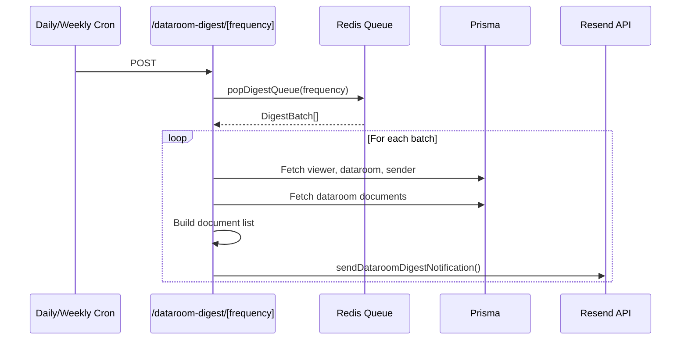

# lib — emails

# lib/emails Module

Transactional and marketing email dispatch for Papermark, built on Resend. This module centralizes all email sending logic, ensuring consistent formatting, branding, and error handling across the application.

## Overview

The emails module handles three categories of email:

| Category | Purpose |
|----------|---------|
| **Transactional** | Document/view notifications, authentication, downloads |
| **Marketing** | Onboarding sequences, milestones, upgrade check-ins |
| **System** | Dataroom digests, domain alerts, team invitations |

All emails route through the shared `sendEmail` utility in `lib/resend`, which wraps the Resend API with consistent headers, error handling, and environment-based test mode.

## Core Pattern

Every email function follows the same structure:

```typescript
export const sendSomeEmail = async (params: EmailParams) => {
  const emailTemplate = SomeEmailTemplate({ /* props */ });
  
  try {
    await sendEmail({
      to: params.recipient,
      subject: "Email subject",
      react: emailTemplate,
      test: process.env.NODE_ENV === "development",
      // ... optional flags
    });
  } catch (e) {
    console.error(e);
    // Re-throw or swallow depending on function
  }
};
```

The React template (`SomeEmailTemplate`) is a component from `@/components/emails/*` that renders the email HTML.

## Dataroom Notifications

Dataroom emails handle the notification system for document sharing. They support both instant notifications and batched digests.

### Instant Notifications

**`sendDataroomNotification`** — Alerts a viewer when a new document becomes available in a dataroom they have access to.

```typescript
sendDataroomNotification({
  dataroomName: string,
  documentName: string | undefined,
  senderEmail: string | null,
  to: string,
  url: string,
  unsubscribeUrl: string,
})
```

**`sendViewedDataroomEmail`** — Notifies the dataroom owner when someone views their dataroom. Includes viewer email and optional geolocation.

```typescript
sendViewedDataroomEmail({
  ownerEmail: string | null,
  dataroomId: string,
  dataroomName: string,
  viewerEmail: string | null,
  linkName: string,
  teamMembers?: string[],
  locationString?: string,
})
```

**`sendViewedDataroomPausedEmail`** — Triggers when dataroom views resume after being paused. Same signature as `sendViewedDataroomEmail` minus viewer details.

**`sendDataroomUploadNotification`** — Notifies dataroom owners and team members when documents are uploaded. The subject line includes the uploader's email if available.

```typescript
sendDataroomUploadNotification({
  ownerEmail: string,
  dataroomId: string,
  dataroomName: string,
  uploaderEmail: string | null,
  documentNames: string[],
  linkName: string,
  teamMembers?: string[],
})
```

### Digest Processing

The digest system batches viewer activity and sends periodic summaries. Processing happens on a scheduled basis (daily or weekly cron jobs hit the `dataroom-digest/daily` and `dataroom-digest/weekly` API routes).



**`processDataroomDigest`** — Entry point for digest processing. Pops batches from Redis, processes each one, and logs failures.

```typescript
export async function processDataroomDigest(
  frequency: "daily" | "weekly"
): Promise<{ processed: number }>
```

**`processBatch`** — Handles a single digest batch:
1. Fetches the viewer's verified views for the dataroom
2. Retrieves dataroom and sender details
3. Collects unique document IDs from batch items
4. Resolves document names via a `Map` lookup
5. Builds the view link URL (custom domain or fallback)
6. Generates unsubscribe URL
7. Sends the digest email

The batch skips processing if:
- No items in the batch
- Viewer has no verified email
- No valid view link found

**`sendDataroomDigestNotification`** — Renders the digest email with document list. The subject dynamically reflects the frequency ("today" for daily, "this week" for weekly).

```typescript
sendDataroomDigestNotification({
  dataroomName: string,
  documents: { documentName: string }[],
  senderEmail: string | null,
  to: string,
  url: string,
  preferencesUrl: string,
  frequency: "daily" | "weekly" | "instant",
})
```

## Authentication Emails

### OTP Verification

**`sendOtpVerificationEmail`** — Sends a one-time password for viewer verification. Supports custom branding when the team has configured a custom domain.

```typescript
sendOtpVerificationEmail(
  email: string,
  code: string,
  isDataroom: boolean = false,
  teamId: string,
)
```

The `isDataroom` flag affects the email template rendering. Custom branding is resolved from Edge Config (`getCustomEmail`) and Redis (`brand:logo:*`).

### Login Code (Passwordless)

**`sendVerificationRequestEmail`** — Generates a 10-character alphanumeric code, stores it in Redis with a 15-minute TTL, and sends the email using `waitUntil` to defer sending after the response.

```typescript
export interface LoginCodeData {
  email: string;
  code: string;
  callbackUrl: string;
  createdAt: number;
}
```

**`fetchAndDeleteLoginCodeData`** — Atomic fetch-and-delete using Redis `GETDEL` to prevent race conditions where the same code could be used twice. Returns `null` if the code is expired or doesn't exist.

```typescript
fetchAndDeleteLoginCodeData(
  email: string,
  code: string
): Promise<LoginCodeData | null>
```

### Email Change Verification

**`sendEmailChangeVerificationRequestEmail`** — Sent when a user requests to change their email address. Includes a confirmation URL that completes the change.

## Document Notifications

### View Notifications

**`sendViewedDocumentEmail`** — Notifies document owners when someone views their document. Includes viewer email and geolocation if available.

**`sendViewedDocumentPausedEmail`** — Triggers when document views resume after being paused.

### Download & Export Notifications

**`sendDownloadReadyEmail`** — Confirms when a bulk download package is ready, with an expiration timestamp.

```typescript
sendDownloadReadyEmail({
  to: string,
  dataroomName: string,
  downloadUrl: string,
  expiresAt?: string,
  isViewer?: boolean,
})
```

**`sendExportReadyEmail`** — Confirms when a data export is ready for download.

## Dataroom Trial Lifecycle

The trial system sends three emails at key moments:

| Function | Trigger | Delay |
|----------|---------|-------|
| `sendDataroomTrialWelcome` | Trial starts | 6 minutes |
| `sendDataroomTrial24hReminderEmail` | Trial expires | 24 hours before |
| `sendDataroomTrialEndEmail` | Trial ends | At expiration |

`sendDataroomTrialWelcome` uses `scheduledAt` to defer delivery by 6 minutes—likely to avoid immediate signup noise.

## User Lifecycle Emails

### Welcome & Onboarding

**`sendWelcomeEmail`** — Initial welcome to Papermark. Marked as `marketing: true` with an unsubscribe link to account settings.

**`sendOnboardingEmail`** — Sends day 1–5 onboarding sequence emails. Each email covers a key feature:

| Type | Subject |
|------|---------|
| `onboarding1` | Turn your documents into links |
| `onboarding2` | Set link permissions |
| `onboarding3` | Track analytics on each page |
| `onboarding4` | Custom domain and branding |
| `onboarding5` | Virtual Data Rooms |

### Milestones

- **`sendHundredViewsCongratsEmail`** — Celebrates 100 document views
- **`sendThousandViewsCongratsEmail`** — Celebrates 1000 document views

### Upgrade Check-ins

- **`sendUpgradeOneMonthCheckinEmail`** — 1-month post-upgrade check-in
- **`sendSixMonthMilestoneEmail`** — 6.5-month milestone (scheduled 195 days ahead)

## Plan & Upgrade Emails

**`sendUpgradePlanEmail`** — Immediate confirmation after plan upgrade. Mapped plan types:

| Plan Slug | Display Name |
|-----------|--------------|
| `pro` | Pro |
| `business` | Business |
| `datarooms` | Data Rooms |
| `datarooms-plus` | Data Rooms Plus |
| `datarooms-premium` | Data Rooms Premium |
| `datarooms-unlimited` | Data Rooms Unlimited |

**`sendUpgradePersonalEmail`** — Personalized welcome after upgrade. Sent 6 minutes after purchase. Custom from address: `Iuliia Shnari <iuliia@papermark.com>`.

**`sendDataroomInfoEmail`** — Educational email about dataroom use cases. Use case determines subject:

```typescript
const USECASE_SUBJECTS = {
  "mergers-and-acquisitions": "Virtual Data Rooms for Mergers and Acquisitions",
  "startup-fundraising": "Virtual Data Rooms for Startup Fundraising",
  "fund-management": "Virtual Data Rooms for Fund Management & Fundraising",
  sales: "Virtual Data Rooms for Sales",
  "project-management": "Virtual Data Rooms for Project Management",
  operations: "Virtual Data Rooms for Operations",
  other: "Virtual Data Rooms",
};
```

## Domain Management Emails

- **`sendInvalidDomainEmail`** — Alerts when a domain has been invalid for N days, prompting reconfiguration
- **`sendDeletedDomainEmail`** — Confirms domain deletion
- **`sendCustomDomainSetupEmail`** — Guides users through custom domain setup

## Team Emails

**`sendTeammateInviteEmail`** — Team invitation with sender details and join URL.

## Integration Points

The module integrates with these external systems:

| Dependency | Purpose |
|------------|---------|
| `@/lib/resend` | Email delivery via Resend API |
| `@/lib/prisma` | Database queries for viewer/document data |
| `@/lib/redis` | Login code storage, digest queue, brand assets |
| `@/lib/edge-config/custom-email` | Team custom branding |
| `@/lib/utils/unsubscribe` | Unsubscribe URL generation |
| `@vercel/functions` | Background email sending (`waitUntil`) |

## Usage from Routes

| Route/Function | Email Function |
|----------------|----------------|
| `POST /dataroom-digest/daily` | `processDataroomDigest("daily")` |
| `POST /dataroom-digest/weekly` | `processDataroomDigest("weekly")` |
| `POST /cron/welcome-user` | `sendWelcomeEmail` |
| `POST /api/jobs/send-dataroom-new-document-notification` | `sendDataroomNotification`, `sendDataroomDigestNotification` |
| `POST /api/views` | `sendOtpVerificationEmail` |
| `POST /api/views-dataroom` | `sendOtpVerificationEmail` |
| `POST /api/jobs/send-notification` | `sendViewedDocument*`, `sendViewedDataroom*` |
| `POST /auth/verify-code` | `fetchAndDeleteLoginCodeData` |
| Stripe webhook | `sendUpgradePlanEmail`, `sendUpgradePersonalEmail` |
| `lib/trigger/bulk-download` | `sendDownloadReadyEmail` |
| `lib/trigger/export-visits` | `sendExportReadyEmail` |

## Security Considerations

- **Login codes** use atomic Redis operations (`GETDEL`) to prevent reuse via race conditions
- **Unsubscribe URLs** are included in all marketing and system emails
- **Custom branding** is fetched per-team, ensuring white-label consistency
- **OTP codes** are generated client-side and transmitted via Resend's verification flow
- **Test mode**: Emails are suppressed in development (`NODE_ENV === "development"`) unless explicitly sent