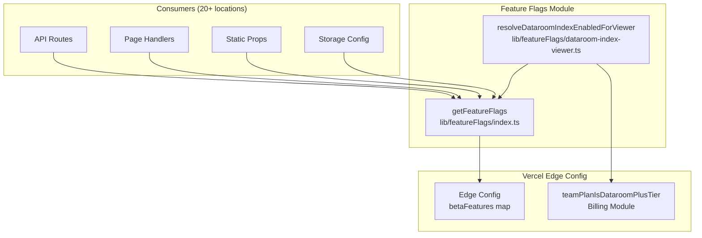
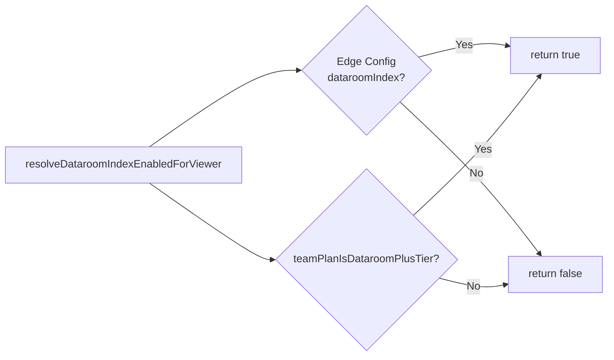

# lib — featureFlags

# `lib/featureFlags` Module

The feature flags module provides a centralized system for enabling and disabling beta features on a per-team basis using Vercel Edge Config.

## Overview

This module implements a **team-based feature flag system** where features can be selectively enabled for specific teams. It integrates with Vercel Edge Config to store feature-to-team mappings, allowing runtime feature toggling without code deployments.

## Architecture



## Core API

### `getFeatureFlags(options)`

Retrieves all feature flags for a given team.

```typescript
import { getFeatureFlags } from "@/lib/featureFlags";

const flags = await getFeatureFlags({ teamId: "team_abc123" });
// { tokens: false, incomingWebhooks: true, dataroomIndex: false, ... }
```

**Parameters:**

| Parameter | Type | Description |
|-----------|------|-------------|
| `options.teamId` | `string \| undefined` | The team ID to check flags for |

**Returns:** `Promise<Record<BetaFeatures, boolean>>`

A record mapping each feature name to a boolean indicating whether it's enabled.

### Default Behavior

The function returns `false` for all features when:
- `EDGE_CONFIG` environment variable is not set (local development)
- No `teamId` is provided
- Edge Config fetch fails with non-403 errors

### Error Handling

```typescript
// Edge Config unavailable (403/Unauthorized)
// → All flags default to false, warning logged

// Other Edge Config errors
// → All flags default to false, error logged

// No EDGE_CONFIG set
// → Returns all flags as false immediately
```

## Available Feature Flags

The system supports 18 beta features:

| Flag | Description |
|------|-------------|
| `tokens` | API token generation |
| `incomingWebhooks` | Inbound webhook support |
| `roomChangeNotifications` | Real-time room update notifications |
| `webhooks` | General webhook functionality |
| `conversations` | Chat/conversation features |
| `dataroomUpload` | Enhanced dataroom upload capabilities |
| `inDocumentLinks` | Links within documents |
| `usStorage` | US-based storage region |
| `dataroomIndex` | Hierarchical numbering for datarooms |
| `slack` | Slack integrations |
| `annotations` | Document annotation features |
| `dataroomInvitations` | Enhanced dataroom sharing |
| `workflows` | Automated workflow capabilities |
| `ai` | AI-powered features |
| `sso` | Single sign-on support |
| `textSelection` | Text selection in viewer |
| `requestList` | Request queue functionality |

## Helper Functions

### `resolveDataroomIndexEnabledForViewer(options)`

Determines if the dataroom index feature (hierarchical numbering) is available for a viewer.

```typescript
import { resolveDataroomIndexEnabledForViewer } from "@/lib/featureFlags/dataroom-index-viewer";

const isEnabled = await resolveDataroomIndexEnabledForViewer({
  teamId: "team_abc123",
  teamPlan: "dataroom_plus",
});
```

**Parameters:**

| Parameter | Type | Description |
|-----------|------|-------------|
| `options.teamId` | `string \| null \| undefined` | The team ID |
| `options.teamPlan` | `string \| null \| undefined` | The team's subscription plan |

**Returns:** `Promise<boolean>`

**Eligibility Logic:**

```
Enabled if:
  - dataroomIndex flag is set for teamId in Edge Config
  OR
  - Team is on Dataroom Plus tier plan
```

This allows the feature to be enabled either through feature flags (for beta testing) or automatically for paying Plus-tier customers.

## Edge Config Data Structure

The Edge Config stores feature flags as a mapping of feature names to arrays of team IDs:

```json
{
  "betaFeatures": {
    "tokens": ["team_abc123", "team_def456"],
    "dataroomIndex": ["team_xyz789"],
    "ai": ["team_abc123"]
  }
}
```

A team with ID `team_abc123` would have `tokens: true` and `ai: true`, while `dataroomIndex` would be `false`.

## Usage Patterns

### Direct Flag Checking

```typescript
// In an API route or server component
export async function GET(req: Request, { params }: { params: { teamId: string } }) {
  const flags = await getFeatureFlags({ teamId: params.teamId });
  
  if (!flags.workflows) {
    return Response.json({ error: "Workflows not enabled" }, { status: 403 });
  }
  
  // Proceed with workflow logic...
}
```

### Viewer-Specific Logic

```typescript
// For visitor-facing features
async function renderDataroomViewer(teamId: string, teamPlan: string) {
  const indexEnabled = await resolveDataroomIndexEnabledForViewer({
    teamId,
    teamPlan,
  });
  
  return indexEnabled ? renderWithNumbering() : renderWithoutNumbering();
}
```

### Storage Region Selection

```typescript
// Combined with billing tier checks
const flags = await getFeatureFlags({ teamId });
if (flags.usStorage && teamPlanIsUSStoragePlan(plan)) {
  return useUSStorage();
}
```

## Consumers

The feature flags module is used across 20+ locations in the codebase:

**API Routes:**
- `api/feature-flags/route.ts` — Public flag endpoint
- `api/views/route.ts` — View creation
- `api/links/generate-index.ts` — Link index generation
- `documents/[documentId]/route.ts` — Document operations
- `datarooms/[dataroomId]/route.ts` — Dataroom operations
- `chat/[chatId]/route.ts` — Chat endpoints
- `ai/chat/route.ts` — AI chat
- `workflows/route.ts` — Workflow operations

**Page Handlers:**
- `documents/[id]/index.ts` — Document viewer
- `documents/[documentId]/annotations.ts` — Annotations
- `documents/[documentId]/overview.ts` — Document overview
- `datarooms/[id]/index.ts` — Dataroom index
- `datarooms/[id]/calculate-indexes.ts` — Index calculations
- `datarooms/[id]/generate-index.ts` — Index generation
- `teams/[teamId]/ai-settings.ts` — AI settings

**Static Props:**
- `view/[linkId]/index.tsx`
- `[linkId]/d/[documentId].tsx`
- `[slug]/d/[documentId].tsx`
- `[domain]/[slug]/index.tsx`

**Storage Configuration:**
- `features/storage/s3-store.ts` — S3 client selection
- `features/storage/config.ts` — Storage config retrieval

## Environment Configuration

| Variable | Required | Description |
|----------|----------|-------------|
| `EDGE_CONFIG` | No (local dev) | Vercel Edge Config connection string |

When `EDGE_CONFIG` is not set, the module gracefully degrades by returning all features as disabled. This enables local development without Edge Config access.

## Team Plan Integration

The `resolveDataroomIndexEnabledForViewer` helper combines feature flag checks with billing tier checks:



This two-path approach allows:
1. **Beta testing** — Enable for specific teams via Edge Config before broader rollout
2. **Tier-based access** — Automatically enable for Dataroom Plus subscribers