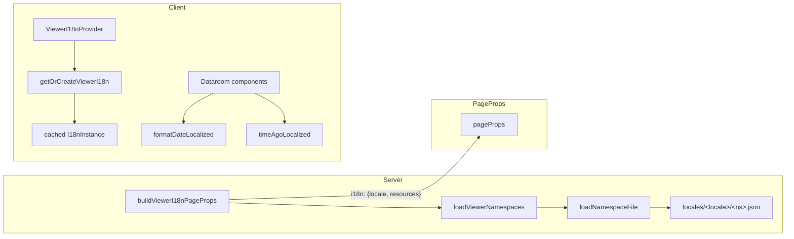
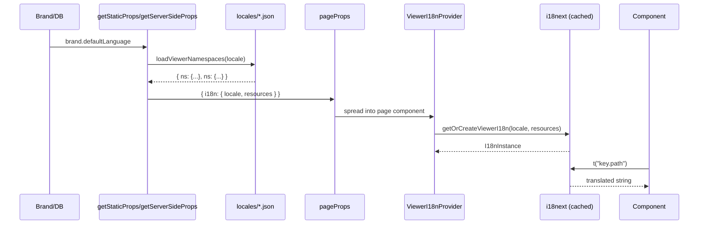

# lib — i18n

# `lib/i18n` — Internationalization Module

The `lib/i18n` module provides locale-aware formatting and translation infrastructure for the **viewer side** of the application. It powers language rendering for datarooms, document viewers, and access forms — everything visitors see when viewing shared content.

> **Admin split**: The admin UI intentionally stays in English. It uses `asSupportedLocale` from `locales.ts` to validate locale codes stored in the database (e.g., for branding settings), but it renders those codes using legacy `en-US` hardcoded helpers. This keeps admin analytics, exports, and internal tooling in a stable English format.

---

## Supported Locales

The viewer supports seven locales defined in `locales.ts`:

| Code | Native Name | English Name |
|------|-------------|--------------|
| `en` | English | English |
| `de` | Deutsch | German |
| `fr` | Français | French |
| `es` | Español | Spanish |
| `it` | Italiano | Italian |
| `pt-BR` | Português (Brasil) | Portuguese (Brazil) |
| `ja` | 日本語 | Japanese |

Each locale has a matching `locales/<code>/*.json` directory containing translation files for three namespaces: `access-form`, `dataroom`, and `viewer`.

**Adding a new language** requires only two steps:

1. Add an entry to `SUPPORTED_LOCALES` in `locales.ts`
2. Create `locales/<code>/*.json` files for the three namespaces

No other code changes are required.

---

## Architecture

The module has four files, each with a distinct responsibility:

```
lib/i18n/
├── locales.ts          # Locale definitions and type safety
├── format.ts           # Locale-aware date/time formatting (no i18next)
├── viewer-i18n.ts      # i18next instance management and resource loading
└── viewer-page-props.ts # Server-side helper for page props
```



---

## `locales.ts` — Locale Definitions

Provides the canonical list of supported locales and utilities for narrowing arbitrary strings to valid locale codes.

### Key Exports

- **`SupportedLocaleCode`** — A union type of all valid locale codes (`"en" | "de" | "fr" | ...`)
- **`SUPPORTED_LOCALES`** — An array of locale metadata objects with `code`, `nativeName`, and `englishName`
- **`DEFAULT_LOCALE`** — Always `"en"`
- **`SUPPORTED_LOCALE_CODES`** — A readonly array of just the codes, derived from `SUPPORTED_LOCALES`
- **`VIEWER_NAMESPACES`** — The three translation namespaces: `["access-form", "dataroom", "viewer"]`

### `asSupportedLocale`

```typescript
function asSupportedLocale(value: string | null | undefined): SupportedLocaleCode | null
```

Narrow an arbitrary string (e.g., from the database) to a supported locale code. Returns `null` for empty, undefined, or unknown values.

```typescript
const locale = asSupportedLocale(brand.defaultLanguage);
// Returns "de" if defaultLanguage is "de", null if it's null/undefined/unsupported
```

**Used by**: `DataroomNav`, `DocumentCard`, `FolderCard`, `DataroomBrandPage`, and other components that read a brand's configured language.

---

## `format.ts` — Locale-Aware Formatting

Provides date and relative-time formatting using the native `Intl` APIs. These functions require no external translation files — they use `Intl.DateTimeFormat` and `Intl.RelativeTimeFormat` directly.

> **Why not i18next here?** Formatting dates and relative times is a solved problem in modern JavaScript runtimes. Shipping a translation table per language for these would double the bundle size for marginal benefit.

### `formatDateLocalized`

```typescript
function formatDateLocalized(
  dateString: string | Date | number,
  locale?: SupportedLocaleCode,
  options?: Intl.DateTimeFormatOptions
): string
```

Formats a date as a full date string: `"January 15, 2025"` / `"15. Januar 2025"` / `"15 janvier 2025"`.

- Defaults to `DEFAULT_LOCALE` if no locale is passed
- All formatting uses `timeZone: "UTC"` for consistency
- Returns an empty string for invalid dates
- The `options` parameter lets callers override individual `Intl.DateTimeFormatOptions` while keeping the sensible defaults

**Used by**: `DataroomNoBannerTitle`, `DataroomNav`, `eyebrowLine` (in dataroom components)

### `timeAgoLocalized`

```typescript
function timeAgoLocalized(
  timestamp: Date | string | number | undefined,
  locale?: SupportedLocaleCode
): string
```

Formats timestamps as relative time strings: `"2 hours ago"` / `"vor 2 Stunden"`.

The behavior mirrors the legacy `timeAgo` helper:

- **< 60 seconds**: Shows "just now" via `Intl.RelativeTimeFormat` with value `0`
- **< ~23 hours**: Shows relative time ("5 minutes ago") using `Intl.RelativeTimeFormat`
- **≥ ~23 hours**: Switches to a short absolute date (`"Jan 15"`), omitting the year when it's the current year

```typescript
// Within 23 hours → relative
timeAgoLocalized(Date.now() - 3_600_000, "de")  // "vor 1 Stunde"

// After ~23 hours → absolute
timeAgoLocalized(Date.now() - 86_400_000, "fr") // "15 janv."
```

**Used by**: `DocumentCard`, `FolderCard`

---

## `viewer-i18n.ts` — i18next Instance Management

Manages the i18next client instance with per-locale caching and static chunk loading for code splitting.

### Key Design Decisions

1. **One instance per locale**: The module caches `I18nInstance` objects in a `Map`. Subsequent calls with the same locale return the cached instance.

2. **Lazy client-side creation**: Instances are created only on the client (where `getOrCreateViewerI18n` is called), not during SSR.

3. **Static chunk loading**: `loadNamespaceFile` uses explicit `switch` statements over `import()` calls rather than template literals. This is intentional — Webpack/Turbopack can only analyze literal dynamic imports for code splitting. Each `import("../../locales/<locale>/<namespace>.json")` call produces a separate chunk.

4. **`load: "currentOnly"`**: Saves ~10–15% per render by only loading plurals for the current locale.

5. **`escapeValue: false`**: Interpolation is disabled for React escapes — letting i18next double-escape would break copy containing `<` or `>` like "AT&T" or `<unknown>`.

### `getOrCreateViewerI18n`

```typescript
function getOrCreateViewerI18n(
  locale: SupportedLocaleCode,
  resources: Partial<Record<ViewerNamespace, Record<string, unknown>>>
): I18nInstance
```

Returns the cached i18next instance for `locale`, initializing it on first call. If `resources` includes namespaces not yet loaded, they are merged in.

This function is called by `ViewerI18nProvider` (the React context provider component) to hydrate the client-side instance from page props.

### `loadViewerNamespaces`

```typescript
async function loadViewerNamespaces(
  locale: SupportedLocaleCode,
  namespaces?: readonly ViewerNamespace[]
): Promise<Partial<Record<ViewerNamespace, Record<string, unknown>>>>
```

Server-side function that loads translation bundles for one or more namespaces. Returns a JSON-cloneable record suitable for passing through `getStaticProps`/`getServerSideProps` as page props.

**Fallback behavior**: If a translation file is missing for the requested locale, it falls back to English. If English is also missing, it returns an empty object. This ensures the namespace is never `undefined`, preventing i18next crashes.

```typescript
// Load all three namespaces for German
const resources = await loadViewerNamespaces("de");
// → { "access-form": {...}, "dataroom": {...}, "viewer": {...} }
```

### `loadNamespaceFile`

Internal function that performs the static dynamic imports. The explicit `switch` over locale and namespace produces ~21 separate chunks (7 locales × 3 namespaces) that Next.js can independently cache.

---

## `viewer-page-props.ts` — Server-Side Page Helper

A thin helper that combines brand locale resolution with namespace loading for use in `getStaticProps`/`getServerSideProps`.

### `buildViewerI18nPageProps`

```typescript
async function buildViewerI18nPageProps(
  brand: { defaultLanguage?: string | null } | null | undefined
): Promise<ViewerI18nPageProps>
```

The returned `ViewerI18nPageProps` shape:

```typescript
{
  i18n: {
    locale: SupportedLocaleCode,
    resources: Partial<Record<ViewerNamespace, Record<string, unknown>>>
  }
}
```

This pattern avoids duplication across the several pages that need translation props:

| Page | Method |
|------|--------|
| `view/[linkId]/index.tsx` | `getStaticProps` |
| `view/[linkId]/d/[documentId].tsx` | `getStaticProps` |
| `view/[linkId]/downloads.tsx` | `getServerSideProps` |
| `[domain]/[slug]/index.tsx` | `getStaticProps` |
| `[domain]/[slug]/d/[documentId].tsx` | `getStaticProps` |
| `[domain]/[slug]/downloads.tsx` | `getServerSideProps` |

Each page spreads the result into its props and passes `i18n.locale` + `i18n.resources` to `<ViewerI18nProvider>`.

---

## Data Flow: Server to Client



1. **Server**: `getStaticProps`/`getServerSideProps` reads the brand's `defaultLanguage`, loads the corresponding translation JSON files, and bundles them into page props.

2. **Hydration**: `ViewerI18nProvider` receives `{ i18n: { locale, resources } }` and calls `getOrCreateViewerI18n`.

3. **Client cache**: On first load, `getOrCreateViewerI18n` creates the i18next instance and caches it. On subsequent navigations (e.g., moving from the viewer to a document subpage), the cached instance is returned and new namespaces are merged in.

4. **Rendering**: Components call `t("key.path")` on the instance to get translated strings.

---

## Adding a New Translation Key

1. Add the key with an English value to the appropriate namespace file in `locales/en/<namespace>.json`
2. Add translations to each locale's file in `locales/<locale>/<namespace>.json`

The key is immediately available everywhere `getOrCreateViewerI18n` is used without any code changes.

---

## Key Behaviors to Know

| Behavior | Detail |
|----------|--------|
| Fallback locale | Always `"en"` — missing translations fall back to English, not to a "default" |
| Date timezone | All dates render in UTC |
| Relative time cutoff | Anything older than ~23 hours renders as an absolute date |
| Just now | Uses `Intl.RelativeTimeFormat` with value `0` to get the locale's natural phrasing |
| Instance reuse | Navigating between `/view/[linkId]` and `/view/[linkId]/d/[doc]` reuses the same instance |
| Admin pages | Do not use `formatDateLocalized` or `timeAgoLocalized` — they use legacy `en-US` helpers |