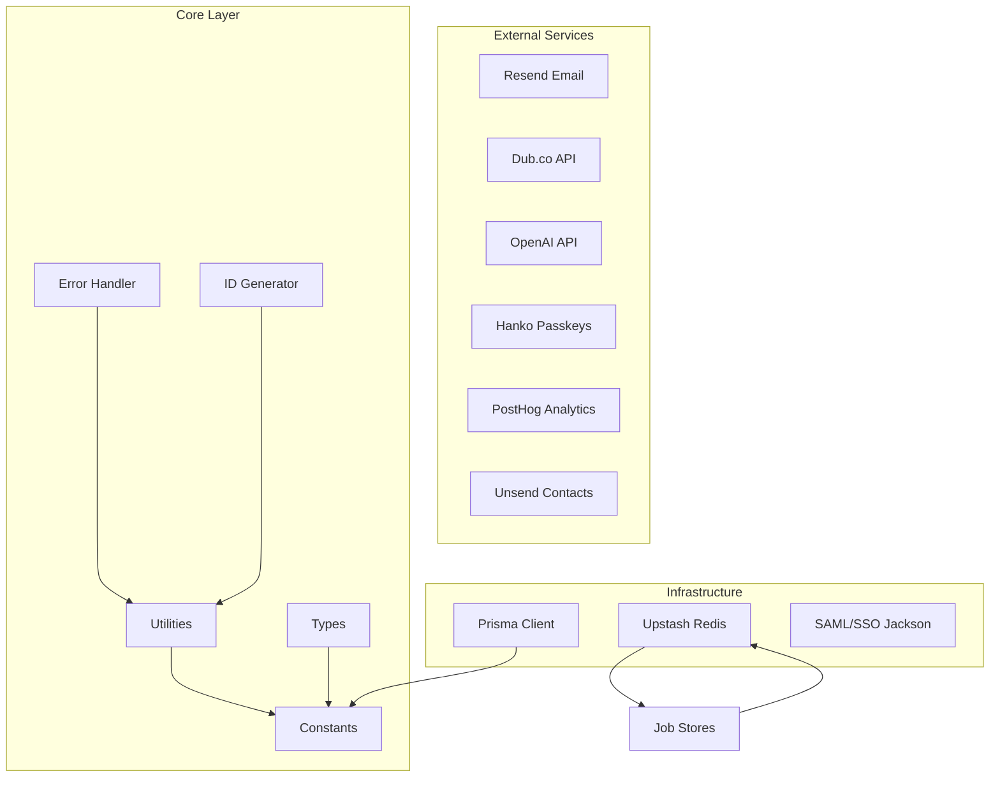

# lib — lib

# lib — Core Library Module

The `lib` module is the foundational layer for the Papermark application. It provides shared utilities, service integrations, database clients, and constant definitions used across the entire codebase—from API routes to frontend pages.

## Overview

This module centralizes cross-cutting concerns so individual features don't need to reimplement:
- Database and cache connectivity
- External API clients (email, analytics, AI, etc.)
- ID generation and cryptographic utilities
- Formatting, validation, and transformation helpers
- Error handling patterns
- Shared type definitions

## Architecture



## Database & Cache Layer

### Prisma Client (`prisma.ts`)

Provides a singleton Prisma client that persists across Next.js hot reloads in development:

```typescript
import prisma from "@/lib/prisma";

// Usage throughout the codebase
const users = await prisma.user.findMany();
```

The singleton pattern prevents exhausting database connections during development when Next.js reimports modules.

### Redis Client & Rate Limiting (`redis.ts`)

Exposes two Redis clients—one for general storage and one for distributed locking—plus a configurable rate limiter factory:

```typescript
import { redis, lockerRedisClient, ratelimit } from "@/lib/redis";

// Standard operations
await redis.get("key");
await redis.setex("key", 3600, "value");

// Distributed lock client (separate credentials)
await lockerRedisClient.set("lock:resource", "1", { ex: 30 });

// Create a rate limiter: 10 requests per 10 seconds
const limiter = ratelimit(10, "10 s");
const { success } = await limiter.limit(userId);
```

The `ratelimit()` factory creates sliding-window limiters prefixed with `"papermark"` for namespacing in Upstash.

### Job Stores

Two Redis-backed job stores manage long-running background operations.

#### Export Job Store (`redis-job-store.ts`)

Tracks asynchronous export jobs (CSV exports of documents and datarooms):

```typescript
import { jobStore } from "@/lib/redis-job-store";

// Create a new export job
const job = await jobStore.createJob({
  type: "document",
  resourceId: documentId,
  userId: user.id,
  teamId: team.id,
  status: "PENDING",
});

// Update job status
await jobStore.updateJob(job.id, { status: "COMPLETED", result: csvUrl });

// List jobs for a user
const userJobs = await jobStore.getUserJobs(user.id);
```

**Key features:**
- Sorted sets index jobs by creation time for efficient pagination
- Blob URLs are automatically scheduled for cleanup after TTL
- Jobs expire after 3 days via Redis TTL

#### Download Job Store (`redis-download-job-store.ts`)

Tracks bulk/folder download jobs for datarooms, including viewer downloads:

```typescript
import { downloadJobStore } from "@/lib/redis-download-job-store";

// Create a bulk download job
const job = await downloadJobStore.createJob({
  type: "bulk",
  dataroomId: dataroom.id,
  teamId: team.id,
  userId: user.id,
  linkId: link.id,
  viewerEmail: viewer.email,
  status: "PENDING",
  totalFiles: 150,
  processedFiles: 0,
  progress: 0,
});

// Poll for progress
const { progress, downloadUrls } = await downloadJobStore.getJob(job.id);
```

**Key features:**
- `DownloadJobPhase` enum (`VALIDATING`, `BUILDING`, `ZIPPING`) provides UI-friendly status
- Separate indexes for team jobs and viewer jobs (by link + email)
- S3 object references stored for on-demand presigning

## External Service Integrations

### Resend Email (`resend.ts`)

Provides email sending with React Email template rendering:

```typescript
import { sendEmail } from "@/lib/resend";
import MyEmailTemplate from "@/emails/my-template";

// Send a transactional email
await sendEmail({
  to: "user@example.com",
  subject: "Welcome to Papermark",
  react: <MyEmailTemplate user={user} />,
  unsubscribeUrl: "https://app.papermark.com/unsubscribe?email=..."
});

// Schedule an email
await sendEmail({
  to: "user@example.com",
  subject: "Scheduled Message",
  react: <MyEmailTemplate />,
  scheduledAt: "2024-12-25T10:00:00Z",
});
```

**Send address selection:**
| Mode | From Address |
|------|--------------|
| Marketing | `marc@updates.papermark.com` |
| System | `system@papermark.com` |
| Verification | `system@verify.papermark.com` |
| Scheduled | `marc@papermark.com` |
| Default | `marc@papermark.com` |

Also exports `subscribe()` and `unsubscribe()` for Resend contact management.

### Dub.co (`dub.ts`)

Retrieves discount coupons for authenticated users:

```typescript
import { getDubDiscountForExternalUserId } from "@/lib/dub";

const discounts = await getDubDiscountForExternalUserId(user.id);
// Returns { discounts: [{ coupon: "PAPER50" }] } or null
```

This enables promo codes stored in Dub to be applied during Stripe checkout. Returns `null` gracefully on API errors to avoid blocking checkout.

### OpenAI (`openai.ts`)

Provides an edge-friendly OpenAI client:

```typescript
import { openai } from "@/lib/openai";

const completion = await openai.chat.completions.create({
  model: "gpt-4",
  messages: [{ role: "user", content: "Summarize this document..." }],
});
```

### Hanko Passkeys (`hanko.ts`)

Initializes the Team Hanko passkey authentication provider:

```typescript
import hanko from "@/lib/hanko";

const { token } = await hanko.token.verify(jwt);
```

Requires `HANKO_API_KEY` and `NEXT_PUBLIC_HANKO_TENANT_ID` environment variables.

### PostHog (`posthog.ts`)

Configures PostHog analytics with a self-hosted proxy:

```typescript
import { getPostHogConfig } from "@/lib/posthog";

const config = getPostHogConfig();
// Returns { key: "phc_xxx", host: "https://app.papermark.com/ingest" }
```

The self-hosted proxy at `/ingest` allows tracking without third-party cookies.

### Unsend Contacts (`unsend.ts`)

Manages contact subscriptions via Unsend:

```typescript
import { subscribe, unsubscribe } from "@/lib/unsend";

await subscribe("user@example.com");
await unsubscribe("user@example.com");
```

Syncs contact records to Prisma's `user.contactId` field.

## Domain Management (`domains.ts`)

Provides Vercel API wrappers for custom domain operations:

```typescript
import {
  addDomainToVercel,
  getDomainResponse,
  verifyDomain,
  getApexDomain,
  getSubdomain,
  validDomainRegex,
} from "@/lib/domains";

// Add a domain to the Vercel project
await addDomainToVercel("docs.acme.com");

// Get domain status
const status = await getDomainResponse("docs.acme.com");

// Verify DNS configuration
const result = await verifyDomain("docs.acme.com");

// Parse domain parts
getApexDomain("https://docs.acme.com/path"); // "acme.com"
getSubdomain("docs.acme.com", "acme.com"); // "docs"

// Validate domain format
validDomainRegex.test("acme.com"); // true
validDomainRegex.test("192.168.1.1"); // false
```

## SAML/SSO (`jackson.ts`)

Wraps BoxyHQ's SAML Jackson library for SSO and SCIM provisioning:

```typescript
import { jackson } from "@/lib/jackson";

const { apiController, oauthController, directorySyncController } =
  await jackson();

// SAML connection management
const connections = await apiController.getConnections(filter);

// OAuth SSO flow
const { redirect_url } = await oauthController.authorize({
  client_id,
  redirect_uri,
  response_type: "code",
});

// SCIM user provisioning
await directorySyncController.users.upsert({ ... });
```

**Encryption:** Derives a stable 32-byte AES-256-GCM key from `NEXTAUTH_SECRET` via SHA-256.

## Error Handling (`errorHandler.ts`)

Provides a request handler wrapper and typed error classes:

```typescript
import { errorhandler, TeamError, DocumentError } from "@/lib/errorHandler";

// In an API route
export async function GET(req: Request, { params }: { params: { id: string } }) {
  try {
    const team = await getTeam(params.id);
    if (!team) {
      throw new TeamError("Team not found");
    }
    return Response.json(team);
  } catch (err) {
    return errorhandler(err, res); // Express-style response object needed
  }
}
```

| Error Class | Default Status | Use Case |
|-------------|----------------|----------|
| `TeamError` | 400 | Team-level validation failures |
| `DocumentError` | 400 | Document-level validation failures |
| Generic Error | 500 | Unhandled exceptions |

## ID Generation (`id-helper.ts`)

Generates Stripe-style prefixed IDs using Base58 encoding:

```typescript
import { newId } from "@/lib/id-helper";

// Generate IDs with domain-specific prefixes
const viewId = newId("view");     // "view_7K4xN9mQ"
const docId = newId("doc");       // "doc_Ab3CdEfG"
const webhookId = newId("webhook"); // "wh_Xy9zWvUu"
```

**Available prefixes:** `view`, `videoView`, `linkView`, `inv`, `email`, `doc`, `page`, `dataroom`, `preview`, `webhook`, `webhookEvent`, `webhookSecret`, `token`, `tokenLive`, `clickEvent`, `preset`, `pending`, `upload`

The `IdGenerator<TPrefixes>` class can be instantiated with custom prefixes for type-safe ID generation.

## Utility Functions (`utils.ts`)

A comprehensive collection of helpers:

### Class Utilities

```typescript
// Tailwind class merging (handles conflicts)
cn("px-2 py-2", "px-4"); // "py-2 px-4"

// Unique class deduplication
classNames("text-red", "text-red", "text-blue"); // "text-red text-blue"
```

### Time & Formatting

```typescript
timeAgo(new Date(Date.now() - 3600000)); // "1 hour ago"
timeIn(new Date(Date.now() + 3600000)); // "in 1 hour"
nFormatter(1500000); // "1.5M"
bytesToSize(1048576); // "1 MB"
formatDate("2024-12-25"); // "December 25, 2024"
formatExpirationTime(604800); // "in 7 days"
durationFormat(90000); // "1:30 mins"
```

### URL & Domain Helpers

```typescript
getExtension("file.pdf"); // "pdf"
getDomainWithoutWWW("https://www.example.com/page"); // "example.com"
isValidUrl("https://example.com"); // true
getBreadcrumbPath(["folder", "subfolder"]);
// [{ name: "Home", pathLink: "/documents" }, { name: "folder", pathLink: "..." }]
```

### Password Handling

```typescript
// bcrypt hashing
const hash = await hashPassword("secret123");
const matches = await checkPassword("secret123", hash);

// AES-256-CTR encryption for document passwords
const encrypted = await generateEncrpytedPassword("view-secret");
const decrypted = decryptEncrpytedPassword(encrypted);
```

### List Validation

```typescript
// Parse and validate email/domain lists
validateList("a@x.com, b@x.com, invalid", "email");
// { all: ["a@x.com", "b@x.com", "invalid"], valid: ["a@x.com", "b@x.com"], invalid: ["invalid"] }

sanitizeList("a@x.com; b@x.com\nc@x.com", "email");
// ["a@x.com", "b@x.com", "c@x.com"]
```

### File & Content Disposition

```typescript
// RFC 5987-compliant download headers
buildContentDisposition("年度报告.pdf", "annual-report.pdf");
// 'attachment; filename="annual-report.pdf"; filename*=UTF-8''%E5%B9%B4%E5%BA%A6%E6%8A%A5%E5%91%8A.pdf'

buildAttachmentDispositionForName("document (1).pdf");
// Safe ASCII fallback with Unicode filename*
```

### Template Variables

```typescript
safeTemplateReplace(
  "Welcome {{email}}, accessed on {{date}}",
  { email: "user@example.com", date: "2024-12-25" }
);
// "Welcome user@example.com, accessed on 2024-12-25"
```

### Data URL Conversion

```typescript
convertDataUrlToFile({ dataUrl: "data:image/png;base64,..." });
// Returns File object

convertDataUrlToBuffer(dataUrl);
// Returns { buffer, mimeType, filename }
```

### Misc

```typescript
getFileNameWithPdfExtension("report.docx"); // "report.pdf"
safeSlugify("文档报告"); // "wen-jian-bao-gao"
hexToRgb("#FF5733"); // rgb(1, 0.34, 0.2)
serializeFileSize({ fileSize: BigInt(1024) }); // { fileSize: 1024 }
```

## Constants (`constants.ts`)

### Animation Settings

```typescript
FADE_IN_ANIMATION_SETTINGS;
// { initial: { opacity: 0 }, animate: { opacity: 1 }, exit: { opacity: 0 }, transition: { duration: 0.2 } }

STAGGER_CHILD_VARIANTS;
// { hidden: { opacity: 0, y: 20 }, show: { opacity: 1, y: 0, transition: { duration: 0.4, type: "spring" } } }
```

### Security Headers

```typescript
PAPERMARK_HEADERS;
// { headers: { "x-powered-by": "Papermark - Secure Data Room Infrastructure..." } }
```

### Reactions

```typescript
REACTIONS;
// [{ emoji: "❤️", label: "heart" }, { emoji: "💸", label: "money" }, ...]
```

### Time Constants

```typescript
ONE_SECOND  // 1000
ONE_MINUTE  // 60000
ONE_HOUR    // 3600000
ONE_DAY     // 86400000
ONE_WEEK    // 604800000
```

### File Type Support

Three tiers of file type acceptance:

| Constant | Plan Level | Notes |
|----------|------------|-------|
| `FREE_PLAN_ACCEPTED_FILE_TYPES` | Free | PDF, Excel, CSV, images only |
| `FULL_PLAN_ACCEPTED_FILE_TYPES` | Pro+ | All supported types including macros, CAD, GIS |
| `VIEWER_ACCEPTED_FILE_TYPES` | Viewer | Similar to full but with `.zip` |

Also exports:
- `SUPPORTED_DOCUMENT_MIME_TYPES` — complete MIME type list
- `SUPPORTED_DOCUMENT_SIMPLE_TYPES` — categorized types (`pdf`, `sheet`, `cad`, etc.)
- `VIDEO_EVENT_TYPES` — tracking event types for video players
- `SYSTEM_FILES` — files excluded from uploads (`[".DS_Store", "Thumbs.db", "node_modules"]`)

### Path Filters

```typescript
BLOCKED_PATHNAMES; // ["/phpmyadmin", "/wordpress", "/wp-json", ...]
EXCLUDED_PATHS;    // ["/", "/register", "/privacy", "/view", ...]
```

### Limits

```typescript
LIMITS.views; // 20 (free plan view limit)
```

### Countries

```typescript
COUNTRIES;        // { AF: "Afghanistan", ... }
COUNTRY_CODES;    // ["AF", "AL", ...]
EU_COUNTRY_CODES; // ["AT", "BE", "DE", ...]
```

## Types (`types.ts`)

Core TypeScript definitions used throughout the application:

### User Types

```typescript
type CustomUser = NextAuthUser & PrismaUser;
```

### Document Types

```typescript
interface DocumentWithLinksAndLinkCountAndViewCount extends Document {
  _count: { links: number; views: number; ... };
  links: Link[];
  folder: { name: string; path: string };
  folderList: string[];
}
```

### Link Types

```typescript
interface LinkWithDocument extends Link {
  document: Document & { versions: DocumentVersion[]; team: { plan: string } };
  feedback: { id: string; data: { question: string; type: string } } | null;
  agreement: Agreement | null;
  customFields: CustomField[];
}

interface LinkWithDataroom extends Link {
  dataroom: { id: string; name: string; documents: DataroomDocument[]; ... };
  accessControls?: ViewerGroupAccessControls[];
}
```

### Analytics Events

```typescript
type AnalyticsEvents =
  | { event: "User Signed Up"; userId: string; email: string | null }
  | { event: "Link Viewed"; documentId: string; linkId: string; ... }
  | { event: "User Upgraded"; email: string | null }
  // ... more event types
```

### Watermark Config

```typescript
const WatermarkConfigSchema = z.object({
  text: z.string().min(1),
  isTiled: z.boolean(),
  position: z.enum(["top-left", "top-center", ...]),
  rotation: z.union([z.literal(0), z.literal(30), ...]),
  color: z.string().refine((val) => /^#([0-9A-F]{3}){1,2}$/i.test(val)),
  fontSize: z.number().min(1),
  opacity: z.number().min(0).max(1),
});
```

### Team Types

```typescript
type TeamRole = "ADMIN" | "MANAGER" | "MEMBER" | "DATAROOM_MEMBER";

interface TeamDetail {
  id: string;
  name: string;
  users: { role: TeamRole; status: "ACTIVE" | "BLOCKED_TRIAL_EXPIRED"; ... }[];
}
```

## Web Storage (`webstorage.ts`)

Safe localStorage wrapper that handles restricted contexts (third-party iframes, Chrome Incognito):

```typescript
import { localStorage } from "@/lib/webstorage";

// Automatic error handling—no thrown exceptions
localStorage.setItem("key", "value");
const value = localStorage.getItem("key");
localStorage.removeItem("key");
```

## Usage Patterns

### API Route Pattern

```typescript
import prisma from "@/lib/prisma";
import { ratelimit } from "@/lib/redis";
import { errorhandler } from "@/lib/errorHandler";

export async function POST(req: Request) {
  // Rate limiting
  const limiter = ratelimit(5, "1 m");
  const { success } = await limiter.limit(ip);
  if (!success) return new Response("Rate limited", { status: 429 });

  try {
    const data = await req.json();
    const result = await prisma.document.create({ data });
    return Response.json(result);
  } catch (err) {
    return errorhandler(err, res); // Requires Express-style response
  }
}
```

### Email Sending Pattern

```typescript
import { sendEmail } from "@/lib/resend";
import WelcomeEmail from "@/emails/welcome";

await sendEmail({
  to: user.email,
  subject: "Welcome to Papermark",
  react: <WelcomeEmail user={user} />,
  unsubscribeUrl: `${BASE_URL}/unsubscribe?email=${encodeURIComponent(user.email)}`,
});
```

### Background Job Pattern

```typescript
import { jobStore } from "@/lib/redis-job-store";

// Trigger async export
const job = await jobStore.createJob({
  type: "dataroom",
  resourceId: dataroom.id,
  resourceName: dataroom.name,
  userId: user.id,
  teamId: team.id,
  status: "PENDING",
  emailNotification: true,
  emailAddress: user.email,
});

// Return job ID to client for polling
return Response.json({ jobId: job.id });

// Worker polls and updates
const job = await jobStore.getJob(jobId);
if (job.status === "PENDING") {
  await jobStore.updateJob(jobId, { status: "PROCESSING" });
  // ... do work
  await jobStore.updateJob(jobId, { status: "COMPLETED", result: csvUrl });
}
```

## Environment Variables

Required variables by integration:

| Integration | Required Variables |
|-------------|-------------------|
| Prisma | `DATABASE_URL` (via Prisma) |
| Redis | `UPSTASH_REDIS_REST_URL`, `UPSTASH_REDIS_REST_TOKEN` |
| Resend | `RESEND_API_KEY` |
| OpenAI | `OPENAI_API_KEY` |
| Dub | `DUB_API_KEY` |
| Hanko | `HANKO_API_KEY`, `NEXT_PUBLIC_HANKO_TENANT_ID` |
| PostHog | `NEXT_PUBLIC_POSTHOG_KEY` |
| Unsend | `UNSEND_API_KEY`, `UNSEND_BASE_URL`, `UNSEND_CONTACT_BOOK_ID` |
| Jackson | `NEXTAUTH_SECRET`, `POSTGRES_PRISMA_URL` |
| Vercel Domains | `AUTH_BEARER_TOKEN`, `PROJECT_ID_VERCEL`, `TEAM_ID_VERCEL` |
| Logging | `PPMK_SLACK_WEBHOOK_URL`, `PPMK_TRIAL_SLACK_WEBHOOK_URL` |
| Document Password | `NEXT_PRIVATE_DOCUMENT_PASSWORD_KEY` |