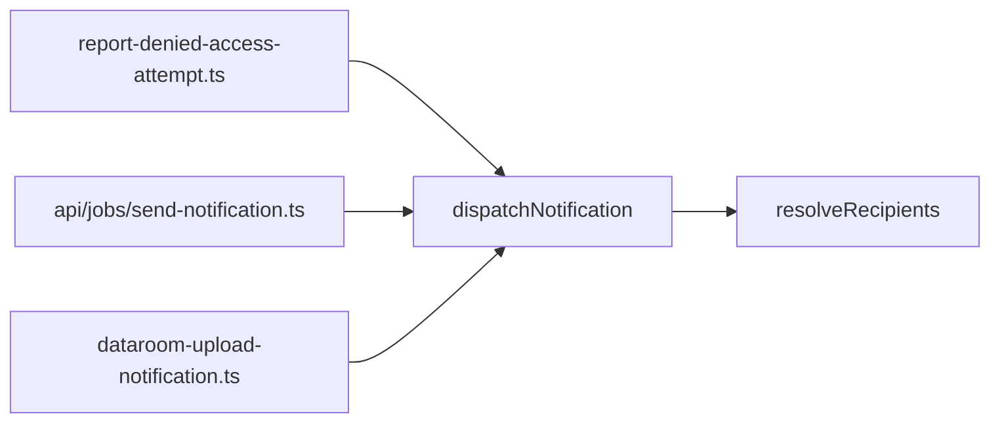

# lib — notifications

# Notifications Module

The `lib/notifications` module provides recipient resolution for team-based notifications. It determines which team members should receive a given notification based on their role, ownership of related resources, and personal notification preferences.

## Overview

When a notification event occurs (e.g., access denied, document uploaded), the system needs to determine *who* should be notified. This module handles that logic by:

1. Identifying active team members
2. Filtering by role and resource ownership
3. Applying user notification preferences
4. Returning eligible recipients with their delivery settings

## Key Components

### `dispatchNotification()`

**File:** `lib/notifications/dispatch.ts`

A thin wrapper that delegates to `resolveRecipients`. Use this function as the public entry point for the module.

```typescript
async function dispatchNotification({
  teamId,
  notificationType,
  linkOwnerId,
  documentOwnerId,
}): Promise<NotificationRecipient[]>
```

**Parameters:**

| Parameter | Type | Description |
|-----------|------|-------------|
| `teamId` | `string` | The team whose members may receive the notification |
| `notificationType` | `TeamNotificationType` | The type of notification (e.g., `ACCESS_DENIED`, `UPLOAD_COMPLETE`) |
| `linkOwnerId` | `string \| null` | ID of the user who owns the related link (if applicable) |
| `documentOwnerId` | `string \| null` | ID of the user who owns the related document (if applicable) |

**Returns:** An array of `NotificationRecipient` objects representing users who should be notified.

---

### `resolveRecipients()`

**File:** `lib/notifications/resolve-recipients.ts`

The core implementation. Performs the actual recipient resolution logic.

**Output Type:**

```typescript
type NotificationRecipient = {
  userId: string;
  email: string;
  scope: TeamNotificationScope;
  role: Role;
};
```

## Recipient Resolution Algorithm

The resolution follows a four-step process:

### Step 1: Fetch Active Team Members

Queries `UserTeam` for all members with `status: "ACTIVE"` in the given team. Only includes `userId`, `role`, and `email` in the select clause.

### Step 2: Filter by Eligibility

A member is eligible if:

- Their role is `ADMIN` or `MANAGER` (always notified), **OR**
- They are the owner of the related link or document (checked via `linkOwnerId` or `documentOwnerId`)

This means regular `MEMBER` role users only receive notifications about resources they own.

### Step 3: Apply Notification Preferences

For each eligible member:

1. Look up their stored preferences in `NotificationPreference` for the given `notificationType`
2. Merge with defaults based on role:
   - `ADMIN` / `MANAGER` → `DEFAULT_ADMIN_PREFERENCES`
   - `MEMBER` → `DEFAULT_MEMBER_PREFERENCES`

3. Determine `frequency` and `scope` values (stored preference overrides default)

### Step 4: Final Filtering

Exclude recipients where:

- Email is missing
- `frequency` is `"NEVER"` (user disabled this notification type)
- `scope` is `"MINE_ONLY"` and user is not an owner of the relevant resource

## Preference Defaults

The module uses role-based defaults defined in `TeamNotificationType` schemas:

| Role | Default Preferences |
|------|---------------------|
| ADMIN / MANAGER | Higher notification frequency by default |
| MEMBER | Lower notification frequency by default |

This reflects that managers and admins typically need broader awareness of team activity, while regular members focus on notifications about their own content.

## Integration Points

The module is consumed by three primary callers:



| Caller | Purpose |
|--------|---------|
| `report-denied-access-attempt.ts` | Notifies team when unauthorized access is attempted |
| `api/jobs/send-notification.ts` | Job handler for processing queued notifications |
| `lib/trigger/dataroom-upload-notification.ts` | Triggered when dataroom uploads complete |

All callers follow the same pattern: construct the notification context, call `dispatchNotification`, then use the returned recipients for actual delivery (email, in-app, etc.).

## Usage Example

```typescript
import { dispatchNotification } from "@/lib/notifications/dispatch";

async function notifyAccessDenied(teamId: string, linkId: string, requestingUserId: string) {
  const link = await prisma.link.findUnique({
    where: { id: linkId },
    select: { ownerId: true },
  });

  const recipients = await dispatchNotification({
    teamId,
    notificationType: "ACCESS_DENIED",
    linkOwnerId: link?.ownerId,
    documentOwnerId: null,
  });

  // Recipients now contains eligible team members to notify
  for (const recipient of recipients) {
    await sendEmail({
      to: recipient.email,
      type: "ACCESS_DENIED",
      scope: recipient.scope,
    });
  }
}
```

## Design Notes

- **No delivery logic**: This module only resolves *who* should be notified. Actual delivery (email service, push notifications, etc.) is handled by callers.
- **Lazy preference defaults**: Defaults are computed per-user at resolution time rather than stored, allowing system-wide preference changes without migration.
- **Owner-based scoping**: The `MINE_ONLY` scope ensures members only receive notifications about their own resources, even if they have the notification type enabled.