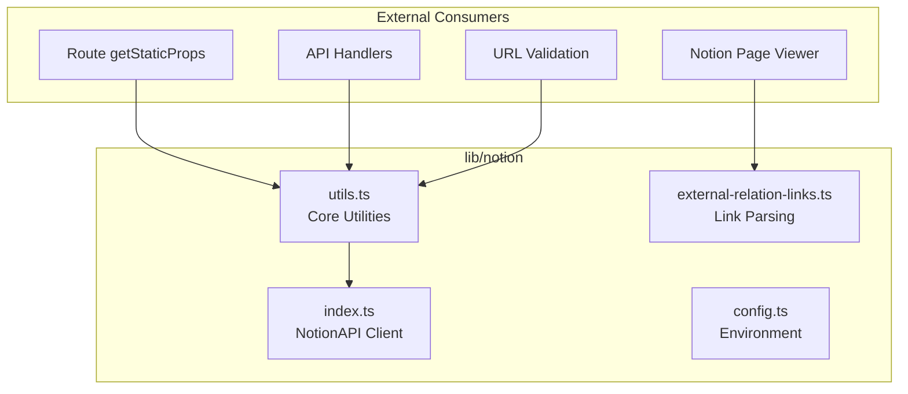
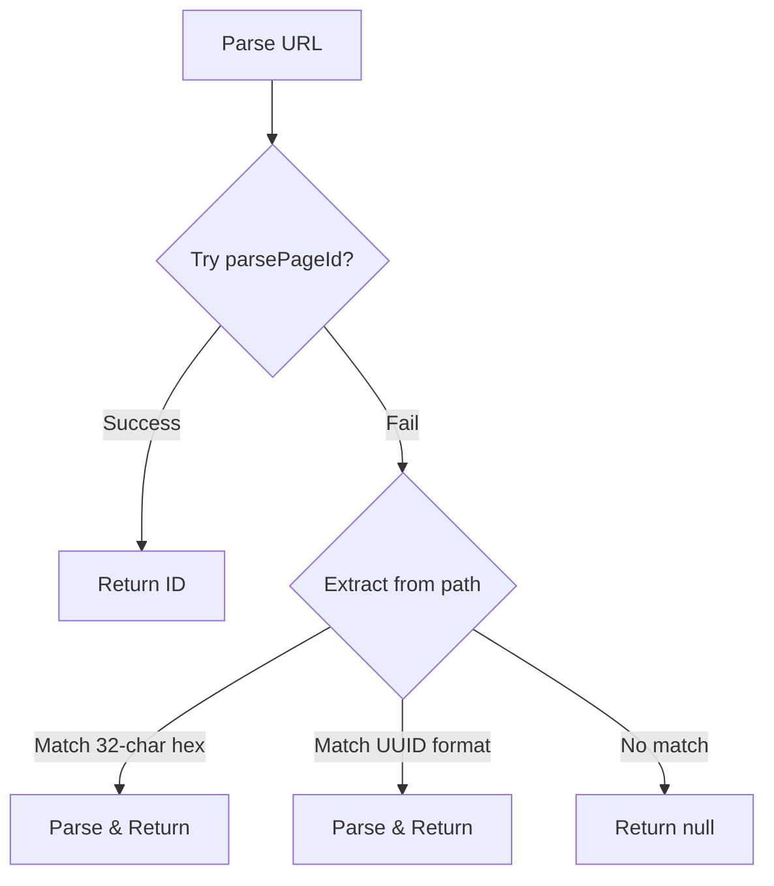

# lib — notion

# Notion Module (`lib/notion`)

The Notion module provides utilities for integrating with the Notion API, handling page fetching, record map normalization, URL parsing, and signed URL management for media assets.

## Overview

This module bridges your application with Notion's API, providing:

- **Client singleton** for Notion API communication
- **Record map normalization** for API response compatibility
- **Page reference resolution** for linked pages and external objects
- **Signed URL handling** for secure media access
- **URL parsing** for various Notion URL formats (notion.so, custom domains, notion.site)

## Architecture



## Core Components

### NotionAPI Client (`index.ts`)

A singleton instance of the `NotionAPI` client from `notion-client`, exported as the default export. All Notion API communication flows through this instance.

```typescript
import notion from "lib/notion";

// Used throughout the module for API calls
notion.getPage(pageId)
notion.getBlocks(blockIds)
notion.getSignedFileUrls(fileInstances)
```

### Configuration (`config.ts`)

Provides environment detection for development mode:

```typescript
export const isDev = process.env.NODE_ENV === "development" || !process.env.NODE_ENV;
```

This is used to enable debug logging or development-specific behavior in consumers.

---

## Utilities (`utils.ts`)

### Record Map Normalization

The Notion API can return block structures in two formats. The newer API wraps blocks in an extra layer:

```typescript
// Double-nested format (newer API)
{ value: { value: { id, type, ... }, role: "reader" }, spaceId }

// Expected format (react-notion-x)
{ value: { id, type, ... }, role: "reader" }
```

`normalizeRecordMap` flattens these structures for compatibility with `react-notion-x`:

```typescript
normalizeRecordMap(recordMap: ExtendedRecordMap): void
```

**Operations:**
1. Iterates through `recordMap.block` entries
2. Detects double-nested values with valid IDs
3. Flattens to `{ value, role }` structure
4. Applies same transformation to `recordMap.collection`

This function mutates the recordMap in place and is called before any operations requiring block IDs.

---

### Page Reference Resolution

Notion pages often reference other pages via rich text decorations or aliases. These references may not be included in the initial API response.

`fetchMissingPageReferences` resolves all missing page references:

```typescript
export async function fetchMissingPageReferences(
  recordMap: ExtendedRecordMap
): Promise<void>
```

**Process:**

```mermaid
flowchart LR
    A[Normalize RecordMap] --> B[Collect Page IDs]
    B --> C[From Rich Text<br/>"p" decorator]
    B --> D[From Alias blocks]
    B --> E[From Content array]
    C --> F[Filter Missing]
    D --> F
    E --> F
    F --> G{Fetch Missing?}
    G -->|Yes| H[Get Blocks API]
    H --> I[Merge into RecordMap]
    I --> J[Link External Objects]
    G -->|No| J
```

**Page ID Extraction (`extractPageReferencesFromRichText`):**

Scans rich text decorations for page references using two decorator patterns:

| Decorator | Format | Description |
|-----------|--------|-------------|
| `"p"` | `["p", pageId]` | Direct page mention/link |
| `"\u2023"` | `["\u2023", [linkType, id]]` | Bullet-style page reference; skips `"u"` (user) type |

---

### External Object Linking

Notion supports linking to external object instances. `linkExternalObjectMentions` enriches text decorations with proper URLs for these links.

```typescript
linkExternalObjectMentions(recordMap: ExtendedRecordMap): void
```

**How it works:**

1. Iterates through all blocks and their properties
2. For each rich text segment, checks for `"p"` or `"\u2023"` decorators
3. Resolves the decorator to an external object URL via `getLinkedExternalObjectTarget`
4. Replaces the decorator with an anchor tag decoration (`["a", url]`)
5. Preserves the original title text if present

---

### Signed URL Management

Notion serves media files (images, PDFs, audio, video) through signed URLs that expire. `addSignedUrls` pre-fetches these URLs:

```typescript
addSignedUrls: NotionAPI["addSignedUrls"] = async ({ recordMap, contentBlockIds })
```

**File types handled:**

| Block Type | Source Property | Notes |
|------------|-----------------|-------|
| `image` | `source` | Uses `block.file_ids` |
| `pdf` | `source` | — |
| `audio` | `source` | — |
| `video` | `source` | — |
| `file` | `source` | — |
| `page` | `format.page_cover` | Cover images |

**URL validation:** Only processes URLs from:
- `secure.notion-static.com`
- `prod-files-secure`
- `attachment:` protocol

After fetching signed URLs from `notion.getSignedFileUrls()`, they are stored in `recordMap.signed_urls` keyed by block ID.

---

### URL Parsing

#### `extractPageIdFromCustomNotionUrl`

Extracts a Notion page ID from arbitrary URLs:

```typescript
export function extractPageIdFromCustomNotionUrl(url: string): string | null
```

**URL formats supported:**

1. **Standard Notion URLs** with plain IDs: `notion.so/workspace/32-char-hex-id`
2. **Hyphenated UUID format**: `notion.so/workspace/8-4-4-4-12-char-uuid`
3. **Custom domain slugs** containing embedded IDs

**Process:**



#### `isCustomNotionDomain`

Verifies if a URL points to a custom Notion domain and the page is accessible:

```typescript
export async function isCustomNotionDomain(url: string): Promise<boolean>
```

**Process:**

1. Extract page ID from URL
2. Attempt to fetch the page via `notion.getPage()`
3. Returns `true` if successful, `false` if error

#### `getNotionPageIdFromSlug`

Resolves a page ID from various Notion URL formats, including public `notion.site` pages:

```typescript
export async function getNotionPageIdFromSlug(url: string): Promise<string>
```

**URL types handled:**

| URL Pattern | Source | Resolution Method |
|-------------|--------|-------------------|
| `notion.so` / `www.notion.so` | Path | Direct `parsePageId` |
| `*.notion.site` | API | Notion internal API `getPublicPageDataForDomain` |
| Custom domains | Path + API verification | Extract + verify page exists |

**For `notion.site` URLs:**

```typescript
// Request to Notion internal API
POST https://{spaceDomain}.notion.site/api/v3/getPublicPageDataForDomain

// Payload
{
  type: "block-space",
  name: "page",
  slug: extractedSlug,
  spaceDomain: domain,
  requestedOnPublicDomain: true
}
```

---

## External Relation Links (`external-relation-links.ts`)

Parses external links from Notion rich text decorations, specifically for linked relation blocks:

```typescript
export function getExternalRelationLinks(
  data?: Decoration[]
): ExternalRelationLink[] | null
```

**Returns:**

```typescript
type ExternalRelationLink = {
  text: string;  // Display text
  url: string;   // Valid HTTP/HTTPS URL
}
```

**Parsing rules:**

1. Expects an array of `[text, decorations]` segments
2. Skips separator tokens (`","` and `" "`)
3. Finds link decorators: `["a", urlString]`
4. Validates URL has `http:` or `https:` protocol
5. Uses URL `href` (normalized) as the link target
6. Falls back to URL for display text if text is empty

Returns `null` for malformed or empty input.

---

## Type Definitions

### Exported Types

| Type | Location | Description |
|------|----------|-------------|
| `ExternalRelationLink` | `external-relation-links.ts` | `{ text: string, url: string }` for parsed links |
| `addSignedUrls` | `utils.ts` | Typed as `NotionAPI["addSignedUrls"]` |

### Internal Types (Not Exported)

| Function | Purpose |
|----------|---------|
| `extractPageReferencesFromRichText` | Returns `string[]` of page IDs |
| `getExternalObjectLinkTarget` | Returns `{ title: string, url: string } | null` |
| `getLinkedExternalObjectTarget` | Wrapper that handles both `"p"` and `"\u2023"` decorators |

---

## Integration Points

### Route Handlers

| Route | Functions Used |
|-------|----------------|
| `[domain]/[slug]/index.tsx` | `fetchMissingPageReferences`, `normalizeRecordMap`, `addSignedUrls` |
| `[linkId]/d/[documentId].tsx` | `fetchMissingPageReferences`, `normalizeRecordMap`, `addSignedUrls` |
| `view/[linkId]/index.tsx` | `normalizeRecordMap`, `fetchMissingPageReferences`, `addSignedUrls` |
| `[slug]/d/[documentId].tsx` | `normalizeRecordMap`, `fetchMissingPageReferences`, `addSignedUrls` |
| `file/notion/index.ts` | `normalizeRecordMap`, `fetchMissingPageReferences`, `addSignedUrls` |

### API Handlers

- `api/documents/process-document.ts` → `getNotionPageIdFromSlug`
- `handleNotionUpload` (add-document-modal) → `getNotionPageIdFromSlug`

### Validation

- `lib/zod/url-validation.ts` → `getNotionPageIdFromSlug`, `isCustomNotionDomain`

### Components

- `view/viewer/notion-page.tsx` → `getExternalRelationLinks` (for property relation display)

---

## Common Usage Patterns

### Fetching a Notion Page for Static Generation

```typescript
import notion from "lib/notion";
import { 
  fetchMissingPageReferences, 
  normalizeRecordMap,
  addSignedUrls 
} from "lib/notion/utils";

export async function getStaticProps({ params }) {
  const recordMap = await notion.getPage(params.pageId);
  
  normalizeRecordMap(recordMap);
  await fetchMissingPageReferences(recordMap);
  await addSignedUrls({ recordMap });
  
  return { props: { recordMap } };
}
```

### Validating a Notion URL

```typescript
import { getNotionPageIdFromSlug, isCustomNotionDomain } from "lib/notion/utils";

// Check if URL is a custom Notion domain
const isCustom = await isCustomNotionDomain(url);

// Resolve page ID from any Notion URL format
const pageId = await getNotionPageIdFromSlug(url);
```

### Extracting Links from Notion Properties

```typescript
import { getExternalRelationLinks } from "lib/notion/external-relation-links";

function RelationProperty({ property }) {
  const links = getExternalRelationLinks(property);
  
  if (!links) return null;
  
  return (
    <ul>
      {links.map(link => (
        <li key={link.url}>
          <a href={link.url}>{link.text}</a>
        </li>
      ))}
    </ul>
  );
}
```

---

## Error Handling

The module handles errors gracefully:

| Function | Error Behavior |
|----------|----------------|
| `fetchMissingPageReferences` | Logs warning, continues without missing pages |
| `addSignedUrls` | Logs warning, leaves `signed_urls` empty |
| `isCustomNotionDomain` | Returns `false` on any error |
| `getNotionPageIdFromSlug` | Throws descriptive errors for unresolvable URLs |
| `getExternalRelationLinks` | Returns `null` for invalid/malformed input |

---

## Notes for Contributors

### Why Mutate Record Maps?

Most functions in this module mutate the input `recordMap` rather than returning a new copy. This is intentional for performance—the record maps can be large, and cloning them would add significant overhead during static generation.

When calling these functions, be aware that:
- `normalizeRecordMap` modifies in place
- `fetchMissingPageReferences` may add blocks and modify content
- `linkExternalObjectMentions` modifies rich text decorations
- `addSignedUrls` populates `recordMap.signed_urls`

### Notion Decoration Formats

The module works with Notion's internal decoration format. Key patterns:

- **`["a", url]`** — Anchor/link decoration
- **`["p", pageId]`** — Page reference (in rich text)
- **`["\u2023", [type, id]]`** — Bullet-style reference; type `"u"` is user, other types are pages
- **`[text, [decorations]]`** — Standard rich text segment

Understanding these patterns is essential when extending functionality that parses Notion content.