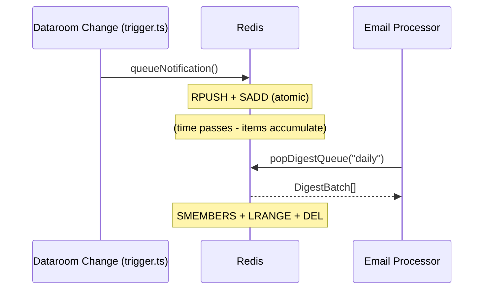

# lib — redis

# Dataroom Notification Queue

A Redis-backed queue that batches dataroom document notifications into daily or weekly digests.

## Purpose

When dataroom documents are accessed or modified, this module queues notifications for later delivery. Instead of sending immediate notifications, it accumulates events and groups them by viewer and dataroom. This allows the email system to send consolidated digest emails rather than individual notifications.

The module uses Redis for both storage and atomic operations, with an 8-day TTL on all queued items.

## Data Model

The queue uses two Redis key patterns:

| Key Pattern | Type | Purpose |
|-------------|------|---------|
| `dataroom_digest_viewers:{frequency}` | Set | Tracks which viewer-dataroom combinations have pending items |
| `dataroom_digest_items:{viewerId}:{dataroomId}` | List | Stores individual notification items for a viewer-dataroom pair |

**Viewer entries** in the set are encoded as colon-separated strings: `{viewerId}:{dataroomId}:{teamId}`

**Queue items** are JSON-encoded objects containing:

```typescript
{
  dataroomDocumentId: string;
  senderUserId: string | null;
  queuedAt: number;  // Unix timestamp
}
```

## Key Functions

### `queueNotification()`

Adds a notification item to the queue for a specific viewer.

```typescript
async function queueNotification({
  frequency,       // "daily" | "weekly"
  viewerId,
  dataroomId,
  teamId,
  dataroomDocumentId,
  senderUserId,
}: QueueParams): Promise<void>
```

**Operations performed atomically via pipeline:**

1. `RPUSH` — Append item to the viewer's list
2. `EXPIRE` — Set 8-day TTL on the list key
3. `SADD` — Add viewer entry to the frequency set

### `popDigestQueue()`

Retrieves all queued items and clears the queue. Called by the digest processor.

```typescript
async function popDigestQueue(
  frequency: "daily" | "weekly"
): Promise<DigestBatch[]>
```

**Operations:**

1. `SMEMBERS` — Get all viewer entries from the set
2. `DEL` — Remove the entire viewer set atomically
3. For each viewer entry:
   - `LRANGE 0 -1` — Fetch all queued items
   - `DEL` — Remove the items list
4. Parse and validate items, filtering corrupted entries

**Returns** an array of `DigestBatch`, each containing:

```typescript
{
  viewerId: string;
  dataroomId: string;
  teamId: string;
  items: QueueItem[];
}
```

## Architecture



## Error Handling

`popDigestQueue` handles corrupted queue items gracefully. If JSON parsing fails for an item, it logs a warning and skips that item rather than failing the entire batch:

```typescript
try {
  return JSON.parse(raw) as QueueItem;
} catch (error) {
  console.warn(`Skipping corrupted queue item...`);
  return null;
}
```

## Connections

**Incoming calls:**

- `lib/trigger/dataroom-change-notification.ts` → `queueNotification()` — Called when dataroom documents change to queue notifications
- `lib/emails/process-dataroom-digest.ts` → `popDigestQueue()` — Consumes the queue during digest email processing

## TTL Behavior

Items expire after **8 days** (8 × 24 × 60 × 60 seconds). This prevents stale items from accumulating indefinitely if the digest processor fails. However, once `popDigestQueue()` retrieves an item, it is deleted immediately, so TTL mainly protects against orphaned lists.