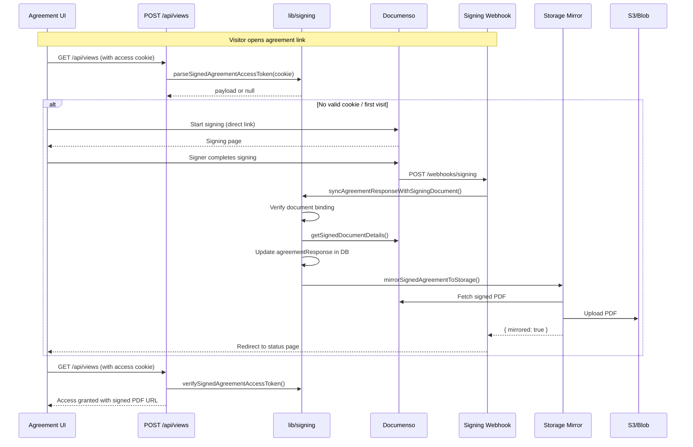

# lib — signing

# lib/signing Module

The `lib/signing` module provides the complete infrastructure for embedded agreement signing with Documenso, including token-based session management, Documenso SDK integration, storage mirroring, and webhook processing.

## Overview

This module bridges three concerns:

1. **Token Security** — HMAC-signed cookies and tokens that bind visitors to their signing sessions without requiring email lookups
2. **Documenso Integration** — Creating templates, minting per-visitor documents, managing envelopes, and resolving download URLs
3. **Storage Layer** — Mirroring signed PDFs to S3 or Vercel Blob for persistent access

The module is consumed by API routes (`/api/views`, `/api/views-dataroom`, webhooks), UI components for the signing flow, and the agreement panel in the link editor.

## Architecture

```mermaid
flowchart TB
    subgraph "Browser / Client"
        UI[Agreement Section UI]
        Cookie[Access Cookie<br/>pm_sas_{linkId}]
    end

    subgraph "API Routes"
        ViewsAPI["POST /api/views"]
        ViewsDataroomAPI["POST /api/views-dataroom"]
        SigningWebhook["POST /webhooks/signing"]
    end

    subgraph "lib/signing"
        AccessToken["access-token.ts<br/>90-day HMAC tokens"]
        DownloadToken["download-token.ts<br/>30-min HMAC tokens"]
        Agreements["agreements.ts<br/>Core logic"]
        Envelopes["envelopes.ts<br/>Documenso envelopes"]
        Client["client.ts<br/>SDK client"]
        Storage["agreement-storage.ts<br/>Browser localStorage"]
        Download["download.ts<br/>Browser downloads"]
        Mirror["mirror.ts<br/>S3/Blob mirroring"]
        TemplateUpload["template-upload.ts<br/>Size limits"]
    end

    subgraph "External Services"
        Documenso["Documenso API"]
        S3["Amazon S3"]
        Blob["Vercel Blob"]
    end

    UI --> Storage
    ViewsAPI --> AccessToken
    ViewsAPI --> Agreements
    ViewsAPI --> DownloadToken
    ViewsDataroomAPI --> AccessToken
    ViewsDataroomAPI --> Agreements
    SigningWebhook --> Agreements
    SigningWebhook --> Mirror
    UI --> Cookie
    Cookie --> ViewsAPI

    Agreements --> Client
    Envelopes --> Client
    Client --> Documenso
    Mirror --> Envelopes
    Mirror --> S3
    Mirror --> Blob
```

## Client Configuration (`client.ts`)

The client module initializes the Documenso SDK and exposes configuration values. It is a lazy singleton — the SDK client is created once on first use.

```typescript
// Key exports
getSigningHost()     // "https://app.documenso.com" (configurable via NEXT_PUBLIC_SIGNING_HOST)
getSigningApiUrl()   // "{host}/api/v2"
getSigningWebhookSecret()  // From SIGNING_WEBHOOK_SECRET env var (nullable)
getSigningClient()   // Lazy Documenso instance; throws TeamError if SIGNING_API_KEY missing
```

The client is the foundation all other signing operations depend on. It is called internally by `envelopes.ts`, `agreements.ts`, and `mirror.ts`.

## Token Security

The module uses two distinct HMAC-signed token schemes, both signed with `NEXTAUTH_SECRET`:

### Access Tokens (`access-token.ts`)

Long-lived tokens (90 days) that bind a browser to a specific `(linkId, agreementId, agreementResponseId)` tuple. These survive page refreshes and allow re-opening the signing UI without re-authentication.

```typescript
mintSignedAgreementAccessToken({ agreementResponseId, linkId, agreementId })
// Returns { token, expiresAt, maxAgeSeconds }

parseSignedAgreementAccessToken(token)  // Validates HMAC, parses payload
verifySignedAgreementAccessToken(token, { linkId, agreementId, agreementResponseId? })
// Full verification including binding checks

buildSignedAgreementAccessCookie({ linkId, token, maxAgeSeconds, secure })
// Produces: pm_sas_{linkId}={token}; Path=/; Max-Age=...; HttpOnly; SameSite=Lax; [Secure]
```

The cookie is scoped to `Path=/` so it reaches all signing-related routes. `HttpOnly` prevents JavaScript access, and `SameSite=Lax` allows the cookie to travel with top-level navigations.

### Download Tokens (`download-token.ts`)

Short-lived tokens (30 minutes) scoped to `(agreementResponseId, linkId)` for authorizing PDF downloads before the access form is submitted.

```typescript
mintSignedAgreementDownloadToken({ agreementResponseId, linkId })
// Returns { token, expiresAt, maxAgeSeconds }

verifySignedAgreementDownloadToken(token, { agreementResponseId, linkId })

buildSignedAgreementDownloadCookie({ token, maxAgeSeconds, secure })
// Path is /api/agreements/signing — only attaches to signing API requests
```

### Token Security Properties

Both token implementations share these guarantees:

- **HMAC-SHA256** signatures computed over the base64url-encoded JSON payload
- **`crypto.timingSafeEqual`** for signature comparison to prevent timing attacks
- **Explicit type checking** on parsed payloads before trusting any field
- **Expiration enforcement** checked server-side on every parse

## Agreement Management (`agreements.ts`)

This is the largest file, containing all core signing business logic.

### Identifying Signing Agreements

```typescript
isSigningAgreement({ signingProvider, contentType })
// Returns true when signingProvider === "DOCUMENSO" or contentType === "SIGNING"
```

### Template Setup

Documenso templates require a placeholder recipient before they can be used. The `Viewer` recipient (email `""`, name `"Viewer"`, role `"SIGNER"`) serves this role.

```typescript
ensureSigningTemplateViewerRecipient({ envelopeId })
// Idempotent: creates or normalizes the placeholder recipient
// Returns refreshed envelope

createSigningTemplateEnvelope({ title, externalId, file, folderId })
// Creates template in Documenso, seeds Viewer recipient
// Returns full Documenso template object
```

### Direct Link Management

Each template needs a direct signing link. The link is keyed by the numeric template ID from our database (since Documenso V2 envelopes don't carry it).

```typescript
ensureSigningTemplateDirectLink({ signingTemplateId })
// Enables existing link or creates new one
// Returns { template, directLink }

deleteSigningTemplateDirectLink({ signingTemplateId })
// Deletes (not just disables) the link
// Necessary before the V2 field editor can save
```

### Document Session Lifecycle

A "document session" represents a per-visitor document derived from a template. The visitor's email/name are applied when the document is created.

```typescript
createSigningDocumentFromTemplate({ signingTemplateId, externalId, signerEmail, signerName })
// Calls templates.use (EmbedSignDocument) with the Visitor recipient
// Returns { documentId, envelopeId, recipientId, token }

getReusableSigningDocumentSession({ documentId })
// Returns existing token if document is still PENDING/CREATED
// Returns null if COMPLETED, REJECTED, or token unavailable

ensureSigningDocumentSession({ signingTemplateId, externalId, existingDocumentId?, signerEmail?, signerName? })
// Reuse path: if existingDocumentId provided and still valid, return it
// Create path: otherwise mint a new document from template
```

### Team Folder Organization

Documents and templates are organized into Documenso folders per team, with names like `Papermark [papermark:team:{teamId}]`.

```typescript
ensureTeamSigningFolders(teamId)
// Returns { templateFolderId, documentFolderId }
// Cached for 5 minutes in memory to avoid repeated Documenso API calls
```

### Response Synchronization

When Documenso fires a webhook after signing, the agreement response in our database must be updated:

```typescript
syncAgreementResponseWithSigningDocument({ agreementResponseId, documentId, signingStatus? })
// Validates document <-> response binding via externalId
// Updates signingStatus, envelopeId, documentId, signedAt, completedAt
// Overwrites signerEmail/signerName with Documenso's authoritative values
// Fires background folder move via waitUntil
```

### Access Gatekeeping

```typescript
getAgreementResponseForAccess({ agreementResponseId, agreementId, linkId, signerEmail?, signerName?, requireSignerEmail?, requireSignerName?, skipSignerIdentityCheck? })
// Validates response exists and belongs to the agreement
// C3: prevents replaying a response against a different link
// Checks signingStatus is SIGNED or COMPLETED
// Optionally verifies signer identity (email/name) via assertAgreementResponseSignerIdentity

ensureAgreementResponseForAccess({ agreement, linkId, agreementResponseId?, hasConfirmedAgreement?, ... })
// Dispatches: SIGNING agreements → getAgreementResponseForAccess
//            Legacy checkbox agreements → creates a SIGNED response inline
```

## Envelope Operations (`envelopes.ts`)

Low-level Documenso envelope access.

```typescript
getEnvelope(envelopeId)
// O(1) lookup via Documenso V2 envelopes.get

getEnvelopeSignedDownloadUrl({ envelopeId, documentId? })
// Fast path: documentId → document.documentDownload
// Legacy path: resolve envelope primary item → envelopes.items.download
// Returns { url }
```

## Storage Mirroring (`mirror.ts`)

After a document is signed, this module copies the PDF to team storage (S3 or Vercel Blob). This is idempotent and non-fatal — if mirroring fails, downloads still work via direct Documenso calls.

```typescript
mirrorSignedAgreementToStorage({ agreementResponseId })
// Checks: response exists, not already mirrored, has envelopeId
// Fetches PDF from Documenso (30s timeout, 50MB cap)
// Uploads to S3 or Blob based on NEXT_PUBLIC_UPLOAD_TRANSPORT
// Updates agreementResponse with fileKey, fileName, storageType
// Returns { mirrored: true, signedFileKey, signedFileName, signedFileStorageType }
```

### Size Protection

`fetchSignedPdf` enforces a 50 MB ceiling matching Documenso's default limit. It checks the `Content-Length` header before streaming, and aborts mid-stream if the cap is exceeded.

### Storage Backend Routing

| Transport | Upload Function | Key Handling |
|-----------|-----------------|---------------|
| `s3` | `uploadToS3` | Key is the stored reference |
| (default) | `uploadToBlob` | `addRandomSuffix` makes URL unguessable; blob URL is stored |

## Webhook Security (`agreements.ts`)

```typescript
verifySigningWebhookSecret(secret)
// Returns { ok: boolean, configured: boolean }
// Uses timingSafeEqual for the comparison
// Returns { ok: false, configured: false } when secret is missing
```

The webhook handler at `/webhooks/signing` uses this before processing any events.

## Browser Utilities

### Download Token (`download-token.ts`)

```typescript
buildSignedAgreementDownloadCookie({ token, maxAgeSeconds, secure })
// Path-scoped to /api/agreements/signing
```

### Agreement Downloads (`download.ts`)

```typescript
downloadSignedAgreement({ url, fallbackFilename? })
// Triggers browser download from the signed agreement URL
// Extracts filename from Content-Disposition or URL params
// Revokes object URL after download starts

buildTeamSignedAgreementDownloadUrl({ teamId, agreementId, responseId })
// Produces: /api/teams/{teamId}/agreements/{agreementId}/responses/{responseId}/download
```

### Local Storage Bridge (`agreement-storage.ts`)

```typescript
getAgreementResponseStorageKey(linkId, agreementId)
// Key: "papermark.agreement.{linkId}.{agreementId}"

parseStoredAgreementResponse(raw)
// Deserializes the stored response from localStorage
```

## Constants (`template-upload.ts`)

```typescript
MAX_SIGNING_TEMPLATE_PDF_BYTES  // 30 MB
MAX_SIGNING_TEMPLATE_PDF_MB     // 30

getSigningTemplateTooLargeMessage()
// "PDF is too large for signing setup (max 30 MB)."
```

## Signing Flow Sequence



## Environment Variables

| Variable | Required | Description |
|----------|----------|-------------|
| `NEXTAUTH_SECRET` | Yes | HMAC signing key for all tokens |
| `SIGNING_API_KEY` | Yes | Documenso API key |
| `SIGNING_API_URL` | No | Documenso API endpoint (defaults to `{host}/api/v2`) |
| `NEXT_PUBLIC_SIGNING_HOST` | No | Documenso host (defaults to `https://app.documenso.com`) |
| `SIGNING_WEBHOOK_SECRET` | No | Webhook verification secret |
| `NEXT_PUBLIC_UPLOAD_TRANSPORT` | No | `s3` or default (Vercel Blob) |

## Error Handling

All errors are thrown as `TeamError` from `lib/errorHandler`. Key error messages:

- `"Signing access token cannot be issued: NEXTAUTH_SECRET is not set."` — startup safety check
- `"Agreement signing could not be verified for this link."` — identity/permission failures
- `"Agreement signing is still pending. Please finish signing to continue."` — incomplete signing
- `"Signed document does not belong to this signing session."` — binding validation failure
- `"Documenso did not return a download URL for the signed agreement."` — envelope resolution failure