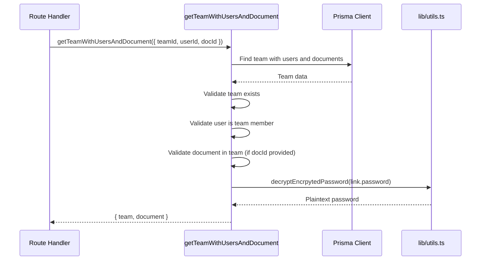

# lib — team

# Team Helper Module (`lib/team/helper.ts`)

Provides data access and authorization helpers for team-based document operations. These functions enforce team membership validation and handle document retrieval with associated link data.

## Overview

This module serves as a reusable layer for any operation that requires fetching a team, its documents, or a specific document while verifying the requesting user has access. It centralizes authorization checks to ensure consistent security across team-related routes.

## Functions

### `getTeamWithUsersAndDocument`

Fetches a team with its members and documents, optionally filtering to a specific document. Performs three authorization checks before returning data.

```typescript
async function getTeamWithUsersAndDocument({
  teamId,
  userId,
  docId,
  checkOwner,
  options,
}: ITeamUserAndDocument)
```

**Parameters:**

| Parameter | Type | Required | Description |
|-----------|------|----------|-------------|
| `teamId` | `string` | Yes | The team's unique identifier |
| `userId` | `string` | Yes | The requesting user's ID |
| `docId` | `string` | No | Optional document ID to fetch alongside the team |
| `checkOwner` | `boolean` | No | Whether to verify the user owns the document (currently commented out) |
| `options` | `object` | No | Prisma include/select options for the documents relation |

**Returns:** `{ team: Team, document?: Document & { views?, versions?, links? } }`

**Authorization Flow:**

1. **Team existence** — Throws `TeamError` if the team doesn't exist
2. **Membership check** — Throws `TeamError` if the user isn't in `team.users`
3. **Document existence** — Throws `TeamError` if `docId` is provided but the document isn't in the team

**Password Decryption:**

When a document is returned with its `links` relation, any link with an encrypted password gets decrypted in-place before return. The `password` field on each `Link` object is replaced with the plaintext value.

### `getDocumentWithTeamAndUser`

Fetches a single document with its team data, verifying the user has access.

```typescript
async function getDocumentWithTeamAndUser({
  docId,
  userId,
  options,
}: IDocumentWithLink)
```

**Parameters:**

| Parameter | Type | Required | Description |
|-----------|------|----------|-------------|
| `docId` | `string` | Yes | The document's unique identifier |
| `userId` | `string` | Yes | The requesting user's ID |
| `options` | `object` | No | Prisma include options for additional relations |

**Returns:** `{ document: Document & { team: { users: { userId: string }[] } } }`

**Authorization Flow:**

1. **Document existence** — Throws `DocumentError` if the document doesn't exist
2. **Membership check** — Throws `TeamError` if the user isn't in the document's team

## Error Handling

Both functions use typed errors from `lib/errorHandler.ts`:

| Function | Error | Condition |
|----------|-------|-----------|
| `getTeamWithUsersAndDocument` | `TeamError` | Team not found |
| `getTeamWithUsersAndDocument` | `TeamError` | User not a team member |
| `getTeamWithUsersAndDocument` | `TeamError` | Document not in team |
| `getDocumentWithTeamAndUser` | `DocumentError` | Document not found |
| `getDocumentWithTeamAndUser` | `TeamError` | User not a team member |

## Data Flow



## Integration

### Called By

- `app/links/[id]/visits/route.ts` — Uses `getDocumentWithTeamAndUser` to verify link access before recording a visit

### Dependencies

- **Prisma** (`@prisma/client`) — Database queries for teams, documents, and relations
- **lib/utils.ts** — `decryptEncrpytedPassword` for link password decryption
- **lib/errorHandler.ts** — `TeamError`, `DocumentError` for typed exceptions

## Security Considerations

1. **Authorization happens server-side** — All user membership checks occur in this module before returning sensitive document data
2. **Password decryption is localized** — Decryption only happens when needed for link access, not on every document fetch
3. **Explicit validation** — Each function fails fast on the first authorization check that fails, preventing unnecessary database access after a rejection

## Notes

- The `checkOwner` parameter and its associated logic in `getTeamWithUsersAndDocument` is currently commented out. If re-enabled, it would add a fourth check verifying the requesting user is the document's `ownerId`.
- The `decryptEncrpytedPassword` function name contains a typo (`Encrpyted` instead of `Encrypted`) — this is a pre-existing issue in the codebase.