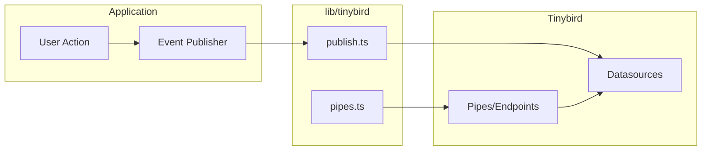

# lib — tinybird

# Tinybird Analytics Module

The `lib/tinybird` module provides typed integrations with [Tinybird](https://tinybird.co/), a real-time analytics platform built on ClickHouse. This module handles all analytics event ingestion and querying for the application.

## Overview

Tinybird serves as the analytics backend for tracking user engagement with documents, videos, and links. The module provides two primary capabilities:

1. **Event Ingestion** — Publishing analytics events (page views, video plays, clicks) to Tinybird datasources
2. **Analytics Queries** — Fetching aggregated statistics through Tinybird pipes

The module uses [`@chronark/zod-bird`](https://github.com/chronark/zod-bird) to generate fully typed, type-safe wrappers around Tinybird endpoints, ensuring compile-time validation of parameters and response data.

## Architecture



### Data Flow

1. **Ingestion Path**: User actions trigger event publishers in `publish.ts`, which send JSON events to Tinybird datasources
2. **Query Path**: Analytics queries call functions from `pipes.ts`, which execute Tinybird pipe endpoints and return typed responses

## Datasources

The module manages five analytics datasources in Tinybird:

### page_views__v3

Tracks when a user views a page within a document. Contains comprehensive engagement data including geolocation, device information, and timing metrics.

| Field | Type | Description |
|-------|------|-------------|
| `id` | String | Unique event identifier |
| `linkId` | String | The sharing link ID |
| `documentId` | String | The viewed document |
| `viewId` | String | Unique viewer session ID |
| `time` | Int64 | Unix timestamp |
| `duration` | UInt32 | Time spent on page (ms) |
| `pageNumber` | LowCardinality(String) | Page identifier |
| `browser`, `os`, `device` | String | User agent components |
| `country`, `city`, `region` | String | Geo information |
| `bot` | UInt8 | Bot detection flag |

### click_events__v1

Records when a user clicks a link within a document (internal navigation).

| Field | Type | Description |
|-------|------|-------------|
| `timestamp` | DateTime64(3) | Event timestamp |
| `event_id` | String | Unique event ID |
| `session_id` | String | User session |
| `link_id` | String | Clicked link |
| `document_id` | String | Parent document |
| `view_id` | String | Viewer session |
| `page_number` | LowCardinality(String) | Source page |
| `href` | String | Destination URL |

### pm_click_events__v1

Tracks link clicks from the public-facing link viewer, capturing extended geographic and device data.

| Field | Type | Description |
|-------|------|-------------|
| `click_id` | String | Unique click ID |
| `view_id` | String | Viewer session |
| `link_id` | String | Clicked link |
| `continent`, `country` | LowCardinality(String) | Geographic region |
| `device`, `browser`, `os` | LowCardinality(String) | Device info |
| `ip_address` | Nullable(String) | User IP |
| `bot` | UInt8 | Bot detection |

### video_views__v1

Records video playback events with detailed engagement metrics.

| Field | Type | Description |
|-------|------|-------------|
| `event_type` | LowCardinality(String) | Event type (start, play, pause, end) |
| `start_time`, `end_time` | UInt32 | Playback position (seconds) |
| `playback_rate` | UInt16 | Stored as 100/150/200 (not 1.0/1.5/2.0) |
| `volume` | UInt8 | Stored as 0-100 (not 0.0-1.0) |
| `is_muted`, `is_focused`, `is_fullscreen` | UInt8 | State flags |

### webhook_events__v1

Logs webhook delivery attempts for debugging and monitoring.

| Field | Type | Description |
|-------|------|-------------|
| `event_id` | String | Unique event ID |
| `webhook_id` | String | Webhook configuration ID |
| `event` | LowCardinality(String) | Trigger type |
| `http_status` | UInt16 | Response status code |
| `request_body`, `response_body` | String | Request/response payloads |
| `message_id` | String | QStash message ID |

## Publishing Events

The `publish.ts` file exports ingest endpoint functions. Call these from your application code when tracking events.

### Available Publishers

| Function | Datasource | Purpose |
|----------|------------|---------|
| `publishPageView` | `page_views__v3` | Track document page views |
| `recordVideoView` | `video_views__v1` | Track video playback |
| `recordClickEvent` | `click_events__v1` | Track internal link clicks |
| `recordLinkViewTB` | `pm_click_events__v1` | Track public link views |
| `recordWebhookEvent` | `webhook_events__v1` | Log webhook delivery |

### Usage Example

```typescript
import { publishPageView } from "@/lib/tinybird";

await publishPageView({
  id: crypto.randomUUID(),
  linkId: "link_abc123",
  documentId: "doc_xyz789",
  viewId: "view_def456",
  time: Date.now(),
  duration: 12500, // milliseconds
  pageNumber: "5",
  country: "US",
  browser: "Chrome",
  os: "macOS",
});
```

### IP Address Handling

`recordLinkViewTB`, `recordVideoView`, and `recordWebhookEvent` accept nullable `ip_address` fields. Pass `null` when IP is unavailable (e.g., server-side rendering).

## Querying Analytics (Pipes)

The `pipes.ts` file exports typed pipe functions for analytics queries. These return Zod-parsed responses with full type inference.

### Duration Queries

| Function | Pipe | Returns |
|----------|------|---------|
| `getTotalDocumentDuration` | `get_total_document_duration__v1` | Total engagement time for a document |
| `getTotalViewerDuration` | `get_total_viewer_duration__v1` | Total time across multiple viewers |
| `getTotalLinkDuration` | `get_total_link_duration__v1` | Duration for a specific link |
| `getTotalDataroomDuration` | `get_total_dataroom_duration__v1` | Duration for all docs in a dataroom |
| `getTotalTeamDuration` | `get_total_team_duration__v1` | Team-wide aggregated stats |
| `getDocumentDurationPerViewer` | `get_document_duration_per_viewer__v1` | Per-viewer breakdown |

### Page-Level Analytics

| Function | Pipe | Returns |
|----------|------|---------|
| `getViewPageDuration` | `get_page_duration_per_view__v5` | Duration per page for a view |
| `getTotalAvgPageDuration` | `get_total_average_page_duration__v5` | Average duration per page across views |
| `getViewCompletionStats` | `get_view_completion_stats__v1` | Pages viewed per viewer |

### Engagement Queries

| Function | Pipe | Returns |
|----------|------|---------|
| `getDataroomViewDocumentStats` | `get_dataroom_view_document_stats__v1` | Stats grouped by view/document |
| `getViewUserAgent` | `get_useragent_per_view__v3` | Viewer device info |

### Event Retrieval

| Function | Pipe | Returns |
|----------|------|---------|
| `getClickEventsByView` | `get_click_events_by_view__v1` | All clicks within a view |
| `getVideoEventsByDocument` | `get_video_events_by_document__v1` | Video events for a document |
| `getVideoEventsByView` | `get_video_events_by_view__v1` | Video events for a view |
| `getWebhookEvents` | `get_webhook_events__v1` | Recent webhook deliveries |

### Usage Example

```typescript
import { getTotalDocumentDuration, getViewPageDuration } from "@/lib/tinybird";

// Query total document duration
const totalResult = await getTotalDocumentDuration({
  documentId: "doc_abc123",
  excludedLinkIds: "link_x,link_y", // comma-separated
  excludedViewIds: "view_1,view_2",
  since: Date.now() - 7 * 24 * 60 * 60 * 1000, // 7 days ago
});

// Query per-page breakdown
const pageResults = await getViewPageDuration({
  documentId: "doc_abc123",
  viewId: "view_def456",
  since: Date.now() - 24 * 60 * 60 * 1000,
});

console.log(`Total: ${totalResult.data.sum_duration}ms`);
pageResults.data.forEach(page => {
  console.log(`Page ${page.pageNumber}: ${page.sum_duration}ms`);
});
```

## API

### index.ts

Re-exports all public functions:

```typescript
export * from "./pipes";
export * from "./publish";
```

Import everything from `@/lib/tinybird` or import specific functions as needed.

## Maintenance

### Adding a New Pipe

1. Create the pipe definition file in `lib/tinybird/endpoints/` (see existing `.pipe` files for format)
2. Push to Tinybird: `tb push lib/tinybird/endpoints/<PIPENAME>.pipe`
3. Add the TypeScript wrapper in `pipes.ts`:

```typescript
export const getMyAnalytics = tb.buildPipe({
  pipe: "get_my_analytics__v1",
  parameters: z.object({
    // your parameters
  }),
  data: z.object({
    // your response schema
  }),
});
```

### Adding a New Datasource

1. Create the datasource definition file in `lib/tinybird/datasources/`
2. Push to Tinybird: `tb push lib/tinybird/datasources/<DATASOURCE>.datasource`
3. Add the ingest endpoint in `publish.ts`:

```typescript
export const recordMyEvent = tb.buildIngestEndpoint({
  datasource: "my_events__v1",
  event: z.object({
    // your schema
  }),
});
```

### Versioning

Tinybird pipes and datasources are versioned via the `VERSION` directive. When modifying an existing pipe:

1. Increment the version number in the `.pipe` file
2. Update the TypeScript wrapper to reference the new version (e.g., `get_page_duration_per_view__v5`)

### Deleting Data

To remove specific records from a datasource (requires careful SQL):

```bash
tb datasource delete page_views__v3 --dry-run --sql-condition "viewId='VIEWID' and CAST(pageNumber AS UInt8) = PAGENUMBER" --wait
```

Always use `--dry-run` first to preview the deletion query.

## Configuration

The module requires the `TINYBIRD_TOKEN` environment variable, which should be set to a valid Tinybird API token with appropriate permissions (ingest and/or query access depending on usage).