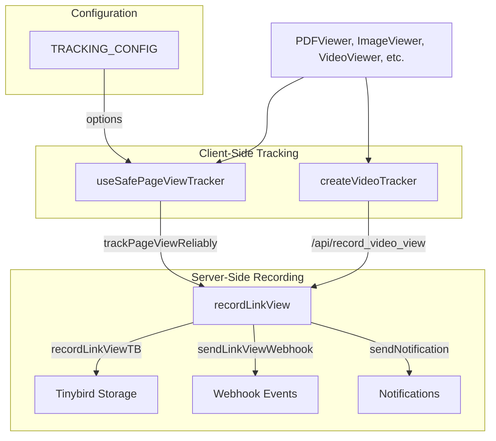
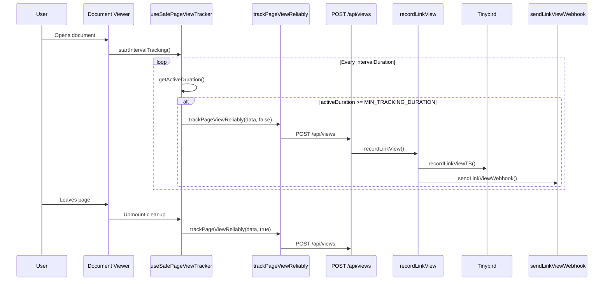
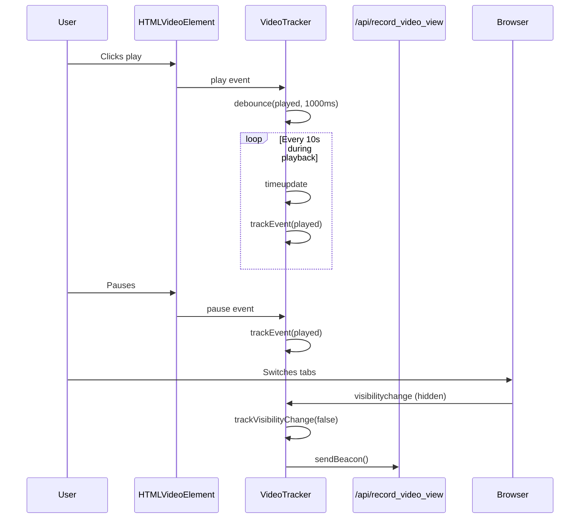

# lib — tracking

# Tracking Module

The `lib/tracking` module provides comprehensive analytics tracking for document views, page interactions, and video playback events. It captures user engagement data including geographic location, device information, referrer sources, and temporal metrics like view duration.

## Architecture Overview



## Key Components

### `record-link-view.ts`

Server-side function that processes and records link/document view events. This is the central recording endpoint invoked from API routes.

**Primary Responsibilities:**

1. **Bot Detection** — Filters out automated traffic using `isBot()` to prevent false analytics
2. **Geolocation** — Extracts geographic data (continent, country, region, city) from Vercel edge headers or defaults for localhost
3. **GDPR Compliance** — Excludes IP addresses from EU country visitors to comply with data privacy regulations
4. **Data Recording** — Sends click/view data to three destinations in parallel:
   - Tinybird for analytics storage
   - Email notification system (if enabled)
   - Webhook events (if not paused)

**Input Parameters:**

```typescript
{
  req: NextRequest;           // Incoming request for UA/geolocation
  clickId: string;            // Unique click identifier
  viewId: string;             // Unique view identifier
  linkId: string;             // Associated link
  teamId: string;             // Team context for webhooks
  documentId?: string;        // Optional document reference
  dataroomId?: string;        // Optional dataroom context
  enableNotification: boolean | null;
  isPaused: boolean;          // Webhook pause state
}
```

**Return Value:** Returns the `clickData` object containing all captured metrics, or `null` if the visitor was identified as a bot.

---

### `safe-page-view-tracker.ts`

React hook that provides reliable client-side page view tracking with sophisticated timing and activity detection. Used by document viewers to measure actual engagement time.

**Tracking Strategies:**

1. **Interval Tracking** — Sends periodic tracking events at configurable intervals (default: 10 seconds) to capture continuous engagement
2. **Activity Detection** — Monitors user interactions (mouse, keyboard, scroll, touch) to distinguish active reading from idle tab-switching
3. **Inactivity Accumulation** — Tracks active time separately, only counting periods when the user is genuinely engaged
4. **Beacon Fallback** — Uses `navigator.sendBeacon` during page unload for reliable delivery

**Hook Interface:**

```typescript
interface TrackingOptions {
  intervalTracking?: boolean;           // Enable periodic tracking (default: true)
  intervalDuration?: number;           // Interval in ms (default: 10000)
  activityTracking?: boolean;           // Track active vs inactive time (default: true)
  inactivityThreshold?: number;        // Inactivity timeout in ms (default: 60000)
  enableActivityDetection?: boolean;   // Listen for user events (default: true)
  externalStartTimeRef?: React.MutableRefObject<number>; // External timing control
}
```

**Returned Methods:**

| Method | Purpose |
|--------|---------|
| `trackPageViewSafely(data, useBeacon)` | Records a page view event with optional beacon delivery |
| `startIntervalTracking(data)` | Begins periodic tracking for the current view |
| `stopIntervalTracking()` | Halts periodic tracking and clears timers |
| `resetTrackingState()` | Resets all tracking counters and timers |
| `getActiveDuration()` | Returns accumulated active time in milliseconds |
| `updateActivity()` | Manually triggers activity detection |
| `isInactive` | Boolean state indicating user inactivity |

**Activity Detection Events:**
The hook listens for `mousedown`, `mousemove`, `keydown`, `keyup`, `scroll`, `touchstart`, and `click` to determine active engagement.

---

### `video-tracking.ts`

Class-based tracker for video playback analytics with debounced event handling.

**Tracked Video Events:**

| Event Type | Trigger | Debounce |
|------------|---------|----------|
| `loaded` | Video metadata loaded | Immediate (1s) |
| `played` | Playback started/resumed | 1s |
| `seeked` | User skipped ahead/back | 500ms |
| `rate_changed` | Playback speed changed | 500ms |
| `volume_up/down` | Volume adjustments | 500ms |
| `muted/unmuted` | Mute toggle | Immediate (500ms) |
| `focus/blur` | Tab visibility changes | Immediate (500ms) |
| `enterfullscreen/exitfullscreen` | Fullscreen toggle | Immediate (500ms) |

**Delivery Strategy:**

1. Primary: `navigator.sendBeacon` with blob payload for maximum reliability
2. Fallback: `fetch` with `keepalive: true` for unload scenarios
3. Tertiary: Retry with sendBeacon if fetch fails

**Class Methods:**

| Method | Purpose |
|--------|---------|
| `updateConfig(config)` | Update tracking configuration mid-playback |
| `trackVisibilityChange(isVisible)` | Handle tab visibility changes |
| `cleanup()` | Remove listeners and send final events |

**Usage Pattern:**

```typescript
const tracker = createVideoTracker(videoElement, {
  linkId: string,
  documentId: string,
  viewId?: string,
  dataroomId?: string,
  versionNumber: number,
  playbackRate: number,
  volume: number,
  isMuted: boolean,
  isFocused: boolean,
  isFullscreen: boolean,
  isPreview?: boolean,
});
```

---

### `tracking-config.ts`

Centralized configuration constants for tracking behavior across all components.

**Configuration Values:**

```typescript
TRACKING_CONFIG = {
  INTERVAL_TRACKING_ENABLED: true,
  INTERVAL_DURATION: 10000,           // 10 seconds
  ACTIVITY_TRACKING_ENABLED: true,
  INACTIVITY_THRESHOLD: 5 * 60000,   // 5 minutes
  ACTIVITY_DETECTION_ENABLED: true,
  MIN_TRACKING_DURATION: 1000,        // 1 second
}
```

**Helper Function:**

```typescript
getTrackingOptions(overrides)
```

Merges user-provided overrides with defaults, allowing per-component configuration without duplicating constants.

---

## Data Flow

### Page View Tracking Flow



### Video Tracking Flow



---

## GDPR and Privacy Considerations

The tracking module implements several privacy safeguards:

1. **EU IP Exclusion** — IP addresses are only recorded for non-EU country visitors. EU visitors have `ip_address: null` in all records.

2. **Bot Filtering** — Automated traffic from crawlers and bots is detected via `isBot()` and excluded from all tracking.

3. **Preview Mode** — When `isPreview: true` is set, video tracking skips recording to avoid capturing preview/impression data.

4. **Data Minimization** — Only essential engagement metrics are collected; no personal information beyond device/browser fingerprinting.

---

## Usage in Viewers

The tracking module is consumed by multiple viewer components:

| Viewer Component | Tracking Features |
|------------------|-------------------|
| `PDFViewer` | Page view tracking with activity detection |
| `ImageViewer` | Interval tracking, viewed pages state |
| `VideoViewer` | Video-specific event tracking |
| `ExcelViewer` | Page duration accumulation |
| `NotionPage` | Full activity tracking configuration |
| `LinkPreview` | Basic interval tracking |

Example integration pattern:

```typescript
function DocumentViewer({ linkId, documentId }) {
  const { 
    trackPageViewSafely, 
    startIntervalTracking, 
    stopIntervalTracking 
  } = useSafePageViewTracker(getTrackingOptions());

  useEffect(() => {
    startIntervalTracking({ 
      linkId, 
      documentId,
      pageNumber: 1,
      versionNumber: 1 
    });

    return () => stopIntervalTracking();
  }, [linkId]);

  // On page change:
  const handlePageChange = (pageNumber) => {
    trackPageViewSafely({
      linkId, documentId, pageNumber, duration: activeDuration
    });
  };
}
```

---

## Dependencies

**External:**
- `next/server` — Request/response handling
- `@vercel/functions` — Edge geolocation functions

**Internal:**
- `lib/tinybird` — Analytics data storage
- `lib/api/notification-helper` — Email notifications
- `lib/api/views/send-webhook-event` — Webhook delivery
- `lib/utils/user-agent` — Bot detection
- `lib/utils/reliable-tracking` — Beacon-based delivery
- `lib/constants` — EU country codes, video event types