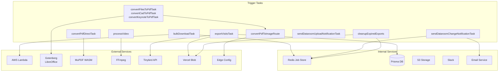
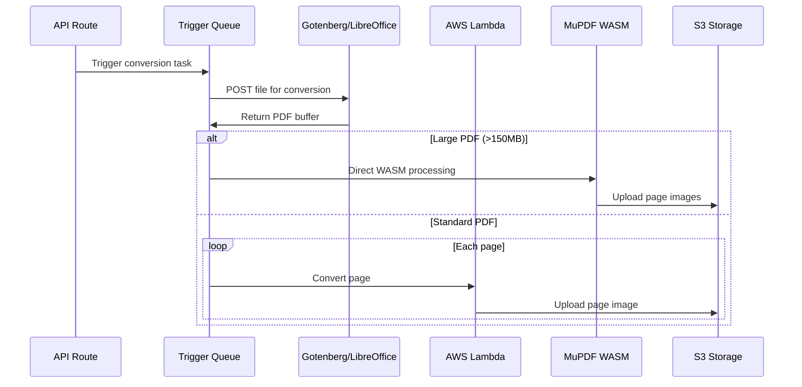
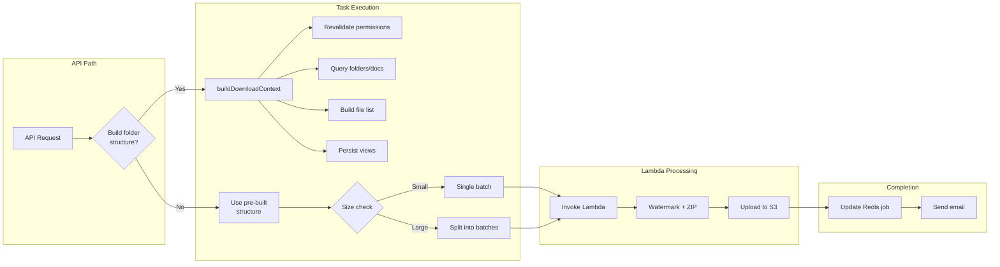
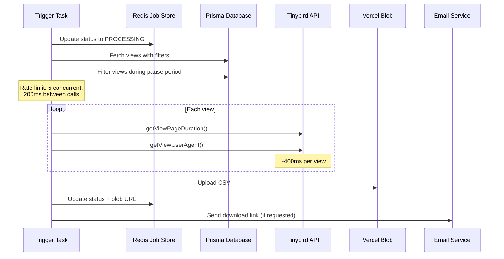

# lib — trigger

# lib/trigger Module

Central hub for all Trigger.dev background tasks. These tasks handle long-running, asynchronous, and scheduled operations that would exceed API request timeouts or require reliable background processing.

## Overview

The module provides a unified interface for Trigger.dev tasks across the application, from document conversion and bulk downloads to notifications and scheduled cleanup jobs. Each task is designed for specific operational concerns: document processing, dataroom management, exports, and notifications.

## Architecture



## Key Tasks

### Document Conversion Pipeline

Three-stage pipeline for converting various file formats to PDF, then processing into page images.

| Task | File | Purpose |
|------|------|---------|
| `convertFilesToPdfTask` | `convert-files.ts` | DOCX/Office → PDF via Gotenberg/LibreOffice |
| `convertCadToPdfTask` | `convert-files.ts` | CAD files (DWG, DXF) → PDF |
| `convertKeynoteToPdfTask` | `convert-files.ts` | Keynote/iWork → PDF |
| `convertPdfToImageRoute` | `pdf-to-image-route.ts` | Routes PDFs to appropriate conversion path |
| `convertPdfDirectTask` | `convert-pdf-direct.ts` | Large PDF → images via MuPDF WASM |

#### Conversion Flow



#### DOCX Sanitization Path

When Gotenberg conversion fails for DOCX files, `convertFilesToPdfTask` attempts sanitization via a Python script (`docx-sanitizer.py`) before retrying:

```typescript
// From convert-files.ts
const result = await python.runScript(
  "./ee/features/conversions/python/docx-sanitizer.py",
  ["-v", "--mode", "all", inputPath, outputPath],
);
// Then retry Gotenberg conversion on sanitized output
```

### Bulk Download (`bulkDownloadTask`)

Handles large dataroom document downloads with automatic batching and Lambda invocation.



#### Batching Strategy

The task uses a size-aware batching algorithm (`splitFilesIntoBatches`):

```typescript
// Size limits
const MAX_FILES_PER_BATCH = 500;
const MAX_ZIP_SIZE_BYTES = 500 * 1024 * 1024; // 500MB
const UNKNOWN_FILE_SIZE_ESTIMATE = 10 * 1024 * 1024; // 10MB fallback
```

**Batching rules:**
- If >50% of files have known sizes → size-based batching
- Otherwise → count-based batching (500 files per batch)
- Each batch becomes a separate ZIP with part numbers

#### Permission Revalidation

Before processing, `revalidateDownloadContext` checks the **live** database state to handle the time-of-check/time-of-use gap:

- Link archived/deleted status
- Link expiration
- Download permission settings
- Bulk download allowance

```typescript
// Throws DownloadNotPermittedError for invalid states
if (link.isArchived) throw NOT_PERMITTED;
if (link.expiresAt && link.expiresAt < new Date()) throw NOT_PERMITTED;
if (type === "bulk" && !link.dataroom.allowBulkDownload) throw NOT_PERMITTED;
```

### Export Visits (`exportVisitsTask`)

Exports document or dataroom visit analytics to CSV, with rate-limited Tinybird API calls.

#### Processing Flow



#### Rate Limiting

Uses Bottleneck to respect Tinybird API limits:

```typescript
const tinybirdLimiter = new Bottleneck({
  maxConcurrent: 5,
  minTime: 200, // ms between requests
});
```

### Dataroom Notifications

#### `sendDataroomChangeNotificationTask`

Notifies verified viewers when documents are added/updated in a dataroom.

**Notification routing:**
1. Check viewer's notification preferences (instant/daily/weekly)
2. Verify folder access via cached permission checks
3. For instant → direct HTTP call to notification endpoint
4. For digest → queue via Redis for batched delivery

```typescript
// Caches folder access checks to reduce DB queries
const folderAccessCache = new Map<string, boolean>();
const canViewFolder = async (groupId, permissionGroupId, folderId) => {
  const cacheKey = `viewer-group:${groupId}:${folderId}`;
  if (folderAccessCache.has(cacheKey)) return folderAccessCache.get(cacheKey);
  // ... query and cache result
};
```

#### `sendDataroomUploadNotificationTask`

Batches uploads within a 10-minute window and notifies team members:

```typescript
const tenMinutesAgo = new Date(Date.now() - 10 * 60 * 1000);
const recentUploads = await prisma.documentUpload.findMany({
  where: {
    uploadedAt: { gte: tenMinutesAgo },
  },
});
```

### Video Optimization (`processVideo`)

Processes uploaded videos using FFmpeg for web-optimized H.264 encoding.

**Capabilities:**
- Scale videos larger than 1080p down to 1920px width
- Keyframe interval: 2 seconds
- Output: H.264/AAC MP4 with faststart for web streaming
- Skips optimization for files >500MB

```typescript
// Encoding parameters
const bitrate = "6000k";
const maxBitrate = parseInt(bitrate.replace("k", "")) * 2;
const keyframeInterval = Math.round(metadata.fps * 2);
```

### Scheduled Tasks

#### `cleanupExpiredExports`

Runs daily at 02:00 UTC to remove expired export blobs:

```typescript
export const cleanupExpiredExports = schedules.task({
  id: "cleanup-expired-exports",
  cron: "0 2 * * *",
  // Fetches blobs due for cleanup from Redis
  // Deletes from Vercel Blob
  // Removes from cleanup queue
});
```

## Common Patterns

### Progress Tracking

Tasks report progress via `metadata` for the Trigger.dev UI:

```typescript
function setProgress(status: { progress: number; text: string }) {
  metadata.set("status", status);
  try {
    metadata.parent.set("status", status); // For nested tasks
  } catch {
    // no parent task
  }
}
```

### Error Handling

- **Retryable errors**: Tasks throw to trigger retry (up to configured max attempts)
- **AbortTaskRunError**: Used for permanent failures that shouldn't retry (e.g., document blocked)
- **Validation failures**: Clean user-facing messages stored in job status

```typescript
// Example: Download permission failure
class DownloadNotPermittedError extends Error {
  constructor(public readonly userMessage: string) {
    super(userMessage);
    this.name = "DownloadNotPermittedError";
  }
}
```

### Job Status Updates

Long-running tasks update Redis to allow polling:

```typescript
await downloadJobStore.updateJob(jobId, {
  status: "PROCESSING",
  phase: "ZIPPING",
  processedFiles: 0,
  progress: 0,
  totalFiles: fileKeys.length,
});
```

## External Dependencies

| Service | Tasks Using It | Purpose |
|---------|---------------|---------|
| **Trigger.dev SDK** | All | Task execution, retries, queues, scheduling |
| **AWS Lambda** | `bulkDownloadTask` | ZIP processing with watermarks |
| **Gotenberg** | `convertFilesToPdfTask` | Office document → PDF |
| **MuPDF WASM** | `convertPdfDirectTask` | Large PDF → images |
| **FFmpeg** | `processVideo` | Video encoding |
| **Tinybird** | `exportVisitsTask` | Analytics data |
| **Vercel Blob** | `exportVisitsTask`, `cleanupExpiredExports` | CSV storage, cleanup |
| **Edge Config** | `convertPdfDirectTask`, `pdf-to-image-route` | Trusted team flags, blocked keywords |

## Configuration

Tasks use machine presets appropriate to their workload:

| Preset | Memory | Use Case |
|--------|--------|----------|
| `small-1x` | 512MB | Simple tasks, small data |
| `medium-1x` | 1GB | Video processing |
| `large-1x` | 2GB | MuPDF PDF conversion |

Retry configuration varies by task:
- **Bulk download**: 2 attempts
- **File conversion**: 3 attempts
- **Export visits**: 2 attempts
- **Notifications**: 3 attempts