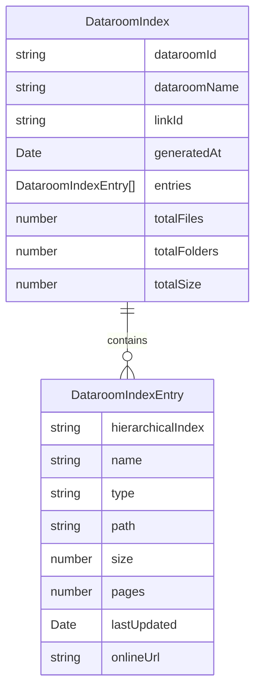

# lib — types

# lib/types Module

Type definitions for document management and dataroom indexing features.

## Overview

This module exports TypeScript interfaces for two distinct but related domains:

- **Document previews** — metadata and page information for rendered documents
- **Dataroom indexes** — structured directory listings of files and folders within a dataroom

These types are consumed throughout the application wherever document or dataroom data is processed, stored, or transmitted.

---

## Document Preview Types

### `DocumentPreviewData`

Represents the complete preview state for a document, including metadata, page details, and optional Excel-specific data.

```typescript
export interface DocumentPreviewData {
  documentId: string;
  documentName: string;
  documentType: string;
  fileType: string;
  isVertical: boolean;
  numPages: number;
  advancedExcelEnabled?: boolean;
  pages?: {
    file: string | null;
    pageNumber: string;
    embeddedLinks: string[];
    pageLinks: {
      href: string;
      coords: string;
      isInternal?: boolean;
      targetPage?: number;
    }[];
    metadata: { width: number; height: number; scaleFactor: number };
  }[];
  file?: string;
  sheetData?: any;
}
```

| Property | Type | Description |
|----------|------|-------------|
| `documentId` | `string` | Unique identifier for the document |
| `documentName` | `string` | Display name of the document |
| `documentType` | `string` | Classification type (e.g., "pdf", "spreadsheet") |
| `fileType` | `string` | MIME type or file extension category |
| `isVertical` | `boolean` | Page orientation flag |
| `numPages` | `number` | Total page count |
| `advancedExcelEnabled` | `boolean?` | Whether advanced Excel rendering is active |
| `pages` | `Page[]?` | Array of page data when multi-page rendering is used |
| `file` | `string?` | Base file reference (single-page documents) |
| `sheetData` | `any?` | Excel sheet information when applicable |

#### Page Structure

Each page in the `pages` array contains:

- **`file`**: Path or URL to the rendered page image. Can be `null` for placeholder pages.
- **`pageNumber`**: Page identifier as a string (e.g., `"1"`, `"2"`)
- **`embeddedLinks`**: Raw link URLs found within the page content
- **`pageLinks`**: Parsed link objects with positioning information

#### Page Link Structure

Links extracted from pages include both external URLs and internal document navigation:

```typescript
pageLinks: {
  href: string;       // Destination URL
  coords: string;     // Bounding box coordinates (e.g., "x,y,w,h")
  isInternal?: boolean;      // Whether link targets internal content
  targetPage?: number;       // For internal links, the target page number
}
```

---

## Dataroom Index Types

Dataroom indexes provide a structured view of files and folders within a virtual data room, enabling navigation, search, and export functionality.

### `DataroomIndexEntry`

Represents a single item (file or folder) within the index.

```typescript
export interface DataroomIndexEntry {
  hierarchicalIndex: string | null | undefined;
  name: string;
  type: "File" | "Folder" | "Root Folder";
  path: string;
  size?: number;
  pages?: number;
  lastUpdated: Date;
  onlineUrl?: string;
  mimeType?: string;
  createdAt?: Date;
  version?: number;
}
```

| Property | Type | Description |
|----------|------|-------------|
| `hierarchicalIndex` | `string?` | Breadcrumb or hierarchical path string for display |
| `name` | `string` | Entry display name |
| `type` | `"File" \| "Folder" \| "Root Folder"` | Item classification |
| `path` | `string` | Full filesystem-style path |
| `size` | `number?` | File size in bytes (undefined for folders) |
| `pages` | `number?` | Page count for multi-page documents |
| `lastUpdated` | `Date` | Most recent modification timestamp |
| `onlineUrl` | `string?` | CDN or storage URL for online access |
| `mimeType` | `string?` | MIME type for files |
| `createdAt` | `Date?` | Creation timestamp |
| `version` | `number?` | Document version number |

### `DataroomIndex`

The complete index for a dataroom, containing metadata and all entries.

```typescript
export interface DataroomIndex {
  dataroomId: string;
  dataroomName: string;
  linkId: string;
  generatedAt: Date;
  entries: DataroomIndexEntry[];
  totalFiles: number;
  totalFolders: number;
  totalSize: number;
}
```

| Property | Type | Description |
|----------|------|-------------|
| `dataroomId` | `string` | Unique identifier for the dataroom |
| `dataroomName` | `string` | Display name of the dataroom |
| `linkId` | `string` | Sharing or access link identifier |
| `generatedAt` | `Date` | When the index was generated |
| `entries` | `DataroomIndexEntry[]` | All files and folders in the dataroom |
| `totalFiles` | `number` | Count of files only |
| `totalFolders` | `number` | Count of folders only |
| `totalSize` | `number` | Sum of all file sizes in bytes |

### `IndexFileFormat`

Supported export formats for dataroom indexes:

```typescript
export type IndexFileFormat = "excel" | "csv" | "json";
```

---

## Relationship Diagram



---

## Usage Notes

### Type Safety

These interfaces provide compile-time type safety for:

- API request/response payloads
- Database entity shapes
- Component props for document viewers
- Export generators for different file formats

### Extensibility

Both `DocumentPreviewData` and `DataroomIndexEntry` use optional properties (`?`) to accommodate variations across document types and export configurations. Always check for the presence of optional fields before accessing them.

### Common Patterns

**Working with index entries:**

```typescript
const files = index.entries.filter(e => e.type === "File");
const folders = index.entries.filter(e => e.type === "Folder");
const totalDocumentSize = files.reduce((sum, f) => sum + (f.size ?? 0), 0);
```

**Iterating document pages:**

```typescript
if (preview.pages) {
  for (const page of preview.pages) {
    // page.pageNumber, page.pageLinks, page.metadata
  }
}
```