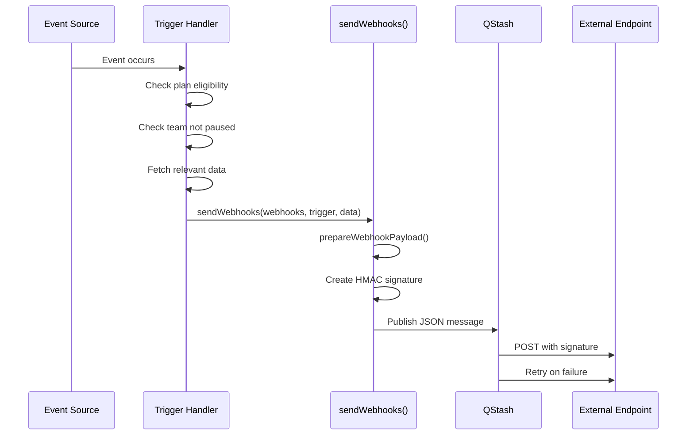

# lib — webhook

# Webhook Module (`lib/webhook`)

The webhook module handles reliable delivery of event notifications to external systems. When actions occur in Papermark (documents created, links generated, etc.), registered webhooks receive POST requests with event payloads signed using HMAC-SHA256.

## Architecture Overview



## Trigger Events

The module supports the following webhook events, organized by scope:

| Event | Scope | Description |
|-------|-------|-------------|
| `document.created` | Team | A document is created |
| `document.updated` | Team | A document is modified |
| `document.deleted` | Team | A document is removed |
| `dataroom.created` | Team | A data room is created |
| `link.created` | Document | A link is generated |
| `link.updated` | Document | A link is modified |
| `link.viewed` | Link | A link receives a view |
| `link.downloaded` | Link | A link triggers a download |

## Core Components

### Payload Preparation (`transform.ts`)

`prepareWebhookPayload()` normalizes event data into a consistent schema before delivery:

```typescript
const payload = prepareWebhookPayload(trigger, data);
```

The payload includes:
- `id` — Unique event identifier with `webhookEvent` prefix
- `event` — The trigger type (e.g., `link.created`)
- `data` — Event-specific payload data
- `createdAt` — ISO timestamp of event creation

### Signature Generation (`signature.ts`)

`createWebhookSignature()` generates an HMAC-SHA256 signature that receivers use to verify payload authenticity:

```typescript
const signature = await createWebhookSignature(webhook.secret, payload);
```

The signature is:
1. Computed over the JSON-stringified payload body
2. Hex-encoded from the raw HMAC output
3. Sent in the `X-Papermark-Signature` header

Receivers should recompute the HMAC using their configured secret and compare it against the received signature.

### Webhook Delivery (`send-webhooks.ts`)

The `sendWebhooks()` function orchestrates delivery to multiple endpoints:

```typescript
const results = await sendWebhooks({
  webhooks,
  trigger: "link.created",
  data: webhookData,
});
```

**Delivery flow:**
1. Validates the payload against the schema
2. Maps each webhook to a QStash publish call
3. Uses `Promise.allSettled` so one failure doesn't block others
4. Returns only fulfilled results; logs errors for rejections

**QStash integration:**
- Messages are published with the target URL, signed body, and headers
- `Upstash-Hide-Headers: true` prevents internal headers from reaching receivers
- Both `callback` and `failureCallback` point to `/api/webhooks/callback` for delivery confirmation

**URL redaction:**
`redactUrl()` strips query strings and path segments from logged URLs, preventing accidental exposure of credentials embedded in webhook endpoints:

```typescript
// "https://api.example.com/hook?token=secret" → "https://api.example.com/"
```

### Trigger Handlers (`triggers/`)

Each trigger handler follows a consistent pattern:

1. **Extract required IDs** from input data
2. **Check plan eligibility** — Only enterprise-tier teams receive webhooks
3. **Check team status** — Paused teams are skipped
4. **Query registered webhooks** — Find endpoints subscribed to this trigger
5. **Fetch event data** — Retrieve the relevant document/link/dataroom
6. **Dispatch** via `sendWebhooks()`

**Example: Link created webhook (`triggers/link-created.ts`)**

```typescript
export async function sendLinkCreatedWebhook({ teamId, data }) {
  // 1. Validate required IDs
  const { link_id, document_id, dataroom_id } = data;
  
  // 2. Check team plan (must be enterprise, not free/pro)
  const team = await prisma.team.findUnique({ where: { id: teamId }, select: { plan: true } });
  if (team?.plan === "free" || team?.plan === "pro") return;
  
  // 3. Check team not paused
  if (await isTeamPausedById(teamId)) return;
  
  // 4. Find subscribed webhooks
  const webhooks = await prisma.webhook.findMany({
    where: { teamId, triggers: { array_contains: ["link.created"] } },
    select: { pId: true, url: true, secret: true },
  });
  if (webhooks.length === 0) return;
  
  // 5. Fetch link with optional document/dataroom
  const link = await prisma.link.findUnique({ where: { id: linkId } });
  
  // 6. Send to all matching webhooks
  await sendWebhooks({ webhooks, trigger: "link.created", data: webhookData });
}
```

## Integration Points

### Incoming Triggers

The following API routes and service handlers invoke webhook functions:

| Source | Trigger Function | Event |
|--------|-----------------|-------|
| `services/[...path]/index.ts` | `handleDataroomCreate()` | `sendLinkCreatedWebhook()` |
| `services/[...path]/index.ts` | `handleLinkCreate()` | `sendLinkCreatedWebhook()` |
| `api/documents/process-document.ts` | `processDocument()` | `sendLinkCreatedWebhook()`, `sendDocumentCreatedWebhook()` |
| `api/links/index.ts` | `handler()` | `sendLinkCreatedWebhook()` |
| `api/links/[id]/duplicate.ts` | `handle()` | `sendLinkCreatedWebhook()` |
| `api/links/bulk-import.ts` | `handleBulkLinkImport()` | `sendLinkCreatedWebhook()` |
| `api/views/send-webhook-event.ts` | `sendLinkViewWebhook()` | `sendWebhooks()` directly |
| `api/documents/process-document.ts` | `processDocument()` | `sendDocumentCreatedWebhook()` |

### Internal Dependencies

| Dependency | Usage |
|------------|-------|
| `@/lib/cron` (QStash) | HTTP message publishing |
| `@/ee/features/billing/cancellation/lib/is-team-paused` | Pause status check |
| `@/lib/prisma` | Webhook and entity queries |
| `@/lib/id-helper` | Event ID generation |
| `@/lib/zod/schemas/webhooks` | Payload validation schemas |
| `@/lib/utils` (log) | Error logging |

## Security Considerations

### Signature Verification

Receivers should verify the `X-Papermark-Signature` header to ensure:
- The payload originated from Papermark
- It wasn't tampered with in transit

```typescript
// Receiver-side verification (pseudocode)
const expectedSig = hmacSha256(secret, JSON.stringify(body));
if (expectedSig !== receivedSignature) {
  return reject("Invalid signature");
}
```

### Credential Protection

- Webhook URLs containing tokens, API keys, or basic auth credentials are redacted in server logs
- Secrets are never included in the payload body — only used for signature generation
- URLs are sanitized to protocol and host before logging

## Error Handling

The module handles failures gracefully at multiple levels:

1. **Empty webhook list** — Returns early without attempting delivery
2. **QStash publish failure** — Logs the error and re-throws for caller awareness
3. **Individual webhook failure** — `Promise.allSettled` ensures one broken endpoint doesn't affect others
4. **Plan/pause checks** — Silently returns without error when conditions aren't met
5. **Database errors** — Caught and logged, returning gracefully to prevent transaction rollback issues

## Types (`types.ts`)

```typescript
type WebhookTrigger = keyof typeof WEBHOOK_TRIGGER_DESCRIPTIONS;
// Values: "link.created" | "link.updated" | "link.deleted" | ...

type WebhookPayload = z.infer<typeof webhookPayloadSchema>;

type EventDataProps = WebhookPayload["data"];
```

The `WebhookPayload` type is a union of the base payload schema and specific event schemas (`linkCreatedWebhookSchema`, `documentCreatedWebhookSchema`, `dataroomCreatedWebhookSchema`).