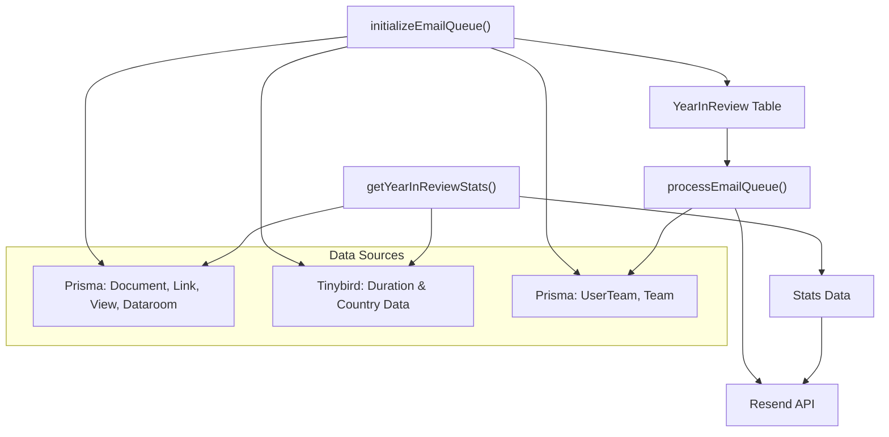
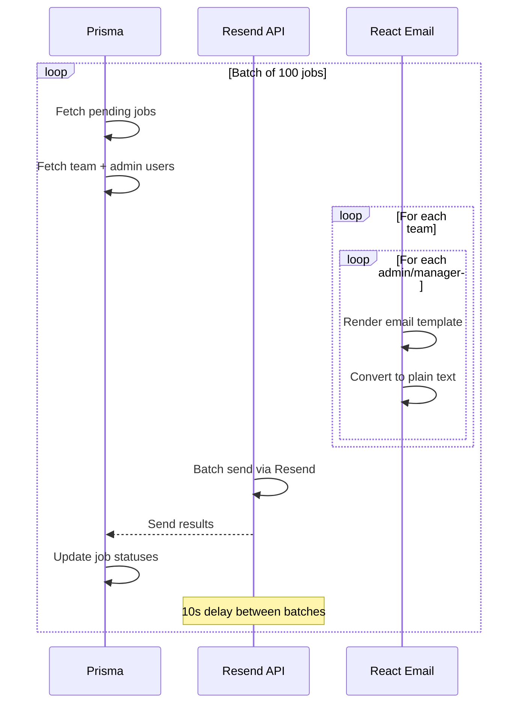

# lib — year-in-review

# Year-in-Review Module

The `lib/year-in-review` module handles the computation, storage, and delivery of Papermark's annual year-in-review statistics emails. It aggregates team activity data—documents, links, views, datarooms, and geographic reach—then sends personalized recap emails to team admins and managers.

## Architecture Overview



## Core Components

### `get-stats.ts` — Statistics Computation

This file computes comprehensive year-in-review statistics for a team. It runs multiple Prisma queries in parallel and aggregates data from Tinybird for duration metrics.

**`getYearInReviewStats(teamId, year?, userGeo?)`**

| Parameter | Type | Description |
|-----------|------|-------------|
| `teamId` | `string` | The team identifier |
| `year` | `number` (optional) | Year to query (defaults to current year) |
| `userGeo` | `{ latitude?, longitude? }` (optional) | User's geolocation from IP |

**Returns:**

```typescript
{
  year: number;
  totalDocuments: number;
  totalLinks: number;
  totalViews: number;
  totalDatarooms: number;
  mostViewedDocument: {
    documentId: string;
    documentName: string;
    viewCount: number;
  } | null;
  mostActiveMonth: {
    month: string;        // e.g., "March"
    viewCount: number;
  } | null;
  mostActiveViewer: {
    email: string;
    name: string | null;
    viewCount: number;
  } | null;
  totalDuration: number;  // milliseconds
  uniqueCountries: string[];
  distanceTraveled: number;  // kilometers
}
```

**Key implementation details:**

- **Parallel queries**: All major database queries run concurrently via `Promise.all` for performance
- **Excludes team members**: The "most active viewer" excludes emails belonging to the team itself
- **Batch processing**: Document IDs are chunked into batches of 100 to respect Tinybird URL length limits
- **Geographic fallback**: When `userGeo` is unavailable, defaults to San Francisco (37.77, -122.42)

### `calculate-percentile.ts` — Percentile Ranking

Determines where a team ranks compared to all other Papermark teams by view count.

**`calculateViewPercentile(teamTotalViews)`**

Uses raw SQL via `$queryRaw` with a CTE to compute percentiles without pulling all data into application memory:

1. Extracts `totalViews` from all `YearInReview` records
2. Finds the team's position in the sorted list
3. Maps to predefined percentile brackets: 1%, 3%, 5%, 10%, 25%, 50%, 100%

**Brackets:**

| Percentile Bracket | Threshold |
|--------------------|-----------|
| Top 1% | ≤ 1st percentile |
| Top 3% | ≤ 3rd percentile |
| Top 5% | ≤ 5th percentile |
| Top 10% | ≤ 10th percentile |
| Top 25% | ≤ 25th percentile |
| Top 50% | ≤ 50th percentile |
| Top 100% | Below 50th |

### `index.ts` — Email Queue Initialization

`initializeEmailQueue()` precomputes and stores stats for all teams. This separates computation from email delivery, allowing the email sender to run independently.

**Process:**
1. Fetches teams in batches of 100
2. For each team, calls `getYearInReviewStats()` to compute stats
3. Skips teams with zero views (no meaningful stats to report)
4. Bulk inserts into the `YearInReview` Prisma model with status `"pending"`

This function is designed to run once during initial setup (e.g., via a cron job or migration script).

### `send-emails.ts` — Email Delivery

`processEmailQueue()` reads pending jobs from the database and dispatches emails via Resend's batch API.

**Processing flow:**



**Key behaviors:**

- **Retry logic**: Jobs retry up to 3 times (`MAX_ATTEMPTS = 3`)
- **Rate limiting**: 10-second delay between batches to respect API limits
- **Status transitions**: `"pending"` → `"completed"` or `"failed"`
- **Unsubscribe handling**: Each email includes a unique unsubscribe URL

**`msToMinutes(ms)`**

Simple utility that converts milliseconds to minutes for display in emails:
```typescript
Math.ceil(ms / 60000)
```

## Geographic Calculations

The module calculates "distance traveled" based on the geographic spread of viewers:

### `calculateDistance(lat1, lng1, lat2, lng2)`

Implements the **Haversine formula** to compute the great-circle distance between two points on Earth:

```typescript
const R = 6371; // Earth's radius in kilometers
const dLat = ((lat2 - lat1) * Math.PI) / 180;
const dLng = ((lng2 - lng1) * Math.PI) / 180;
const a = Math.sin(dLat / 2) * Math.sin(dLat / 2) +
          Math.cos(lat1 * π/180) * Math.cos(lat2 * π/180) *
          Math.sin(dLng / 2) * Math.sin(dLng / 2);
const c = 2 * Math.atan2(Math.sqrt(a), Math.sqrt(1 - a));
return R * c;
```

### `calculateTotalDistance(countryCodes, origin)`

Sums the distances from the origin point (user's IP location) to each unique country's centroid:

1. Maps country codes (e.g., `"US"`) to coordinates using `COUNTRY_CENTROIDS`
2. Calculates Haversine distance for each
3. Returns the total in kilometers

## External Dependencies

| Dependency | Purpose |
|------------|---------|
| `@prisma/client` | Database queries (Prisma) |
| `@/lib/tinybird/pipes` | `getTotalTeamDuration()` for duration/country aggregation |
| `@/lib/resend` | Email delivery via Resend API |
| `@/lib/utils` | Logging via `log()` |
| `@/lib/utils/unsubscribe` | `generateUnsubscribeUrl()` |
| `@/components/emails/year-in-review-papermark` | React Email template |
| `react-email` | `render()`, `toPlainText()` for email generation |
| `nanoid` | Unique email tracking IDs |

## Database Schema

The module relies on the `YearInReview` Prisma model:

```prisma
model YearInReview {
  id        String   @id @default(cuid())
  teamId    String
  status    String   // "pending", "completed", "failed"
  stats     Json     // Precomputed stats object
  attempts  Int      @default(0)
  error     String?
  createdAt DateTime @default(now())
}
```

## Usage Patterns

### Real-time Stats (for API routes)

```typescript
import { getYearInReviewStats } from "@/lib/year-in-review/get-stats";

// In an API route or server component
const stats = await getYearInReviewStats(teamId, 2024, { latitude: "37.77", longitude: "-122.42" });
```

### Initialization (one-time setup)

```typescript
import { initializeEmailQueue } from "@/lib/year-in-review";

// Run during deployment or via admin script
await initializeEmailQueue();
```

### Email Processing (cron job)

```typescript
import { processEmailQueue } from "@/lib/year-in-review/send-emails";

// Called by POST /cron/year-in-review
await processEmailQueue();
```