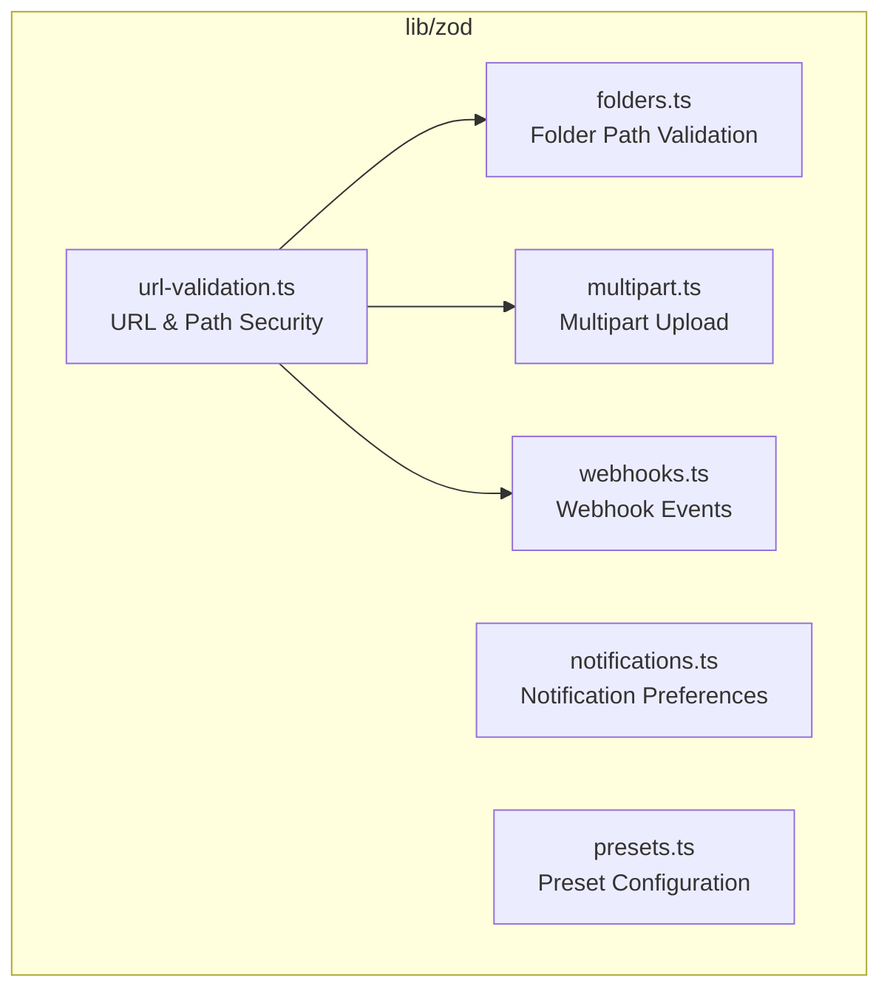
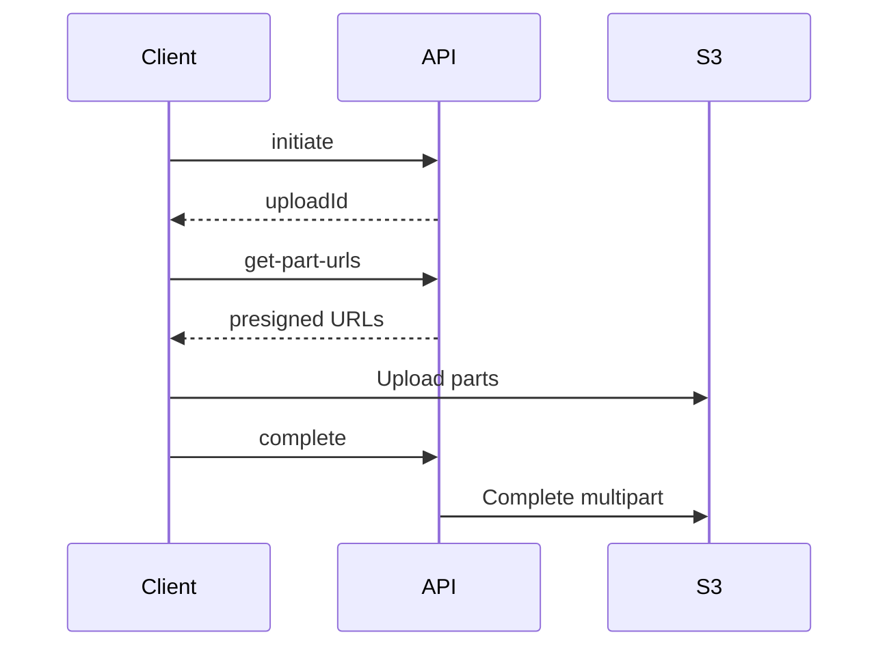

# lib — zod

# lib/zod Module Documentation

Type-safe schema validation layer for the Papermark application using [Zod](https://zod.dev). This module centralizes input validation, security checks, and type inference across multiple feature domains.

## Overview

The `lib/zod` module provides runtime validation schemas that complement TypeScript's compile-time type checking. Each schema serves as both documentation of expected data shapes and a validation gate that rejects malformed or malicious input before it reaches business logic.



## Security Architecture

The `url-validation.ts` file implements defense-in-depth validation for URLs and file paths, protecting against common attack vectors.

### Path Traversal Prevention

```typescript
validatePathSecurity(pathOrUrl: string): boolean
```

Blocks directory traversal attempts and injection attacks:

| Attack Vector | Detection Pattern |
|---------------|-------------------|
| Path traversal | `../`, `..\` |
| Null byte injection | `\0` |
| Double encoding | `%2E%2E`, `%2F%2F` |

### SSRF Protection

```typescript
validateUrlSSRFProtection(url: string): boolean
```

Prevents Server-Side Request Forgery by blocking connections to internal infrastructure:

- Private IP ranges (10.x, 172.16-31.x, 192.168.x)
- Localhost and loopback addresses
- Link-local addresses (169.254.x)
- IPv6 equivalents (::1, fc00::, fe80::)
- URLs containing credentials in the authority section

Uses `isPublicHostnameLiteral()` from `@/lib/utils/ssrf-protection` for hostname validation.

## Schema Reference

### Folders (`folders.ts`)

Validates folder path parameters in catch-all routes. Designed to prevent path traversal while ensuring clean URL structures.

```typescript
folderPathSchema // Array of non-empty strings, no traversal chars
type FolderPath = z.infer<typeof folderPathSchema>
```

**Constraints enforced:**
- Array must contain at least one element
- Each folder name must be non-empty
- No `..` sequences (path traversal)
- No forward slashes `/` in individual names
- No backslashes `\` in individual names

### Multipart Upload (`multipart.ts`)

Handles the three-phase multipart upload workflow for large file uploads.



**Actions and their schemas:**

| Action | Schema | Key Fields |
|--------|--------|------------|
| `initiate` | `MultipartInitiateSchema` | fileName, contentType, teamId, docId |
| `get-part-urls` | `MultipartGetPartUrlsSchema` | + uploadId, fileSize, partSize (≥5MB) |
| `complete` | `MultipartCompleteSchema` | + uploadId, parts[] |

**Part structure:**
```typescript
{
  ETag: string,      // Required, from S3 upload response
  PartNumber: number // Positive integer
}
```

### Notifications (`notifications.ts`)

Dual notification preference systems for different user roles.

#### Viewer Notifications (External Users)

```typescript
ViewerNotificationFrequency // "instant" | "daily" | "weekly"
ZViewerNotificationPreferencesSchema
```

Dataroom change notifications for external viewers. Defaults to `{ dataroom: {} }` with empty preferences.

#### Team Member Notifications

```typescript
TeamNotificationType // DOCUMENT_VIEW | DATAROOM_VIEW | BLOCKED_ACCESS | 
                     // DATAROOM_UPLOAD | CONVERSATION_MESSAGE | DATAROOM_TASK

TeamNotificationFrequency // "IMMEDIATE" | "NEVER"
TeamNotificationScope // "ALL" | "MINE_ONLY"
```

**Default configurations:**

| Role | CONVERSATION_MESSAGE | Default Scope |
|------|---------------------|---------------|
| Admin | IMMEDIATE | ALL |
| Member | NEVER | MINE_ONLY |

### Presets (`presets.ts`)

Configuration schemas for link and document presets.

```typescript
presetDataSchema // Full preset configuration
customFieldDataSchema // Individual custom field definition
watermarkConfigSchema // Watermark styling
```

**Preset categories:**

| Category | Fields |
|----------|--------|
| Social Meta | enableCustomMetaTag, metaFavicon, metaImage, metaTitle, metaDescription |
| Custom Fields | enableCustomFields, customFields[] |
| Watermark | enableWatermark, watermarkConfig |
| Access Control | enableAllowList, allowList[], enableDenyList, denyList[] |
| Email Protection | emailProtected, emailAuthenticated |
| Security | enablePassword, password, expiresAt, expiresIn, enableScreenshotProtection |
| Agreement | enableAgreement, agreementId |
| UI | showBanner |

**Custom field types:**
```typescript
"SHORT_TEXT" | "LONG_TEXT" | "NUMBER" | "PHONE_NUMBER" | "URL" | "CHECKBOX"
```

### Webhooks (`webhooks.ts`)

#### Creation Schema

```typescript
createWebhookSchema
{
  name: string,      // 1-40 characters
  url: string,       // Valid URL, max 190 chars
  secret: string,    // Must start with "whsec_"
  triggers: Trigger[] // From WEBHOOK_TRIGGERS constant
}

updateWebhookSchema // Partial version for PATCH operations
```

#### Event Payloads

Discriminated union of event-specific schemas using the `event` field:

| Event | Schema | Key Data |
|-------|--------|----------|
| `link.created` | `linkCreatedWebhookSchema` | link, document?, dataroom? |
| `document.created` | `documentCreatedWebhookSchema` | document |
| `dataroom.created` | `dataroomCreatedWebhookSchema` | dataroom |
| `link.viewed` | `linkViewedWebhookSchema` | view, link, document?, dataroom? |

**View event data includes:**
- Temporal: viewedAt, createdAt
- Identity: viewId, email, emailVerified
- Location: country, city
- Device: device, browser, os, ua, referer

#### Callback Schema

```typescript
webhookCallbackSchema
{
  status: number,
  url: string,
  createdAt: number,
  sourceMessageId: string,
  body: string,       // Response from webhook URL
  sourceBody: string  // Original payload
}
```

## URL Validation (`url-validation.ts`)

### Composite Security Validation

```typescript
validateUrlSecurity(url: string): boolean
```

Combines path security and SSRF protection checks. Used by:
- `linkUrlUpdateSchema`
- `notionUrlUpdateSchema`
- `webhookFileUrlSchema`
- External caller: `validateRedirectUrl` in `api/domains/validate-redirect-url.ts`

### File Path Validator

```typescript
filePathSchema // createFilePathValidator()
```

Accepts two path types:

1. **Notion URLs**: Standard domains (`notion.so`, `www.notion.so`, `*.notion.site`) or custom domains with valid page IDs
2. **S3 paths**: Pattern `teamId/doc_documentId/filename.ext`

Uses async refinement to validate custom Notion domains via `getNotionPageIdFromSlug()`.

### Document Upload Schema

```typescript
documentUploadSchema
```

Comprehensive validation for document creation with cross-field refinement:

**Type-specific URL validation:**
- `link` type: HTTPS URL validated by `validateUrlSecurity()`
- Other types: File path validated by `filePathSchema`

**Storage type consistency:**
- `S3_PATH`: Must use file paths, not URLs
- `VERCEL_BLOB`: Accepts Notion URLs or S3 paths (supports migration)

**Content type validation:**
- Ensures declared content type matches actual file type
- Special case: `text/html` allowed for `notion` type

### Notion URL Schema

```typescript
notionUrlUpdateSchema
```

Dedicated validator for Notion URL updates:
- Must be valid HTTPS URL
- Must resolve to valid Notion page (standard or custom domain)
- Subject to security validation

## Usage Patterns

### Safe Parsing

```typescript
import { folderPathSchema } from "@/lib/zod/schemas/folders";

const result = folderPathSchema.safeParse(req.params.path);

if (!result.success) {
  return res.status(400).json({ errors: result.error.issues });
}

const validatedPath: FolderPath = result.data;
```

### Transform with Validation

```typescript
import { documentUploadSchema } from "@/lib/zod/url-validation";

const result = await documentUploadSchema.spa(formData);

if (result.success) {
  // data.name is already sanitized via transform
  const { name, url, type } = result.data;
}
```

### Type Inference

```typescript
import type { MultipartUploadRequest } from "@/lib/zod/schemas/multipart";
import type { PresetDataSchema } from "@/lib/zod/schemas/presets";
import type { WebhookPayload } from "@/lib/zod/schemas/webhooks";

// Use inferred types in function signatures
function handleWebhook(payload: WebhookPayload) {
  switch (payload.event) {
    case "link.viewed":
      // TypeScript knows payload.data.view exists
      console.log(payload.data.view.email);
      break;
  }
}
```

## Dependencies

| External Import | Purpose |
|-----------------|---------|
| `zod` | Schema definition and validation |
| `notion-utils` | Notion page ID parsing |
| `@/lib/notion/utils` | Custom domain resolution |
| `@/lib/utils/ssrf-protection` | Public hostname checking |
| `@/lib/utils/sanitize-html` | Text sanitization |
| `@/lib/utils/get-content-type` | MIME type mapping |
| `@/lib/constants` | Supported file types |
| `@/lib/webhook/constants` | Webhook trigger enum |

## Deprecations

```typescript
// Legacy names still exported for backwards compatibility
NotificationFrequency // → use ViewerNotificationFrequency
```

Maintain deprecated exports only if external consumers depend on them. New code should use the renamed variants.