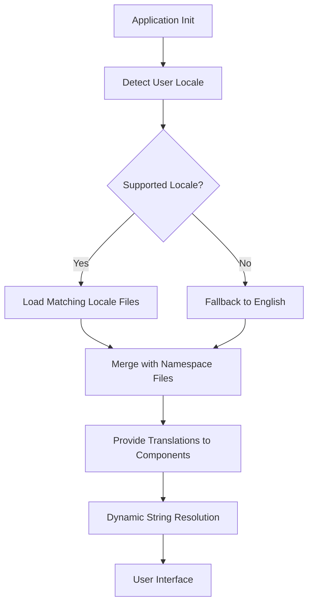

# locales

Locales Module

Internationalization (i18n) resource files for the Papermark application. This module contains all user-facing strings translated into seven languages, organized by locale and functional namespace.

## Overview

The locales module provides translated strings for the UI, organized into three namespaces corresponding to major application sections:

| Namespace | Purpose |
|-----------|---------|
| `access-form` | Identity verification and email entry forms |
| `dataroom` | Document management and download interfaces |
| `viewer` | Document viewing experience |

## Supported Locales

| Code | Language | Region |
|------|----------|--------|
| `en` | English | Default |
| `de` | German | Germany |
| `es` | Spanish | Spain |
| `fr` | French | France |
| `it` | Italian | Italy |
| `ja` | Japanese | Japan |
| `pt-BR` | Portuguese | Brazil |

## File Structure

```
locales/
├── {locale}/
│   ├── access-form.json   # Verification and access forms
│   ├── dataroom.json      # Data room interface
│   └── viewer.json        # Document viewer
```

## Namespace Reference

### `access-form`

Handles user identity verification flows including email entry, OTP verification, and reauthentication prompts.

**Key sections:**

| Section | Content |
|---------|---------|
| `welcome` | Initial prompt text with fallback messaging |
| `buttons` | Continue and verification action labels |
| `fields` | Form input labels, placeholders, and validation messages for email, password, name, URL, and phone |
| `agreement` | Terms acceptance prefixes |
| `verification` | OTP entry flow: title, description, error states, resend options |
| `footer` | Branding, security notice, privacy policy link |
| `reauth` | Re-verification prompts when accessing uploaded content |

**Variable interpolation examples:**
```json
"description": "Enter the six digit verification code sent to <email>{{email}}</email>"
"copyright": "© {{year}}{{name}}"
```

### `dataroom`

Covers the data room shell, document browsing, search, upload, and download workflows.

**Key sections:**

| Section | Content |
|---------|---------|
| `shell` | Header elements, footer branding, copyright |
| `tabs` | Navigation tabs (Documents, My Uploads) |
| `search` | Search input and result messaging |
| `breadcrumb` | Navigation breadcrumb labels |
| `empty` | Empty state messages |
| `cards` | Document/folder card labels and actions |
| `compactList` | Table column headers |
| `trailingActions` | Q&A and download action labels |
| `navToasts` | Notification messages for navigation and download events |
| `intro` | Data room introduction modal |
| `upload` | Document upload flow labels and success messages |
| `download` | Complete download workflow including folder downloads, OTP verification, progress states, and expiration messaging |
| `downloadsPage` | Standalone downloads page with email verification |
| `downloadOtp` | One-time password verification for downloads |
| `downloadsPanel` | Inline download progress panel states |
| `folderPicker` | Folder selection component |
| `indexFile` | Index file generation interface |

### `viewer`

Document viewing interface including navigation, zoom, and reporting.

**Key sections:**

| Section | Content |
|---------|---------|
| `nav` | Viewer toolbar actions and tooltips |
| `toasts` | Download preparation and result notifications |
| `downloadOnly` | Download-only document mode messaging |
| `awayPoster` | Idle detection pause overlay with ARIA labels |
| `poweredBy` | Attribution footer |
| `report` | Content reporting interface and abuse type options |

## Translation Patterns

### Variable Interpolation

Strings use `{{variableName}}` syntax for dynamic values:

```json
"title": "Welcome to {{name}}"
"filesCount": "{{processed}} / {{total}} files"
```

### ICU-Style Pluralization

Plural forms use `_one` and `_other` suffixes following CLDR conventions:

```json
"resultCount_one": "({{count}} result across all folders)",
"resultCount_other": "({{count}} results across all folders)",
"expiresDays_one": "{{count}} day",
"expiresDays_other": "{{count}} days"
```

### HTML Markup in Strings

Some strings embed HTML elements for structured rendering:

```json
"description": "Enter the six digit verification code sent to <email>{{email}}</email>"
```

### Accessibility (ARIA)

Critical UI states include ARIA labels:

```json
"awayPoster": {
  "ariaTitle": "Auto-paused session notification",
  "ariaDescription": "Your session was paused due to inactivity..."
}
```

### Fallback Values

Default values provide graceful degradation:

```json
"phone": {
  "placeholderDefault": "+1 123 456 7890"
}
```

## Adding a New Locale

To add support for a new language:

1. Create a new directory under `locales/` with the appropriate ISO code (e.g., `zh` for Chinese)
2. Copy the three JSON files from an existing locale
3. Translate all string values while preserving keys
4. Update any locale-specific formatting (phone numbers, dates)

## Adding a New Translation Key

When adding new UI strings:

1. Add the key to `locales/en/` first (the source of truth)
2. Add the same key to all other locale files with translations
3. For pluralized strings, include both `_one` and `_other` variants
4. Test with interpolation variables by running the consuming component

## Integration

This module is consumed by the application's i18n integration layer. Components reference keys using a path notation matching the JSON structure:

```typescript
// Example consumption pattern
t('dataroom.download.start')
t('viewer.awayPoster.title', { duration: '5 minutes' })
t('access-form.verification.description', { email: userEmail })
```

## Mermaid Diagram: Locale Loading Flow



## Consistency Guidelines

When modifying strings, maintain these conventions:

- **Placeholder format**: Always use `{{variableName}}`
- **Pluralization**: Always provide both `_one` and `_other` variants
- **HTML safety**: Only include pre-approved inline elements like `<email>`
- **Tone**: Keep translations professional and concise
- **Variable names**: Match across all locales for the same concept
- **ARIA**: Include both `ariaTitle` and `ariaDescription` for modal overlays