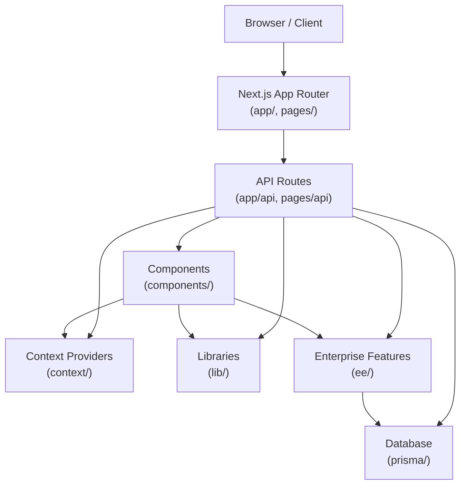

# papermark — Wiki

# Papermark

The open-source DocSend alternative. Papermark lets you send documents and track who opens them, with support for custom domains, team management, datarooms, and enterprise features like AI-powered chat and SSO.

## Architecture Overview

Papermark is a multi-tenant SaaS built on Next.js 14's App Router. The codebase follows a layered architecture where API routes handle business logic, components render UI, and shared libraries provide utilities, data fetching, and integrations.



## Key Modules

### [app](app/app.md)

The Next.js application root containing all pages, layouts, and API routes. Uses route groups to separate concerns: `app/(auth)` for authentication flows, `app/(ee)` for enterprise API routes, and `app/api` for the core REST API.

### [components](components/components.md)

The UI layer organized by feature domain: `components/ui` contains primitive components like buttons and dialogs that everything depends on. Feature-specific components live in subdirectories like `documents`, `links`, `datarooms`, and `analytics`. The `components/ui` module is the most heavily imported across the codebase.

### [lib](lib/lib.md)

Shared utilities and integrations. Key submodules include `lib/swr` for data fetching with stale-while-revalidate, `lib/api` for internal API client functions, `lib/auth` for authentication, `lib/emails` for transactional emails, and `lib/trigger` for background job processing. This module is the backbone connecting API routes to components.

### [context](context/context.md)

React Context providers that manage application-wide state. The `TeamContext` handles multi-tenant team switching (persistable to localStorage), while `UploadProgressContext` and `PendingUploadsContext` coordinate file upload state between the upload zone and notification UI.

### [ee](ee/ee.md)

Enterprise-only features gated behind billing plans: AI chat elements, SCIM provisioning, dataroom freezing, advanced analytics, and Stripe billing integration. The `ee/features` module is called heavily from both API routes and components.

### [prisma](prisma/prisma.md)

Database schema organized by domain (team, document, link, dataroom, conversation) with migration history. Papermark uses PostgreSQL with Prisma ORM.

### [locales](locales/locales.md)

Internationalization resources for seven languages across three namespaces: `access-form`, `dataroom`, and `viewer`.

### [styles](styles/styles.md)

CSS styling system including Tailwind configuration, Notion-inspired content styles, and dark mode support.

## How Requests Flow

A typical user action follows this path:

1. **Client** sends a request to a Next.js route
2. **API route** (`app/api` or `pages/api`) validates the request and applies business logic
3. **Prisma** queries or updates the database
4. **Enterprise features** (`ee/`) may be triggered for plan-gated operations
5. **Context providers** update reactive state
6. **Components** re-render with fresh data

The most common cross-cutting concern is upgrade prompts. Settings pages like billing, general settings, and tag management all funnel through `SettingsHeader` → `NavMenu` → `UpgradePlanModal` when users hit feature limits.

## Setting Up Your Development Environment

```bash
# Install dependencies
npm install

# Set up environment variables
cp .env.local.example .env.local
# Edit .env.local with your database URL and API keys

# Generate Prisma client
npm run generate

# Run database migrations
npm run dev:prisma

# Start development server
npm run dev
```

The dev script starts Next.js in development mode. Prisma migrations run automatically via the postinstall script when you install dependencies.