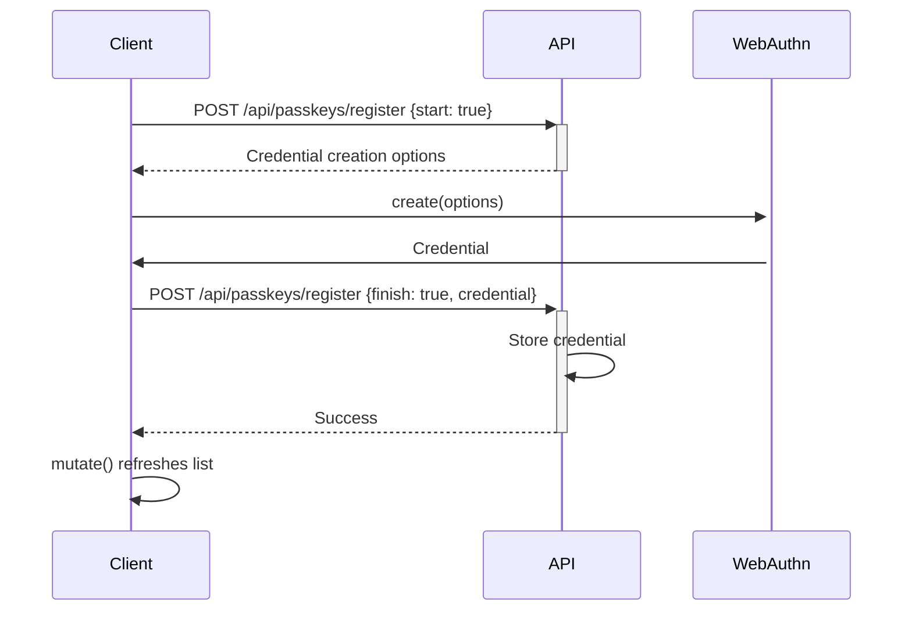
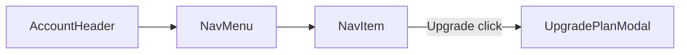

# pages — account

# Account Pages Module

The `/account` module provides two pages for users to manage their profile settings and security preferences. It leverages Next.js App Router patterns, NextAuth.js for session management, and WebAuthn for passwordless authentication.

## Pages Overview

| Route | File | Purpose |
|-------|------|---------|
| `/account` | `general.tsx` | Manage display name, email, and avatar |
| `/account/security` | `security.tsx` | Register and manage passkeys for passwordless login |

## General Settings Page (`/account`)

The general settings page allows users to update their profile information.

### User Information Form

The page renders two `Form` components for editable user data:

**Name Field**

- Accepts up to 32 characters
- Updates immediately via `PATCH /api/account`
- Session refreshes on success to reflect changes
- Default value populated from `session.user.name`

**Email Field**

- Validated against RFC-compliant email format using `validateEmail`
- Requires email confirmation for changes (confirmation sent to current email)
- Supports addresses up to 52 characters
- Displays `UpdateMailSubscribe` component for email notification preferences

### Avatar Upload

The `UploadAvatar` component handles profile image management:

- Accepts `.png` and `.jpg` files
- Enforces 2MB maximum file size
- Square images recommended

### Session Integration

The page uses `useSession` from NextAuth.js to:

- Retrieve current user data (`session.user.name`, `session.user.email`)
- Trigger session updates after successful name changes via `update()`

## Security Settings Page (`/account/security`)

The security page provides passkey-based passwordless authentication.

### Passkey Registration

The `registerPasskey` function implements the WebAuthn registration flow:



1. Fetches credential creation options from `/api/passkeys/register`
2. Opens the browser's native passkey registration dialog via `@github/webauthn-json`
3. Sends the created credential to the API for storage
4. Refreshes the passkey list using `mutate()`

### Passkey Management

The page displays existing passkeys fetched via `usePasskeys`:

- Shows credential name, creation date, and last used timestamp
- Displays supported transports (e.g., `usb`, `nfc`, `ble`)
- Each passkey has a delete action with confirmation dialog

The `removePasskey` function:

1. Opens an `AlertDialog` confirmation modal
2. Sends `DELETE /api/account/passkeys` with the credential ID
3. Refreshes the list on success

### Date Formatting

`formatDate` converts ISO timestamps to localized display format:

```typescript
new Date(dateString).toLocaleDateString("en-US", {
  year: "numeric",
  month: "short",
  day: "numeric",
  hour: "2-digit",
  minute: "2-digit",
});
```

## Shared Components

Both pages use common components for consistent layout and navigation:



- **`AccountHeader`**: Renders page title and breadcrumb navigation
- **`AppLayout`**: Wraps content with the application's main layout structure
- **`NavItem`**: Navigation item that may trigger `UpgradePlanModal` for plan upgrades

## Key Dependencies

| Dependency | Purpose |
|------------|---------|
| `next-auth/react` | Session management via `useSession` |
| `@github/webauthn-json` | Cross-browser WebAuthn API abstraction |
| `@/lib/swr/use-passkeys` | Passkey data fetching and caching |
| `sonner` | Toast notifications for success/error feedback |
| `@/lib/utils/validate-email` | Email format validation |

## API Endpoints

| Endpoint | Method | Usage |
|----------|--------|-------|
| `/api/account` | `PATCH` | Update name and email |
| `/api/passkeys/register` | `POST` | Register new passkey (start/finish flow) |
| `/api/account/passkeys` | `DELETE` | Remove existing passkey |

## State Management

- **Loading states**: Track pending operations (`isLoading`, `isLoadingPasskeys`)
- **Passkey list**: Managed by `usePasskeys` SWR hook with `mutate()` for refresh
- **Form submissions**: Handled via `fetch` with toast feedback
- **Confirmation flow**: Email changes require user confirmation before applying