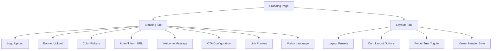

# pages — datarooms

# pages/datarooms Module

The `pages/datarooms/[id]/` module contains all client-facing pages for managing a single dataroom instance. It handles document organization, analytics, branding customization, access control, conversations, and settings.

## Route Structure

```
datarooms/[id]/
├── analytics/
│   ├── index.tsx           # Analytics overview with stats
│   └── audit-log.tsx        # Visitor activity log
├── branding/
│   └── index.tsx           # Dataroom branding customization
├── conversations/
│   ├── index.tsx            # Conversation list
│   ├── [conversationId]/
│   │   └── index.tsx        # Individual conversation thread
│   └── faqs/
│       └── index.tsx        # FAQ management
├── document/
│   └── [documentId].tsx      # Document detail with visitor stats
├── documents/
│   ├── index.tsx            # Root folder view
│   └── [...name].tsx        # Nested folder view
├── groups/
│   └── index.tsx            # Viewer group management
├── index.tsx                # Dataroom overview/header
├── links.tsx                # Shared link management
├── notifications.tsx        # Notification settings
├── permissions.tsx          # Permission configuration
└── settings.tsx             # Dataroom settings
```

## Core Pages

### Documents Pages

The documents pages display the folder tree and document list within a dataroom.

**Root Documents Page** (`documents/index.tsx`)

- Renders the top-level folder contents using `useDataroomItems({ root: true })`
- Displays the folder sidebar via `SidebarFolderTree`
- Shows document and folder counts in the header area

**Nested Documents Page** (`documents/[...name].tsx`)

- Uses the catch-all route `[...name]` to handle arbitrary folder paths
- Fetches items for the specific path via `useDataroomItems({ name })`
- Reuses the same layout and components as the root page

**Shared Components Used**

| Component | Purpose |
|-----------|---------|
| `SidebarFolderTree` | Left navigation showing folder hierarchy |
| `DataroomItemsList` | Renders documents and folders in a grid/list |
| `DataroomSortableList` | Drag-and-drop reordering interface |
| `DataroomSearchResults` | Search results display |
| `SearchBoxPersisted` | Search input with URL persistence |
| `AddDocumentDropdown` | Upload/create document actions |
| `GenerateIndexButton` | Triggers AI-powered document indexing |
| `RebuildIndexButton` | Re-indexes existing documents |
| `DownloadDataroomButton` | Bulk download all documents |

**State Management**

The page tracks `isReordering` state locally. When true, it swaps `DataroomItemsList` for `DataroomSortableList` to enable drag-and-drop reordering. Search is activated by the `search` query parameter, which populates results from `useDataroomSearch`.

---

### Document Detail Page

**Route**: `document/[documentId].tsx`

Displays analytics and visitor information for a specific document within the dataroom context.

```mermaid
graph LR
    A[Document Page] --> B[useDataroomDocumentOverview]
    A --> C[StatsComponent]
    A --> D[VideoAnalytics]
    A --> E[VisitorsTable]
    C -->|non-video| Page stats
    D -->|video type| Video metrics
    E -->|viewScope: dataroom| Room visitors
```

**Key Behaviors**

- Uses `useDataroomDocumentOverview` to fetch the document and dataroom context
- Conditionally renders `StatsComponent` (PDF/docs) or `VideoAnalytics` (videos)
- `VisitorsTable` uses `viewScope="dataroom"` to filter to room-only visits
- Full team members see a count of direct-link visits with a link to the team-wide document page
- Data room scoped members only see room visits (no direct-link data)
- Actions include preview button, link status indicator, and Notion accessibility status

**Lazy Loading**

Heavy components are dynamically imported with skeleton loading states:

- `StatsComponent` — document analytics
- `VideoAnalytics` — video engagement metrics
- `VisitorsTable` — visitor breakdown

---

### Analytics Pages

**Analytics Overview** (`analytics/index.tsx`)

Displays engagement metrics across the dataroom. Shows a stats card summary, then either:

- **With access**: Full `DataroomAnalyticsOverview` component and `DocumentAnalyticsTree` for drill-down
- **Without access**: `FeaturePreview` gate showing `MockAnalyticsTable` preview

The page uses `usePlan()` to check `isDatarooms`, `isDataroomsPlus`, or `isTrial` for access.

**Audit Log** (`analytics/audit-log.tsx`)

Renders `DataroomVisitorsTable` to show all visitor activity for the dataroom. Links from a `TabMenu` for mobile navigation between Analytics and Audit Log.

---

### Branding Page

**Route**: `branding/index.tsx`

The most complex page in the module. Provides comprehensive dataroom customization with two tabs: **Branding** and **Layouts**.



**Data Inheritance Model**

The page implements a tiered inheritance system:

1. **Dataroom-specific** — If `dataroomBrand` exists, use those values
2. **Team global** — Fall back to `globalBrand` if no dataroom row exists
3. **Defaults** — Apply hardcoded defaults (e.g., `#000000` for brand color)

This prevents UI flashing when switching between datarooms or after resetting branding.

**State Initialization** (`useEffect` on `[dataroomBrand, globalBrand]`)

```typescript
// Simplified flow
if (dataroomBrand) {
  // Use dataroom-specific values
} else if (globalBrand) {
  // Mirror team brand (no flash)
} else {
  // Apply hardcoded defaults
}
```

**Plan-Gated Features**

| Feature | Required Plan |
|---------|---------------|
| Layout customization | DataRooms or higher |
| Welcome message | Business or higher |
| CTA button | Business or higher |
| Visitor language | DataRoomsPlus or higher |

**Upgrade Gate Logic**

The page tracks unsaved changes using refs:

- `initialLayoutSnapshotRef` — layout state at last load
- `initialLanguageRef` — visitor language at last load

When `blocksSave` is true (layout/language changed without appropriate plan), the save button becomes an `UpgradeButton` instead of a standard `Button`.

**Preset Layouts**

Four predefined layouts via `applyLayoutPreset()`:

| Preset | Banner | Card Layout | Folder Tree | Header Style |
|--------|--------|-------------|-------------|--------------|
| Standard | Visible | List | Shown | Default |
| Strict | Hidden | Compact | Hidden | Default |
| Modern | Visible | Compact | Hidden | Split |
| Notion | Visible | Grid | Hidden | Notion |

**Auto-fill Feature**

The `handleAutoFill()` function POSTs to `/api/branding/auto-fill` with a URL, then applies any extracted brand data (logo, banner, colors) to local state.

**Preview System**

Three iframe-based previews render in real-time as settings change:

1. **Dataroom View** — `/room_ppreview_demo` with all layout params
2. **Document View** — `/nav_ppreview_demo` with brand colors
3. **Access/Front Page** — `/entrance_ppreview_demo` with welcome message

Preview URLs are rebuilt via `buildPreviewQuery()` whenever debounced state changes.

**Image Handling**

Local uploads are converted to blob URLs for preview, then uploaded to Vercel Blob storage on save via `uploadImage()`. The `useEffect` cleanup revokes blob URLs to prevent memory leaks.

---

### Conversations Pages

Delegates entirely to `@/ee/features/conversations` components:

| Route | Exports From |
|-------|-------------|
| `conversations/index.tsx` | `conversation-overview` |
| `conversations/faqs/index.tsx` | `faq-overview` |
| `conversations/[conversationId]/index.tsx` | `conversation-detail` |

This follows a pattern where complex features (conversations, FAQ management) are housed in the `/ee/features` module and simply mounted at these routes.

---

### Links & Permissions

**Links Page** (`links.tsx`)

Manages shared links for the dataroom. Uses `BulkImportLinksModal` for batch link creation.

**Permissions Page** (`permissions/index.tsx`)

Configures access permissions with similar structure to links.

---

### Groups Page

**Route**: `groups/index.tsx`

Manages viewer groups for the dataroom. Integrates `ButtonComponent` which triggers `UpgradePlanModal` for plan-gated group features.

---

### Settings Page

**Route**: `settings/index.tsx`

Dataroom configuration (name, notifications, etc.). Uses `useSelfMembership` to scope permissions appropriately.

---

## Data Fetching Patterns

### SWR Hooks Used

| Hook | Purpose |
|------|---------|
| `useDataroom` | Fetches the current dataroom by ID from URL |
| `useDataroomItems` | Fetches documents and folders for a path |
| `useDataroomSearch` | Full-text search within the dataroom |
| `useDataroomBrand` | Fetches dataroom-specific branding |
| `useBrand` | Fetches team-level branding |
| `usePlan` | Checks current plan tier and trial status |
| `useSelfMembership` | Determines user role within dataroom context |
| `useTeam` | Team context for API calls |

### URL Parameter Patterns

- **Dataroom ID**: Derived from `router.query.id` via `useDataroom`
- **Document ID**: `router.query.documentId` in nested routes
- **Folder Path**: `router.query.name` as string array (`[...name]`)
- **Search**: `router.query.search` persisted in URL

---

## AppLayout Wrapper

Every page wraps content in `AppLayout`, which provides:

- Consistent navigation header
- Team context provider
- Dataroom context (when available)

The layout handles loading states with `<LoadingSpinner />` or skeleton fallbacks.

---

## Upgrade Gates

The module uses `FeaturePreview` and `UpgradePlanModal` components to gate advanced features. Common patterns:

```typescript
// Check access
const { isDatarooms, isDataroomsPlus, isTrial } = usePlan();

// Conditional rendering
{hasAccess ? <Feature /> : <FeaturePreview />}

// Blocked save
if (blocksSave) {
  setUpgradeModalOpen(true);
  return;
}
```

---

## Performance Considerations

1. **Lazy Loading**: Document detail page dynamically imports `StatsComponent`, `VideoAnalytics`, and `VisitorsTable`
2. **Blob URL Cleanup**: Branding page revokes object URLs in `useEffect` cleanup
3. **Debounced Updates**: Color pickers and welcome message use `useDebounce` to reduce preview re-renders
4. **Scrollable Sections**: Branding settings use `lg:max-h-[calc(100vh-440px)]` with overflow scroll for long content