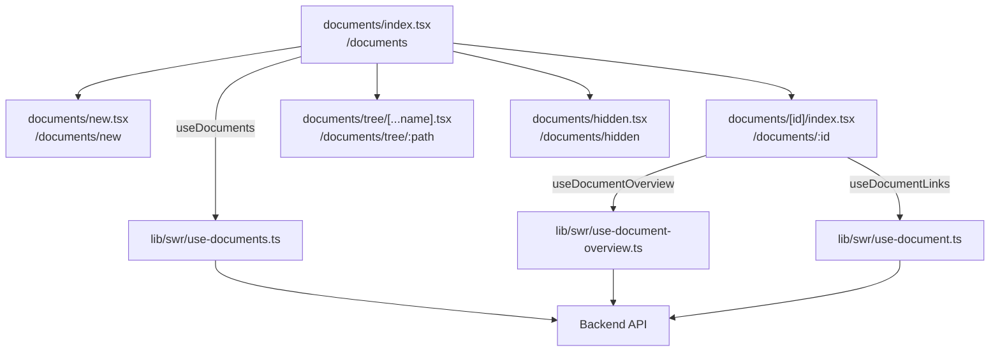

# pages — documents

# Documents Module

The documents module handles document listing, creation, viewing, and management across the application. It consists of five Next.js page components that work together to provide a complete document management experience.

## Overview

This module covers the document lifecycle:

- **List documents** at `/documents`
- **Create documents** at `/documents/new`
- **View individual documents** at `/documents/[id]`
- **Browse folders** at `/documents/tree/[...name]`
- **Manage hidden documents** at `/documents/hidden`



## Key Data Hooks

The module relies on SWR hooks from `lib/swr/` for data fetching:

| Hook | File | Purpose |
|------|------|---------|
| `useDocuments()` | `use-documents.ts` | Fetch paginated documents with search/filter |
| `useRootFolders()` | `use-documents.ts` | Fetch root-level folders |
| `useHiddenDocuments()` | `use-documents.ts` | Fetch hidden documents and folders |
| `useFolder()` | `use-documents.ts` | Fetch subfolders for a path |
| `useFolderDocuments()` | `use-documents.ts` | Fetch documents within a folder path |
| `useDocumentOverview()` | `use-document-overview.ts` | Fetch single document details |
| `useDocumentLinks()` | `use-document.ts` | Fetch links for a document |

## Pages

### Documents List (`/documents`)

**File:** `pages/documents/index.tsx`

The main entry point for document management. Displays all documents with search, sorting, and pagination.

**Key features:**

- **Invitation handling** — Processes `?invitation=accepted|teamMember` query params via `handleInvitationStatus()` to handle team invitations
- **Search** — Uses `SearchBoxPersisted` for persistent search state
- **Sort** — `SortButton` component for list ordering
- **Hidden items indicator** — Shows `EyeOffIcon` button linking to `/documents/hidden` when hidden items exist
- **Pagination** — Supports URL-based pagination (`?page=1&limit=10`)

**Component flow:**

```
Documents
├── AddDocumentDropdown (create new)
├── SearchBoxPersisted
├── SortButton
└── DocumentsList (documents + folders)
    └── Pagination (when filtered)
```

### Hidden Documents (`/documents/hidden`)

**File:** `pages/documents/hidden.tsx`

Displays documents and folders that have been hidden from the main list. Allows users to unhide items.

**Data source:** `useHiddenDocuments()` returns `folders` and `documents` arrays

### Document Creation (`/documents/new`)

**File:** `pages/documents/new.tsx`

Landing page for document upload. Uses `AnimatePresence` for smooth transitions between steps.

**Behavior:**

- Without `?type` query param → shows `DeckGeneratorUpload` (AI-powered deck generation)
- With `?type` query param → shows step-by-step upload flow with `Upload` component
- "Skip to dashboard" link navigates to `/documents`

### Document Detail (`/documents/[id]`)

**File:** `pages/documents/[id]/index.tsx`

The most complex page in the module. Shows document statistics, links, and visitor analytics.

**Data fetching:**

```typescript
const { data: overview, document: prismaDocument, primaryVersion, limits, team, ... } = useDocumentOverview();
const { links, ... } = useDocumentLinks();
```

**Lazy-loaded components** (dynamic imports with loading states):

| Component | File | Loading Placeholder |
|-----------|------|---------------------|
| `StatsComponent` | `components/documents/stats` | `DocumentStatsPlaceholder` |
| `VideoAnalytics` | `components/documents/video-analytics` | `VideoStatsPlaceholder` |
| `VisitorsTable` | `components/visitors/visitors-table` | Skeleton |
| `BulkImportLinksModal` | `components/links/bulk-import-modal` | — |

**Conditional rendering based on document type:**

- `primaryVersion.type !== "video"` → Document stats
- `primaryVersion.type === "video"` → Video analytics

**Header actions:**

The `DocumentHeader` receives an `actions` array containing:

1. `NotionAccessibilityIndicator` — Shows Notion connection status
2. `LinkDocumentIndicator` — Shows link status
3. `DocumentPreviewButton` — Opens document preview
4. `AddLinkButton` — Creates new link (or shows upgrade modal if limits exceeded)

**AddLinkButton logic:**

```typescript
if (!limits?.canAddLinks) {
  // Show upgrade modal for plan-gated link creation
  <UpgradePlanModal clickedPlan={team?.isTrial ? Business : Pro}>
    <Button>Upgrade to Create Link</Button>
  </UpgradePlanModal>
} else {
  <Button onClick={() => setIsLinkSheetOpen(true)}>Create Link</Button>
}
```

**Modals:**

- `LinkSheet` — Create individual links
- `BulkImportLinksModal` — Bulk import links for the document

### Folder Tree (`/documents/tree/[...name]`)

**File:** `pages/documents/tree/[...name].tsx`

Displays documents within a specific folder path. Uses catch-all route `[...name]` to support nested folders.

**Data fetching:**

```typescript
const { folders, loading } = useFolder({ name });      // Subfolders
const { documents, loading } = useFolderDocuments({ name });  // Documents in folder
```

**Usage example:** `/documents/tree/marketing/reports` shows documents in the `marketing/reports` folder path.

## Shared Components

| Component | Location | Purpose |
|-----------|----------|---------|
| `AppLayout` | `components/layouts/app` | Page wrapper with navigation |
| `DocumentsList` | `components/documents/documents-list` | Renders document/folder list |
| `HiddenDocumentsList` | `components/documents/hidden-documents-list` | Renders hidden items |
| `AddDocumentDropdown` | `components/documents/add-document-dropdown` | Create new document/folder |
| `Pagination` | `components/documents/pagination` | Pagination controls |
| `Separator` | `components/ui/separator` | Visual divider |

## Mutations

When document data changes, the module uses a combined mutation function:

```typescript
const mutateDocument = () => {
  mutateOverview();  // Re-fetch document overview
  mutateLinks();     // Re-fetch document links
};
```

This ensures both the overview stats and links list stay in sync after operations like creating/deleting links.

## Error Handling

- **400 errors** from `useDocumentOverview` render the Next.js error page
- Loading states use `LoadingSpinner` and skeleton components
- The document detail page shows full-page loading spinner on initial load, then renders components progressively