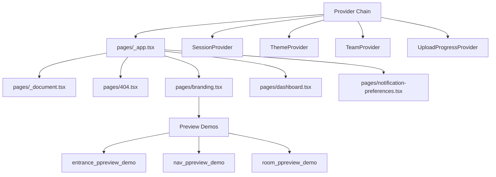

# pages — pages

# Pages Module

The `pages/` directory contains the core Next.js page components and global app configuration. This module serves as the entry point for the Papermark application, handling document branding, analytics dashboards, notification preferences, and preview demonstrations.

## Architecture Overview



## Core Files

### `_document.tsx`

Customizes the HTML document structure for the entire application.

**Key responsibilities:**
- Sets the `lang` attribute to `"en"`
- Adds `bg-background` class to the `<html>` element for base styling
- Configures viewport meta tag via `<Head>` for responsive behavior
- Enables `viewport-fit=cover` for safe area handling on iOS devices

```tsx
export default function Document() {
  return (
    <Html lang="en" className="bg-background" suppressHydrationWarning>
      <Head>
        <meta name="viewport" content="width=device-width, initial-scale=1, viewport-fit=cover" />
      </Head>
      <body className="">
        <Main />
        <NextScript />
      </body>
    </Html>
  );
}
```

### `_app.tsx`

The root application component that wraps every page. This is where the provider hierarchy is established.

**Provider Chain (outermost to innermost):**

1. **SessionProvider** - Provides NextAuth.js session context
2. **PostHogCustomProvider** - Analytics tracking provider
3. **ThemeProvider** - Dark/light mode management (`attribute="class"`, `defaultTheme="light"`)
4. **NuqsAdapter** - URL state management for query parameters
5. **TooltipProvider** - Global tooltip configuration (`delayDuration={100}`)
6. **TeamProvider** - Current team context (only for non-excluded paths)
7. **PostHogGroupSync** - Syncs team context to PostHog analytics groups
8. **UploadProgressProvider** - Upload progress tracking

**Conditional Rendering:**

The `TeamProvider`, `PostHogGroupSync`, and `UploadProgressProvider` are only mounted when the current route is not in `EXCLUDED_PATHS`. Public pages like the notification preferences and preview demos are excluded from team context.

**Global Head Configuration:**
- Sets Open Graph and Twitter Card meta tags
- Configures favicon
- Sets default title and description for Papermark

### `404.tsx`

Custom 404 error page displayed when routes are not found.

**Props:**
- `message?: string` - Optional custom error message

**Features:**
- Centered layout with responsive padding
- Displays "404 error" badge and "Page not found." heading
- "Go back home" link pointing to `/`
- Full-height layout using `min-h-screen`

## Feature Pages

### `branding.tsx` — Global Branding Settings

A comprehensive settings page for configuring team-level branding that applies to all documents and data rooms.

**State Management:**

The component manages extensive local state for all branding options:

| State | Type | Purpose |
|-------|------|---------|
| `brandColor` | `string` | Primary brand color (hex) |
| `accentColor` | `string` | Background/front-page color |
| `accentButtonColor` | `string` | CTA button color |
| `logo` | `string \| null` | Logo image (data URL or uploaded URL) |
| `banner` | `string \| null` | Banner image for data rooms |
| `welcomeMessage` | `string` | Front-page welcome text |
| `ctaEnabled` | `boolean` | Call-to-action toggle |
| `ctaLabel` | `string` | CTA button text |
| `ctaUrl` | `string` | CTA link URL |
| `cardLayout` | `DataroomCardLayout` | Document card display style |
| `showFolderTree` | `boolean` | Navigation tree visibility |
| `viewerHeaderStyle` | `DataroomViewerHeaderStyle` | Header layout variant |

**Plan-Based Feature Gating:**

Features are gated based on the user's plan tier:

```typescript
// Business messaging features (CTA, welcome message, link preview)
const hasBusinessMessagingAccess = isBusiness || isDatarooms || isDataroomsPlus || isTrial;

// Data room features (banner)
const hasDataroomAccess = isBusiness || isDatarooms || isDataroomsPlus || isTrial;

// Layout visibility (show tab)
const hasLayoutVisibility = isBusiness || isDatarooms || isDataroomsPlus || isTrial;

// Layout persistence (save changes)
const hasLayoutSaveAccess = isDatarooms || isDataroomsPlus || isTrial;
```

**Layout Presets:**

The component defines four layout presets that users can apply:

| Preset ID | cardLayout | showFolderTree | viewerHeaderStyle | hideFolderIconsInMain |
|-----------|------------|----------------|-------------------|----------------------|
| STANDARD | LIST | true | DEFAULT | false |
| STRICT | COMPACT | false | DEFAULT | true |
| MODERN | COMPACT | false | SPLIT | true |
| NOTION | GRID | false | NOTION | false |

**Debounced Updates:**

Color changes and text inputs use debouncing to avoid excessive re-renders during live preview updates:

- Brand/accent colors: 300ms debounce
- Welcome message: 500ms debounce
- CTA label/URL: 400ms debounce

**Preview System:**

The page renders three preview tabs that display live updates as users modify settings:

1. **Document View** - Shows the document viewer with navigation controls
2. **Dataroom View** - Shows the data room with folder tree and card layout
3. **Front Page** - Shows the access screen with welcome message

Previews use iframes with query parameters to render demo content without affecting actual data.

**Save Logic:**

The `saveBranding` function:
1. Validates welcome message length (max 80 characters)
2. Uploads data URL images as blobs via `uploadImage()`
3. Conditionally includes fields based on plan access
4. Calls `PUT` for existing brands or `POST` for new brands
5. Mutates the SWR cache to refresh brand data

**Upgrade Flow:**

When users without save access try to modify gated features, upgrade modals open:
- Layout save → Opens DataRooms upgrade modal highlighting "dataroom-viewer-layouts"
- Messaging save → Opens Business upgrade modal highlighting messaging features

### `dashboard.tsx` — Analytics Dashboard

Displays aggregate analytics for document views, links, visitors, and engagement metrics.

**Data Fetching:**

Uses SWR to fetch overview data from `/api/analytics`:

```typescript
const { data: overview } = useSWR<OverviewData>(
  teamInfo?.currentTeam?.id
    ? `/api/analytics?type=overview&interval=${interval}&teamId=${teamInfo.currentTeam.id}...`
    : null,
  fetcher,
  { keepPreviousData: true, revalidateOnFocus: false }
);
```

**Query Parameters:**

| Parameter | Type | Description |
|-----------|------|-------------|
| `interval` | `TimeRange` | Time range for analytics (7d, 14d, 30d, custom) |
| `type` | `string` | Active tab (links, documents, visitors, views) |
| `start` | `string` | Custom range start date (ISO string) |
| `end` | `string` | Custom range end date (ISO string) |

**Tab Types:**

- **Links** - Shows `LinksTable` with link-specific metrics
- **Documents** - Shows `DocumentsTable` with document performance
- **Visitors** - Shows `VisitorsTable` with visitor information
- **Views** - Shows `ViewsTable` with individual view events

**Empty States:**

The dashboard shows contextual empty states:
- **No activity, no links** - Shows prompt to create links
- **No activity, has links** - Shows prompt to share links
- **Has activity** - Normal table display

**Premium Features:**

The `isPremium` flag (`plan !== "free" || trial`) determines whether custom date ranges beyond 30 days are accessible.

### `notification-preferences.tsx` — Server-Rendered Preferences Page

A standalone page for managing dataroom notification frequency without authentication.

**Server-Side Rendering:**

Uses `getServerSideProps` to fetch viewer and dataroom data:

```typescript
export async function getServerSideProps(context: GetServerSidePropsContext) {
  const token = context.query.token as string;
  const payload = verifyUnsubscribeToken(token);
  
  // Validate token, check expiration, fetch data
  return { props: { token, data: { dataroomName, currentFrequency } } };
}
```

**Token Verification:**

The token is verified using `verifyUnsubscribeToken()` which extracts:
- `viewerId` - The viewer's database ID
- `dataroomId` - The target dataroom ID
- `teamId` - The team ID for authorization
- `exp` - Token expiration timestamp

**Frequency Options:**

| Value | Label | Description |
|-------|-------|-------------|
| `instant` | Every update | Immediate notification for new documents |
| `daily` | Daily digest | Summary at 9 AM UTC daily |
| `weekly` | Weekly digest | Summary every Monday at 9 AM UTC |
| `disabled` | Unsubscribed | No notifications |

**Client-Side State:**

The page manages `selected` state for the current frequency selection and `status` for save confirmation (`idle`, `success`, `error`).

## Preview Demo Pages

These pages render within iframes on the branding settings page to provide live previews.

### `entrance_ppreview_demo.tsx` — Access Screen Preview

Renders the access screen with:
- Dynamic background color from `accentColor` query param
- Welcome message display
- Adaptive color palette generation using `createAdaptiveSurfacePalette()`
- Email input placeholder with themed styling

### `nav_ppreview_demo.tsx` — Document Viewer Preview

Renders a simplified document viewer with:
- Navigation header showing logo, CTA button, and page counter
- Previous/Next navigation controls
- Brand color applied to header
- CTA button with `accentButtonColor`

### `room_ppreview_demo.tsx` — Data Room Preview

A more complex preview (referenced in call graph) that demonstrates:
- Folder tree navigation
- Document card layouts (LIST, COMPACT, GRID)
- Viewer header styles (DEFAULT, SPLIT, NOTION)
- Banner media display

## Key Dependencies

**Context Providers:**
- `TeamProvider` - Current team context from `@/context/team-context`
- `UploadProgressProvider` - Upload tracking from `@/context/upload-progress-context`
- `SessionProvider` - NextAuth session from `next-auth/react`

**SWR Hooks:**
- `useBrand()` - Fetches team branding settings
- `usePlan()` - Returns plan tier and trial status

**Utilities:**
- `cn()` - Tailwind class name merging
- `uploadImage()` - Uploads blob images
- `convertDataUrlToFile()` - Converts data URLs to Blob objects
- `fetcher()` - Standard fetch wrapper for SWR

**UI Components:**
- `AppLayout` - Application shell with navigation
- `Tabs` / `TabsContent` - Tabbed interface
- `Card` / `CardContent` / `CardFooter` - Card containers
- `Button`, `Input`, `Switch`, `Checkbox` - Form controls

## Integration Points

**Branding Page → Preview Demos:**
The branding page passes settings as query parameters to iframe sources:
```
/nav_ppreview_demo?brandColor=...&accentColor=...&brandLogo=...
/room_ppreview_demo?cardLayout=...&showFolderTree=...
/entrance_ppreview_demo?welcomeMessage=...
```

**App → Analytics:**
Dashboard fetches data from `/api/analytics` using team context.

**Branding → API:**
Branding saves to `/api/teams/${teamId}/branding` endpoint.

**Notification Preferences → API:**
Preferences save to `/api/notification-preferences/dataroom?token=${token}`.