# pages — settings

# Settings Module

The `pages/settings/` module provides a comprehensive set of configuration interfaces for team management, billing, security, and document sharing features. All pages use the `AppLayout` component as a common wrapper and follow a consistent visual layout with the `SettingsHeader` component.

## Module Structure

```
pages/settings/
├── agreements.tsx        # NDA agreement management
├── ai.tsx               # AI agents configuration
├── billing.tsx          # Subscription management
├── billing/
│   └── invoices.tsx    # Invoice history
├── domains.tsx          # Custom domain management
├── general.tsx          # Core team settings
├── incoming-webhooks.tsx # External data ingestion
├── notifications.tsx    # Email notification preferences
├── people.tsx           # Team member management
├── presets/
│   ├── index.tsx       # Presets list
│   ├── new.tsx         # Create preset
│   └── [id].tsx        # Edit preset
├── security.tsx         # Team security settings
└── tags.tsx            # Tag management
```

## Key Pages

### Agreements (`agreements.tsx`)

Manages one-click NDA agreements for document sharing and data rooms. Displays a list of active agreements using `AgreementCard` components, with an `AgreementSheet` drawer for creating or editing agreements. The **Create agreement** button is gated behind plan requirements (Business or higher), showing an upgrade button for other plans.

```typescript
const activeAgreements = useMemo(() => {
  return agreements?.filter((agreement) => !agreement.deletedAt) || [];
}, [agreements]);
```

Key interactions:
- **Create**: Opens `AgreementSheet` with `null` editing state
- **Edit**: Opens `AgreementSheet` with the selected agreement
- **Delete**: Mutates the SWR cache to remove the agreement from the list

### AI Settings (`ai.tsx`)

Controls AI-powered chat features at the team level. Requires the `ai` feature flag to be enabled. Displays a toggle for `agentsEnabled` with a PATCH request to `/api/teams/{teamId}/ai-settings`. Non-admins see the toggle disabled with an explanation. Includes privacy information about OpenAI data usage.

```typescript
const handleToggleAI = async (enabled: boolean) => {
  const response = await fetch(`/api/teams/${teamId}/ai-settings`, {
    method: "PATCH",
    headers: { "Content-Type": "application/json" },
    body: JSON.stringify({ agentsEnabled: enabled }),
  });
};
```

### Billing (`billing.tsx` and `billing/invoices.tsx`)

The billing page handles subscription management with tab navigation between **Subscription** and **Invoices** views. It captures Stripe checkout callbacks via query parameters (`?success`, `?cancel`) and reports events to analytics and Google Tag Manager.

The invoices page fetches invoice data from `useInvoices()` and displays them in a table with:
- Description (Papermark Subscription with invoice number)
- Date formatted with `Intl.NumberFormat`
- Amount in user's currency
- Actions for viewing (hosted URL) and downloading (PDF)

### Team Members (`people.tsx`)

A comprehensive team management interface with the following features:

**Member List**: Displays all team members with their roles, document counts, and status badges (e.g., "Blocked (Trial Expired)").

**Role Management**: The `ChangeRoleDialog` component handles role changes with a `RadioGroup` for role selection. When changing to `DATAROOM_MEMBER`, a checkbox list allows assigning specific data rooms.

```typescript
const ASSIGNABLE_ROLES: TeamRole[] = [
  "ADMIN", "MANAGER", "MEMBER", "DATAROOM_MEMBER"
];
```

**Invitation Handling**: Pending invitations appear in the list with status indicators (Pending/Expired) and actions for resending or revoking.

**Seat Management**: Checks `canAddUsers` from `useLimits()` to determine if invitations are allowed, with options to purchase additional seats.

### Notifications (`notifications.tsx`)

Configures email notification preferences using a categorized interface:

```typescript
const NOTIFICATION_CATEGORIES = [
  { label: "Documents", items: [{ type: "DOCUMENT_VIEW", ... }] },
  { label: "Data rooms", items: [
    { type: "DATAROOM_VIEW", ... },
    { type: "DATAROOM_UPLOAD", ... },
    { type: "CONVERSATION_MESSAGE", ... },
    { type: "DATAROOM_TASK", ... }
  ]},
  { label: "Security", items: [{ type: "BLOCKED_ACCESS", ... }] }
];
```

Each notification has:
- A toggle switch for enabling/disabling
- A scope selector (visible to admins/managers) for `ALL` or `MINE_ONLY`

### Link Presets (`presets/`)

Reusable link configurations stored in the database. Three pages handle preset management:

**List Page** (`presets/index.tsx`): Grid display of all presets with creation date, link to edit page.

**Create Page** (`presets/new.tsx`): Form using `DEFAULT_LINK_PROPS` with sections:
- Link Preview Cards (OG metadata)
- Basic Settings (email protection, authentication, notifications, download, expiration)
- Access Control (password, allow/deny lists)
- Additional Security (watermark, screenshot protection, confidential view, agreements, custom fields)
- Branding (pro banner)

**Edit Page** (`presets/[id].tsx`): Same form with loaded preset data, includes delete functionality with confirmation alert.

```typescript
const handleSubmit = async (e: FormEvent) => {
  const response = await fetch(`/api/teams/${teamId}/presets/${presetId}`, {
    method: "PUT",
    body: JSON.stringify({ /* preset data */ }),
  });
};
```

### General Settings (`general.tsx`)

Core team configuration with multiple form sections:
- **Team Name**: Sanitizes input via `validateContent()` before saving
- **Excel Advanced Mode**: Toggle with Business plan requirement prompt
- **Replicate Dataroom Folders**: Toggle for folder structure replication
- **Timezone Selector**: Configures team's timezone
- **Ignored Domains**: Blocks domains from accessing links
- **Global Block List**: Prevents specific emails from accessing content
- **Survey Settings**: Configures post-viewing surveys
- **Delete Team**: Destructive action for team removal

### Custom Domains (`domains.tsx`)

Manages custom domains for sharing documents. Uses `AddDomainModal` for domain creation and `DomainCard` for display. Requires Business or Datarooms plan for adding domains.

### Incoming Webhooks (`incoming-webhooks.tsx`)

Creates webhook endpoints for receiving data from external services. Feature-flag gated (`incomingWebhooks`). Each webhook gets a unique URL at `${process.env.NEXT_PUBLIC_WEBHOOK_BASE_URL}/services/{webhookId}`.

## Common Patterns

### Plan Gating

Most advanced features check the current plan before allowing access:

```typescript
const { isTrial, isBusiness, isDatarooms, isDataroomsPlus } = usePlan();

// Show upgrade button for non-qualifying plans
{isTrial || isBusiness || isDatarooms || isDataroomsPlus ? (
  <Button onClick={handleCreate}>Create</Button>
) : (
  <UpgradeButton text="Upgrade" clickedPlan={PlanEnum.Business} />
)}
```

### Upgrade Modal Flow

Features requiring a plan upgrade use a shared pattern:

1. Check plan eligibility
2. If ineligible, trigger `UpgradePlanModal` with appropriate plan and highlight items
3. Modal handles Stripe checkout flow

### State Management

Settings pages use SWR for server state with optimistic updates:

```typescript
mutate(`/api/teams/${teamId}`, /* optimistic update */, false);
```

### Data Fetching

All pages follow consistent patterns for data fetching:
- Use custom hooks (`useAgreements`, `useInvoices`, `useDomains`)
- Display loading states with spinners
- Show error states with retry options
- Handle empty states with helpful CTAs

## Component Dependencies

```mermaid
graph TD
    subgraph "Settings Pages"
        AG[agreements.tsx]
        AI[ai.tsx]
        BILL[billing.tsx]
        INV[invoices.tsx]
        DOM[domains.tsx]
        GEN[general.tsx]
        NOT[notifications.tsx]
        PPL[people.tsx]
        PRE[presets/*]
        SEC[security.tsx]
    end

    subgraph "Shared Components"
        SH[SettingsHeader]
        AL[AppLayout]
        UP[UpgradePlanModal]
    end

    subgraph "Feature Components"
        AC[AgreementCard]
        AS[AgreementSheet]
        DC[DomainCard]
        CR[ChangeRoleDialog]
        PV[Preview]
    end

    subgraph "Data Hooks"
        UA[useAgreements]
        UI[useInvoices]
        UD[useDomains]
        UP2[usePlan]
        UL[useLimits]
    end

    AG --> AC & AS
    DOM --> DC
    PPL --> CR
    PRE --> PV
    GEN --> UP
    AI --> UP
    ALL --> SH & AL
    ALL --> UA & UP2
```



## API Endpoints

Settings pages interact with these API routes:

| Endpoint | Methods | Purpose |
|----------|---------|---------|
| `/api/teams/{id}` | GET, PATCH | Team info and settings |
| `/api/teams/{id}/agreements` | GET | List agreements |
| `/api/teams/{id}/ai-settings` | GET, PATCH | AI feature toggle |
| `/api/teams/{id}/domains` | GET, POST, DELETE | Domain management |
| `/api/teams/{id}/presets` | GET, POST | Preset CRUD |
| `/api/teams/{id}/presets/{presetId}` | GET, PUT, DELETE | Single preset operations |
| `/api/teams/{id}/incoming-webhooks` | GET, POST, DELETE | Webhook management |
| `/api/teams/{id}/change-role` | PUT | Role assignment |
| `/api/teams/{id}/remove-teammate` | DELETE | Member removal |
| `/api/teams/{id}/invitations` | GET, DELETE | Invitation management |
| `/api/teams/{id}/invitations/resend` | PUT | Resend invitation |
| `/api/feature-flags` | GET | Feature availability |
| `/api/teams/{id}/update-name` | PATCH | Team name change |
| `/api/teams/{id}/update-advanced-mode` | PATCH | Excel mode toggle |