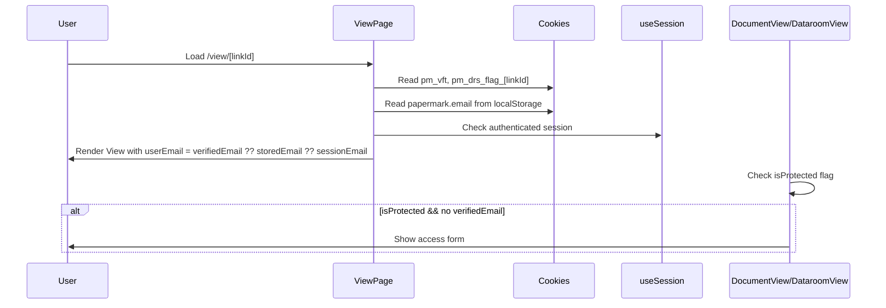

# pages — view

# pages/view Module

The `pages/view` module handles all public-facing view pages for shared links in Papermark. It provides dynamic rendering for three link types — documents, data rooms, and workflows — through two route patterns: standard link IDs and custom domain slugs.

## Route Structure

```
pages/view/
├── [linkId]/
│   ├── index.tsx           # Main view: document, dataroom, or workflow
│   ├── d/[documentId].tsx # Single document view within a dataroom
│   ├── downloads.tsx       # Downloads panel for dataroom links
│   └── embed.tsx           # Iframe-embeddable version of the view
└── domains/
    └── [domain]/[slug]/
        ├── index.tsx       # Custom domain view (document or dataroom)
        ├── d/[documentId].tsx # Custom domain dataroom document view
        └── downloads.tsx   # Custom domain downloads panel
```

## Link Types

The module routes to different components based on the `linkType` returned from the link data fetch:

| Link Type | Description | View Component |
|-----------|-------------|----------------|
| `DOCUMENT_LINK` | Single document | `DocumentView` |
| `DATAROOM_LINK` | Collection of documents | `DataroomView` / `DataroomDocumentView` |
| `WORKFLOW_LINK` | Workflow entry point | `WorkflowAccessView` |

## Data Flow

```mermaid
flowchart TD
    A[Request: /view/[linkId] or /view/domains/[domain]/[slug]] --> B[getStaticProps / getServerSideProps]
    B --> C{Link Type?}
    C -->|DOCUMENT_LINK| D[Fetch Notion recordMap if needed]
    C -->|DATAROOM_LINK| E[Process dataroom documents]
    C -->|WORKFLOW_LINK| F[Return minimal props]
    D --> G[fetchMissingPageReferences]
    G --> H[normalizeRecordMap]
    H --> I[addSignedUrls]
    E --> J[buildViewerI18nPageProps]
    I --> J
    F --> J
    J --> K[Props to client component]
    K --> L{linkType?}
    L -->|DOCUMENT| M[DocumentView]
    L -->|DATAROOM| N[DataroomView / DataroomDocumentView]
    L -->|WORKFLOW| O[WorkflowAccessView]
```

## Key Components

### `ViewPage` (`[linkId]/index.tsx`)

The main view handler. Reusable `ViewPageInner` component renders different views based on `linkType`, with a wrapper that provides i18n context.

**Route parameters:**
- `linkId` — Valid CUID identifying the link

**Key features:**
- Fetches link data via `fetchLinkDataById`
- For Notion documents: parses page ID, fetches record map, resolves missing references, and signs URLs
- Resolves feature flags (`annotationsEnabled`, `textSelectionEnabled`, `dataroomIndexEnabled`)
- Handles link expiration and archive status
- Supports query parameters: `email` (verified email), `d` (disable email editing), `previewToken`, `preview`

### `DataroomDocumentViewPage` (`[linkId]/d/[documentId].tsx`)

Renders a single document within a dataroom context.

**Route parameters:**
- `linkId` — Dataroom link CUID
- `documentId` — Specific document CUID

**Key differences from main view:**
- Fetches link data specifically for the dataroom document via `fetchLinkDataById({ linkId, dataroomDocumentId })`
- Only handles `DATAROOM_LINK` type
- Passes `notionData` to `DataroomDocumentView` for document rendering

### `ViewDownloadsPage` (`[linkId]/downloads.tsx`)

Provides a downloads panel for dataroom links. Uses `getServerSideProps` (not static) because it needs the brand's default language at request time.

**Route parameters:**
- `linkId` — Dataroom link CUID

Renders `DownloadsPanel` with the resolved `linkId`.

### `EmbedPage` (`[linkId]/embed.tsx`)

Embeddable version that blocks direct access. Only renders content when detected inside an iframe.

**Security check:**
- Compares `window !== window.parent` to detect iframe context
- Returns 404 for direct browser access
- Tracks embed load events with analytics (captures `embedSource` from referrer hostname)

Reuses `getStaticProps` and `getStaticPaths` from `ViewPage` — the underlying data fetching is identical, only the rendering differs.

### Domain Routes (`domains/[domain]/[slug]/`)

Mirror the standard routes but use custom domain slugs instead of link IDs:

| File | Standard Equivalent |
|------|---------------------|
| `index.tsx` | `[linkId]/index.tsx` |
| `d/[documentId].tsx` | `[linkId]/d/[documentId].tsx` |
| `downloads.tsx` | `[linkId]/downloads.tsx` |

**Key differences:**
- Fetches via `fetchLinkDataByDomainSlug({ domain, slug, ... })`
- URL param validation uses regex patterns: domain must be a valid FQDN, slug must be alphanumeric with hyphens/underscores
- For workflow links, includes `domain` and `slug` in props for downstream routing

## Authentication & Access Flow



**Email resolution priority:**
1. `email` query parameter (verified email from email protection flow)
2. `storedEmail` from localStorage
3. `session.user.email` from NextAuth session

**Token storage:**
- `pm_vft` cookie — general view flag token
- `pm_drs_flag_[linkId]` cookie — dataroom-specific flag token

## Notion Document Processing

For documents with `type === "notion"`, the following pipeline runs in `getStaticProps`:

```typescript
// 1. Parse page ID from file URL
const notionPageId = parsePageId(file, { uuid: false });

// 2. Fetch the Notion page record map
recordMap = await notion.getPage(pageId, { signFileUrls: false });

// 3. Fetch any missing page references (e.g., links in table cells)
await fetchMissingPageReferences(recordMap);

// 4. Normalize double-nested block structures
normalizeRecordMap(recordMap);

// 5. Sign URLs for file access
await addSignedUrls({ recordMap });
```

The theme (light/dark mode for Notion) is extracted from the URL query parameter: `new URL(file).searchParams.get("mode")`.

## Feature Flags

Feature flags are resolved server-side via `getFeatureFlags({ teamId })` and passed as props:

| Flag | Purpose |
|------|---------|
| `textSelectionEnabled` | Allow selecting text in documents |
| `annotationsEnabled` | Enable annotation/highlighting features |
| `dataroomIndexEnabled` | Show dataroom index/navigation |
| `annotations` | (Document links only) |

The `useCustomAccessForm` and `logoOnAccessForm` flags are currently hardcoded for specific team IDs rather than fetched from the database.

## I18n Setup

All pages wrap their inner component in `ViewerI18nProvider`:

```typescript
<ViewerI18nProvider locale={locale} resources={resources}>
  <ViewPageInner {...props} />
</ViewerI18nProvider>
```

The locale and resources come from `buildViewerI18nPageProps(brand)`, which respects the brand's `defaultLanguage` setting. If `getStaticProps` exits early (e.g., frozen or error state), the wrapper defaults to English.

## Error Handling

| Condition | Response |
|-----------|----------|
| Link not found | `notFound: true` |
| Link frozen (dataroom closed) | Renders 404 with "data room has been closed" |
| Link expired | Renders 404 with "link is expired" |
| Link archived | Renders 404 with "link is archived" |
| Notion API error | `notionError: true`, revalidates every 30s |
| Unknown error | `error: true`, revalidates every 30s |

## Revalidation Strategy

```typescript
revalidate: brand || recordMap ? 10 : 60
```

Pages with custom branding or Notion content revalidate every 10 seconds. Static content without branding waits 60 seconds.

## Props Shape

All view pages share a common props structure via `ViewPageProps`:

```typescript
type ViewPageProps = {
  linkData: DocumentLinkData | DataroomLinkData | WorkflowLinkData;
  notionData: {
    rootNotionPageId: string | null;
    recordMap: ExtendedRecordMap | null;
    theme: NotionTheme | null;
  };
  meta: {
    enableCustomMetatag: boolean;
    metaTitle: string | null;
    metaDescription: string | null;
    metaImage: string | null;
    metaFavicon: string | null;
    metaUrl: string | null;
  };
  showPoweredByBanner: boolean;
  showAccountCreationSlide: boolean;
  useAdvancedExcelViewer: boolean;
  useCustomAccessForm: boolean;
  logoOnAccessForm: boolean;
  // ... dataroom-specific or document-specific flags
};
```

## Dependencies

**Internal lib functions:**
- `fetchLinkDataById` — Fetch link by CUID
- `fetchLinkDataByDomainSlug` — Fetch link by domain/slug
- `getFeatureFlags` — Resolve feature toggles
- `buildViewerI18nPageProps` — Build i18n context
- `notion.getPage` — Fetch Notion record map
- `fetchMissingPageReferences`, `normalizeRecordMap`, `addSignedUrls` — Notion processing

**Internal components:**
- `DocumentView` — Document renderer
- `DataroomView` — Dataroom index view
- `DataroomDocumentView` — Single dataroom document
- `WorkflowAccessView` — Workflow entry form
- `DownloadsPanel` — Download tracking UI
- `CustomMetaTag` — SEO meta tags
- `ViewerI18nProvider` — I18n context provider
- `LoadingSpinner` — Loading state