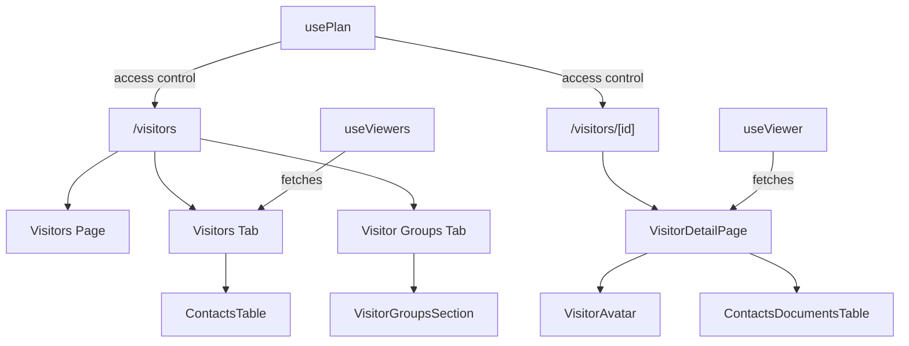
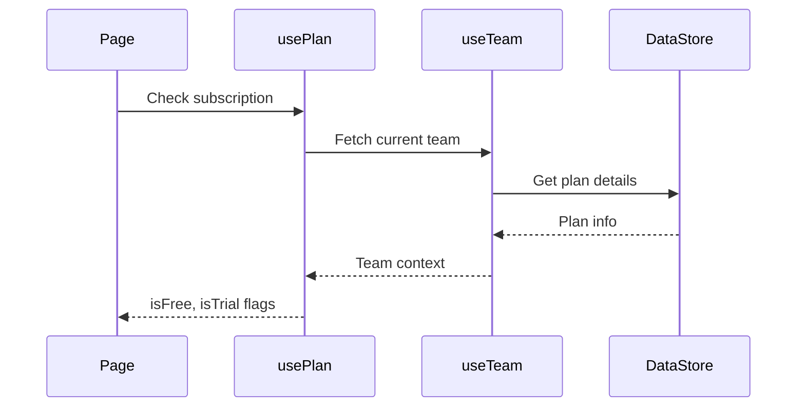

# pages — visitors

# Visitors Module

The visitors module provides two Next.js page components for managing and viewing visitors: a list view showing all visitors with filtering capabilities, and a detail view showing individual visitor information and their document activity.

## Overview



## Pages

### `/visitors` — Visitor List Page

The main visitors page displays all visitors with a tabbed interface separating visitor records from visitor groups.

**Route:** `pages/visitors/index.tsx`

**Key features:**

- **Tabbed navigation** — Switches between "Visitors" (individual records) and "Visitor Groups" (organized collections)
- **URL-synced tabs** — The active tab persists in the URL query string (`?tab=visitors` or `?tab=groups`)
- **Search** — `SearchBoxPersisted` component allows searching visitors by email or name
- **Pagination & Sorting** — Full controls for navigating large visitor lists
- **Access control** — Redirects free (non-trial) users to `/documents`

**Data fetching:**

```typescript
const { viewers, pagination, isValidating } = useViewers(
  currentPage,
  pageSize,
  sortBy,
  sortOrder,
);
```

The `useViewers` hook fetches paginated visitor data. Sorting defaults to `lastViewed` descending.

**State management:**

| State | Initial Value | Purpose |
|-------|---------------|---------|
| `currentPage` | `1` | Current pagination page |
| `pageSize` | `10` | Items per page |
| `sortBy` | `"lastViewed"` | Sort field |
| `sortOrder` | `"desc"` | Sort direction |
| `activeTab` | URL param or `"visitors"` | Active tab selection |

### `/visitors/[id]` — Visitor Detail Page

Displays detailed information for a single visitor, including their avatar, email, and a table of documents they've viewed.

**Route:** `pages/visitors/[id]/index.tsx`

**Key features:**

- **Visitor header** — Shows avatar and email address
- **Document views table** — Lists documents the visitor has accessed with viewing durations
- **Breadcrumb navigation** — Back link to "All Visitors" (visible in loading skeleton)
- **Same access control** — Redirects free users away

**Data fetching:**

```typescript
const { viewer, durations, loadingDurations, error } = useViewer(
  currentPage,
  pageSize,
  sortBy,
  sortOrder,
);
```

The `useViewer` hook fetches data for the specific visitor identified by the route parameter. The `durations` field tracks how long the visitor spent on each document.

**Error handling:**

```typescript
if (error) {
  return <ErrorPage statusCode={404} />;
}
```

If the visitor cannot be found, the page renders a 404 error page.

## Shared Patterns

Both pages follow consistent patterns for cross-cutting concerns:

### Plan-Based Access Control

Both pages check the user's plan and redirect non-trial free users:

```typescript
useEffect(() => {
  if (isFree && !isTrial) router.push("/documents");
}, [isTrial, isFree]);
```

This ensures free users cannot access visitor analytics, likely a premium feature.

### Pagination & Sorting Handlers

Both pages implement identical handler patterns for table controls:

```typescript
const handlePageChange = (page: number) => setCurrentPage(page);
const handlePageSizeChange = (size: number) => {
  setPageSize(size);
  setCurrentPage(1); // Reset to first page
};
const handleSortChange = (newSortBy: string, newSortOrder: string) => {
  setSortBy(newSortBy);
  setSortOrder(newSortOrder);
  setCurrentPage(1); // Reset to first page
};
```

### Loading States

`VisitorDetailPage` includes a dedicated skeleton component for loading states:

```typescript
const VisitorDetailHeaderSkeleton = () => { ... }
```

This provides visual feedback while the viewer data loads, with a placeholder avatar and text that matches the final layout dimensions.

## Component Dependencies

### Outgoing Dependencies

| Component | Purpose |
|-----------|---------|
| `AppLayout` | Page wrapper providing consistent layout structure |
| `ContactsTable` | Renders paginated visitor list with sorting |
| `ContactsDocumentsTable` | Renders visitor's document views |
| `VisitorGroupsSection` | Container for visitor groups management |
| `SearchBoxPersisted` | Search input with URL persistence |
| `Tabs`, `TabsList`, `TabsTrigger`, `TabsContent` | Tabbed navigation UI |
| `VisitorAvatar` | Displays visitor avatar with tooltip |
| `Separator`, `Skeleton` | UI utilities |
| `Breadcrumb*` | Navigation breadcrumb components |

### Data Hooks

| Hook | Source | Purpose |
|------|--------|---------|
| `useViewers` | `lib/swr/use-viewers.ts` | Fetch visitor list |
| `useViewer` | `lib/swr/use-viewer.ts` | Fetch single visitor |
| `usePlan` | `lib/swr/use-billing.ts` | Check subscription tier |

### Internal Execution Flow

The pages flow through the team context for authentication:



## Layout Structure

Both pages use identical layout patterns:

```
┌─────────────────────────────────────────┐
│ AppLayout                               │
│  ┌───────────────────────────────────┐  │
│  │ Header Section                    │  │
│  │ - Title ("All visitors" / email)  │  │
│  │ - Description text                │  │
│  │ - Avatar (detail page only)       │  │
│  └───────────────────────────────────┘  │
│  ┌───────────────────────────────────┐  │
│  │ Separator                         │  │
│  └───────────────────────────────────┘  │
│  ┌───────────────────────────────────┐  │
│  │ Content Section                   │  │
│  │ - Tabs (list page)                │  │
│  │ - Search (visitors tab)           │  │
│  │ - Table (contacts or documents)   │  │
│  └───────────────────────────────────┘  │
└─────────────────────────────────────────┘
```