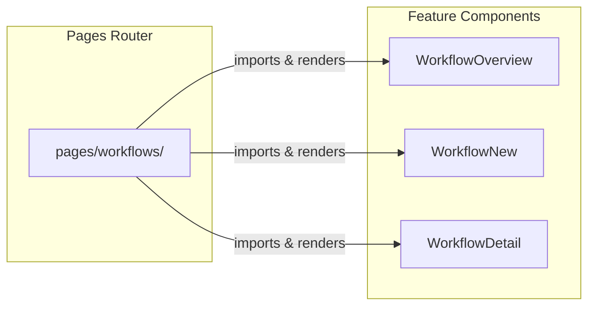

# pages — workflows

# Workflows Pages Module

## Overview

This module provides the routing layer for the workflows feature using Next.js Pages Router. It consists of three page components that serve as thin wrappers, delegating rendering to feature components located in `@/ee/features/workflows/pages/`.

## File Structure

```
pages/workflows/
├── [id].tsx    → Dynamic route for individual workflow details
├── index.tsx   → Route for workflow overview/list
└── new.tsx     → Route for creating new workflows
```

## Routes

| Route | File | Component Rendered | Purpose |
|-------|------|-------------------|---------|
| `/workflows` | `index.tsx` | `WorkflowOverview` | Display all workflows |
| `/workflows/new` | `new.tsx` | `WorkflowNew` | Create a new workflow |
| `/workflows/[id]` | `[id].tsx` | `WorkflowDetail` | View/edit specific workflow |

## Architecture Pattern

This module follows the **delegation pattern** for Next.js pages:



The pages directory handles:
- **Route matching** via Next.js file conventions
- **Dynamic segment extraction** (the `id` parameter in `[id].tsx`)
- **Component delegation** to the actual feature implementation

## Usage

### Workflow Overview (`/`)

The root workflows page displays all available workflows and provides navigation to individual workflows or the creation flow.

### Create New Workflow (`/new`)

Displays the workflow creation interface. After successful creation, users are typically redirected to the detail view of the newly created workflow.

### Workflow Detail (`/[id]`)

Uses a dynamic route where `id` corresponds to the workflow's unique identifier. This page handles viewing and potentially editing an existing workflow.

## Relationship to Feature Module

The pages in this module are intentionally minimal—they exist solely to satisfy Next.js routing requirements. All business logic, UI components, and state management live in the `@/ee/features/workflows/pages/` directory:

```
@/ee/features/workflows/pages/
├── WorkflowDetail.tsx
├── WorkflowOverview.tsx
└── WorkflowNew.tsx
```

This separation allows the feature components to be:
- Reused outside the pages context if needed
- Tested independently from routing
- Developed without modifying route files

## TypeScript

All files use standard Next.js page component typing. The wrapped components (`WorkflowDetail`, `WorkflowOverview`, `WorkflowNew`) handle all prop and state management internally.