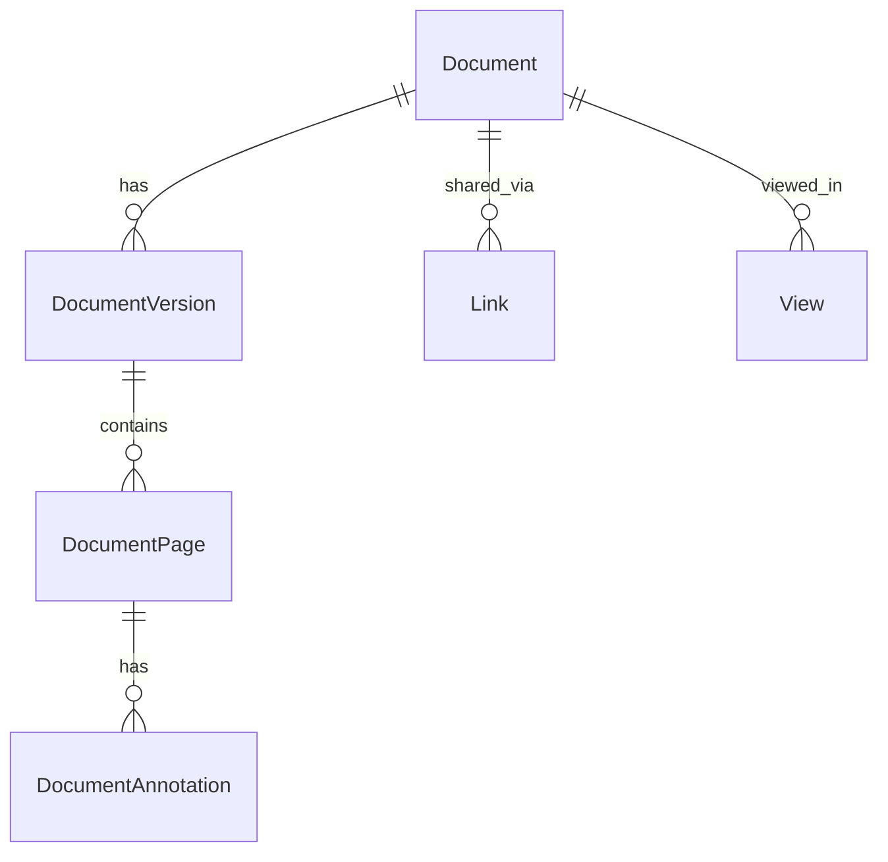
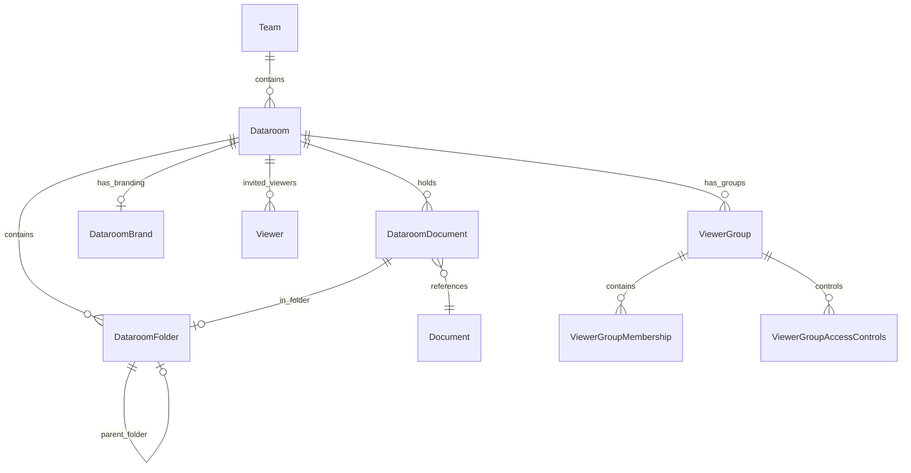
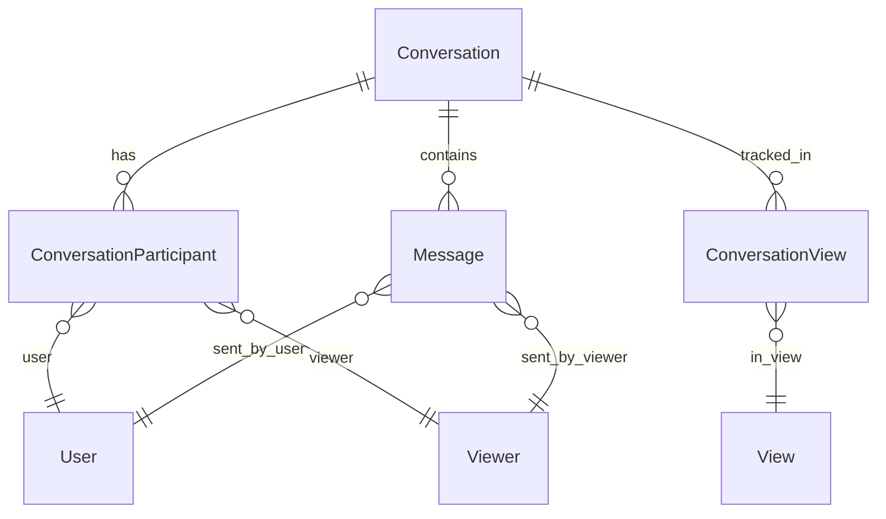
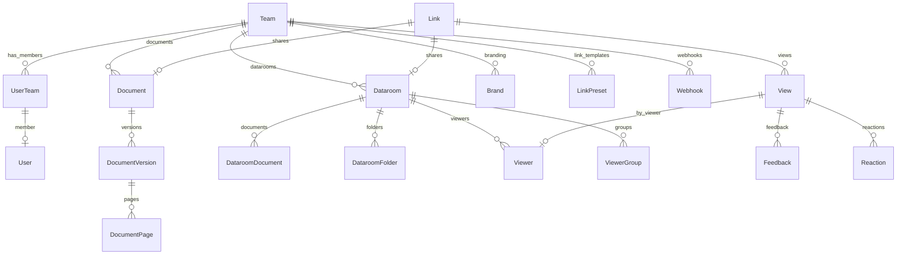

# prisma — migrations

# Prisma Migrations Module

## Overview

This module contains the database schema migrations for the application, managed by Prisma with PostgreSQL as the underlying database. The migrations define the complete data model for a document sharing and dataroom management platform.

The schema has evolved through 75+ migrations starting from September 2023, progressively adding features like team management, datarooms, viewer authentication, feedback systems, AI integrations, workflows, and SSO support.

## Core Entities

### Authentication & Users

The authentication layer uses NextAuth.js-compatible tables:

- **User** — Core user account with email, name, image, and Stripe subscription tracking
- **Account** — OAuth provider accounts linked to users
- **Session** — Active user sessions
- **VerificationToken** — Email verification tokens

Users belong to Teams via the **UserTeam** junction table, which tracks roles (`ADMIN`, `MANAGER`, `MEMBER`, `DATAROOM_MEMBER`) and membership status.

### Documents

The document subsystem stores PDFs and other files with versioning:

- **Document** — Main document record with metadata, storage type (S3 or Vercel Blob), and folder assignment
- **DocumentVersion** — Versioned copies with file references, page counts, and orientation
- **DocumentPage** — Individual page data with embedded links, metadata, and page links
- **DocumentAnnotation** — Team annotations on documents with images

### Sharing Links

The **Link** table is the primary mechanism for sharing documents:

| Feature | Fields |
|---------|--------|
| Access Control | `password`, `allowList`, `denyList`, `emailAuthenticated`, `emailProtected` |
| Security | `enableScreenshotProtection`, `enableWatermark`, `watermarkConfig`, `enableAgreement` |
| Notifications | `enableNotification`, `enableFeedback`, `enableQuestion` |
| Customization | `enableCustomMetatag`, `metaTitle`, `metaDescription`, `metaImage`, `metaFavicon`, `showBanner`, `welcomeMessage` |
| Tracking | `linkType` (`DOCUMENT_LINK`, `DATAROOM_LINK`, `WORKFLOW_LINK`) |

Links can be organized with **LinkPreset** templates and tagged with **Tag**/**TagItem**.

### Data Rooms

**Datarooms** provide structured document access with folder hierarchies:

Key dataroom features:
- **DataroomBrand** — Customizable branding with logo, banner, colors, welcome message
- **Viewer management** — Invite viewers, assign to groups with granular permissions
- **PermissionGroup** / **ViewerGroup** — Control view/download access per item
- **Introduction pages** and **FAQ items** for viewer guidance
- **Freeze** capability to archive dataroom state

### Analytics & Views

Every document or dataroom view is recorded:

- **View** — Tracks viewer, timestamps, page navigation, download activity
- **Reaction** — Page-level reactions (emoji type per page)
- **Feedback** / **FeedbackResponse** — Viewer feedback submissions
- **CustomFieldResponse** — Lead capture form data

Views support `viewType` (`DOCUMENT_VIEW`, `DATAROOM_VIEW`) and track download metadata including `downloadType` (`SINGLE`, `BULK`, `FOLDER`).

### Agreements & E-Signing

Documents can require agreement before access:

- **Agreement** — Agreement content with signing provider support (legacy or Documenso)
- **AgreementResponse** — Tracks who agreed and signing status

### Conversations & Q&A

The system supports contextual conversations tied to documents or datarooms:

- **Conversation** — Thread with visibility modes (`PRIVATE`, `PUBLIC_LINK`, etc.)
- **Message** — Individual messages from users or viewers
- **DataroomFaqItem** — Frequently asked questions generated from conversations

### Teams & Organizations

- **Team** — Organization with billing (Stripe), limits (JSONB), SSO configuration
- **Invitation** — Team invite tokens
- **Brand** — Organization-wide branding settings
- **Webhook** — Outbound webhooks for events
- **SentEmail** — Email history tracking

### AI & Integrations

- **Chat** / **ChatMessage** — AI chat on documents/datarooms using vector stores
- **Conversation** — AI-powered Q&A context
- **Integration** / **InstalledIntegration** — Third-party integrations
- **Webhook** — Event subscriptions

### API & Authentication

- **RestrictedToken** — API tokens with scopes (`apis.all`, `apis.read`)
- **OAuthClient** — OAuth 2.0 client applications
- **OAuthClientApproval** — User authorizations for clients
- **OAuthRecord** — OAuth grant records
- **IncomingWebhook** — Inbound webhook endpoints

### SSO/SCIM

Enterprise teams support SAML-based SSO via Jackson:

- **jackson_index** — Key mapping for OAuth/SAML
- **jackson_store** — Encrypted credential storage
- **jackson_ttl** — Token expiration tracking

Teams have `slug`, `ssoEnabled`, `ssoEmailDomain`, and `ssoEnforcedAt` fields.

### Document Uploads

Viewers can upload documents in datarooms:

- **DocumentUpload** — Uploaded file records
- **PendingDocumentUpload** — Pre-signed upload tokens

### Tasks & Request Lists

Datarooms support task assignment workflows:

- **TaskList** — Grouped task collections
- **Task** — Individual tasks with status, due dates
- **TaskAssignment** — Assigned to viewers, groups, links, or emails
- **TaskActivity** — Audit log of task changes

## Schema Patterns

### Nullable Foreign Keys

Many foreign keys use `ON DELETE SET NULL` allowing soft ownership changes. For example, `Document.ownerId` references `User` but can be null when ownership transfers to teams.

### Soft Deletes

Links support soft deletion via `deletedAt` timestamp, enabling recovery or audit trails.

### Hierarchical Indexing

Dataroom folders use `hierarchicalIndex` (string prefix) for efficient tree queries without recursive CTEs.

### Enums

Key enums in the schema:
- `Role`: `ADMIN`, `MANAGER`, `MEMBER`, `DATAROOM_MEMBER`
- `LinkType`: `DOCUMENT_LINK`, `DATAROOM_LINK`, `WORKFLOW_LINK`
- `ViewType`: `DOCUMENT_VIEW`, `DATAROOM_VIEW`
- `DownloadType`: `SINGLE`, `BULK`, `FOLDER`
- `ExecutionStatus`: `PENDING`, `IN_PROGRESS`, `COMPLETED`, `FAILED`, `BLOCKED`
- `FaqStatus`: `DRAFT`, `PUBLISHED`, `ARCHIVED`

## Relationship Summary

## Migration History Highlights

| Period | Major Features |
|--------|---------------|
| 2023 Q4 | Core tables, document versions, datarooms, teams |
| 2024 Q1-Q2 | View analytics, branding, feedback, reactions |
| 2024 Q3-Q4 | Folder hierarchies, FAQ, conversations, watermarks |
| 2025 | SSO/SCIM, workflows, API tokens, OAuth, tasks |
| 2026 | Advanced layouts, language settings, confidential views |